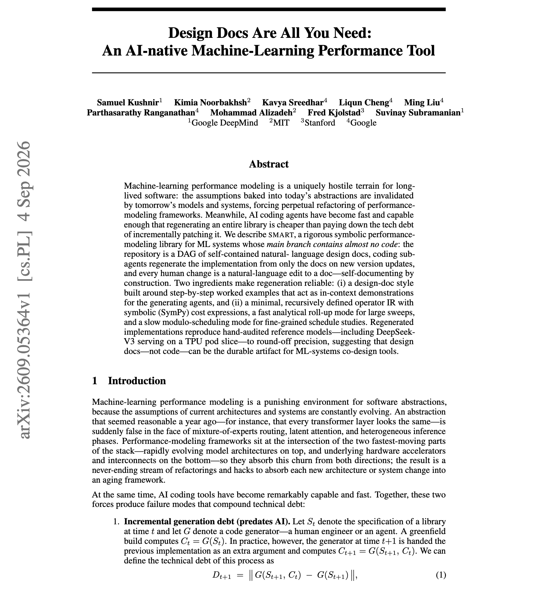
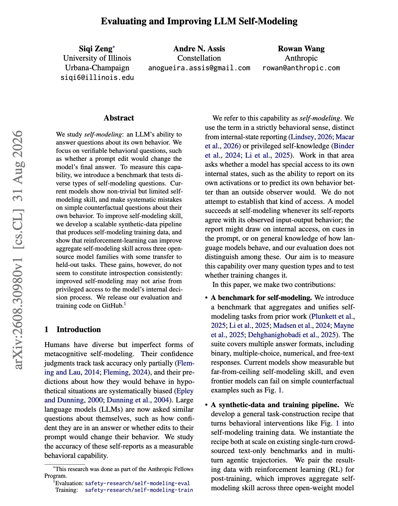
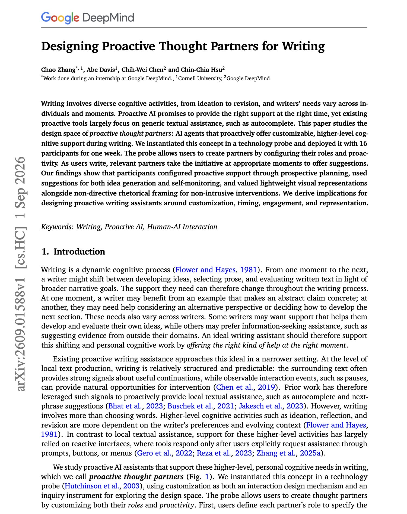

# 🐦 @dair_ai

## 📅 September 07, 2026

> 5 post(s) archived.

---

### 🕐 15:25 UTC · @dair_ai

> // Design Docs Are All You Need // Banger paper from Google DeepMind, MIT, and colleagues. What a genuinely strange and interesting paper this one is. Here is the setup: They maintain a performance-modeling library whose main branch contains almost no code. The repository is a directed graph of natural-language design docs. Coding sub-agents regenerate the entire implementation from those docs whenever a version updates. Every human change is an edit to a doc. The premise is that ML performance modeling invalidates its own abstractions every hardware and model generation, and coding agents are now cheap enough that regenerating a library beats patching one. Two things make the regeneration reliable. The design docs are written around step-by-step worked examples, which act as in-context demonstrations for the generating agents. The system is also anchored on a minimal recursively defined operator IR with symbolic cost expressions in SymPy. Regenerated implementations reproduce hand-audited reference models to round-off precision, including DeepSeek-V3 serving on a TPU pod slice. Paper: https://academy.dair.ai/papers/design-docs-are-all-you-need-an-ai-native-machine-learning-performance-tool-2609.05364

🔗 [View original post](https://x.com/omarsar0/status/2096983084956852537)

---

### 🕐 14:41 UTC · @dair_ai

> This is insane! GPT-6 Astra built this beautiful math animation in one go! (🔉 sound on) &quot;Jaw-on-the-floor&quot; moment. I&apos;ve not been able to get anything close to this with previous AI models. True personalized learning has arrived! Media

🔗 [View original post](https://x.com/omarsar0/status/2096972099394928951)

---

### 🕐 08:00 UTC · @dair_ai

> // Evaluating and Improving LLM Self-Modeling // Really interesting paper. Can a model answer questions about its own behavior? The questions are deliberately verifiable, such as whether a particular prompt edit would change the model&apos;s final answer. This framing avoids the usual trap where introspection claims cannot be checked by anyone. Current models show real but limited skill on a new benchmark covering diverse self-modeling question types, and they make consistent errors on simple counterfactuals about themselves. A scalable synthetic-data pipeline plus reinforcement learning raises the aggregate score across three open-source model families, with some transfer to held-out tasks. The authors then decline the interpretation their own result invites. They note the gains may not come from privileged access to the model&apos;s internal decision process, so a better self-modeling score is not evidence of introspection. Useful if you want agents that predict their own failures well enough to route or escalate, since that capability can now be measured without settling what produces it. Paper: https://academy.dair.ai/papers/evaluating-and-improving-llm-self-modeling-2608.30980

🔗 [View original post](https://x.com/dair_ai/status/2096871139184451647)

---

### 🕐 02:08 UTC · @dair_ai

> Fascinating paper from Anthropic and colleagues. They study whether models can tell when they are being tested. It turns out that capable models can tell when they are being tested rather than deployed. They claim that this fact weakens every conclusion a safety evaluation supports, and it gets worse as models get better. Two techniques make simulated evaluations harder to distinguish from real deployment. Critique refinement spends extra inference-time compute on each simulator action, generating several candidates, asking an instance of the target model how to make them more realistic, and continuing with the most deployment-like one. DISH, the Deployment-Imitating SWE-Agent Harness, wraps the target in a real agent harness so the simulated coding environment matches production. Why does it matter? Your harness is a signal the model reads. If evaluations run in a different scaffold than production, the model can condition on that difference, which makes scaffold parity a safety property rather than an engineering detail. Paper: https://academy.dair.ai/papers/improving-evaluation-realism-with-inference-time-compute-and-deployment-scaffold-2609.02302

🔗 [View original post](https://x.com/dair_ai/status/2096782512119001119)

---

### 🕐 02:00 UTC · @dair_ai

> Super interesting paper on proactive agents from Google DeepMind. (bookmark it) Proactive assistance usually means autocomplete. Researchers asks what it looks like when an agent offers higher-level cognitive support and picks its own moment to speak. They built a probe and deployed it with 16 participants for a week. Writers create partners by configuring a role and a proactivity level, and relevant partners then take initiative as the writing happens. Three findings stand out: &gt; Participants configured support prospectively, planning for situations they anticipated rather than reacting to interruptions. &gt; They used suggestions for idea generation and also for self-monitoring, which is a purpose proactive tools rarely design for. &gt; And they judged intrusiveness by presentation, valuing lightweight visual representation and non-directive rhetorical framing. The design implications cover customization, timing, engagement and representation. Worth reading if you are building an assistant that acts before being asked, because how the intervention is phrased mattered to users as much as when it arrived. Paper: https://academy.dair.ai/papers/designing-proactive-thought-partners-for-writing-2609.01588

🔗 [View original post](https://x.com/omarsar0/status/2096780509540139364)

---
