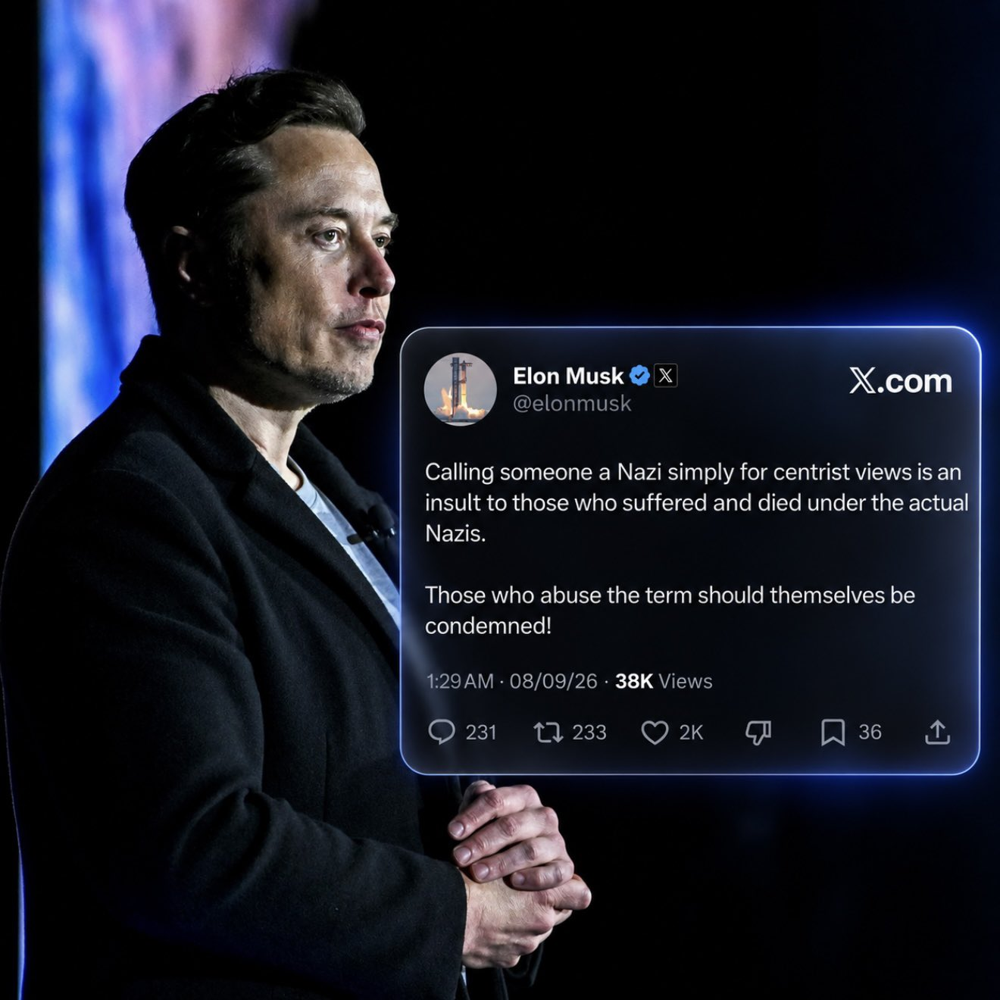
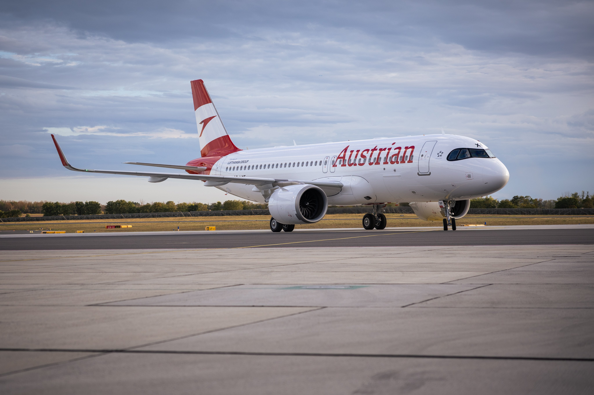
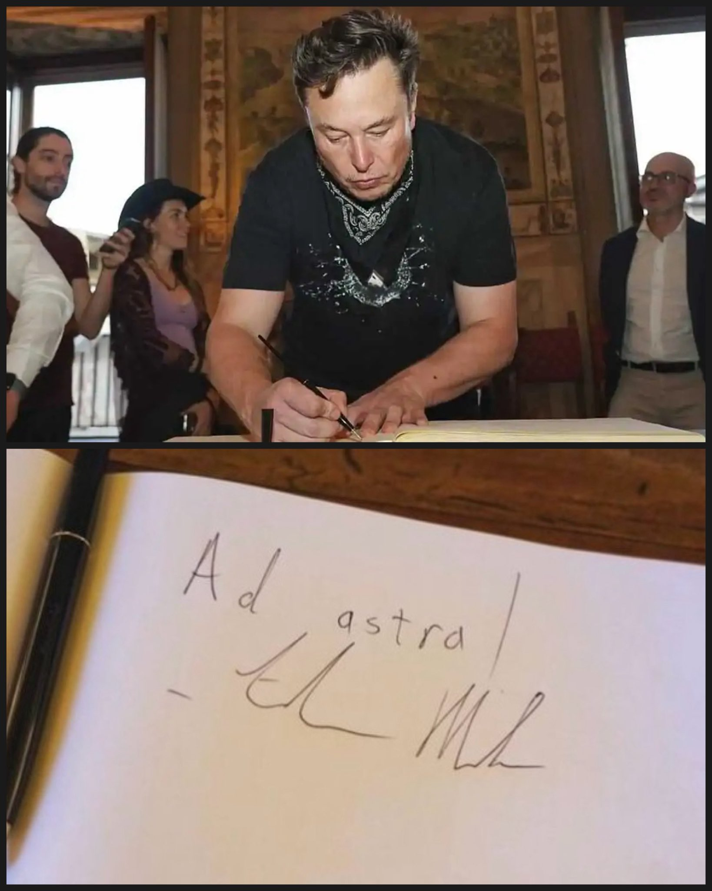

# 🐦 @elonmusk

## 📅 September 07, 2026

> 10 post(s) archived.

---

### 🕐 20:55 UTC · @elonmusk

> FSD Supervised approved in Slovenia 🇸🇮 FSD Supervised now approved in Slovenia 🇸🇮 Rollout will begin soon

🔗 [View original post](https://x.com/elonmusk/status/2097066172780831194)

---

### 🕐 20:42 UTC · @elonmusk

> Elon Musk is right to call this out. He said calling people Nazis for centrist views insults those who suffered and died under the real Nazis. Those abusing it should be condemned. Calling people Nazis just because they hold views you oppose disrespects history and its victims.

🔗 [View original post](https://x.com/cb_doge/status/2097063090240328026)

---

### 🕐 18:58 UTC · @elonmusk

> Starlink is now delivering fast, reliable connectivity onboard Austrian Airlines so passengers can stream, scroll, and surf effortlessly from 30,000 feet 🛰️✈️

🔗 [View original post](https://x.com/Starlink/status/2097036769577644353)

---

### 🕐 18:56 UTC · @elonmusk

> The truth shall set you free Before @ElonMusk bought Twitter, you couldn&apos;t notice that foreigners committed most of the group rapes in Germany, despite being just 15% of the population. By lifting censorship, says @Pauline__Voss, Musk unleashed a “vibe shift” that led to @AfD&apos;s historic victory.

🔗 [View original post](https://x.com/elonmusk/status/2097036344165818834)

---

### 🕐 17:00 UTC · @elonmusk

> That is correct The &quot;far right&quot; party is headed by a lesbian feminist with a wife from Sri Lanka?

🔗 [View original post](https://x.com/elonmusk/status/2097007158156034352)

---

### 🕐 16:55 UTC · @elonmusk

> Cool 🇦🇹 BREAKING: Starlink is now officially live on Austrian Airlines. 🇦🇹 CEO Annette Mann boarded the aircraft to mark Austrian Airlines’ first Starlink-enabled flight from Vienna to Porto today.

🔗 [View original post](https://x.com/elonmusk/status/2097005896802984375)

---

### 🕐 10:12 UTC · @elonmusk

> When Elon Musk visited Palazzo Vecchio in Florence in 2021 🇮🇹

🔗 [View original post](https://x.com/cb_doge/status/2096904542038495664)

---

### 🕐 08:58 UTC · @elonmusk

> “The obsession with truth is why I studied physics, because physics attempts to understand the truth of the universe.” — Elon Musk

🔗 [View original post](https://x.com/cb_doge/status/2096885801640718423)

---

### 🕐 06:16 UTC · @elonmusk

> Illuminating Now the Third Man – Rudi Dutschke – The Man Who Gave the Long March Its Name. Gramsci invented the strategy. Dutschke named it – and then went out and implemented it, in the streets of West Berlin, in 1968, with a generation of students who had read Gramsci and were ready to marc…

🔗 [View original post](https://x.com/elonmusk/status/2096844931520225342)

---

### 🕐 02:22 UTC · @elonmusk

> the Grok @Bot desktop app just got a whole lot faster! there&apos;s still more to improve, but we shipped many perf improvements over the past week: • cold start to usable shell: -247ms (18% faster). • cold start LCP: -425ms (23% faster). • cold start FCP: -234ms (16% faster). • total blocking time to the shell: -101 ms (34% faster). • warm restart to shell: -194 ms (18% faster). • marketplace bots tab first open: -18ms (41% faster). other stats that are unchanged: • INP p98: 48 ms to 56 ms. • composer keystroke to next frame: 8.4 to 8.5 ms. • chat switching: 64 to 77 ms short chat first visit, 66 to 68 ms long chat, revisits equal. • long chat scroll: zero long tasks. enjoy the long weekend building with Grok @Bot!

🔗 [View original post](https://x.com/poteto/status/2096786161981366338)

---
