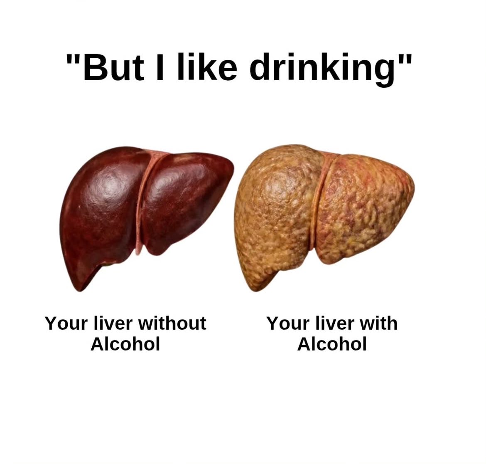

# 🐦 @theendeavorpath

## 📅 September 07, 2026

> 3 post(s) archived.

---

### 🕐 17:06 UTC · @theendeavorpath

> Dear men: Your future self will live with the habits you choose today. 1. “But I like drinking”

🔗 [View original post](https://x.com/EnergyUp_/status/2097008569434689548)

---

### 🕐 16:12 UTC · @theendeavorpath

> She literally explained how to stop ruminating and take action instead. Media

🔗 [View original post](https://x.com/thewisepathh/status/2096994975989026919)

---

### 🕐 07:36 UTC · @theendeavorpath

> B12 needs stomach acid to get out of your food. Antacids taken most days keep that acid down, and the B12 goes through you untouched. Save them for the meals that actually need one. But acid is only the door, and after 50 the door narrows on its own.

🔗 [View original post](https://x.com/RafaelNasriX/status/2096865061407236196)

---
