# 🐦 @Unlockyourlife_

## 📅 September 08, 2026

> 38 post(s) archived.

---

### 🕐 16:54 UTC · @Unlockyourlife_

> How Deadly Train Coupling is. Media

🔗 [View original post](https://x.com/_learnskills/status/2097367873937195113)

---

### 🕐 16:05 UTC · @Unlockyourlife_

> Not everything you hear about nutrition is true. Carbs, fruit, protein, and even meal timing can all be part of a healthy diet. Instead of following extreme food rules, focus on balanced meals, appropriate portions, and consistency. Learn the facts, make smarter choices, and don’t let nutrition myths control your diet.

🔗 [View original post](https://x.com/_fitnesshub/status/2097355669170991179)

---

### 🕐 16:05 UTC · @Unlockyourlife_

> 5.

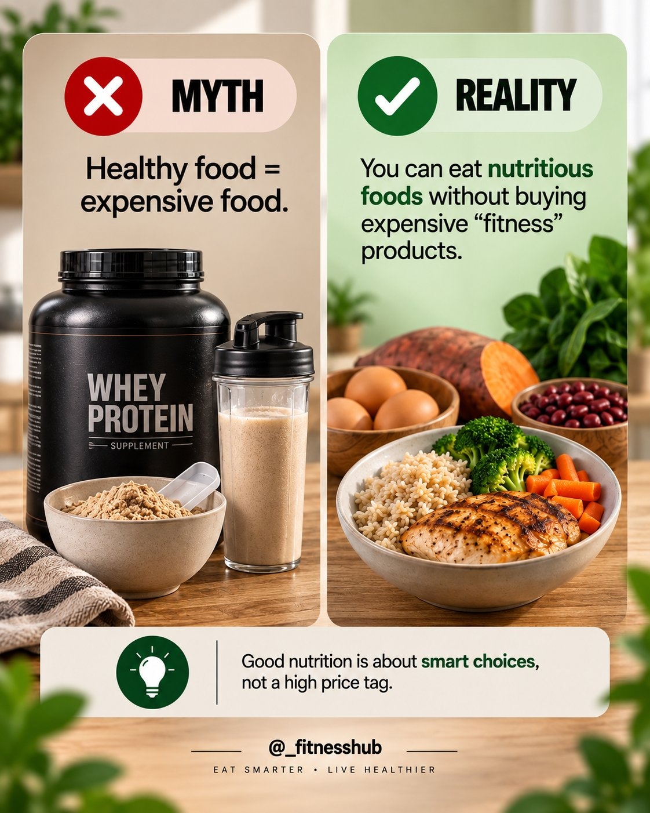

🔗 [View original post](https://x.com/_fitnesshub/status/2097355665186468060)

---

### 🕐 16:05 UTC · @Unlockyourlife_

> 4.

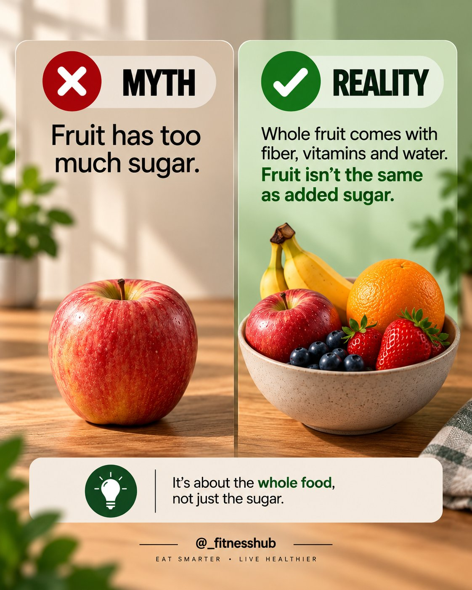

🔗 [View original post](https://x.com/_fitnesshub/status/2097355659096318383)

---

### 🕐 16:05 UTC · @Unlockyourlife_

> 3.

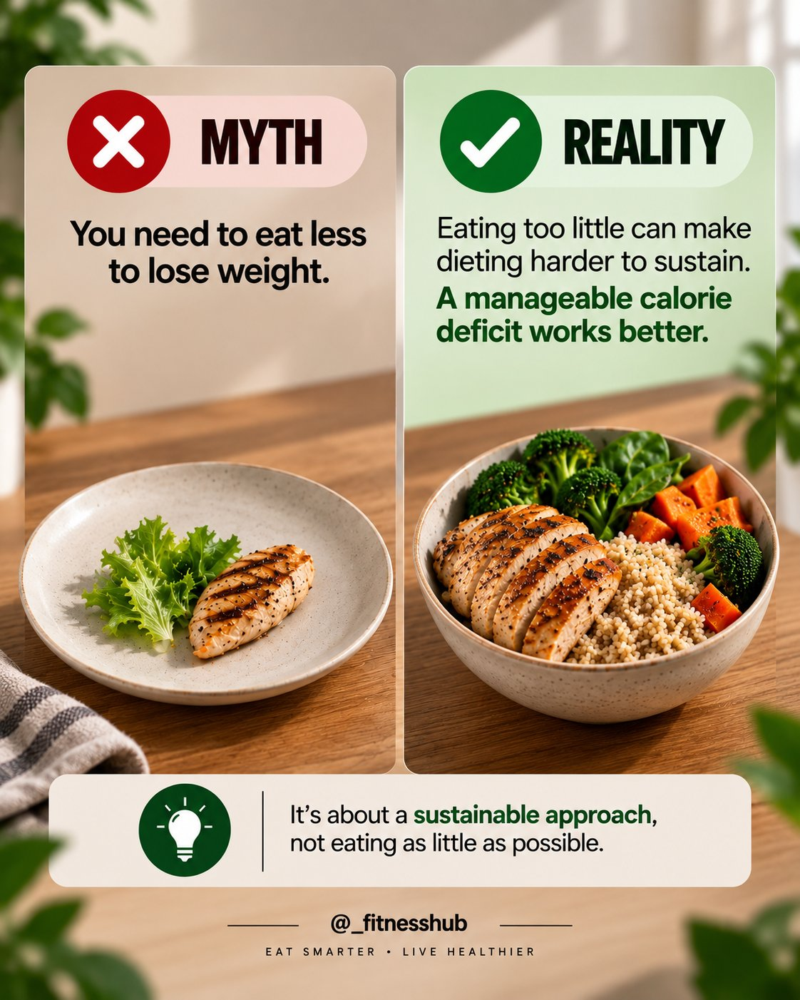

🔗 [View original post](https://x.com/_fitnesshub/status/2097355652809085229)

---

### 🕐 16:05 UTC · @Unlockyourlife_

> 2.

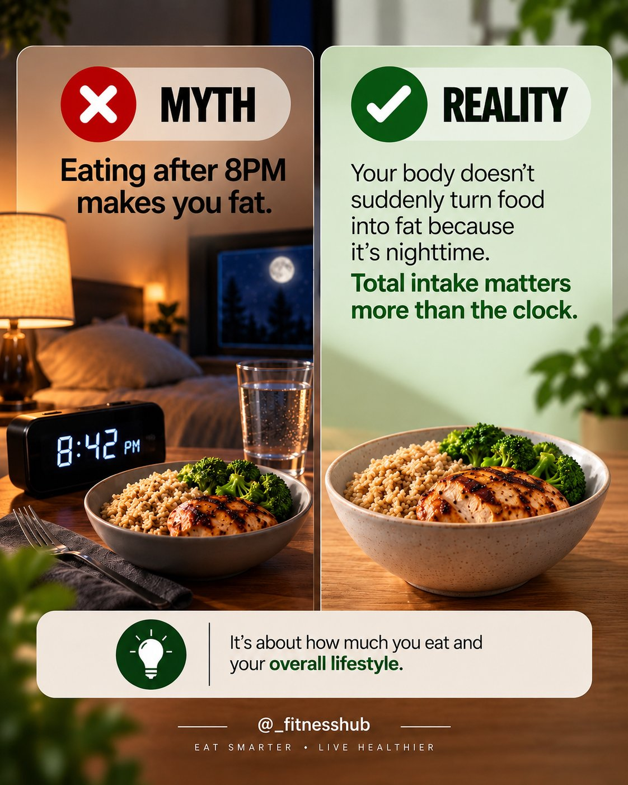

🔗 [View original post](https://x.com/_fitnesshub/status/2097355647775908103)

---

### 🕐 16:05 UTC · @Unlockyourlife_

> 🍎 5 NUTRITION MYTHS YOU PROBABLY STILL BELIEVE. 1.

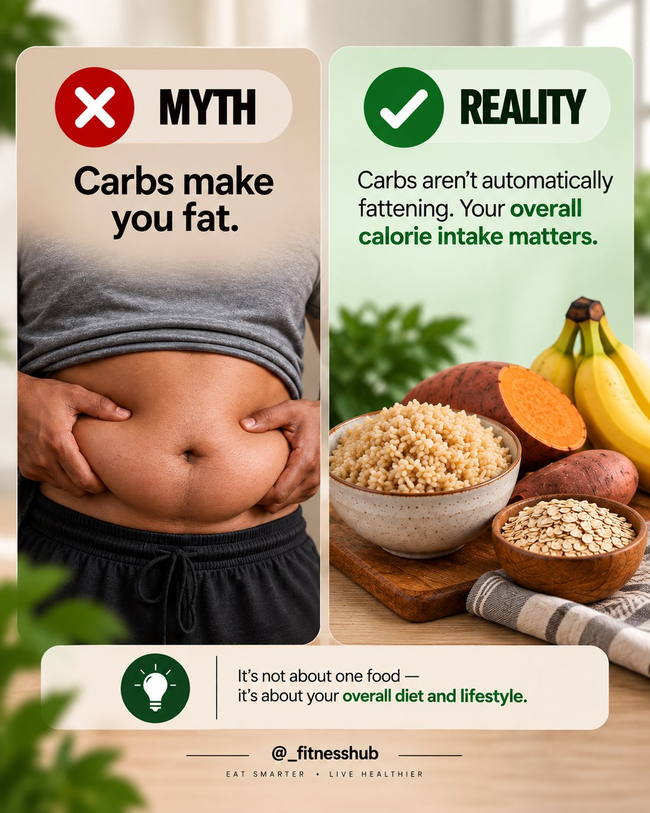

🔗 [View original post](https://x.com/_fitnesshub/status/2097355641702555859)

---

### 🕐 15:10 UTC · @Unlockyourlife_

> 20 Types Of Skin Issues

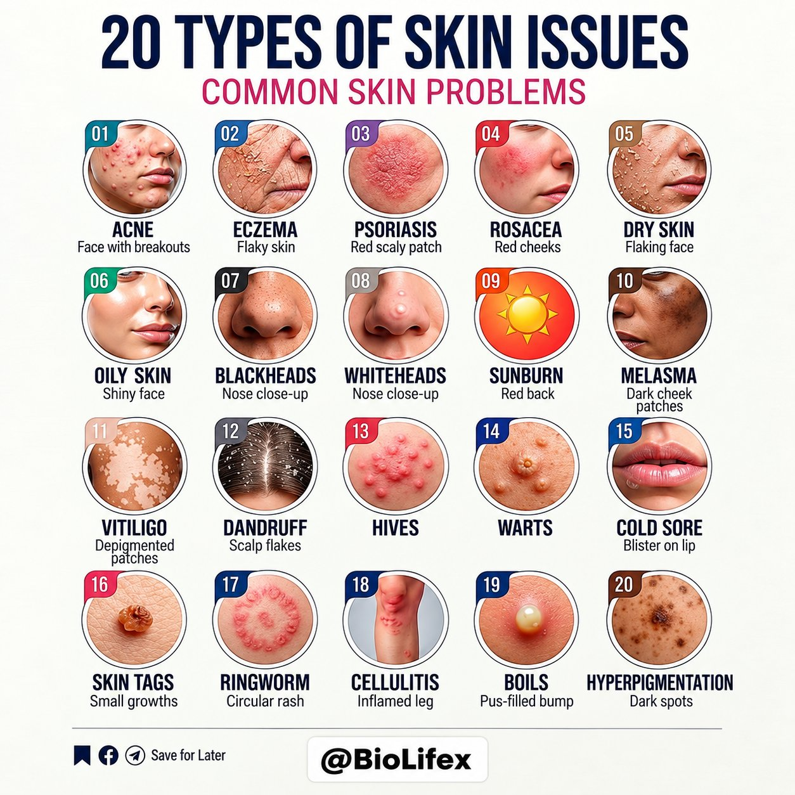

🔗 [View original post](https://x.com/BioLifex/status/2097341882061750595)

---

### 🕐 13:36 UTC · @Unlockyourlife_

> Natural remedies can provide simple support for everyday symptoms, but they are not cures. Warm fluids, honey, ginger, saline rinses and prunes may help with certain symptoms, while healthy habits and knowing when to seek medical care matter just as much. If symptoms are severe, persistent, frequent, or unusual, speak with a healthcare professional.

🔗 [View original post](https://x.com/FitnessDr_/status/2097318110978035916)

---

### 🕐 13:36 UTC · @Unlockyourlife_

> 6. Constipation

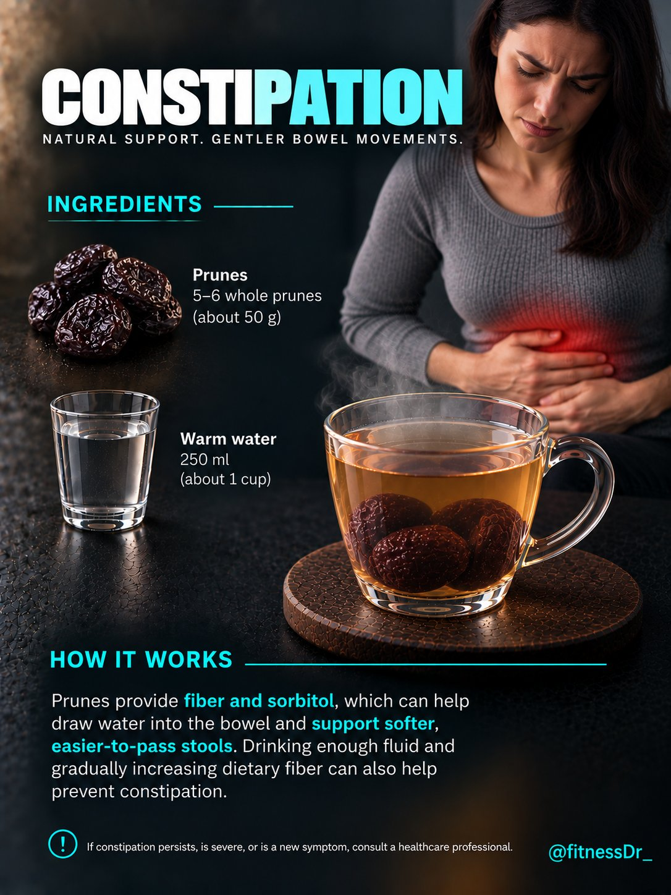

🔗 [View original post](https://x.com/FitnessDr_/status/2097318108411113499)

---

### 🕐 13:36 UTC · @Unlockyourlife_

> 5. Heartburn

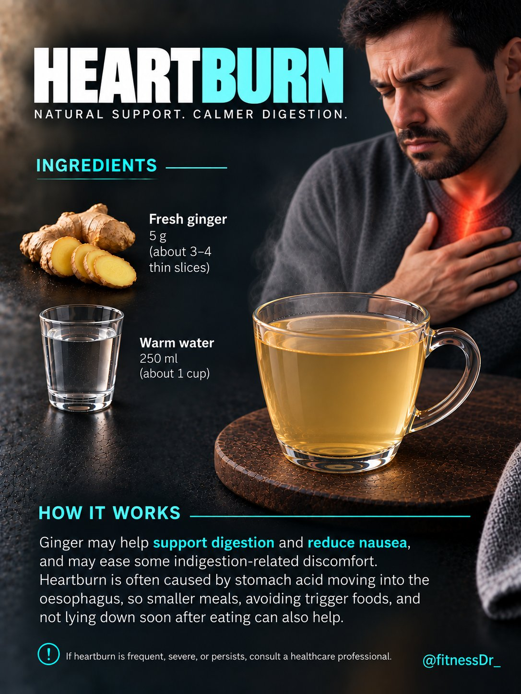

🔗 [View original post](https://x.com/FitnessDr_/status/2097318098323771887)

---

### 🕐 13:36 UTC · @Unlockyourlife_

> 4. Nasal congestion

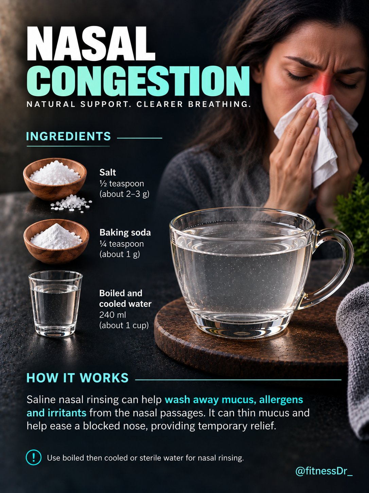

🔗 [View original post](https://x.com/FitnessDr_/status/2097318089507409998)

---

### 🕐 13:36 UTC · @Unlockyourlife_

> 3. Mild cough

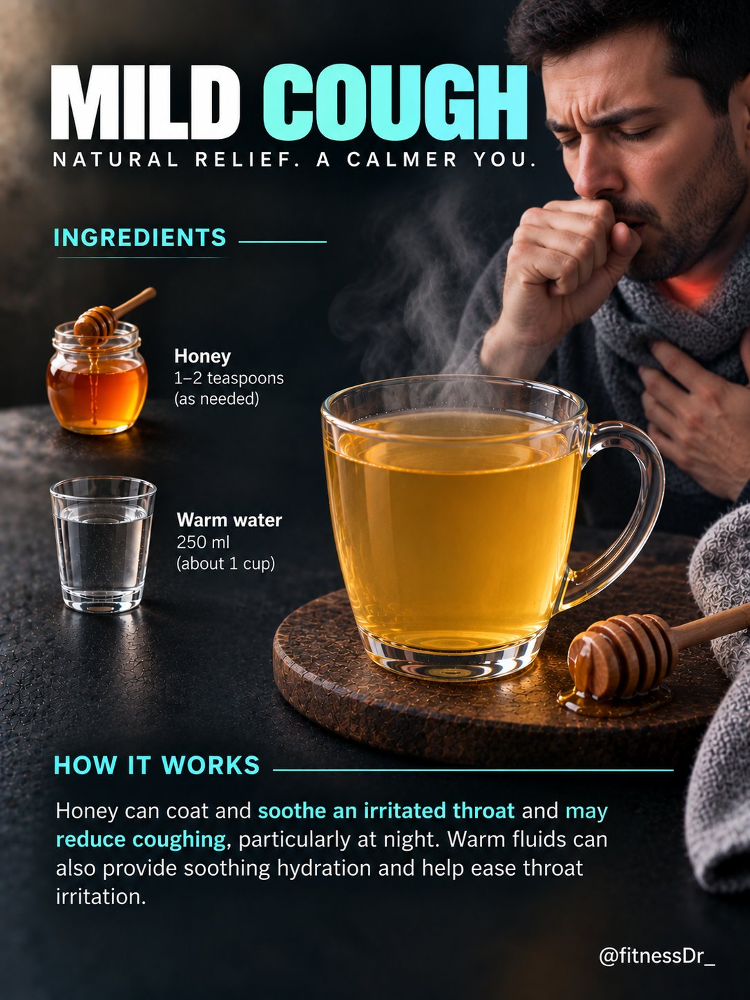

🔗 [View original post](https://x.com/FitnessDr_/status/2097318080389026187)

---

### 🕐 13:36 UTC · @Unlockyourlife_

> 2. Migraine

🔗 [View original post](https://x.com/FitnessDr_/status/2097318070884655472)

---

### 🕐 13:36 UTC · @Unlockyourlife_

> 6 COMMON AILMENTS &amp; NATURAL WAYS TO FEEL BETTER. 1. Sore throat

🔗 [View original post](https://x.com/FitnessDr_/status/2097318061191708914)

---

### 🕐 12:35 UTC · @Unlockyourlife_

> Who knew school geometry would actually come in handy? 📐 Media

🔗 [View original post](https://x.com/Smart_Tipsx/status/2097302778435502590)

---

### 🕐 12:32 UTC · @Unlockyourlife_

> What happens when you throw popcorn into a blazing fire? 🔥🍿 Media

🔗 [View original post](https://x.com/Mastering_life_/status/2097301994625282269)

---

### 🕐 12:04 UTC · @Unlockyourlife_

> Flexibility vs Mobility.

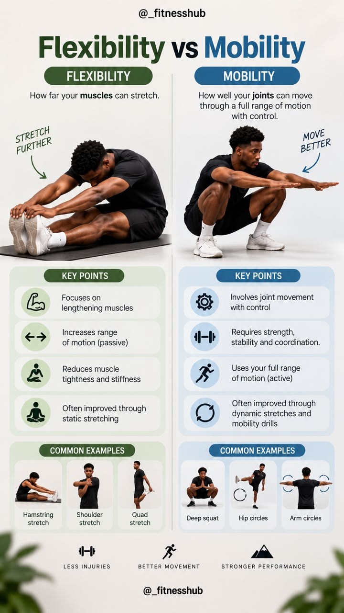

🔗 [View original post](https://x.com/_fitnesshub/status/2097294977231396974)

---

### 🕐 11:37 UTC · @Unlockyourlife_

> A Tiny Wooden Project With a Big Finish! Media

🔗 [View original post](https://x.com/_Brainboxx/status/2097288328848544158)

---

### 🕐 10:45 UTC · @Unlockyourlife_

> 7 3D Prints That Are WAY Too Satisfying 🤫 Media

🔗 [View original post](https://x.com/samx_reels/status/2097275087506329772)

---

### 🕐 10:13 UTC · @Unlockyourlife_

> construction tricks idea 😨😨😨😨 Media

🔗 [View original post](https://x.com/Smart_Tipsx/status/2097267099974430768)

---

### 🕐 09:50 UTC · @Unlockyourlife_

> How do you prepare your chicken?

🔗 [View original post](https://x.com/Elitedelicacy/status/2097261340553285890)

---

### 🕐 09:49 UTC · @Unlockyourlife_

> Did you know?

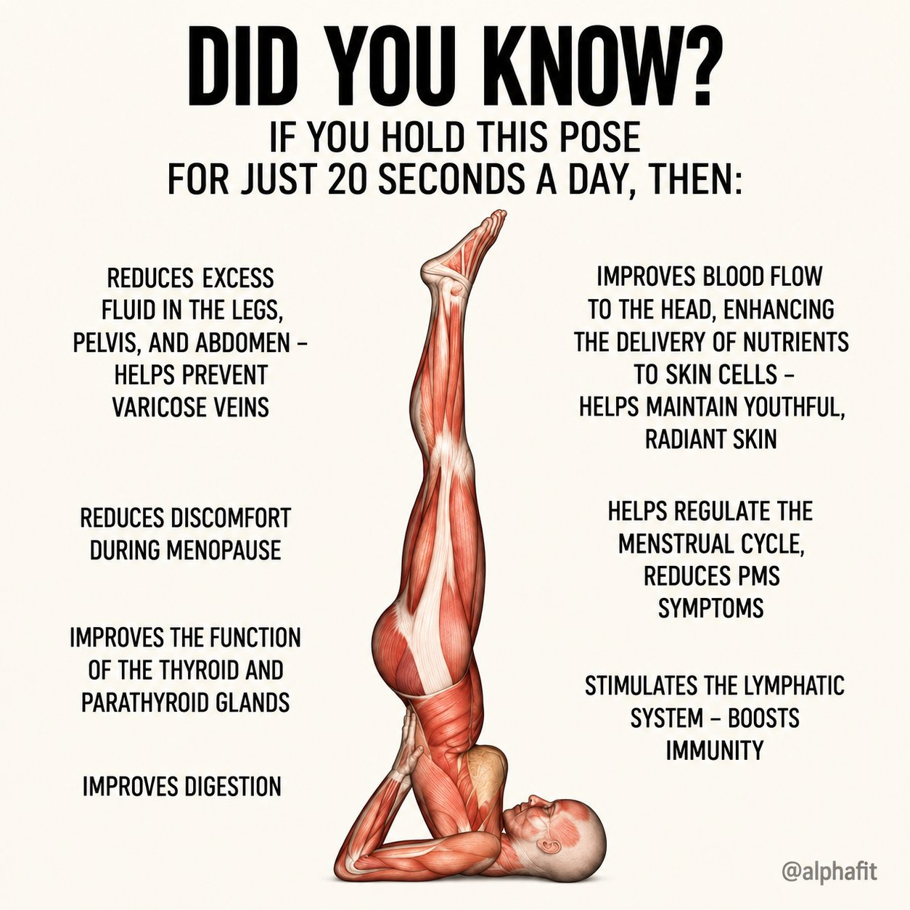

🔗 [View original post](https://x.com/_alphafit/status/2097261101138260102)

---

### 🕐 09:48 UTC · @Unlockyourlife_

> Why Do We Have Fingerprints?

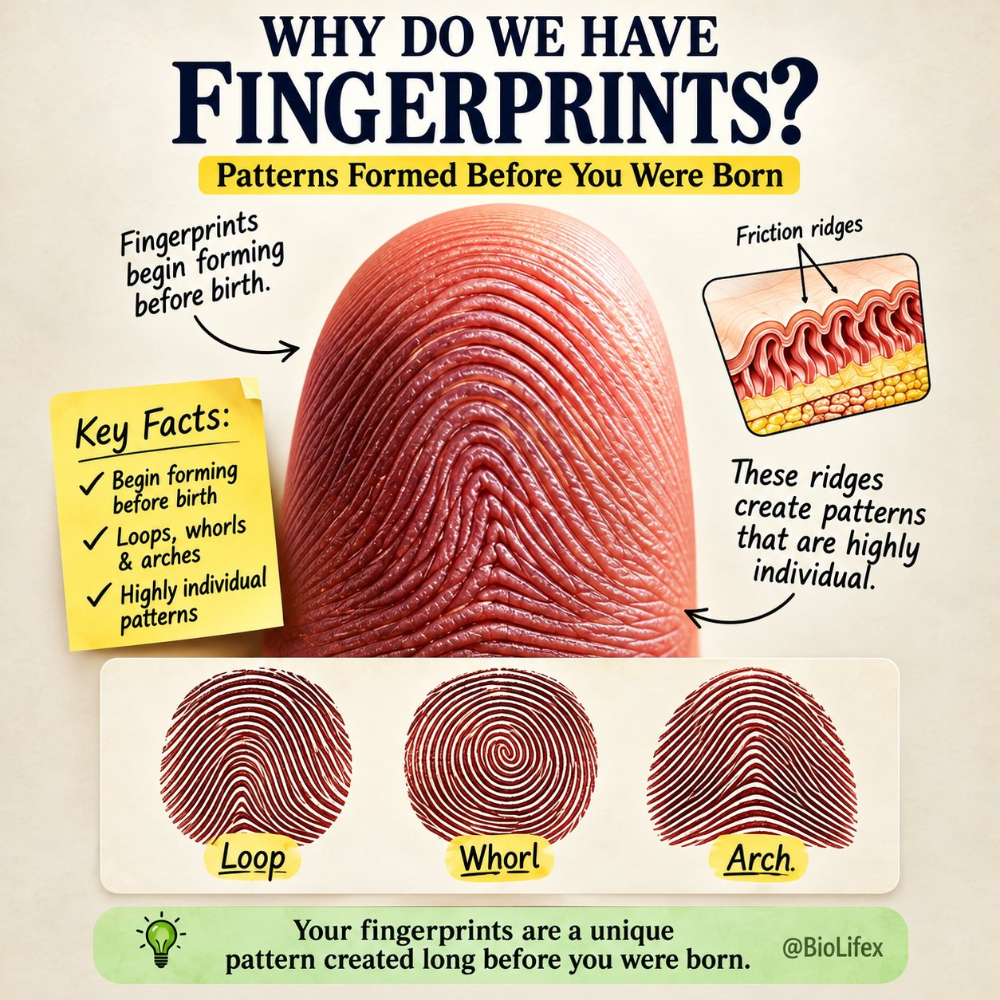

🔗 [View original post](https://x.com/BioLifex/status/2097260886368891153)

---

### 🕐 08:01 UTC · @Unlockyourlife_

> Remember, getting fit is a process, not a race. You don&apos;t need to train the hardest or see results overnight. Focus on good form, proper nutrition, enough recovery, and staying consistent. Progress might feel slow at first, but those small improvements will add up over time. Be patient, trust the process, and keep showing up. 🔥💪

🔗 [View original post](https://x.com/_fitnesshub/status/2097233937848254769)

---

### 🕐 08:01 UTC · @Unlockyourlife_

> 5. EXPECTING RESULTS TOO QUICKLY You won&apos;t transform your body after a few workouts. Strength, muscle and fitness improve gradually through consistent training, nutrition and recovery. Don&apos;t compare your first month to someone&apos;s fifth year.

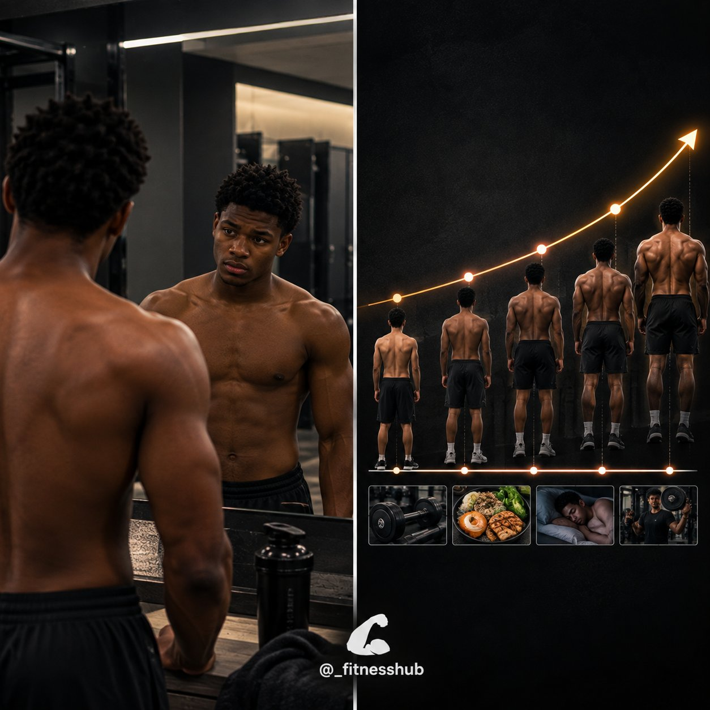

🔗 [View original post](https://x.com/_fitnesshub/status/2097233928973070646)

---

### 🕐 08:01 UTC · @Unlockyourlife_

> 4. NOT EATING OR SLEEPING PROPERLY Your workout is only part of the equation. Your body needs enough protein, calories, nutrients and sleep to recover and adapt. You can train hard, but if recovery is poor, your progress may suffer.

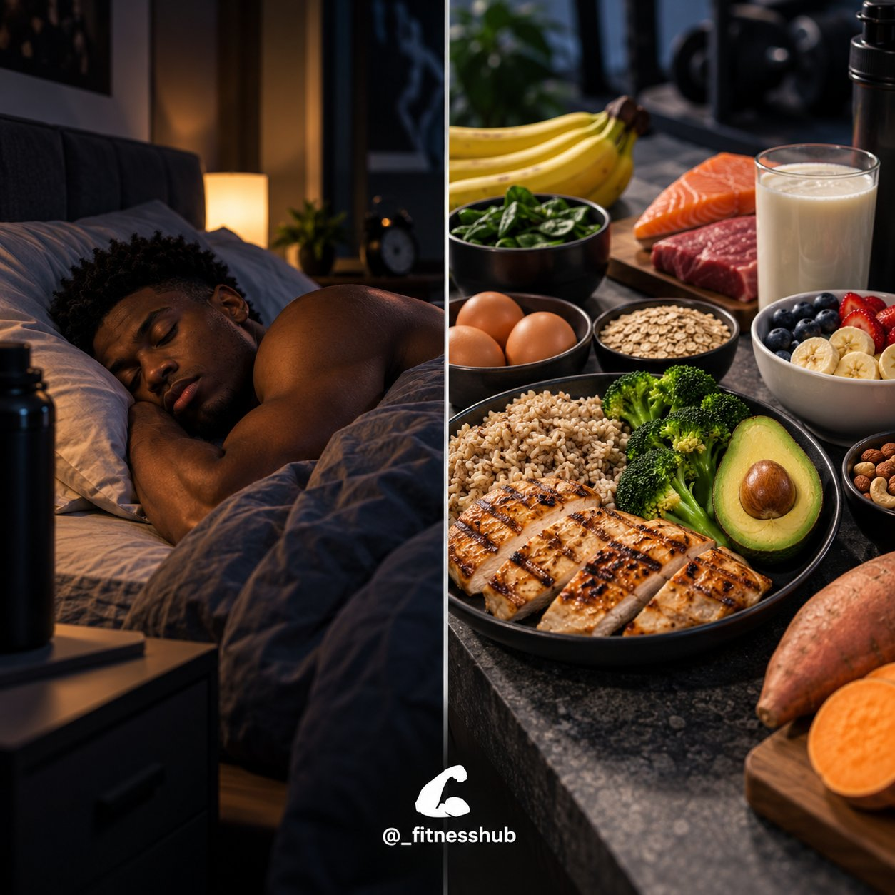

🔗 [View original post](https://x.com/_fitnesshub/status/2097233917220655465)

---

### 🕐 08:01 UTC · @Unlockyourlife_

> 3. IGNORING PROPER FORM Trying to complete more reps by swinging, rushing or using momentum can reduce the effectiveness of an exercise and increase your risk of injury. Learn the movement first. Add weight later.

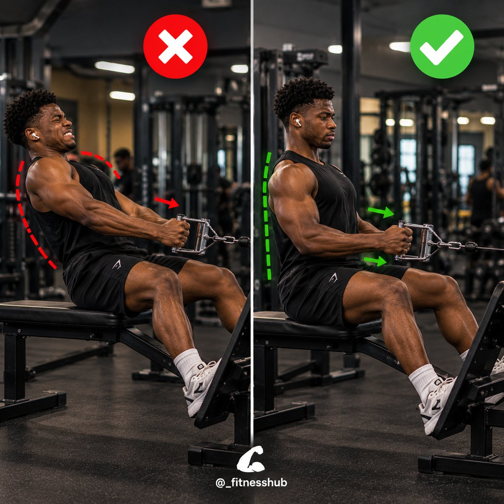

🔗 [View original post](https://x.com/_fitnesshub/status/2097233902221893747)

---

### 🕐 08:01 UTC · @Unlockyourlife_

> 2. TRAINING EVERY SINGLE DAY More workouts don&apos;t automatically mean faster results. Your muscles need time to recover and adapt after training. Give your body proper rest, especially when you&apos;re just starting.

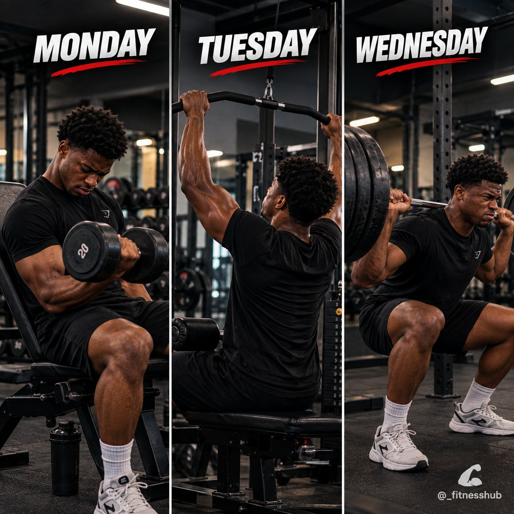

🔗 [View original post](https://x.com/_fitnesshub/status/2097233892180689402)

---

### 🕐 08:01 UTC · @Unlockyourlife_

> 1. GOING TOO HEAVY TOO SOON You don&apos;t need to lift the heaviest weight in the gym to build muscle. Starting with weights you can&apos;t control often leads to poor form and unnecessary strain. Focus on controlled movements and gradually increase the weight as you get stronger.

🔗 [View original post](https://x.com/_fitnesshub/status/2097233882886099247)

---

### 🕐 08:01 UTC · @Unlockyourlife_

> 5 WORKOUT MISTAKES BEGINNERS MAKE 🏋️‍♂️ Starting your fitness journey is exciting, but doing too much too soon can slow your progress or even get you injured. Here are 5 common mistakes beginners should avoid 👇

🔗 [View original post](https://x.com/_fitnesshub/status/2097233876074577992)

---

### 🕐 08:00 UTC · @Unlockyourlife_

> Have you ever seen a plumber with this level of intelligence? Media

🔗 [View original post](https://x.com/Smart_Tipsx/status/2097233722303025180)

---

### 🕐 06:54 UTC · @Unlockyourlife_

> 20 Keyboard Shortcuts Every Computer User Should Know.

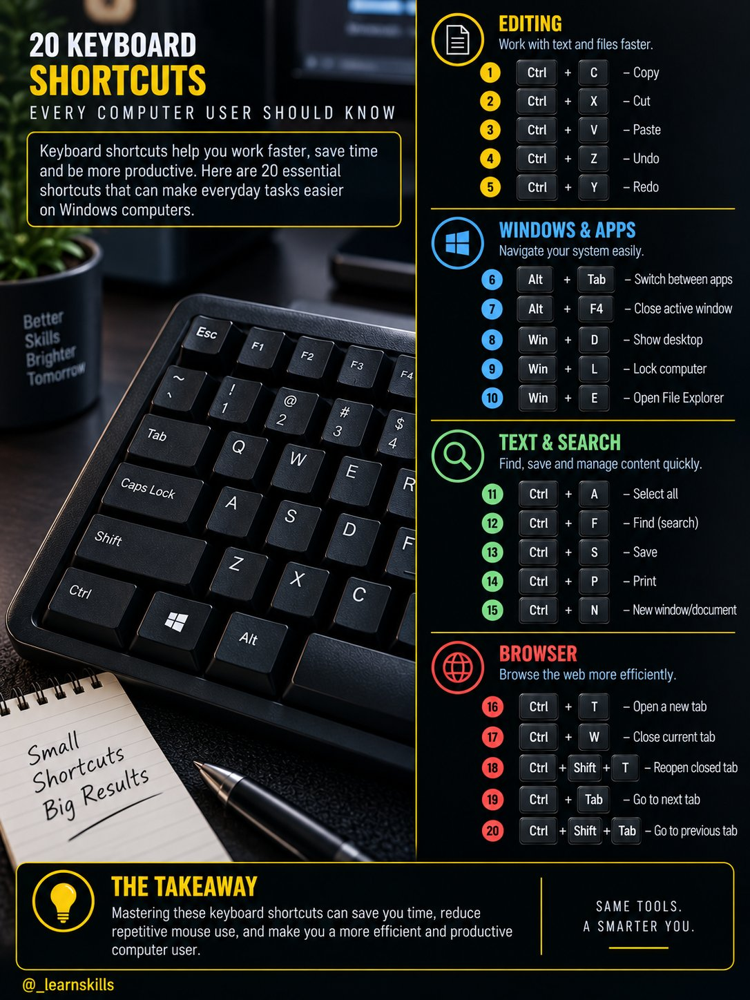

🔗 [View original post](https://x.com/_learnskills/status/2097216874589151347)

---

### 🕐 06:40 UTC · @Unlockyourlife_

> Kebab Recipe &amp; Ingredients

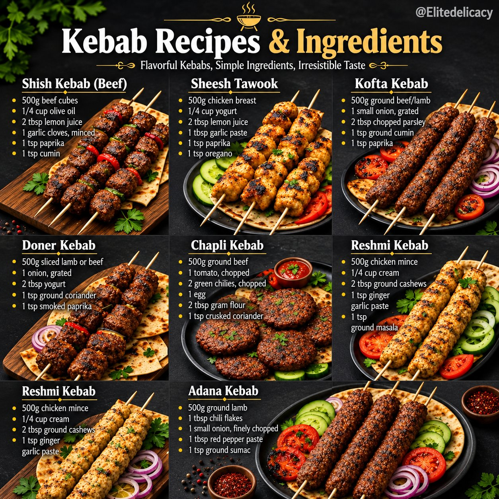

🔗 [View original post](https://x.com/Elitedelicacy/status/2097213527958176057)

---

### 🕐 06:40 UTC · @Unlockyourlife_

> Height Growth Exercises.

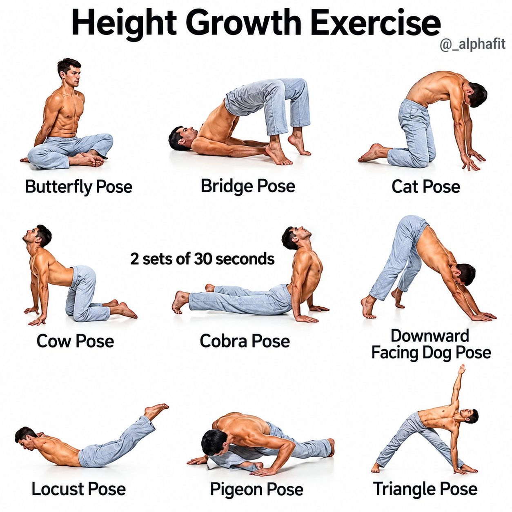

🔗 [View original post](https://x.com/_alphafit/status/2097213345837334801)

---

### 🕐 06:39 UTC · @Unlockyourlife_

> Belly Fat Vs Water Retention.

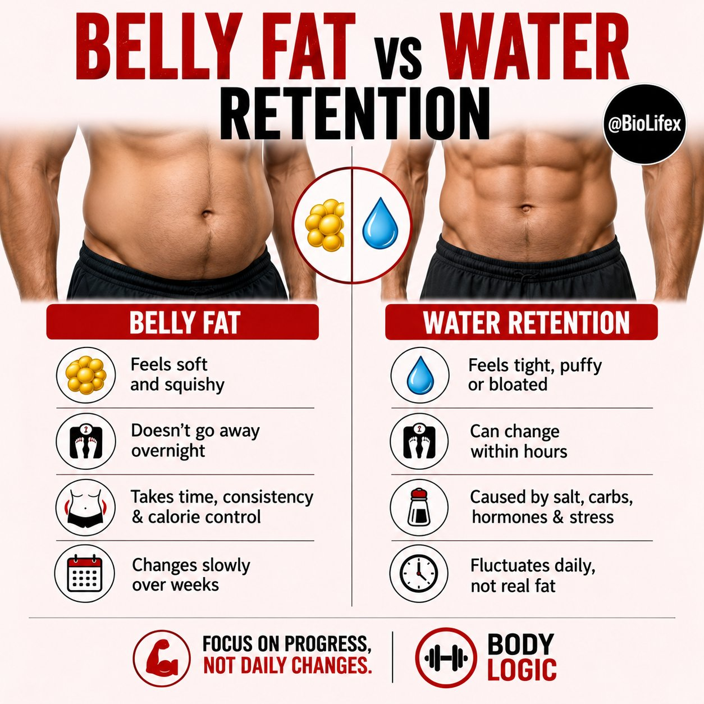

🔗 [View original post](https://x.com/BioLifex/status/2097213214064779330)

---

### 🕐 05:09 UTC · @Unlockyourlife_

> Sitting too much VS Staying Active

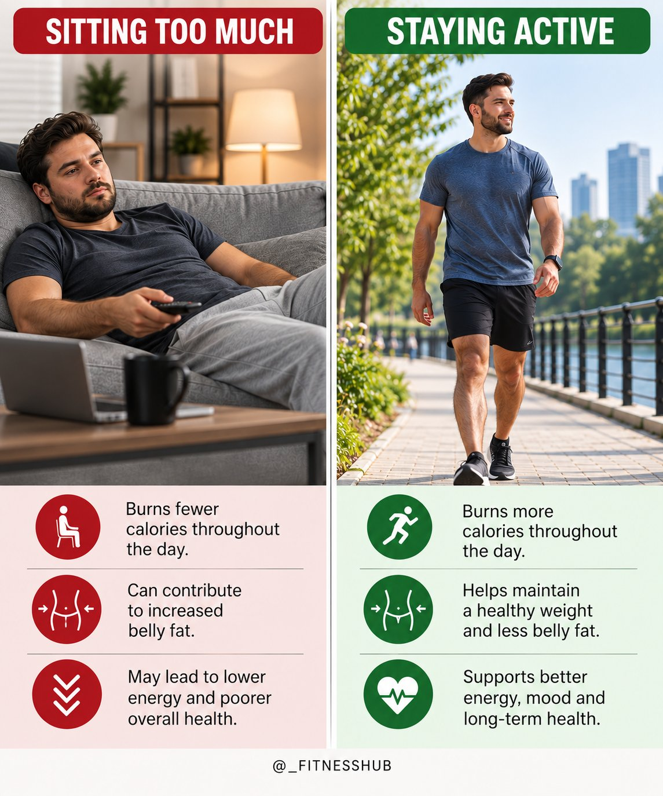

🔗 [View original post](https://x.com/_fitnesshub/status/2097190677134110769)

---

### 🕐 03:50 UTC · @Unlockyourlife_

> Your body may be low in IRON

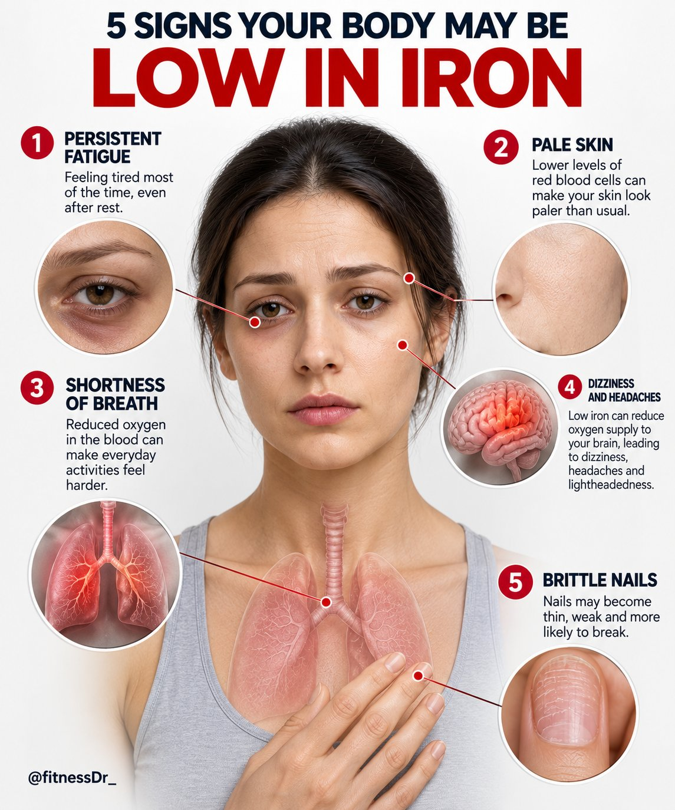

🔗 [View original post](https://x.com/FitnessDr_/status/2097170671734308981)

---
