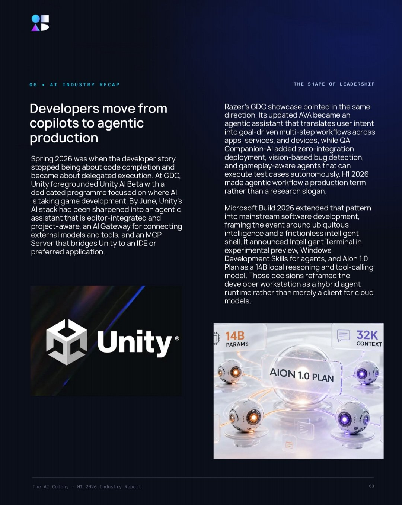
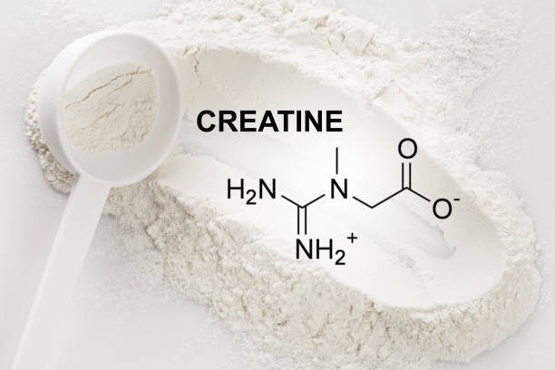
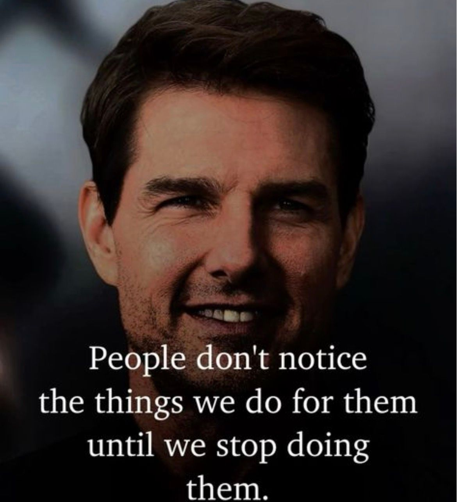

# 🐦 @Wise1Philosophy

## 📅 September 08, 2026

> 36 post(s) archived.

---

### 🕐 08:59 UTC · @Wise1Philosophy

> Netflix is quietly hoping you never type a 4-digit code into your browser. There are over 2,200 hidden genre categories the Netflix homepage will never show you from &quot;Deep Sea Horror&quot; to &quot;Cyberpunk&quot; to &quot;Tearjerkers Based on Real Life&quot; to &quot;Visually Striking Foreign Thrillers&quot; to &quot;90-Minute Movies&quot; to &quot;Witchcraft &amp; the Dark Arts.&quot; The Netflix homepage shows you roughly 40 rows of content. Behind it: 2,200+ curated categories hand-organized by Netflix since its DVD-mailing days accessible with a URL and a 4-digit number. The algorithm shows you what IT wants. The codes show you everything. A streaming analyst who&apos;s studied every major platform&apos;s recommendation system for 6 years told his friend: &quot;You&apos;ve been saying &apos;there&apos;s nothing to watch on Netflix&apos; for 3 years. There are 8,000+ titles in your region. The homepage shows you about 200 curated by an algorithm that narrows your options based on what you&apos;ve already watched. You&apos;re scrolling through a keyhole and blaming the house for being empty. The house has 8,000 rooms. The algorithm is showing you the same hallway.&quot; He showed her 9 features that break the loop hidden categories that bypass the algorithm, a quality setting she was paying for but not receiving, a viewing history she can edit to reset recommendations, and a download system that works on more devices than she thought. She stopped scrolling that evening. For the first time in months, she found something she&apos;d never seen recommended in a genre she didn&apos;t know Netflix had. &quot;Netflix has 2,200 genre categories. The homepage shows you 40. The other 2,160 are behind codes most subscribers have never typed in a URL structure Netflix has never shut down, never hidden, and never promoted.&quot; Here are the 9 things he showed her 🧵

🔗 [View original post](https://x.com/jackcoder0/status/2097248449863234009)

---

### 🕐 08:37 UTC · @Wise1Philosophy

> Your son will meet boys who include him, pressure him, mock him, and dare him to prove himself. Teach him these 7 friendship rules early.

🔗 [View original post](https://x.com/Manifest_Lord/status/2097242868029292569)

---

### 🕐 08:37 UTC · @Wise1Philosophy

> Your daughter will meet girls who love her, use her, exclude her, and test her. Teach her these 7 friendship rules early.. 👇 🧵

🔗 [View original post](https://x.com/scotti_brooks/status/2097242802581278803)

---

### 🕐 08:30 UTC · @Wise1Philosophy

> a network of young crypto scammers allegedly pulled off one of the largest cryptocurrency thefts in u.s. history, tricking a washington, d.c. investor into handing over access that let them steal more than 4,100 bitcoin worth over $240 million. prosecutors say the group then laundered the stolen crypto through multiple platforms to hide the proceeds. the suspects quickly went on a massive spending spree, buying dozens of luxury cars, watches and other expensive items, renting mansions, flying private jets and spending millions at nightclubs. eighteen defendants have been charged in the case, with alleged ringleader malone lam, 22, scheduled for a plea agreement hearing tuesday.

🔗 [View original post](https://x.com/daveydefi/status/2097241257168843166)

---

### 🕐 08:04 UTC · @Wise1Philosophy

> The developer story changed this half. Coding assistants stopped being about code completion and became about delegated execution, with agents that translate intent into multi-step workflows and test entire builds on their own. How building software changed, in the H1 2026 Industry Report:https://bit.ly/StateofAI2026

🔗 [View original post](https://x.com/TheAIColonyRD/status/2097234534416678936)

---

### 🕐 08:03 UTC · @Wise1Philosophy

> The AI Colony Academy Scholarship is now open. If cost has ever stopped you from learning AI properly, this is for you. Completely free for those selected! https://rebrand.ly/AIscholarship

🔗 [View original post](https://x.com/Shawnife/status/2097234469103063389)

---

### 🕐 08:01 UTC · @Wise1Philosophy

🔗 [View original post](https://x.com/Wise1Philosophy/status/2097233816813277444)

---

### 🕐 08:00 UTC · @Wise1Philosophy

> Your body has emergency stress and anxiety switches built right into it. Here&apos;s what you can reset in seconds: 1. Lying awake in bed = blink slowly for 60 seconds

🔗 [View original post](https://x.com/HiVioletMM/status/2097233488617656466)

---

### 🕐 07:54 UTC · @Wise1Philosophy

> What happens when your body is severely vitamin D deficient? You may NEVER skip your vitamin D again after reading this list: 1. Your head starts sweating for no reason///

🔗 [View original post](https://x.com/TinaaDeJong/status/2097231967746163077)

---

### 🕐 07:43 UTC · @Wise1Philosophy

> A Stanford professor proved high cortisol hurts your memory, enlarges your fear center, and makes your brain smaller. 1. Walk barefoot on grass for 5 minutes Media

🔗 [View original post](https://x.com/Rose_MaryIRL/status/2097229222171541621)

---

### 🕐 07:30 UTC · @Wise1Philosophy

🔗 [View original post](https://x.com/Daily__wisdom_/status/2097226007128203558)

---

### 🕐 07:30 UTC · @Wise1Philosophy

> The future of creativity is coming to Los Angeles. This October, CapCut World will bring together global creators to explore new possibilities in AI-powered creativity and video creation. A new era of creating starts here. #CapCutWorld #CapCutDidThat

🔗 [View original post](https://x.com/FutureStacked/status/2097225998886396107)

---

### 🕐 07:27 UTC · @Wise1Philosophy

> Los Angeles. October 2026. Creators from around the world. AI. Creativity. Video. CapCut World is bringing the future of creation together in one place. #CapCutWorld #CapCutDidThat

🔗 [View original post](https://x.com/TheAIColony/status/2097225411197329765)

---

### 🕐 07:24 UTC · @Wise1Philosophy

> AI is changing the way we create, and creators are at the center of it all. This October, CapCut World is coming to Los Angeles for a global gathering celebrating AI, creativity, and the future of video creation. Can’t wait to see what creators make next. #CapCutWorld #CapCutDidThat

🔗 [View original post](https://x.com/AriaWestcott/status/2097224427461079133)

---

### 🕐 07:21 UTC · @Wise1Philosophy

> Something big is coming to Los Angeles. CapCut World is happening in October 2026, bringing together creators from around the world to explore the future of AI, creativity, and video creation. The future of creating is here. Will you be part of it? #CapCutWorld #CapCutDidThat

🔗 [View original post](https://x.com/AIFrontliner/status/2097223714152559016)

---

### 🕐 07:20 UTC · @Wise1Philosophy

> The biggest scam in human history is the supplement industry. Out of 50,000+ products on the shelves, these are the 5 that actually work: 1. Magnesium glycinate

🔗 [View original post](https://x.com/MuahDavis/status/2097223419138080776)

---

### 🕐 07:14 UTC · @Wise1Philosophy

> I started taking whey at breakfast, vitamin D with the same meal, and magnesium before bed. Without exaggerating, my personality changed 180 degrees. 1. Whey protein, at breakfast

🔗 [View original post](https://x.com/MarkoSilva291/status/2097221901412364679)

---

### 🕐 07:01 UTC · @Wise1Philosophy

🔗 [View original post](https://x.com/apex_mentality_/status/2097218770037026953)

---

### 🕐 06:40 UTC · @Wise1Philosophy

> Creatine isn&apos;t a steroid. It is a naturally occurring compound that exists in everyone’s body. It doesn&apos;t cause bloating, hair loss, weight gain, or kidney trouble. 1. It refuels effort

🔗 [View original post](https://x.com/HeyKimChong/status/2097213349616652498)

---

### 🕐 06:30 UTC · @Wise1Philosophy

🔗 [View original post](https://x.com/yeti_mind/status/2097210904437813337)

---

### 🕐 06:23 UTC · @Wise1Philosophy

> We were asked to assess a mature eDiscovery platform comprising over 2 million lines of code. The product manager showed us the math and proved that engineering was not the bottleneck. Testing was the actual constraint. Law firms and corporations use it for large litigations: collect the custodians, process the documents, review them, produce what&apos;s responsive to the other side or to a regulator. It is largely a 15 year old Windows desktop application with release cycles stretching up to a year. They ran 3,800 regression tests entirely by hand. This suite provided zero coverage for new features. It required five months of manual execution just to ship an update, with a single tester clearing only one or two tests a day. New hires took three months to become useful because the test paths were completely undocumented. The procedures lived solely in the heads of veteran staff. Every new feature carries a five month tax. While this company shipped once, a competitor shipping quarterly took four swings at the market. From a board seat, this simply looks like a slow engineering organization where releases land late and the roadmap slips. The default response is to hire more engineers, but that makes the problem worse. Every new hire produces more surface area to regress and directly hits the bottleneck slowing the system down. You are just paying to lengthen the queue. The root cause is a QA function sitting completely outside development. They were absent from planning and acceptance. They arrived only at the end to inspect. When nobody upstream is accountable for building a testable product, thousands of manual tests feel necessary. We audited the codebase and scoped the turnaround. We are not automating 3,800 tests because most of the suite is duplicative or covers behavior customers abandoned years ago. Automating a test nobody needs is just faster waste. The first job is identifying the 500 tests that actually protect the business. No tool can answer that question for you. Once we isolate the core suite, the designed strategy shifts the workload away from manual execution. We designed a solution where AI generates test cases directly from acceptance criteria in minutes, and Playwright executes them automatically. The strategy establishes quality gates enforcing a 98% pass rate before code merges. The design targets an 80% reduction in total testing time. If you manage a mature product with a long release cycle and an update slips, you must be able to split the delay into days of engineering versus days of verification. Most companies cannot do this. That is the exact metric you need before approving more headcount. Your release cycle does not die of bad features. It dies of manual regression.

🔗 [View original post](https://x.com/mardehaym/status/2097209066322067758)

---

### 🕐 06:17 UTC · @Wise1Philosophy

> A dermatologist shocked me when she said: &quot;You age because your body stops making collagen. Without it, your skin thins, your joints ache, and your bones get brittle.&quot; 1. Stop skipping sunscreen on cloudy days

🔗 [View original post](https://x.com/HeyEleanorr/status/2097207556485832741)

---

### 🕐 06:09 UTC · @Wise1Philosophy

> Ashwagandha is nature’s hormone stabilizer. It reduces cortisol, supports testosterone, and improves sleep. But almost no one uses it correctly. 1. It is an adaptogen so ithelps your body respond to stress instead of masking it [1/13] Media

🔗 [View original post](https://x.com/ClaraBrooksjz/status/2097205563310608590)

---

### 🕐 06:00 UTC · @Wise1Philosophy

🔗 [View original post](https://x.com/Life__Mastery/status/2097203492293116038)

---

### 🕐 06:00 UTC · @Wise1Philosophy

> A doctor who has followed the same 2,000 people since the eighties told me the 8 things that predict how well you age. 1. How fast you walk.

🔗 [View original post](https://x.com/yourcamilavega/status/2097203298558439733)

---

### 🕐 03:18 UTC · @Wise1Philosophy

> Dementia = blood sugar. Dementia = inflammation. Dementia = Preventable. 8 simple rules to protect your brain: 1. Don&apos;t sleep 6 hours Media

🔗 [View original post](https://x.com/Fitby_Chandler/status/2097162612245229974)

---

### 🕐 03:12 UTC · @Wise1Philosophy

> Heart Attack = Inflammation. Heart Attack = Happens in early morning. Heart Attack = No. 1 killer on Earth. 5 simple habits to protect your heart: 1. Don&apos;t wake up to go to the toilet at 3 AM Media

🔗 [View original post](https://x.com/BeBetter_Athlet/status/2097161139033661477)

---

### 🕐 03:08 UTC · @Wise1Philosophy

> An oncologist confessed: “There are 3 types of people who never get cancer.” 1. Those who regularly sweat until salt forms on their skin.

🔗 [View original post](https://x.com/LevelUpPrime/status/2097160154328547490)

---

### 🕐 03:04 UTC · @Wise1Philosophy

> Sleep is the most underrated medicine on Earth. It repairs your brain, burns fat, balances hormones, and controls how fast you age. Here are 7 &quot;normal&quot; habits that are ruining your sleep: 1. Waking up to go to the toilet at 3 AM. Media

🔗 [View original post](https://x.com/NutritionCorp/status/2097159123972522203)

---

### 🕐 02:56 UTC · @Wise1Philosophy

> Cortisol = belly fat. Cortisol = puffy face. Cortisol = trembling eyelids. Cortisol = collagen gone. Cortisol = libido gone. One hormone. Every symptom. Here’s what actually fixes it: 1. Magnesium glycinate before bed. Media

🔗 [View original post](https://x.com/DPro_Coach/status/2097157155040419908)

---

### 🕐 02:53 UTC · @Wise1Philosophy

> Cortisol = Jaw clenching Cortisol = Waking up at 3 AM Cortisol = Belly fat that won&apos;t budge Cortisol = Puffy face Cortisol = No libido One hormone causing every symptom. Here&apos;s the simple fix: 1. Ashwagandha. In the morning.

🔗 [View original post](https://x.com/TheFastedState/status/2097156262278635868)

---

### 🕐 02:51 UTC · @Wise1Philosophy

> My best friend started taking zinc in the morning, magnesium at night, and vitamin D+K2 with breakfast after his doctor told him to. He stuck with it for 30 days. Then... no kidding his personality did a complete 180

🔗 [View original post](https://x.com/CoachDanCole_/status/2097155871361126761)

---

### 🕐 02:51 UTC · @Wise1Philosophy

> A poor diet is the #1 reason people can&apos;t lose weight. After coaching 800+ people, the ones who lose the fastest do this same thing, pick 3-4 simple diet on repeat. Here&apos;s the list: 1. 𝐄𝐠𝐠 &amp; 𝐑𝐢𝐜𝐞 (𝐒𝐢𝐦𝐩𝐥𝐞)

🔗 [View original post](https://x.com/CoachWillStone/status/2097155739064344737)

---

### 🕐 02:47 UTC · @Wise1Philosophy

> High cortisol ruins the quality of your life. It&apos;s giving you beer belly, neck hump, skin tags, bloating your face. These are the 8 best ways to reduce it: 1. Walk barefoot. Media

🔗 [View original post](https://x.com/HeyDoc_MD/status/2097154951332171849)

---

### 🕐 02:40 UTC · @Wise1Philosophy

> Waking up at 3 AM to go to the toilet isn&apos;t because you drank water before bed. Here’s actually why (&amp; what stops it): 1. Your blood sugar crashes at 1 AM, 3 AM, and 5 AM.

🔗 [View original post](https://x.com/LongevityCode_/status/2097153063551455639)

---

### 🕐 02:32 UTC · @Wise1Philosophy

> Your Resting Heart Rate tells the whole story. 95+ bpm - Heart is working hard just to keep you alive. 90 bpm - Sedentary, unhealthy, and stressed. 80 bpm -

🔗 [View original post](https://x.com/Dr_Biohacker/status/2097150987215708362)

---
