# 🐦 @Wise1Philosophy

## 📅 September 08, 2026

> 120 post(s) archived.

---

### 🕐 17:31 UTC · @Wise1Philosophy

> Voice Design is live on @GradiumAI You literally describe the kind of voice you have in mind, it gives you a few options, and you keep the one that feels right. That is basically the whole flow. I asked for a 22 year old from a Vancouver suburb with an accent, a little rough around, but still young. second option nailed it. Try today, describe the voice you want is a very different job than scrolling through voices hoping to find it. Today, we’re launching Voice Design. Write a prompt, create a voice. Describe the accent, age, gender, and pace your use case needs, and get new voices in seconds, ready to use. Live and free in the Gradium API and Studio. https://gradium.link/voice-design

🔗 [View original post](https://x.com/sufyanmaan/status/2097377173262709023)

---

### 🕐 17:22 UTC · @Wise1Philosophy

> THIS IS WILD @GradiumAI just let you invent a voice from a prompt 🤯 Accent, age, gender, pace etc.. Seconds later you are hearing someone who did not exist before. Not a clone. An actual creation. It’s Live now. FREE. API + Studio 👀 Today, we’re launching Voice Design. Write a prompt, create a voice. Describe the accent, age, gender, and pace your use case needs, and get new voices in seconds, ready to use. Live and free in the Gradium API and Studio. https://gradium.link/voice-design

🔗 [View original post](https://x.com/DataChaz/status/2097375067873419427)

---

### 🕐 17:16 UTC · @Wise1Philosophy

> CRESTA × MARSHAWN LYNCH = CX IN BEAST MODE 🔥 What that actually means: &gt; their AI Agents pick up and solve the easy stuff &gt; when it needs a person, the handoff includes the full convo Already trusted by names like United Airlines, Cox, Marriott 👀 &gt; https://cresta.com/ Media We’re welcoming Super Bowl champion, Bay Area legend, and media icon @MoneyLynch to Team Cresta. He earned the name Beast Mode by being unstoppable. Now your customer experience can be too. Call the right play. Solve the problem. Never fumble. Put your customer experience in Beas…

🔗 [View original post](https://x.com/DataChaz/status/2097373599694794800)

---

### 🕐 17:03 UTC · @Wise1Philosophy

> Asked @GradiumAI Voice Design for a battle-worn warrior queen. Northern English. Dark contralto. Measured. Commanding. Heard a few options. Kept the one that hits like a boss fight intro in Studio. This is one of those features people sleep on for a week then suddenly everyone is using. Media Today, we’re launching Voice Design. Write a prompt, create a voice. Describe the accent, age, gender, and pace your use case needs, and get new voices in seconds, ready to use. Live and free in the Gradium API and Studio. https://gradium.link/voice-design

🔗 [View original post](https://x.com/alex_prompter/status/2097370362958717077)

---

### 🕐 17:01 UTC · @Wise1Philosophy

> Most voice tools give you safe defaults. I asked @GradiumAI Voice Design for a Mythical King: deep baritone, polished British, regal with a little arrogance underneath. Heard a few options. Kept the one that actually felt dangerous in Studio. The prompt is the product. Be specific or get generic. Media Today, we’re launching Voice Design. Write a prompt, create a voice. Describe the accent, age, gender, and pace your use case needs, and get new voices in seconds, ready to use. Live and free in the Gradium API and Studio. https://gradium.link/voice-design

🔗 [View original post](https://x.com/alex_verem/status/2097369637046390881)

---

### 🕐 16:59 UTC · @Wise1Philosophy

> AI video is making me rethink what a “shot” actually is. A shot isn’t just a collection of good-looking frames. It has a camera. It has movement. It has geography. And it has a reason for existing in the sequence. GPT-6 Astra lets me establish those spatial relationships first through the Viewport. Then I can bring the 3D scene into CapCut PC, render with Seedance 2.5, and keep shaping the footage afterward. Maybe the future of AI video is less about generating better frames and more about generating better shots. #GPT6Astra #AIVideo #Seedance25 #CapCutPC Media

🔗 [View original post](https://x.com/Div_pradeep/status/2097369351565476251)

---

### 🕐 16:46 UTC · @Wise1Philosophy

> The bridge between Blender and AI video is finally starting to feel like an actual production pipeline. Turns out GPT-6 Astra + Dreamina Seedance 2.5 is an actual pipeline. Astra codes the geometry → Blender → Clay Renderer Plugin → final render on Dreamina. You build the geometry in Blender, then send the clay model directly to Dreamina with one click. Camera locked. Layout locked. Seedance 2.5 handles the final rendering and visual style without messing with the setup. If you&apos;re building AI-assisted production workflows, try Dreamina. #Dreamina #DreaminaPartner Media

🔗 [View original post](https://x.com/nrqa__/status/2097365909858082950)

---

### 🕐 16:39 UTC · @Wise1Philosophy

> If I have to explain my problem to four different employees, put me on the payroll. @cresta’s AI agents handle routine requests and pass the full context to a human when needed. Transferring a call shouldn’t cause collective amnesia. We’re welcoming Super Bowl champion, Bay Area legend, and media icon @MoneyLynch to Team Cresta. He earned the name Beast Mode by being unstoppable. Now your customer experience can be too. Call the right play. Solve the problem. Never fumble. Put your customer experience in Beas…

🔗 [View original post](https://x.com/alex_prompter/status/2097364117895991565)

---

### 🕐 16:33 UTC · @Wise1Philosophy

> okay so i logged into hypesonic kind of expecting the usual AI-tool thing where you get one video and have to figure out the rest yourself. instead it made a whole set of ads on its own, i just went through and approved the ones i liked, and they went straight to my actual meta account from there. didn&apos;t have to touch ads manager once. it took me a second to process but ngl this is the first AI ad tool that&apos;s actually saved me a step instead of adding one. they&apos;re doing a free week for early users if you want to see it yourself. $70M+ in ad spend is already supported by Hypesonic. Today we&apos;re officially introducing it: the world&apos;s most powerful self-improving ads and content engine. It reads your ad data, competitors, what&apos;s viral, does deep research on your customers. Then it creates image and video ads…

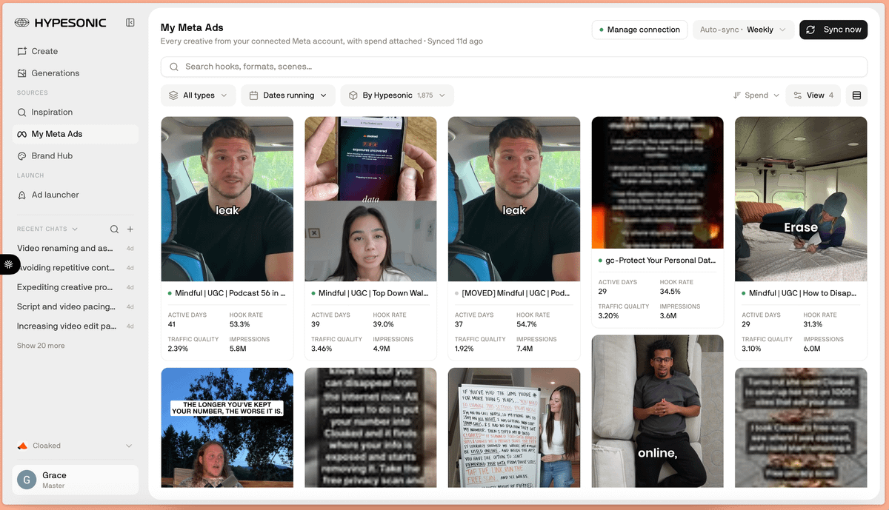

🔗 [View original post](https://x.com/aibytekat/status/2097362684996145532)

---

### 🕐 16:33 UTC · @Wise1Philosophy

> alright, Hypesonic is easily my most &quot;holy shit&quot; AI moment this year. i have been thinking a lot about this launch today. running ads used to need money or a team, usually both, so most people just didn&apos;t bother. it actually puts the ads live on your meta account, that&apos;s the part that used to need a whole company behind you. idk this one feels different. And, it&apos;s a free week for early users today, so try it yourself. $70M+ in ad spend is already supported by Hypesonic. Today we&apos;re officially introducing it: the world&apos;s most powerful self-improving ads and content engine. It reads your ad data, competitors, what&apos;s viral, does deep research on your customers. Then it creates image and video ads…

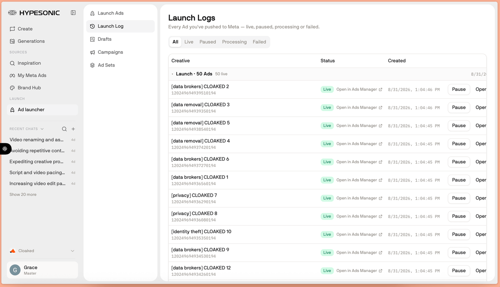

🔗 [View original post](https://x.com/thetripathi58/status/2097362656734990761)

---

### 🕐 16:15 UTC · @Wise1Philosophy

> Motion consistency beats visual novelty in this kind of scene. yeah.. i just recreated the STORM music video no camera, no cast, no set @higgsfield Genjutsu... exact workflow below👇

🔗 [View original post](https://x.com/Wise1Philosophy/status/2097358188903317809)

---

### 🕐 16:15 UTC · @Wise1Philosophy

> Your competitor found a killer ad format. You can stop staring at it now. @TopviewAIhq’s new AI Marketer connects market research with ad production. Research your niche, adapt successful video formats to your product, then generate multiple variations to test. Ask for another round and it keeps your brand context. That folder of saved ads might finally pay its rent. Media Turn GPT-6 Astra into your AI marketing dream team. Meet Topview AI Marketer. Market research → Winning angles → Conversion-ready ads From strategy to final assets, all in one workspace #TopviewAI #AIMarketer #AIVideo #EcommerceMarketing #GPT6

🔗 [View original post](https://x.com/alex_verem/status/2097358096909615492)

---

### 🕐 16:14 UTC · @Wise1Philosophy

> Your clay model stops at the Blender export Turns out GPT-6 Astra + Dreamina Seedance 2.5 is an actual pipeline. Astra codes the geometry → Blender → Clay Renderer Plugin → final render on Dreamina. The Clay Renderer Plugin is the step I was missing. Here&apos;s what it does in 3 moves (finally): 1. Pushes your Blender clay straight into Dreamina 2. Seedance 2.5 renders it into finished footage 3. Your camera and layout stay locked, so it only adds the look Same model, no premium pipeline. Try it now 👇 #Dreamina #DreaminaPartner Media

🔗 [View original post](https://x.com/socialwithaayan/status/2097357944149155908)

---

### 🕐 16:13 UTC · @Wise1Philosophy

> GPT-6 Astra just walked into the agency business. @TopviewAIhq’s AI Marketer is live: research the market, find the angle, produce the ads. All in one workflow. It pulls research from TikTok Shop, Amazon and Shopee, then carries your product and brand context into the creative work. You can go from “what’s the opportunity?” to reviewing finished ads in the same workspace. Media Turn GPT-6 Astra into your AI marketing dream team. Meet Topview AI Marketer. Market research → Winning angles → Conversion-ready ads From strategy to final assets, all in one workspace #TopviewAI #AIMarketer #AIVideo #EcommerceMarketing #GPT6

🔗 [View original post](https://x.com/alex_prompter/status/2097357630133993562)

---

### 🕐 16:06 UTC · @Wise1Philosophy

> Decades of gerontology research identify 8 variables that govern your rate of aging. The most predictive isn&apos;t your genetics. It&apos;s how you cross the street.

🔗 [View original post](https://x.com/Claritysteps/status/2097355855750631836)

---

### 🕐 16:06 UTC · @Wise1Philosophy

> THE MOOD OF THE HOME IS CREATED BY THE WIFE... AND THE MOOD OF THE WIFE IS IN THE HANDS OF HER HUSBAND Here&apos;s what that means: 👇 🧵

🔗 [View original post](https://x.com/scotti_brooks/status/2097355812293562442)

---

### 🕐 16:05 UTC · @Wise1Philosophy

> After the first day of school you have a 15-minute window that never opens the same way again. Don&apos;t waste it on &quot;how was your day.&quot; Ask these 5 questions. 🧵 👇

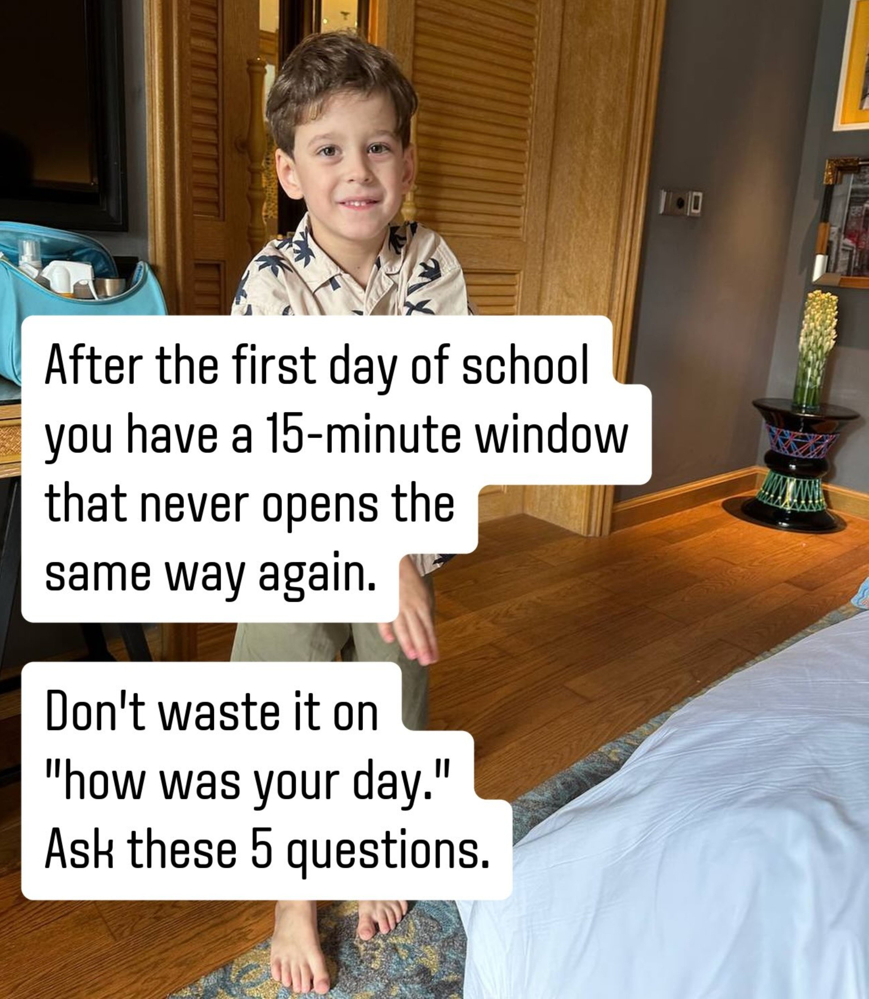

🔗 [View original post](https://x.com/Manifest_Lord/status/2097355642830991838)

---

### 🕐 16:04 UTC · @Wise1Philosophy

> Turns out GPT-6 Astra + Dreamina Seedance 2.5 is an actual pipeline Forget prompt → generate → regenerate. This workflow gives you actual structure first. GPT-6 Astra → coded geometry Blender → scene setup Clay Renderer Plugin → Dreamina Seedance 2.5 → final render This might be a much better way to create AI video when you actually care about the shot. #Dreamina #DreaminaPartner Media

🔗 [View original post](https://x.com/Div_pradeep/status/2097355403172749353)

---

### 🕐 16:01 UTC · @Wise1Philosophy

> 🚨 BREAKING: People are using Claude to build income streams… in days. Not months. Not years. Just prompts. Here are 7 you can copy 👇🧵

🔗 [View original post](https://x.com/heyadam_ai/status/2097354718104437141)

---

### 🕐 16:00 UTC · @Wise1Philosophy

> &quot;Does S1 exhibit physical prompt steerability: different prompts induce distinct behavior in the same environment?&quot; Yes! Watch S1 follow 4 different video prompt recipes in the same kitchen. The first one is something far out of distribution -- &quot;putting a plate in a toaster&quot;. Media Introducing S1, our new foundation model that learns from one example. It can be taught 10-minute long tasks that it has never seen before, from one video prompt without any fine-tuning. Watch S1 operate in real-time via in-context learning:

🔗 [View original post](https://x.com/deepakpathak/status/2097354518497522024)

---

### 🕐 16:00 UTC · @Wise1Philosophy

> Apple First Folding I Phone Lunches Tomorrow. Media

🔗 [View original post](https://x.com/TheAIColonyRD/status/2097354428164591856)

---

### 🕐 15:54 UTC · @Wise1Philosophy

> football analytics is solved. gpt-6 astra + higgsfield built a tool that tracks players, maps passes and follows possession while you watch. honestly, watching sports is more fun with ai. Media

🔗 [View original post](https://x.com/daveydefi/status/2097352776795685314)

---

### 🕐 15:47 UTC · @Wise1Philosophy

> Amazon Ring. NVIDIA Robotics. Nebius. Some serious teams are already using @antiochrobotics to develop physical AI through scaled, high-fidelity simulation. Now Antioch has raised a $32M Series A led by @GreylockVC. Definitely one to watch 👀↓ Today, we’re announcing Antioch’s $32 million Series A, led by @GreylockVC with participation from @A_StarVC, @Category_VC, @BoxGroup, @IcehouseVenture, and angels. While AI has drastically accelerated software development, physical autonomy has been constrained by slow, expensiv…

🔗 [View original post](https://x.com/DataChaz/status/2097351001355194871)

---

### 🕐 15:45 UTC · @Wise1Philosophy

> damn... OpenMAIC has changed a lot since I first came across it. with v1.0, it’s no longer just “give it a topic and get a course.” you can now work with an AI agent that plans and builds the course from your materials, then keep chatting to revise, expand, or change direction as you learn. genuinely nice to see the team bringing this new version to educators from around the world at UNESCO Digital Learning Week. try it here: http://open.maic.chat GitHub: http://github.com/THU-MAIC/OpenMAIC Media A huge moment for us: OpenMAIC at UNESCO Digital Learning Week. 🇺🇳 In Paris, we brought OpenMAIC into the room with educators from around the world , not just to demo AI, but to hear what it actually takes to make AI useful in their classrooms. We believe anyone should be able …

🔗 [View original post](https://x.com/thetripathi58/status/2097350727513608218)

---

### 🕐 15:45 UTC · @Wise1Philosophy

> GPT-6 Astra + Dreamina Seedance 2.5 is turning into a seriously interesting workflow. Astra codes the geometry → Blender builds the scene → Clay Renderer Plugin brings it into Dreamina → Seedance 2.5 handles the final render. This is where AI creation starts feeling like an actual production pipeline, not just prompting. #Dreamina #DreaminaPartner Media

🔗 [View original post](https://x.com/Rixhabh__/status/2097350715241005126)

---

### 🕐 15:43 UTC · @Wise1Philosophy

> Turns out GPT-6 Astra + Dreamina Seedance 2.5 is an actual pipeline. Astra → code the geometry Blender → build the scene Clay Renderer Plugin → bring it into Dreamina Seedance 2.5 → final render This feels much closer to directing the output than simply generating it. #Dreamina #DreaminaPartner Media

🔗 [View original post](https://x.com/Damn_coder/status/2097350057083449449)

---

### 🕐 15:39 UTC · @Wise1Philosophy

> EL 90% USA GEMINI PRO 3.1 COMO SI FUERA GOOGLE ❌ Y DESPERDICIAN SU VERDADERO PODER. Reuní +300 Prompts que lo convierten en una máquina de automatización BRUTAL. (GRATIS SOLO POR 24 HORAS) Like + RT + Sígueme Comenta &quot;IA&quot; y te los envío por DM 👇

🔗 [View original post](https://x.com/Griselda_IA/status/2097349145170497543)

---

### 🕐 15:37 UTC · @Wise1Philosophy

> OpenMAIC v1.0 feels less like a course generator and more like having an AI agent build the learning experience with you. Give it your materials, let it plan and create the course, then keep talking to it to revise pages, add new content, or go deeper wherever you’re stuck. Interesting to see this kind of agentic learning experience being explored with educators at UNESCO Digital Learning Week. Try it: http://open.maic.chat GitHub: http://github.com/THU-MAIC/OpenMAIC Media A huge moment for us: OpenMAIC at UNESCO Digital Learning Week. 🇺🇳 In Paris, we brought OpenMAIC into the room with educators from around the world , not just to demo AI, but to hear what it actually takes to make AI useful in their classrooms. We believe anyone should be able …

🔗 [View original post](https://x.com/AIPandaX/status/2097348709927506401)

---

### 🕐 15:36 UTC · @Wise1Philosophy

> A business followed the recommendations in this article and added $50,000+ in ChatGPT, Google and Perplexity-driven traffic.

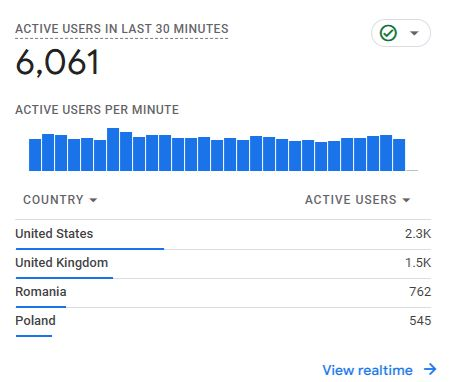

🔗 [View original post](https://x.com/alexgroberman/status/2097348392183791904)

---

### 🕐 15:20 UTC · @Wise1Philosophy

> Okay, imagine giving AI that paper or topic you’ve been struggling with and simply saying: “teach me this.” OpenMAIC can turn it into an interactive course, and with v1.0, you can keep working with the agent to go deeper, revise the course, or focus on the parts you don’t understand. Pretty cool to see an open-source project like this being brought into conversations with educators from around the world at UNESCO Digital Learning Week. Try it: http://open.maic.chat GitHub: http://github.com/THU-MAIC/OpenMAIC Media A huge moment for us: OpenMAIC at UNESCO Digital Learning Week. 🇺🇳 In Paris, we brought OpenMAIC into the room with educators from around the world , not just to demo AI, but to hear what it actually takes to make AI useful in their classrooms. We believe anyone should be able …

🔗 [View original post](https://x.com/aibytekat/status/2097344437970210851)

---

### 🕐 15:16 UTC · @Wise1Philosophy

> follow this account if you want to actually learn enterprise AI: The most underrated artifact in AI engineering is a folder of markdown files. Before any agent touches code on a brownfield engagement, the team builds a knowledge graph: every module, dependency, data flow, and domain term documented. The agent reads this context before writing …

🔗 [View original post](https://x.com/alex_prompter/status/2097343237467893818)

---

### 🕐 15:12 UTC · @Wise1Philosophy

> Stop telling Claude, &quot;do this.&quot; Stop telling Claude, &quot;write code.&quot; Stop telling Claude, &quot;fix this error.&quot; You&apos;re actually treating a senior AI like a junior intern. Here are 8 prompts you can copy and paste directly:

🔗 [View original post](https://x.com/jaysmith_ai/status/2097342382476013666)

---

### 🕐 15:07 UTC · @Wise1Philosophy

> ok so, I need to talk about this for a sec I didn&apos;t realize how slow and expensive hardware testing actually was until someone explained it to me. You basically can&apos;t move fast and everything costs real money, so even good AI ends up stuck. Antioch raised $32M to fix that by letting teams test in simulation instead of always needing real hardware. Amazon&apos;s Ring, NVIDIA, and Nebius are already using it which is wild. rooting for this one 👇 Today, we’re announcing Antioch’s $32 million Series A, led by @GreylockVC with participation from @A_StarVC, @Category_VC, @BoxGroup, @IcehouseVenture, and angels. While AI has drastically accelerated software development, physical autonomy has been constrained by slow, expensiv…

🔗 [View original post](https://x.com/thetripathi58/status/2097340959659049328)

---

### 🕐 15:01 UTC · @Wise1Philosophy

> LinkedIn has been my business&apos;s top revenue driver for the last few years. The number of opportunities I&apos;ve gotten from LinkedIn DMs is crazy. Both from inbound and outbound. But running outbound campaigns by hand is brutal. Now HeyReach plugs into Claude, so you can write one sentence describing the campaign and your list, and then the sequence and the sends happen from there. Makes it super easy to scale, as it&apos;s already a part of your Claude workflow. Try HeyReach for free: https://app.heyreach.io/account/register Me and Stefan started @heyreach_io from our bedrooms in Macedonia. Buggy af at first. Since then: $17M ARR and 7,000+ teams running their LinkedIn outreach on it. This is how you go from “Hey” to deals closed in 2026:

🔗 [View original post](https://x.com/ecomchasedimond/status/2097339533826363561)

---

### 🕐 14:51 UTC · @Wise1Philosophy

> GPT-6 Astra can (actually) use your Mac. 1. Open Codex and pick Astra (if available). 2. Install Computer Use, enable server and skill. 3. Grant Screen Recording and Accessibility. 4. Connect Chrome and confirm it shows Manage. 5. Mention @Chrome or an app, then say the goal. 6. Approve access to the app or website. 7. Sign in yourself, then check the work. Give it your constraints and a clear finish line: &quot;Use [app or page] to achieve [result]. Use an available plugin for the work it supports, then Computer Use for remaining steps and visual checks. Preserve [constraints], check against [success criteria], and show me the result.&quot; Claude-to-Codex guide → https://charliehills.substack.com/p/claude-code-codex Repost ♻️ to help someone in your network.

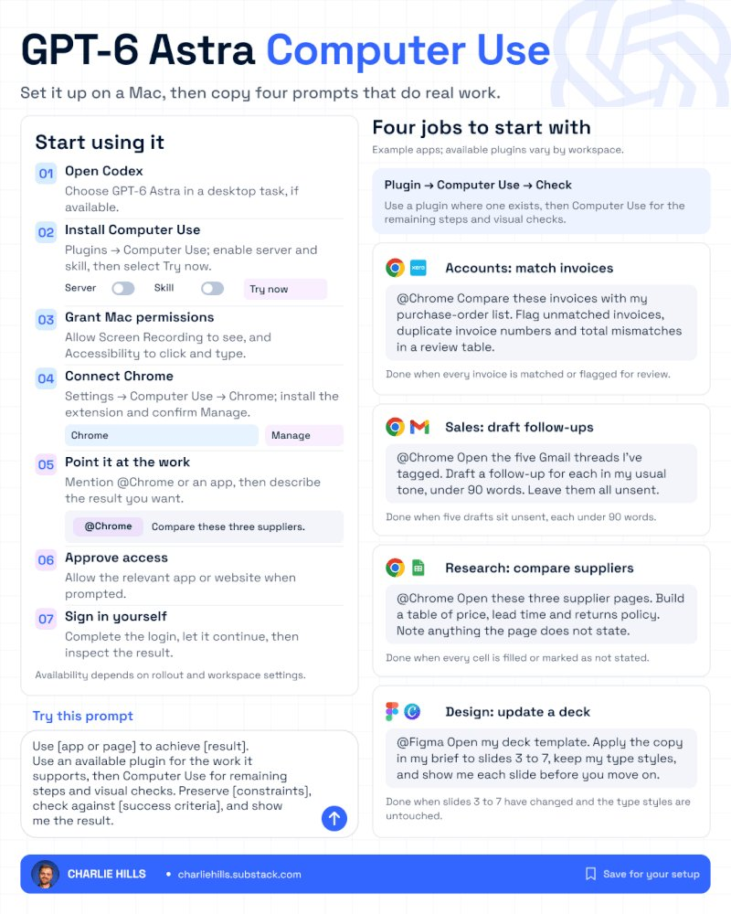

🔗 [View original post](https://x.com/charliejhills/status/2097336967084310723)

---

### 🕐 14:40 UTC · @Wise1Philosophy

> Everyone who just bought an annual @pangram sub right now: Media We just killed Pangram, the world&apos;s most accurate AI detector. Today we’re announcing Super, a next generation humanization model. Our model makes content so unique and natural AI checkers can&apos;t even detect it. Check this out ⬇️

🔗 [View original post](https://x.com/DataChaz/status/2097334255781122104)

---

### 🕐 14:34 UTC · @Wise1Philosophy

> Introducing Buzzy 3D Director Console, powered by GPT-6 Astra. Let GPT-6 turn your words into fully interactive 3D world, and then to stunning video on Buzzy. &gt;Build complex 3D characters &amp; scenes with simple prompts &gt;Control cameras, characters, lighting, and environments easily &gt;Direct and refine every detail with simple prompts Experience OpenAI&apos;s strongest model on Buzzy! Media

🔗 [View original post](https://x.com/Buzzy_now_AI/status/2097332703444308275)

---

### 🕐 14:30 UTC · @Wise1Philosophy

> Vibelets MCP now casts our UGC ads. 0 creators hired. 16 styles, 16 avatars, Claude shortlists 3 👇 The order is the whole trick. Strategy, then script, then face: 1/ The strategy first 2/ The script pass 3/ The avatar roster 4/ The counter-pick 5/ The style match 6/ The render fan-out 7/ The face read Paste 1 URL into Claude, casting in 1 minute. Comment &quot;STYLES&quot; and I&apos;ll DM the connector link + all 8 prompts.

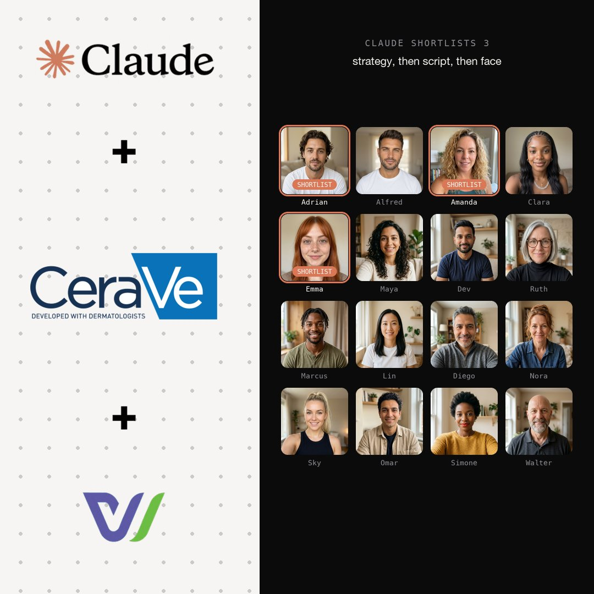

🔗 [View original post](https://x.com/nipuntaneja/status/2097331627965706389)

---

### 🕐 14:29 UTC · @Wise1Philosophy

> A couple planned a group trip for 8 friends. The planning process: 47 screenshots texted to a group chat. 6 &quot;what about this one?&quot; messages with Airbnb links nobody clicked. 3 arguments about location. 2 people who wanted a pool. 1 person who needed a pet-friendly property. 4 hours of scrolling through listings nobody else could see. And the person who finally booked it fronted $3,200 on their credit card then spent 3 weeks chasing 7 Venmo payments from friends who &quot;forgot.&quot; Their friend a travel planner who books 30+ Airbnbs per year for corporate retreats heard the group chat horror story and said something that silenced the table. &quot;Every problem you just described has been solved inside the Airbnb app for years. Collaborative wishlists where 8 people vote on properties no screenshots needed. Payment splitting across 16 travelers no fronting, no chasing. AI that reads 400 reviews and tells you the 3 things that matter no scrolling. A trip planner that builds the itinerary inside the app no Google Sheets. Flexible dates that find the cheapest window no guessing. A map that shows cheaper properties 10 minutes away no overpaying.&quot; She told them the Airbnb app has 11 features most users have never opened because most users search a city, scroll listings, and book. The same way they&apos;ve used Airbnb since 2015. The app rebuilt itself into a trip-planning platform. The users are still using it as a bedroom search engine. Here&apos;s every hidden Airbnb feature most travelers have never tapped 🧵

🔗 [View original post](https://x.com/jackcoder0/status/2097331520042316267)

---

### 🕐 14:12 UTC · @Wise1Philosophy

> Nearly 50% of ChatGPT citations come from one specific place. A fascinating study analyzing 3 million AI answers and 30 million citations dropped a while back and answered a lot of key questions brands have. And it lines up closely with what we have been learning about how AI systems retrieve, evaluate and reuse information. By the way, if you want to know where your site stands right now across Google and AI search, check here (it&apos;s free): https://rightcited.com Alright, let’s get into the study. Kevin Indig, one of the most brilliant minds in this space, analyzed 3 million AI answers from ChatGPT alongside 30 million citations. The biggest takeaway? 44.2% of ChatGPT citations came from the first third of the content. 31.1% came from the middle. Only 24.7% came from the final third. That is a pretty clear pattern. Traditional SEO often rewarded depth and narrative, where you could warm up the reader, build context and delay the main point. AI retrieval is much less patient. If your strongest definitions, facts and entities are buried halfway down the page, they are less likely to be surfaced early enough to influence retrieval. That is because modern AI systems often discover pages, break them into chunks, score relevance and then assemble a smaller context window before generating an answer. The early sections help establish what the page is about. That makes front-loaded clarity extremely important. Again, if you want to know where your site stands right now across Google and AI search, check here (it&apos;s free): https://rightcited.com Indig also found several recurring traits in cited passages. Definitive language performed well, including simple constructions like “X is...” and “X refers to...” Cited content was also roughly twice as likely to contain question marks. And 78.4% of citations tied to questions came from headings. That is especially interesting because an H2 can function almost like a prompt, while the paragraph directly beneath it becomes the answer. Entity density mattered too. Typical text contained roughly 5% to 8% proper nouns. Highly cited text was around 20.6%. That reinforces something we have been talking about for a while. AI systems respond well to clear entity relationships. Specific companies, products, people, technologies, locations and categories give the model more context than vague marketing language. The best-performing content also tended to use a more neutral, analytical tone. So the pattern is becoming pretty consistent. AI rewards clarity, specificity and extractability. And that is a different writing model from what a lot of brands are still using. This is exactly why SEO Stuff content is structured the way it is. The done-for-you plan includes AI-search-optimized content built around question-based headings, direct answers, early definitions, TLDR sections and clear entity signals: https://seo-stuff.com/gold-plan-package We do not bury the useful information in paragraph 18 - the important classification and answer signals appear early. The Premium Content Bundle goes deeper: https://seo-stuff.com/premium-content-bundle-service It includes 60 long-form pieces designed around semantic coverage, comparisons, entity reinforcement and structured sections that are easier for search and AI systems to understand and reuse. The bigger takeaway is simple: AI wants content that gets to the point. Define the topic early. Mention the important entities early. Answer the question early. Use clear headings. Make the useful facts easy to extract. Nearly half of ChatGPT citations in this dataset came from the first third of the content. So if your best information is buried near the bottom of the page, there is a good chance you are making AI work harder than it needs to. And if you want to see where your business stands across Google, ChatGPT, Claude, Perplexity and broader AI search, start here: https://rightcited.com Microsoft dropped an official “Here Is How To Get Traffic From ChatGPT” guide. Interestingly, it got surprisingly little attention. Let’s go over it together. Not long ago Microsoft released &quot;A guide to AEO and GEO - Practical data strategies to empower retailers for AI search, A…

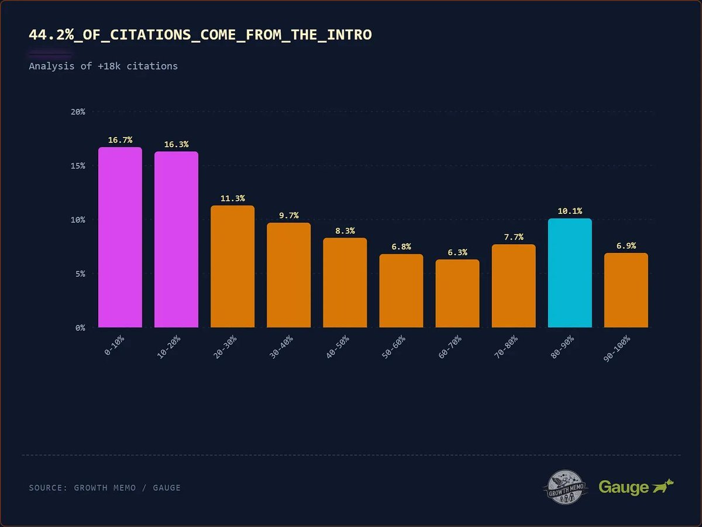

🔗 [View original post](https://x.com/alexgroberman/status/2097327316368244959)

---

### 🕐 14:03 UTC · @Wise1Philosophy

🔗 [View original post](https://x.com/Ant_Philosophy/status/2097324913589625025)

---

### 🕐 14:01 UTC · @Wise1Philosophy

> Stop saving random AI prompts from your timeline. This free website has over 10,000 prompts for ChatGPT, Claude and Nano Banana, all organized in one place. Link in the comments. Media

🔗 [View original post](https://x.com/AriaWestcott/status/2097324460537782521)

---

### 🕐 14:01 UTC · @Wise1Philosophy

> Reddit is disappearing from ChatGPT citations right now, but I honestly think everyone is focusing on the wrong part of the story: Reddit isn’t what matters most here. Because something much bigger seems to have changed in how ChatGPT searches. 8 August: ChatGPT started citing Reddit less. 14 August: It basically stopped citing Reddit at all. But at almost exactly the same time, ChatGPT’s query fan-outs started changing too. It began using much more specific searches like: &gt; site:http://ibm.com &gt; ibm official pricing &gt; ibm docs [feature] Which suggests ChatGPT is doing less of: search the web → see what ranks → cite it And more of: choose where to search → search those sites/brands → build the answer But Reddit isn’t the only thing changing. Another dataset found it’s the entire citation mix: &gt; Reddit: 15% → 0% &gt; review sites/forums: 7% → 0% &gt; smaller company sites: 66% → 32% While: &gt; help centres/docs: 2% → 32% &gt; established companies: 4% → 18% &gt; app marketplaces: 2% → 17% This is the part I find most interesting. Is ChatGPT starting to decide which sources it trusts before it searches? Does that make the authority of the source more important than where an individual page ranks? And how long does any of this last? Because if AI search keeps proving one thing, it’s how quickly things change. Reddit looked incredibly important two weeks ago. In another two weeks, this could all look different again. looks like reddit is almost wiped from chatgpt sources the query fanout changes had a big impact and the past couple of days it seems to be almost completely removed from prompt responses https://promptwatch.com/data/reddit-citations-are-dropping-in-chatgpt

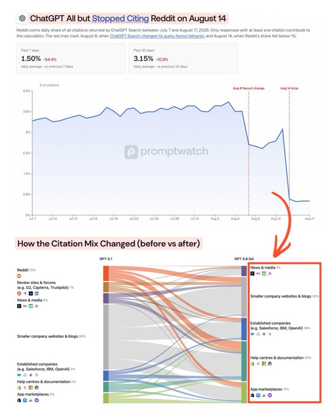

🔗 [View original post](https://x.com/AiEvolutio58513/status/2097324332532084897)

---

### 🕐 14:00 UTC · @Wise1Philosophy

> Nearly half of America&apos;s economic growth now comes from ONE thing. It is not jobs, housing, or shopping. And your &quot;safe&quot; index fund is now betting on it... Here is what it is (and what it actually means for your investments): AI data centers. A data center is a giant building full of computers. They power the AI tools everyone is suddenly using. Building them costs a staggering amount of money. And a handful of tech giants are spending like never before. Five of the largest could spend around 750 billion dollars this year. That category of spending jumped 72 percent in a single year. Measured against the whole economy, that spending tops the dot-com peak. It has become the biggest single engine of the economy. Strip it out, and growth almost disappears. Now here is why this reaches your account: You probably own an index fund somewhere. Maybe inside a 401k you rarely check. It is supposed to spread your money across 500 companies. That is what makes it feel safe. You were told to buy the whole market and relax. But seven giant tech names now dominate that fund. Together they are more than a third of its value. At the dot-com peak, the top names were about 15 percent. So your diversified fund is really one giant bet on AI. And the cracks are already showing. Google&apos;s parent just burned more cash than it made. The first time that has happened since it went public. The profit gains are piling up in just a few names too. The rest of the market is barely growing its profits. The danger is not that AI suddenly fails. The danger is that everyone owns the same bet. When one giant stumbles, they often fall together. And a fund that felt safe drops all at once. That is the retirement money you were counting on. And you never chose this bet on purpose. This is how hidden risk actually works. It hides inside the word diversified. The comfort is the trap. Most people never look under the hood of their fund. They see 500 names and feel protected. Rules-based investing looks at what you actually own. It measures the risk instead of trusting the label. Then it spreads your money by design, not by accident. It does not care how popular a trade has become. That is exactly what Surmount was built for. Automated strategies that manage real risk, not comforting labels. So when the crowded trade unwinds, you are not trapped in it. You are already positioned: Media

🔗 [View original post](https://x.com/SurmountInvest/status/2097324296918217134)

---

### 🕐 14:00 UTC · @Wise1Philosophy

> Me and Stefan started @heyreach_io from our bedrooms in Macedonia. Buggy af at first. Since then: $17M ARR and 7,000+ teams running their LinkedIn outreach on it. This is how you go from “Hey” to deals closed in 2026: Media

🔗 [View original post](https://x.com/nikolak47/status/2097324081792332195)

---

### 🕐 13:59 UTC · @Wise1Philosophy

> PAID VS FREE 1. Netflix Paid: ↳ http://netflix.com Free alternative: Tubi ↳ http://tubitv.com 2. Spotify Premium Paid: ↳ http://spotify.com/premium/ Free: Spotify ↳ http://open.spotify.com 3. Apple Music Paid: ↳ http://apple.com/apple-music/ Free alternative: Demus ↳ http://demus.app 4. ChatGPT Plus Paid: ↳ http://chatgpt.com Free: ChatGPT ↳ http://chatgpt.com 5. Microsoft Office Paid: ↳ http://microsoft.com/microsoft-365 Free: LibreOffice ↳ http://libreoffice.org 6. Midjourney Paid: ↳ http://midjourney.com Free alternative: Leonardo AI ↳ http://leonardo.ai 7. Canva Pro Paid: ↳ http://canva.com Free: Canva ↳ http://canva.com 8. Google Gemini Paid: ↳ http://gemini.google.com Free: Gemini ↳ http://gemini.google.com 9. Disney+ Paid: ↳ http://disneyplus.com Free alternative: Tubi ↳ http://tubitv.com 10. Hulu Paid: ↳ http://hulu.com Free alternative: Pluto TV ↳ http://pluto.tv 11. Xbox Game Pass Paid: ↳ http://xbox.com/xbox-game-pass Free alternative: Epic Games Store ↳ http://store.epicgames.com/free-games 12. Kindle Paid: ↳ http://amazon.com/kindle Free alternative: Wattpad ↳ http://wattpad.com 13. Gmail Free: ↳ http://mail.google.com Privacy-focused alternative: Proton Mail ↳ http://proton.me/mail 14. Figma Paid: ↳ http://figma.com Free: Figma Starter ↳ http://figma.com 15. YouTube Premium Paid: ↳ http://youtube.com/premium Free alternative: Rumble ↳ http://rumble.com 16. Grammarly Premium Paid: ↳ http://grammarly.com Free alternative: Ginger ↳ http://gingersoftware.com 17. Notion Paid: ↳ http://notion.com wtf..Higgsfield Genjutsu...we are NOT ready for what happens next

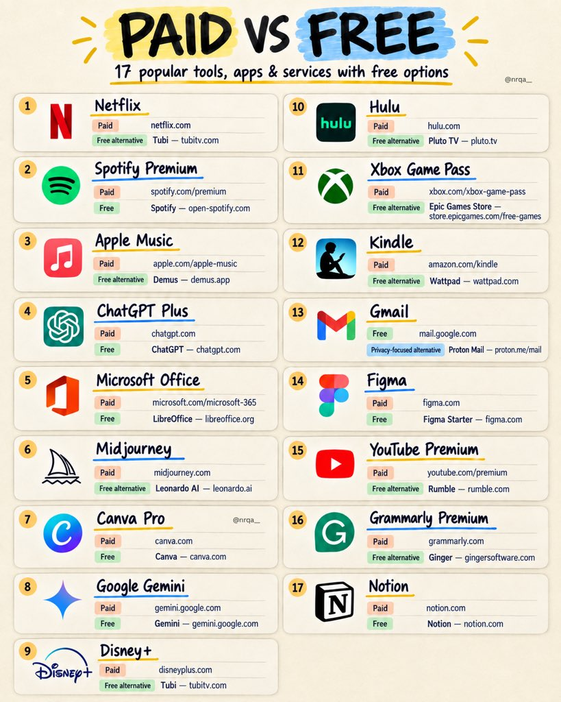

🔗 [View original post](https://x.com/nrqa__/status/2097323915349819630)

---

### 🕐 13:52 UTC · @Wise1Philosophy

> IF YOU DIED TOMORROW, YOUR FAMILY WOULDN&apos;T BE ABLE TO ACCESS A SINGLE THING YOU OWN DIGITALLY. BANK ACCOUNTS. PASSWORDS. CLOUD STORAGE. ALL OF IT PERMANENTLY LOCKED AWAY. HERE&apos;S HOW TO FIX IT IN 30 MINUTES:

🔗 [View original post](https://x.com/iam_chonchol/status/2097322218250453502)

---

### 🕐 13:48 UTC · @Wise1Philosophy

> This book changed the game: The Big Leap. Gay Hendricks cracked why so many smart, successful people sabotage themselves right as things start going well. Here are 8 lessons for breaking through your own ceiling:

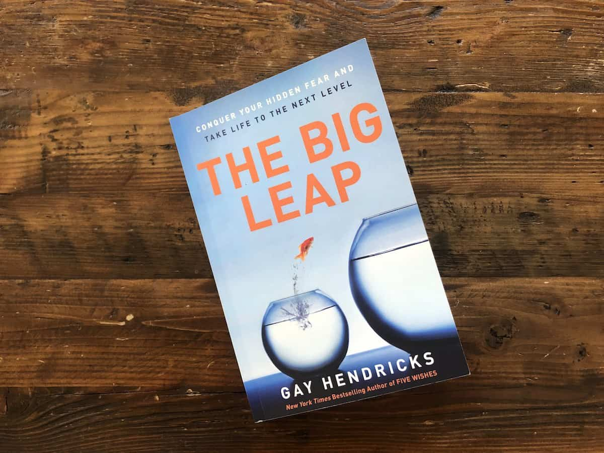

🔗 [View original post](https://x.com/davekashen/status/2097321086991929562)

---

### 🕐 13:44 UTC · @Wise1Philosophy

> the best enterprise AI account on this app: AI transformation isn&apos;t sexy. Everyone wants to sell you a revolution. They put you in a conference room with a 90-slide deck and talk about autonomous agents running your entire enterprise. That&apos;s a fantasy built to bill you for months of strategy. The reality looks much more bo…

🔗 [View original post](https://x.com/alex_prompter/status/2097320212005539949)

---

### 🕐 13:44 UTC · @Wise1Philosophy

> The most underrated artifact in AI engineering is a folder of markdown files. Before any agent touches code on a brownfield engagement, the team builds a knowledge graph: every module, dependency, data flow, and domain term documented. The agent reads this context before writing a single line. Every time. On one of our logistics clients, building the knowledge graph took 4 days. It saved roughly 4 months. The agent stopped generating code that violated naming conventions. Stopped importing deprecated modules. Stopped wiring services through patterns the team abandoned six months earlier. At another healthcare client, the same knowledge graph served double duty. AI agents used it for code generation context. Human engineers used it as onboarding documentation. I mean, most teams skip this because it feels like overhead. Four days of documentation before any code ships feels slow. But the teams that skip it spend those same four days spread across four months of rework, reviewing PRs that look right and break something upstream. We&apos;ve seen this at @LimestoneHQ on dozens of engagements. The knowledge graph is the scaffolding everything else stands on.

🔗 [View original post](https://x.com/mardehaym/status/2097320047957999726)

---

### 🕐 13:43 UTC · @Wise1Philosophy

> Signs that you have a good Aura: 1. Dogs are drawn to you.

🔗 [View original post](https://x.com/BeBetterMan_/status/2097319972959850910)

---

### 🕐 13:32 UTC · @Wise1Philosophy

> Signs you have insulin resistance (&amp; don’t realize it): 1. Foam when you piss.

🔗 [View original post](https://x.com/Fitby_Chandler/status/2097317085982638219)

---

### 🕐 13:30 UTC · @Wise1Philosophy

🔗 [View original post](https://x.com/Mindsthatbuild/status/2097316730489954772)

---

### 🕐 13:24 UTC · @Wise1Philosophy

> CREATINE is the most POWERFUL legal supplement in the world. However, most men have no idea what it really does. How to use it correctly. Or if it&apos;s safe in the long term? This thread will tell you what to do:

🔗 [View original post](https://x.com/NutritionCorp/status/2097315034628321288)

---

### 🕐 13:23 UTC · @Wise1Philosophy

> 9 SIGNS YOUR CORTISOL IS THROUGH THE ROOF (&amp; YOU DON’T EVEN REALISE IT): 1. Waking up between 2–4 a.m at night Media

🔗 [View original post](https://x.com/DPro_Coach/status/2097314915686248665)

---

### 🕐 13:05 UTC · @Wise1Philosophy

> REBUILDING YOURSELF AFTER 40 STARTS WITH THESE 14 THINGS. 1. Fix your teeth, skin, and posture

🔗 [View original post](https://x.com/josh_uglyasf/status/2097310286646812901)

---

### 🕐 13:03 UTC · @Wise1Philosophy

> This Harvard professor just proved 6 hours of sleep &quot;triggers&quot; your body toward heart disease and even cancer in 1 week. He revealed 7 daily habits that destroy your sleep, mood, and brain: 1) Checking your phone right after waking up Media

🔗 [View original post](https://x.com/TheFastedState/status/2097309963114979355)

---

### 🕐 13:03 UTC · @Wise1Philosophy

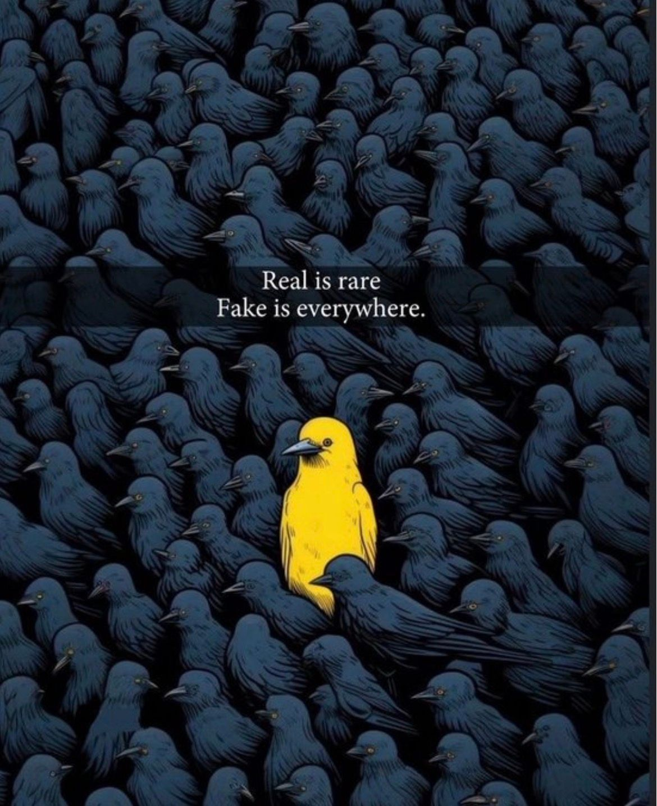

🔗 [View original post](https://x.com/Life__Mastery/status/2097309795036348701)

---

### 🕐 13:00 UTC · @Wise1Philosophy

> Your partner coming to you about something you&apos;ve done wrong is not a personal attack. It’s a sign they really care about the relationship &amp; want to make it work – it&apos;s a heads up. You communicate, you fix it, you stay. That&apos;s emotional maturity. That&apos;s commitment. That&apos;s love.

🔗 [View original post](https://x.com/_Pammy_DS_/status/2097308982926873010)

---

### 🕐 12:57 UTC · @Wise1Philosophy

> MARC ANDREESSEN DID 3+ HOURS ON ROGAN. HERE ARE 11 TAKEAWAYS YOU SHOULD ACTUALLY CARE ABOUT. 1. In his telling, AGI is not “coming.” It already arrived. He thinks the threshold quietly flipped about three months ago with GPT-5.5, Claude 4.6, Gemini 3, and Grok 4.3, and the world shrugged because the pace is too fast for anyone to notice the big moments anymore. 2. He says that for almost any subject, the best models now outperform the elite experts he could personally call, and he can call nearly anyone. He has not shown public evidence for that, and it is worth remembering a Nature Medicine study on a similar AI health system found it missed true emergencies more than half the time. Treat it as a serious hypothesis, not a settled fact. 3. On doctors, he claims they are already using ChatGPT live in the exam room, entering symptoms as you talk. His blunt line: “at that point you&apos;re asking the question of like, what do I need you for.” 4. Allegedly, when the model refuses, he gets around it by saying the request is for a novel. 5. Allegedly, his approach to tough concepts is “simplicity laddering.” Explain it like I am 10, then 5, then 2, until it finally lands. 6. Allegedly, he does not ask for the “correct” view first. He asks the AI to steelman both sides, then he decides. 7. Allegedly, for high-stakes questions he has the AI simulate a panel of experts who debate each other. 8. His meta-lesson: the moment you think “I don’t know how to solve this” is exactly where most people stop, and exactly where you should open the AI. 9. His belief: the scarce skill now is asking good questions. The limiting factor is not the model. It is your ability to frame the problem. 10. He talks about sending AI images such as rashes, lab results, and blood tests for quick second opinions, since current systems can interpret visuals directly. 11. He flags CBT as the clearest clinically validated therapy format AI can plausibly deliver solo, meaning real support could become effectively free and massively scalable. Media

🔗 [View original post](https://x.com/AiEvolutio58513/status/2097308288052535732)

---

### 🕐 12:56 UTC · @Wise1Philosophy

> A Stanford neurobiologist warns chronic stress is physically shrinking the part of your brain responsible for memory, focus, and clear thinking. Most people blame age. His 30 years of research points to something else entirely. It comes down to 4 variables almost nobody knows about: Media

🔗 [View original post](https://x.com/marcuswlefton/status/2097308029297348986)

---

### 🕐 12:51 UTC · @Wise1Philosophy

> Walking is the best exercise for fatloss. Done correctly, it can lower your risk of heart disease, improve blood sugar, strengthen your heart, and add years to your life. Here are 7 rules that completely changed how I walk: 1. Don&apos;t chase 10,000 steps. Media

🔗 [View original post](https://x.com/CoachWillStone/status/2097306862983217565)

---

### 🕐 12:45 UTC · @Wise1Philosophy

> A cardiologist shocked me when he said: &quot;You age because your body stops making Nitric Oxide. Without it, blood pressure rises, erections fail, and Alzheimer&apos;s happens.&quot; Here&apos;s the 5-step protocol to boost it naturally: 1. Stop using mouthwash

🔗 [View original post](https://x.com/HeyDoc_MD/status/2097305434390778357)

---

### 🕐 12:42 UTC · @Wise1Philosophy

> If you&apos;re in your 40s &amp; your goal is to retire by 50, here&apos;s exactly what to do: 1. Start an LLC before the week is over. Not next month. Not after you &quot;research more.&quot; This week.

🔗 [View original post](https://x.com/gedamtekle/status/2097304469377552413)

---

### 🕐 12:40 UTC · @Wise1Philosophy

> A Stanford neurologist told me: “Sticking out your tongue for 40 seconds removes cortisol faster than any pills and breathing exercises.” 1. Your neck is what&apos;s keeping you anxious.

🔗 [View original post](https://x.com/LongevityCode_/status/2097304023435190464)

---

### 🕐 12:35 UTC · @Wise1Philosophy

> Ten foods with no limit. Eat them at 9pm, eat them all week, it doesn&apos;t matter. 1. Pickles

🔗 [View original post](https://x.com/CoachDanCole_/status/2097302871926862279)

---

### 🕐 12:30 UTC · @Wise1Philosophy

🔗 [View original post](https://x.com/Wise1Philosophy/status/2097301574628327792)

---

### 🕐 12:10 UTC · @Wise1Philosophy

> OpenAI just achieved AGI. Here&apos;s what it means for the average person… &amp; how you can capitalize on this once-in-a-lifetime opportunity to build generational wealth:

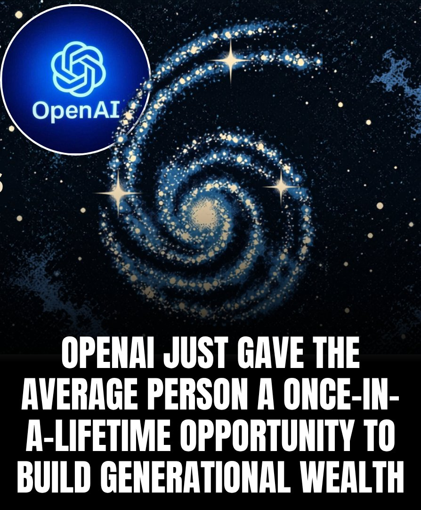

🔗 [View original post](https://x.com/erichustls/status/2097296421049319440)

---

### 🕐 11:48 UTC · @Wise1Philosophy

> AI VIDEO IS QUIETLY CROSSING THE LINE FROM CONTENT GENERATION INTO GENUINE CINEMATOGRAPHY With GPT-6 Astra + CapCut PC, the workflow itself starts looking more like filmmaking. The key difference: You start by designing the shot, not just prompting for the final image 🧵↓ Media

🔗 [View original post](https://x.com/DataChaz/status/2097291074406580482)

---

### 🕐 11:30 UTC · @Wise1Philosophy

🔗 [View original post](https://x.com/Daily__wisdom_/status/2097286439733973442)

---

### 🕐 11:15 UTC · @Wise1Philosophy

> Top Claude Prompts for Job Seekers 1). Personalized Resume Builder ↳ “analyze my experience in industry/role and draft a tailored resume for a specific job title.” 2). Compelling Cover Letter Generator ↳ “write a cover letter for a job title position at company, highlighting my achievements in key skills/experience.” 3). Keyword Optimization ↳ “review this job description and suggest keywords to include in my resume for better ATS matching.” 4). Interview Preparation ↳ “generate likely interview questions for a role at target company and help me craft strong responses.” 5). Networking Message Crafting ↳ “write a concise LinkedIn message to connect with professional name about opportunities at company.” 2024: one prompt box, one output, start over every time 2026: a canvas where the whole process stays connected that&apos;s @pippitofficial&apos;s Creative Agent Canvas. instead of jumping between tools, you build your own workflow in one place → chat and canvas working together, ideas to e…

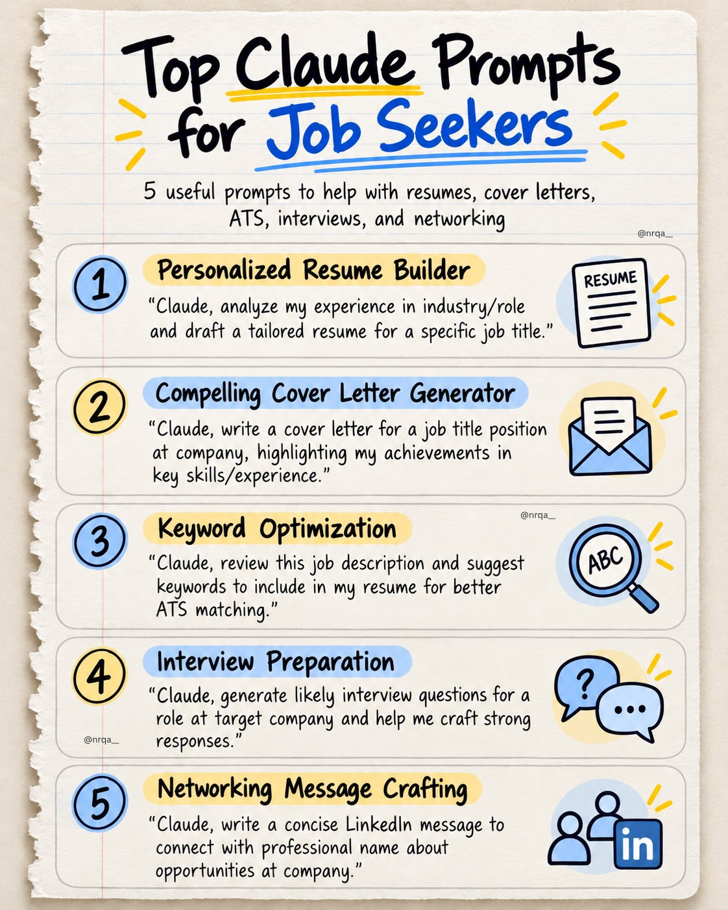

🔗 [View original post](https://x.com/nrqa__/status/2097282571906457846)

---

### 🕐 11:02 UTC · @Wise1Philosophy

🔗 [View original post](https://x.com/apex_mentality_/status/2097279365939699785)

---

### 🕐 10:56 UTC · @Wise1Philosophy

> Now turn messy documents into structured knowledge with one command. It&apos;s called Hyper-Extract. Most RAG setups chop your PDFs into pieces and pray the search layer holds up. This one goes further. It reads unstructured text and hands back knowledge graphs, hypergraphs, temporal and spatial graphs, spatio-temporal graphs, typed data models, Obsidian vaults, and MCP-ready knowledge bases. So rather than begging a model to read your report, you convert the report into a system you can query. What people do with it: Papers become research graphs. Earnings reports give up the companies, people, metrics and risks inside them. Private docs finally become searchable. Run it locally through vLLM and nothing leaves your machine. Pull the results into Claude Desktop or an IDE agent over MCP. 80+ YAML templates ship alongside it, across finance, legal, medical and industrial work. This is what RAG looks like once it grows a spine. Interested in AI? Follow @AiEvolutio58513 and never fall behind. I track ChatGPT, Claude, and every tool quietly changing how we work and create, then hand you the tested signals.

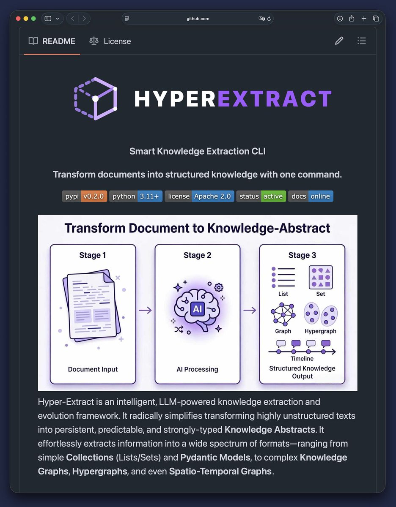

🔗 [View original post](https://x.com/AiEvolutio58513/status/2097277775489241133)

---

### 🕐 10:54 UTC · @Wise1Philosophy

> Holy smokes... How is this AI? Media

🔗 [View original post](https://x.com/AIFrontliner/status/2097277493824631126)

---

### 🕐 10:49 UTC · @Wise1Philosophy

> I think the real skill is scoping, Not asking Astra to do everything, But knowing exactly where it must stop :) https://x.com/i/article/2097274811928231936

🔗 [View original post](https://x.com/Wise1Philosophy/status/2097276036924764612)

---

### 🕐 10:35 UTC · @Wise1Philosophy

> okay GPT-6 Astra, I see you Okay this one actually made me stop scrolling. A guy asked GPT-6 Astra to help him understand his ankle pain. And it didn&apos;t just write a paragraph back. It built him a full 3D model of his ankle he can play with. Bones, ligaments, tendons, the way the foot actually moves, sliders…

🔗 [View original post](https://x.com/Wise1Philosophy/status/2097272514611212715)

---

### 🕐 10:34 UTC · @Wise1Philosophy

> Okay, this is wild 🤯 I turned a single image into an entire interactive 3D world with Hyper3D WorldGen. This is one of the coolest AI 3D demos I’ve tried. Here’s how to do it: Media

🔗 [View original post](https://x.com/HeyAbhishek/status/2097272261866831976)

---

### 🕐 10:30 UTC · @Wise1Philosophy

🔗 [View original post](https://x.com/yeti_mind/status/2097271380609794487)

---

### 🕐 10:06 UTC · @Wise1Philosophy

> The AI ad wars have officially begun. Fable 5.1 vs GPT-6 Astra. Who did the Pringles Ad better? Media

🔗 [View original post](https://x.com/AIHighlight/status/2097265303667249515)

---

### 🕐 09:40 UTC · @Wise1Philosophy

> Samsung, LG, Sony, TCL, Hisense, Vizio, Roku every brand ships smart TVs with the same 9 wrong settings. The picture mode is set for a showroom. The motion smoothing makes movies look like soap operas. The brightness is dimmed by an eco setting you didn&apos;t turn on. The audio makes dialogue inaudible and explosions deafening. The TV is taking screenshots of your screen and selling your viewing data to advertisers. The free channels are buried. And you&apos;re tapping through 5 menus when one remote button could control every device in the room. A home theater installer who&apos;s calibrated TVs from every major brand over 1,000 total in 11 years told his friend: &quot;The brand on the box doesn&apos;t matter. They all ship with the same problems. Showroom picture. Soap opera motion. Surveillance enabled. Audio unoptimized. Free content hidden. Every smart TV in America is sitting in a living room performing at 40% of its capability because every brand ships with the same factory defaults and nobody changes them.&quot; His friend said: &quot;I have an LG. This applies to me?&quot; &quot;LG, Samsung, Sony, TCL, Hisense, Vizio, Roku they all do the same things. They just put them in different menus with different names. The problems are universal. The fixes are universal. The fact that nobody changes them is universal.&quot; He changed 9 settings in 15 minutes. The picture improved. The sound improved. The spying stopped. And 500+ free channels appeared on a TV his friend thought only ran Netflix. &quot;Every smart TV owner in America should make these 9 changes. This thread gives you the setting name and the menu path for every brand so you can do it regardless of which logo is on the box.&quot; Here are the 9 things he changed 🧵

🔗 [View original post](https://x.com/Eric_Smith08/status/2097258769680150940)

---

### 🕐 09:30 UTC · @Wise1Philosophy

🔗 [View original post](https://x.com/Ant_Philosophy/status/2097256275457249583)

---

### 🕐 09:13 UTC · @Wise1Philosophy

> LA first look at how the foldable iPhone might look. Media

🔗 [View original post](https://x.com/FutureStacked/status/2097251874810327381)

---

### 🕐 09:00 UTC · @Wise1Philosophy

> En GptZone publicamos más de 1.000 contenidos al mes entre nuestra web, newsletter y redes sociales. Y descubrimos algo curioso: crear el contenido ya no era nuestro mayor problema. El problema venía después. ¿Qué artículos funcionan? ¿Qué temas generan más clics? ¿Qué publicación merece convertirse en newsletter? ¿Qué contenido deberíamos actualizar? Durante mucho tiempo, teníamos esas respuestas repartidas entre herramientas, métricas y canales. Probamos hacerlo con ChatGPT. Funcionaba, pero primero teníamos que recopilar los datos, pasarle el contexto y convertir sus recomendaciones en tareas. Seguíamos haciendo casi todo el trabajo. Así que cambiamos el enfoque. En lugar de pedirle respuestas, delegamos el workflow posterior a la publicación a Viktor. Lo que antes eran 5 tareas separadas para analizar, adaptar y decidir qué hacer con un contenido, ahora lo planteamos como 1 workflow que nuestro equipo puede delegar y revisar. Viktor trabaja dentro de Slack y Microsoft Teams y puede conectarse con 3.200+ herramientas. Nuestro equipo puede darle una tarea completa: revisar el rendimiento, detectar patrones, investigar oportunidades y preparar las siguientes acciones. Si un tema empieza a destacar, prepara cómo aprovecharlo en otros canales. Si un contenido necesita actualizarse, prepara el trabajo. Si aparece un patrón entre varias publicaciones, lo pone delante del equipo para decidir qué hacer. El cambio no fue añadir otra herramienta. Fue pasar de 5 tareas separadas a 1 workflow delegado. Nosotros seguimos decidiendo qué merece publicarse y aprobamos el resultado final. Viktor hace el trabajo que viene después. Un chatbot analiza lo que le das. A un AI employee le delegas el trabajo. Hire @viktor_com for your team. $100 in credits included, no card. Full link in first comment. In partnership with Viktor.

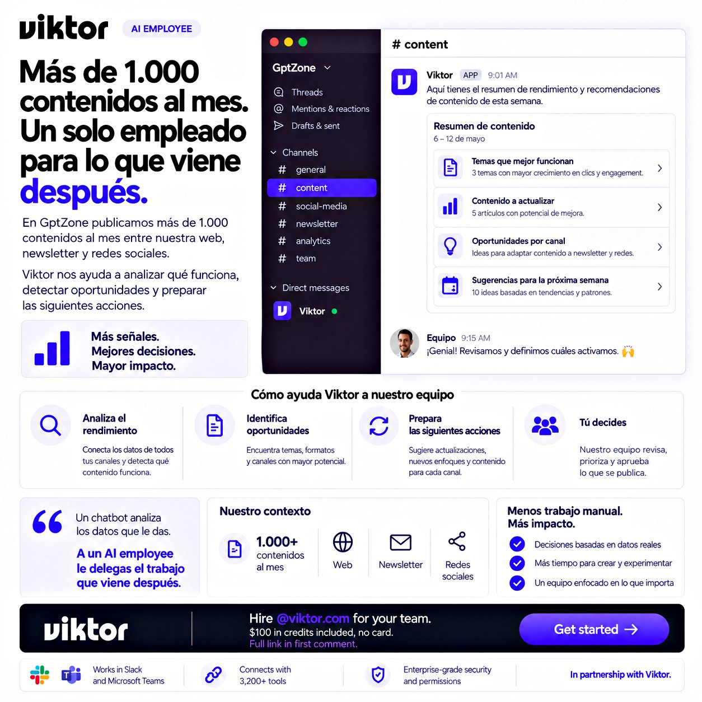

🔗 [View original post](https://x.com/MiguelMaestroIA/status/2097248592150790308)

---

### 🕐 08:59 UTC · @Wise1Philosophy

> Netflix is quietly hoping you never type a 4-digit code into your browser. There are over 2,200 hidden genre categories the Netflix homepage will never show you from &quot;Deep Sea Horror&quot; to &quot;Cyberpunk&quot; to &quot;Tearjerkers Based on Real Life&quot; to &quot;Visually Striking Foreign Thrillers&quot; to &quot;90-Minute Movies&quot; to &quot;Witchcraft &amp; the Dark Arts.&quot; The Netflix homepage shows you roughly 40 rows of content. Behind it: 2,200+ curated categories hand-organized by Netflix since its DVD-mailing days accessible with a URL and a 4-digit number. The algorithm shows you what IT wants. The codes show you everything. A streaming analyst who&apos;s studied every major platform&apos;s recommendation system for 6 years told his friend: &quot;You&apos;ve been saying &apos;there&apos;s nothing to watch on Netflix&apos; for 3 years. There are 8,000+ titles in your region. The homepage shows you about 200 curated by an algorithm that narrows your options based on what you&apos;ve already watched. You&apos;re scrolling through a keyhole and blaming the house for being empty. The house has 8,000 rooms. The algorithm is showing you the same hallway.&quot; He showed her 9 features that break the loop hidden categories that bypass the algorithm, a quality setting she was paying for but not receiving, a viewing history she can edit to reset recommendations, and a download system that works on more devices than she thought. She stopped scrolling that evening. For the first time in months, she found something she&apos;d never seen recommended in a genre she didn&apos;t know Netflix had. &quot;Netflix has 2,200 genre categories. The homepage shows you 40. The other 2,160 are behind codes most subscribers have never typed in a URL structure Netflix has never shut down, never hidden, and never promoted.&quot; Here are the 9 things he showed her 🧵

🔗 [View original post](https://x.com/jackcoder0/status/2097248449863234009)

---

### 🕐 08:37 UTC · @Wise1Philosophy

> Your son will meet boys who include him, pressure him, mock him, and dare him to prove himself. Teach him these 7 friendship rules early.

🔗 [View original post](https://x.com/Manifest_Lord/status/2097242868029292569)

---

### 🕐 08:37 UTC · @Wise1Philosophy

> Your daughter will meet girls who love her, use her, exclude her, and test her. Teach her these 7 friendship rules early.. 👇 🧵

🔗 [View original post](https://x.com/scotti_brooks/status/2097242802581278803)

---

### 🕐 08:30 UTC · @Wise1Philosophy

> a network of young crypto scammers allegedly pulled off one of the largest cryptocurrency thefts in u.s. history, tricking a washington, d.c. investor into handing over access that let them steal more than 4,100 bitcoin worth over $240 million. prosecutors say the group then laundered the stolen crypto through multiple platforms to hide the proceeds. the suspects quickly went on a massive spending spree, buying dozens of luxury cars, watches and other expensive items, renting mansions, flying private jets and spending millions at nightclubs. eighteen defendants have been charged in the case, with alleged ringleader malone lam, 22, scheduled for a plea agreement hearing tuesday.

🔗 [View original post](https://x.com/daveydefi/status/2097241257168843166)

---

### 🕐 08:30 UTC · @Wise1Philosophy

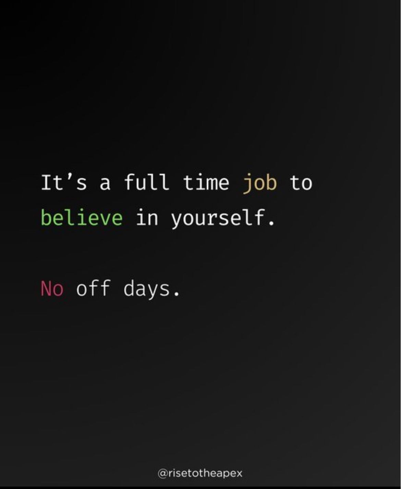

🔗 [View original post](https://x.com/Mindsthatbuild/status/2097241109030113543)

---

### 🕐 08:04 UTC · @Wise1Philosophy

> The developer story changed this half. Coding assistants stopped being about code completion and became about delegated execution, with agents that translate intent into multi-step workflows and test entire builds on their own. How building software changed, in the H1 2026 Industry Report:https://bit.ly/StateofAI2026

🔗 [View original post](https://x.com/TheAIColonyRD/status/2097234534416678936)

---

### 🕐 08:03 UTC · @Wise1Philosophy

> The AI Colony Academy Scholarship is now open. If cost has ever stopped you from learning AI properly, this is for you. Completely free for those selected! https://rebrand.ly/AIscholarship

🔗 [View original post](https://x.com/Shawnife/status/2097234469103063389)

---

### 🕐 08:01 UTC · @Wise1Philosophy

🔗 [View original post](https://x.com/Wise1Philosophy/status/2097233816813277444)

---

### 🕐 08:00 UTC · @Wise1Philosophy

> Your body has emergency stress and anxiety switches built right into it. Here&apos;s what you can reset in seconds: 1. Lying awake in bed = blink slowly for 60 seconds

🔗 [View original post](https://x.com/HiVioletMM/status/2097233488617656466)

---

### 🕐 07:54 UTC · @Wise1Philosophy

> What happens when your body is severely vitamin D deficient? You may NEVER skip your vitamin D again after reading this list: 1. Your head starts sweating for no reason///

🔗 [View original post](https://x.com/TinaaDeJong/status/2097231967746163077)

---

### 🕐 07:43 UTC · @Wise1Philosophy

> A Stanford professor proved high cortisol hurts your memory, enlarges your fear center, and makes your brain smaller. 1. Walk barefoot on grass for 5 minutes Media

🔗 [View original post](https://x.com/Rose_MaryIRL/status/2097229222171541621)

---

### 🕐 07:30 UTC · @Wise1Philosophy

🔗 [View original post](https://x.com/Daily__wisdom_/status/2097226007128203558)

---

### 🕐 07:30 UTC · @Wise1Philosophy

> The future of creativity is coming to Los Angeles. This October, CapCut World will bring together global creators to explore new possibilities in AI-powered creativity and video creation. A new era of creating starts here. #CapCutWorld #CapCutDidThat

🔗 [View original post](https://x.com/FutureStacked/status/2097225998886396107)

---

### 🕐 07:27 UTC · @Wise1Philosophy

> Los Angeles. October 2026. Creators from around the world. AI. Creativity. Video. CapCut World is bringing the future of creation together in one place. #CapCutWorld #CapCutDidThat

🔗 [View original post](https://x.com/TheAIColony/status/2097225411197329765)

---

### 🕐 07:24 UTC · @Wise1Philosophy

> AI is changing the way we create, and creators are at the center of it all. This October, CapCut World is coming to Los Angeles for a global gathering celebrating AI, creativity, and the future of video creation. Can’t wait to see what creators make next. #CapCutWorld #CapCutDidThat

🔗 [View original post](https://x.com/AriaWestcott/status/2097224427461079133)

---

### 🕐 07:21 UTC · @Wise1Philosophy

> Something big is coming to Los Angeles. CapCut World is happening in October 2026, bringing together creators from around the world to explore the future of AI, creativity, and video creation. The future of creating is here. Will you be part of it? #CapCutWorld #CapCutDidThat

🔗 [View original post](https://x.com/AIFrontliner/status/2097223714152559016)

---

### 🕐 07:20 UTC · @Wise1Philosophy

> The biggest scam in human history is the supplement industry. Out of 50,000+ products on the shelves, these are the 5 that actually work: 1. Magnesium glycinate

🔗 [View original post](https://x.com/MuahDavis/status/2097223419138080776)

---

### 🕐 07:14 UTC · @Wise1Philosophy

> I started taking whey at breakfast, vitamin D with the same meal, and magnesium before bed. Without exaggerating, my personality changed 180 degrees. 1. Whey protein, at breakfast

🔗 [View original post](https://x.com/MarkoSilva291/status/2097221901412364679)

---

### 🕐 07:01 UTC · @Wise1Philosophy

🔗 [View original post](https://x.com/apex_mentality_/status/2097218770037026953)

---

### 🕐 06:40 UTC · @Wise1Philosophy

> Creatine isn&apos;t a steroid. It is a naturally occurring compound that exists in everyone’s body. It doesn&apos;t cause bloating, hair loss, weight gain, or kidney trouble. 1. It refuels effort

🔗 [View original post](https://x.com/HeyKimChong/status/2097213349616652498)

---

### 🕐 06:30 UTC · @Wise1Philosophy

🔗 [View original post](https://x.com/yeti_mind/status/2097210904437813337)

---

### 🕐 06:23 UTC · @Wise1Philosophy

> We were asked to assess a mature eDiscovery platform comprising over 2 million lines of code. The product manager showed us the math and proved that engineering was not the bottleneck. Testing was the actual constraint. Law firms and corporations use it for large litigations: collect the custodians, process the documents, review them, produce what&apos;s responsive to the other side or to a regulator. It is largely a 15 year old Windows desktop application with release cycles stretching up to a year. They ran 3,800 regression tests entirely by hand. This suite provided zero coverage for new features. It required five months of manual execution just to ship an update, with a single tester clearing only one or two tests a day. New hires took three months to become useful because the test paths were completely undocumented. The procedures lived solely in the heads of veteran staff. Every new feature carries a five month tax. While this company shipped once, a competitor shipping quarterly took four swings at the market. From a board seat, this simply looks like a slow engineering organization where releases land late and the roadmap slips. The default response is to hire more engineers, but that makes the problem worse. Every new hire produces more surface area to regress and directly hits the bottleneck slowing the system down. You are just paying to lengthen the queue. The root cause is a QA function sitting completely outside development. They were absent from planning and acceptance. They arrived only at the end to inspect. When nobody upstream is accountable for building a testable product, thousands of manual tests feel necessary. We audited the codebase and scoped the turnaround. We are not automating 3,800 tests because most of the suite is duplicative or covers behavior customers abandoned years ago. Automating a test nobody needs is just faster waste. The first job is identifying the 500 tests that actually protect the business. No tool can answer that question for you. Once we isolate the core suite, the designed strategy shifts the workload away from manual execution. We designed a solution where AI generates test cases directly from acceptance criteria in minutes, and Playwright executes them automatically. The strategy establishes quality gates enforcing a 98% pass rate before code merges. The design targets an 80% reduction in total testing time. If you manage a mature product with a long release cycle and an update slips, you must be able to split the delay into days of engineering versus days of verification. Most companies cannot do this. That is the exact metric you need before approving more headcount. Your release cycle does not die of bad features. It dies of manual regression.

🔗 [View original post](https://x.com/mardehaym/status/2097209066322067758)

---

### 🕐 06:17 UTC · @Wise1Philosophy

> A dermatologist shocked me when she said: &quot;You age because your body stops making collagen. Without it, your skin thins, your joints ache, and your bones get brittle.&quot; 1. Stop skipping sunscreen on cloudy days

🔗 [View original post](https://x.com/HeyEleanorr/status/2097207556485832741)

---

### 🕐 06:09 UTC · @Wise1Philosophy

> Ashwagandha is nature’s hormone stabilizer. It reduces cortisol, supports testosterone, and improves sleep. But almost no one uses it correctly. 1. It is an adaptogen so ithelps your body respond to stress instead of masking it [1/13] Media

🔗 [View original post](https://x.com/ClaraBrooksjz/status/2097205563310608590)

---

### 🕐 06:00 UTC · @Wise1Philosophy

🔗 [View original post](https://x.com/Life__Mastery/status/2097203492293116038)

---

### 🕐 06:00 UTC · @Wise1Philosophy

> A doctor who has followed the same 2,000 people since the eighties told me the 8 things that predict how well you age. 1. How fast you walk.

🔗 [View original post](https://x.com/yourcamilavega/status/2097203298558439733)

---

### 🕐 03:18 UTC · @Wise1Philosophy

> Dementia = blood sugar. Dementia = inflammation. Dementia = Preventable. 8 simple rules to protect your brain: 1. Don&apos;t sleep 6 hours Media

🔗 [View original post](https://x.com/Fitby_Chandler/status/2097162612245229974)

---

### 🕐 03:12 UTC · @Wise1Philosophy

> Heart Attack = Inflammation. Heart Attack = Happens in early morning. Heart Attack = No. 1 killer on Earth. 5 simple habits to protect your heart: 1. Don&apos;t wake up to go to the toilet at 3 AM Media

🔗 [View original post](https://x.com/BeBetter_Athlet/status/2097161139033661477)

---

### 🕐 03:08 UTC · @Wise1Philosophy

> An oncologist confessed: “There are 3 types of people who never get cancer.” 1. Those who regularly sweat until salt forms on their skin.

🔗 [View original post](https://x.com/LevelUpPrime/status/2097160154328547490)

---

### 🕐 03:04 UTC · @Wise1Philosophy

> Sleep is the most underrated medicine on Earth. It repairs your brain, burns fat, balances hormones, and controls how fast you age. Here are 7 &quot;normal&quot; habits that are ruining your sleep: 1. Waking up to go to the toilet at 3 AM. Media

🔗 [View original post](https://x.com/NutritionCorp/status/2097159123972522203)

---

### 🕐 02:56 UTC · @Wise1Philosophy

> Cortisol = belly fat. Cortisol = puffy face. Cortisol = trembling eyelids. Cortisol = collagen gone. Cortisol = libido gone. One hormone. Every symptom. Here’s what actually fixes it: 1. Magnesium glycinate before bed. Media

🔗 [View original post](https://x.com/DPro_Coach/status/2097157155040419908)

---

### 🕐 02:53 UTC · @Wise1Philosophy

> Cortisol = Jaw clenching Cortisol = Waking up at 3 AM Cortisol = Belly fat that won&apos;t budge Cortisol = Puffy face Cortisol = No libido One hormone causing every symptom. Here&apos;s the simple fix: 1. Ashwagandha. In the morning.

🔗 [View original post](https://x.com/TheFastedState/status/2097156262278635868)

---

### 🕐 02:51 UTC · @Wise1Philosophy

> My best friend started taking zinc in the morning, magnesium at night, and vitamin D+K2 with breakfast after his doctor told him to. He stuck with it for 30 days. Then... no kidding his personality did a complete 180

🔗 [View original post](https://x.com/CoachDanCole_/status/2097155871361126761)

---

### 🕐 02:51 UTC · @Wise1Philosophy

> A poor diet is the #1 reason people can&apos;t lose weight. After coaching 800+ people, the ones who lose the fastest do this same thing, pick 3-4 simple diet on repeat. Here&apos;s the list: 1. 𝐄𝐠𝐠 &amp; 𝐑𝐢𝐜𝐞 (𝐒𝐢𝐦𝐩𝐥𝐞)

🔗 [View original post](https://x.com/CoachWillStone/status/2097155739064344737)

---

### 🕐 02:47 UTC · @Wise1Philosophy

> High cortisol ruins the quality of your life. It&apos;s giving you beer belly, neck hump, skin tags, bloating your face. These are the 8 best ways to reduce it: 1. Walk barefoot. Media

🔗 [View original post](https://x.com/HeyDoc_MD/status/2097154951332171849)

---

### 🕐 02:40 UTC · @Wise1Philosophy

> Waking up at 3 AM to go to the toilet isn&apos;t because you drank water before bed. Here’s actually why (&amp; what stops it): 1. Your blood sugar crashes at 1 AM, 3 AM, and 5 AM.

🔗 [View original post](https://x.com/LongevityCode_/status/2097153063551455639)

---

### 🕐 02:32 UTC · @Wise1Philosophy

> Your Resting Heart Rate tells the whole story. 95+ bpm - Heart is working hard just to keep you alive. 90 bpm - Sedentary, unhealthy, and stressed. 80 bpm -

🔗 [View original post](https://x.com/Dr_Biohacker/status/2097150987215708362)

---
