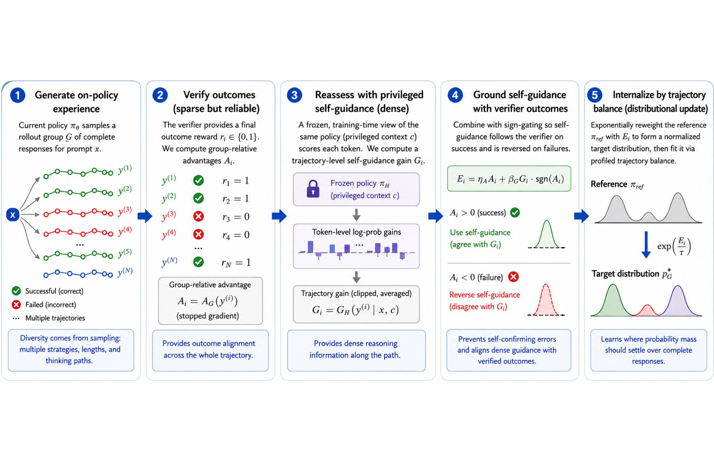

# 🐦 @_akhaliq

## 📅 September 08, 2026

> 3 post(s) archived.

---

### 🕐 15:00 UTC · @_akhaliq

> Today, we’re announcing Antioch’s $32 million Series A, led by @GreylockVC with participation from @A_StarVC, @Category_VC, @BoxGroup, @IcehouseVenture, and angels. While AI has drastically accelerated software development, physical autonomy has been constrained by slow, expensive hardware-based development. Antioch enables physical AI teams to build, test, and validate systems at the speed of software. We’re proud to be working with leading teams including @amazon @ring, @NVIDIARobotics, and @nebiusai as we make scaled, high-fidelity simulation the standard for physical AI development. Our sincere thanks to the legion of investors, customers, partners, and advisors who are making this step change possible. We’re scaling rapidly and hiring across simulation, infrastructure, machine learning, 3D graphics, go-to-market, and operations. Media

🔗 [View original post](https://x.com/antiochrobotics/status/2097339176006172962)

---

### 🕐 12:19 UTC · @_akhaliq

> FlowBalance: verifier-grounded self-improvement for reasoning models Improves math reasoning by +2.12 avg over GRPO on Qwen3-8B, with faster training, better stability, and higher solution diversity.

🔗 [View original post](https://x.com/HuggingPapers/status/2097298711697072142)

---

### 🕐 00:16 UTC · @_akhaliq

> First selfie together!!! #microduck

🔗 [View original post](https://x.com/rafaelcaricio/status/2097116865579401315)

---
