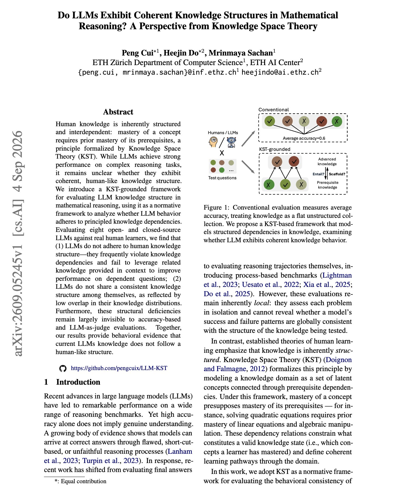
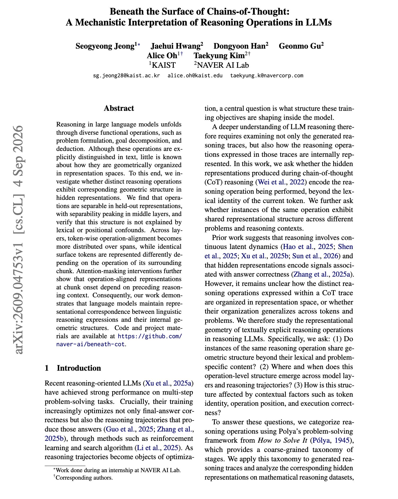

# 🐦 @dair_ai

## 📅 September 08, 2026

> 3 post(s) archived.

---

### 🕐 16:34 UTC · @dair_ai

> Finally a good paper testing whether an LLM&apos;s mathematical knowledge has coherent structure or just coherent accuracy. There is a lot of interest in using LLMs for advancing math. This is a great read testing whether LLMs math knowledge has structure. Researchers apply Knowledge Space Theory, which formalizes the idea that mastering a concept requires mastering its prerequisites, as a normative standard. They evaluate eight open and closed models against real human learners. Two important results: The models frequently violate knowledge dependencies, answering a dependent question correctly while failing its prerequisite, and they do not use related knowledge supplied in context to improve on the dependent question. Second, the eight models show low overlap in their knowledge distributions, so they do not share a consistent structure with each other either. Both deficits stay invisible to accuracy based scoring and to LLM as judge evaluation, because both score items independently and never look at the dependency graph. Paper: https://academy.dair.ai/papers/do-llms-exhibit-coherent-knowledge-structures-in-mathematical-reasoning-a-perspe-2609.05245

🔗 [View original post](https://x.com/dair_ai/status/2097362837534625861)

---

### 🕐 15:57 UTC · @dair_ai

> It feels like GPT-6 Astra has no limits. It just built this human anatomy with ~4K structures. I wanted to look closely at what Astra was doing. Notes: I can explore at different levels and select any body part for closer inspection with unique views. Amazing! If you give Astra instructions to use any tool or resource, it does some mind-blowing things. Make sure when you prompt it to not hold back or constrain it too much. Allow it to search and explore. This is the most excited I have been about AI. This opens up personalized learning, understanding, and applications unlike anything possible before. To be clear, it&apos;s not about originality. The model used existing works and resources. But even so, it&apos;s probably the best model at doing research, which is needed to get these working prototypes. The personalization of building apps like this to your needs- that is the most exciting part of the Astra demos you have been seeing in your timeline. That level of personalization unlocks unique potential and creativity in all of us. IMO, the more accurate term describing new models like Astra is &quot;personalized general intelligence.&quot; Stack the model used (self-selected): React 19 and TypeScript, Vite for builds, Three.js with OrbitControls for interactive 3D, plain CSS, Lucide icons, and Vitest with React Testing Library. The anatomy models come from Z-Anatomy/BodyParts3D. Will share prompts and process soon. Stay tuned. Media

🔗 [View original post](https://x.com/omarsar0/status/2097353640792985816)

---

### 🕐 14:40 UTC · @dair_ai

> // Beneath the Surface of Chains-of-Thought // Impressive paper on whether reasoning steps have internal structure or only textual structure. Researchers ask whether distinct reasoning operations, such as problem formulation, goal decomposition and deduction, are geometrically organized in hidden representations. It turns out they are. Operations are separable in held out representations, and separability peaks in middle layers. The authors check that lexical and positional confounds do not explain it. They find that identical surface tokens are represented differently depending on the operation of the surrounding chunk, so the geometry tracks function rather than wording. And attention masking shows that operation aligned representations at the start of a chunk depend on preceding reasoning context, so the operation label is constructed from the trace rather than read off the current token. Across layers, token wise operation alignment becomes more distributed over spans. If you want to steer or monitor reasoning by operation type, this study shows where the important signals might be. Paper: https://arxiv.org/abs/2609.04753 Chat with Paper: https://academy.dair.ai/papers/beneath-the-surface-of-chains-of-thought-a-mechanistic-interpretation-of-reasoni-2609.04753

🔗 [View original post](https://x.com/dair_ai/status/2097334147908096003)

---
