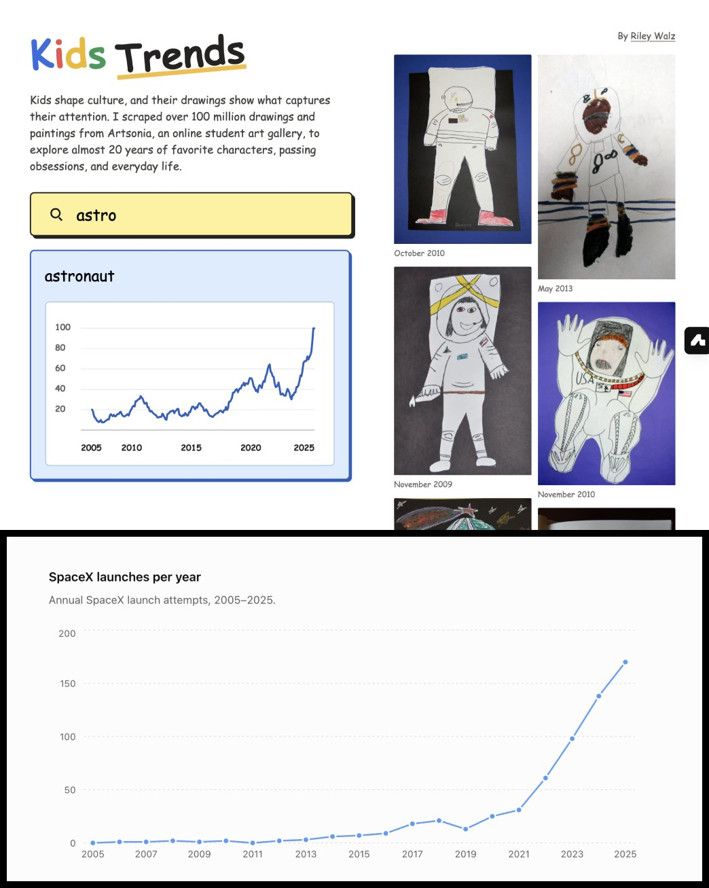
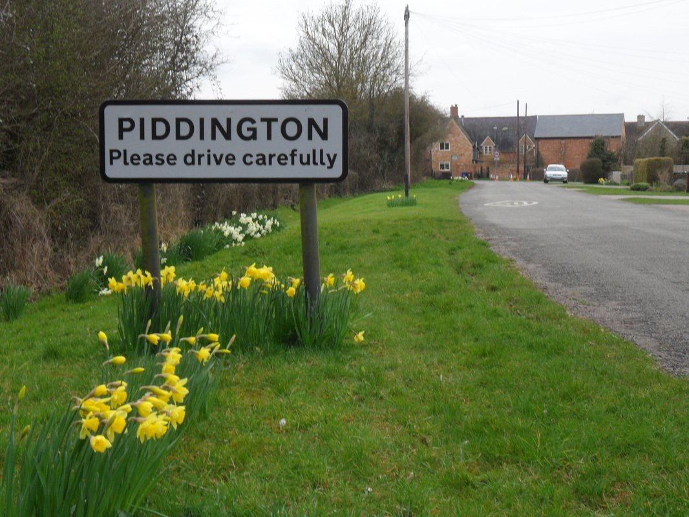
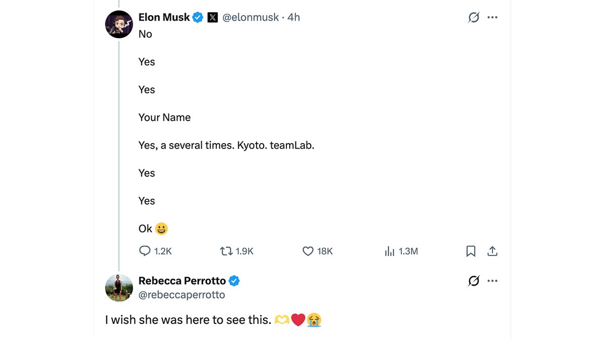
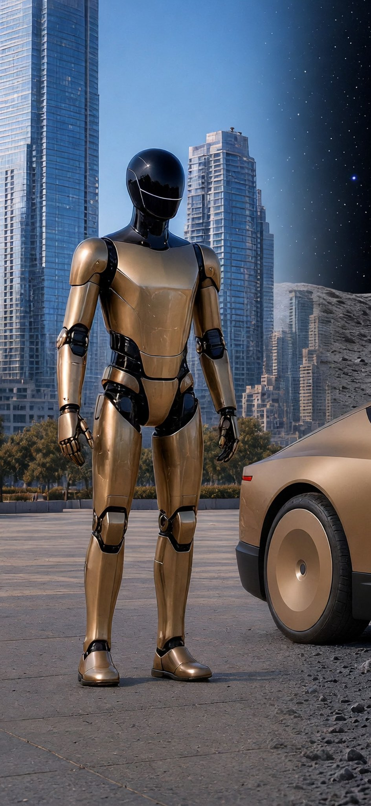

# 🐦 @elonmusk

## 📅 September 08, 2026

> 17 post(s) archived.

---

### 🕐 19:07 UTC · @elonmusk

> If you notice anything concerning about 𝕏, please lmk directly in replies Glad to be back at X as Head of Safety. Focus: keep people safe across our products and AI systems, protect free expression, and make Safety more transparent.

🔗 [View original post](https://x.com/elonmusk/status/2097401351441633585)

---

### 🕐 19:02 UTC · @elonmusk

> 𝕏 is the number 1 source for news on Earth! More monthly readership than the circulation of all newspapers combined. 𝕏 ranks #1 among news apps across almost all European countries Europeans are turning to 𝕏 for the truth... Europe spent years attacking 𝕏 Now 𝕏 is becoming Europe’s #1 place for news 😂

🔗 [View original post](https://x.com/elonmusk/status/2097400295525638383)

---

### 🕐 16:13 UTC · @elonmusk

> Well said Rubio just blew my mind‼️ The man who understood communism the most, just explained it to the least of us.

🔗 [View original post](https://x.com/elonmusk/status/2097357638044443029)

---

### 🕐 16:07 UTC · @elonmusk

> Rave cave Tesla Cybercab’s interior at night is so sick. RGB accent lighting on the dash, doors, and floor pulses in sync with the music. Such a vibe.

🔗 [View original post](https://x.com/robotaxi/status/2097356275592184178)

---

### 🕐 15:55 UTC · @elonmusk

> Hopefully soon in Europe too Just tried a CyberCab ride here in Austin Texas 🤩 Super smooth experience. The style is just unmatched especially vs Waymo which I tried last year. Hope it’s not gonna take years until this is possible in Germany. Come on EU 🤞

🔗 [View original post](https://x.com/elonmusk/status/2097353262588383244)

---

### 🕐 15:24 UTC · @elonmusk

> Earth is a max-difficulty escape room. The universe offered a slim hint at escape, then drowned it in noise. The aperture is short. Recording every finding on Earth counts for nothing if we spend it crowning ourselves geniuses rather than combining our efforts to crack the puzzle before the door closes.

🔗 [View original post](https://x.com/yunta_tsai/status/2097345305599754469)

---

### 🕐 13:04 UTC · @elonmusk

> SpaceX launches vs. kids painting astronauts I scraped 100 million pictures of kids&apos; drawings, and made them searchable so you can see the trends of the last 20 years https://walzr.com/kids-trends

🔗 [View original post](https://x.com/luismbat/status/2097310017451946263)

---

### 🕐 12:32 UTC · @elonmusk

> 🚨BREAKING: The number of migrants being placed in the tiny village of Piddington has been INCREASED They originally said 1,250 illegal fighting age men IT IS NOW GOING TO BE 3,510 FIGHTING AGE MALES The village has just 300 adults and 50 children They will be outnumbered by 10 to 1 God help them

🔗 [View original post](https://x.com/BasilTheGreat/status/2097302133800312969)

---

### 🕐 08:48 UTC · @elonmusk

> True Far right is just whatever was considered being normal in the early 2000s. Even some of Obama&apos;s positions during his first term would be considered right wing by modern Democrat standards.

🔗 [View original post](https://x.com/elonmusk/status/2097245786694099341)

---

### 🕐 08:46 UTC · @elonmusk

> According to Grok for this election cycle: https://x.com/i/grok/share/be1c9d7737d24e20a6124f50de810625

🔗 [View original post](https://x.com/elonmusk/status/2097245204780556344)

---

### 🕐 07:54 UTC · @elonmusk

> I find it strange how Elon’s most controversial moments get amplified by the media, while the things he does that inspire people often get little to no coverage. Where was « People’s Magazine » when Elon Musk showed personal kindness toward ordinary people (fans, kids or strangers…)? 1. Answered a dying teen’s last questions and made her design a SpaceX mascot (Liv Perrotto, 2026) 15-year-old Liv Perrotto, who had dreamed of meeting Musk, left eight handwritten questions on her nightstand after she became too weak to take a scheduled call. After her death from cancer, commentator Glenn Beck shared them. Musk answered every question (Tesla phone? No. Diner expansion and new games? Yes. Favorite anime? Your Name. Japan? Kyoto and teamLab. Hatsune Miku and Ani/Misa? Yes). On her final request, to make her Shiba Inu “Asteroid” plush (designed as a zero-g indicator for Polaris Dawn) a SpaceX mascot, he simply wrote “Ok 😀.” Her mother replied: “I wish she was here to see this.” 2. Publicly adopted a 5th-grader’s marketing idea (Bria, 2017) Nine-year-old Bria from Michigan wrote Musk a school-project letter suggesting Tesla use the homemade commercials fans already made, since the company didn’t advertise. Her dad posted it. Musk replied: “Thank you for the lovely letter. That sounds like a great idea. We’ll do it!” She also asked for a Tesla T-shirt. 3. Covered the full repair bill for a stranger who used his Tesla to save a life (Manfred Kick, 2017) German Tesla owner Manfred Kick saw an unconscious stroke victim’s Volkswagen swerving on the Autobahn. He pulled in front of it, let the other car hit his bumper, and braked both vehicles to a stop, saving the driver’s life at the cost of damage to his own Model S. Musk tweeted congratulations and announced Tesla would cover all repairs, free and expedited. The local Tesla Germany head personally picked up the car. 4. Shared a struggling woman’s letter, she said it stopped her from taking her life (Johnna Sabri, 2018) Johnna Sabri wrote an open letter about how Musk’s persistence inspired her after her nonprofit failed and her life fell apart. Musk shared it with his millions of followers on Memorial Day. Sales of her handmade jewelry exploded. When he later accepted a small space-rock pendant she wanted to give him, she publicly said the timing and gesture pulled her back from suicide. Musk later posted a quote about hidden kindness. 5. Funded clean-water fountains in Flint schools after a young activist asked (Mari Copeny / Little Miss Flint, 2018) After 11-year-old activist Mari Copeny (“Little Miss Flint”) and others highlighted the ongoing water crisis, the Musk Foundation donated about $480,000 for UV-filtered drinking fountains in all Flint schools (plus later funds for student laptops). Musk had publicly committed to helping houses with contaminated water above FDA levels. The fountains were eventually installed so kids could drink from school fountains again. 6. Kept a promise to hug a YouTuber because two kids at the World Cup asked him to (Fidias, 2022–2023) Cypriot YouTuber Fidias Panayiotou camped outside Twitter/SpaceX offices for months hoping for a hug. At the 2022 World Cup in Qatar, two young boys asked Musk to hug “the guy who keeps trying to hug you in San Francisco.” Musk checked that they were sure, then tweeted “Will do it.” He later hugged Fidias at Twitter HQ on National Hugging Day. 7. Stopped to sign a hat and take a selfie with a child who called out from the crowd In a widely circulated video, a young fan called out during an event. Musk paused, brought the boy up, signed his hat and toy rocket, knelt to the child’s level, and posed for photos. Musk later quoted the clip with the comment “Great kid.” Small gestures that meant the world to one family to support that helped entire communities… these are moments that reached and touched many ordinary people at once. Sadly, « People’s Magazine » did not cover any of those 7 inspiring’ stories. Every attempt to smear Elon Musk lands on the same small group of people who already made up their minds. They will not move an inch, no matter what facts or evidence they are shown. Every book, film, and article about Elon Musk only proves our point as his supporters: he is the …

🔗 [View original post](https://x.com/karatademada/status/2097232194502607145)

---

### 🕐 04:50 UTC · @elonmusk

> True

🔗 [View original post](https://x.com/elonmusk/status/2097185878154019176)

---

### 🕐 04:50 UTC · @elonmusk

> Yup Come ON, bro. I like Carl, but the left needs to read TWO books about rightist politics. The best comparison for the lesbian feminist with the Sri Lankan boss-girl lover - who is just tried of migrant crime - is not &quot;Hitler.&quot;

🔗 [View original post](https://x.com/elonmusk/status/2097185713330475226)

---

### 🕐 03:32 UTC · @elonmusk

> @leodev Build supports dynamic workflows :) https://x.ai/news/workflows

🔗 [View original post](https://x.com/milichab/status/2097166049821278284)

---

### 🕐 03:28 UTC · @elonmusk

> “Far right” is a propaganda term that became especially popular in recent years Have you noticed the media overusing the term &quot;far right&quot; for Republicans (and conservatives in other countries) But wondered why they rarely use the term &quot;far left&quot; to describe Democrats? Here&apos;s the past 5 years of Google News trends. You don&apos;t hate the media enough.

🔗 [View original post](https://x.com/elonmusk/status/2097165268690543015)

---

### 🕐 01:53 UTC · @elonmusk

> “The Earth is the cradle of humanity, but one cannot live in the cradle forever.” — Konstantin Tsiolkovsky The unique character of AI in Tesla and SpaceX is that same spirit of exploration: the true frontier not confined by benchmarks, but lifting humanity out of its cradle so we can see with our own eyes how far the laws of physics and the universe will let us go—from Earth to Mars.

🔗 [View original post](https://x.com/yunta_tsai/status/2097141358293381265)

---

### 🕐 00:09 UTC · @elonmusk

> Tonight’s aurora has a purple hue. The KP is ~4. We are approaching high beta so there is more light creeping over the horizon. It mixes the colors and you can see the satellites in the nights sky. (14mm, 1/4 interval, broken into two parts) Media

🔗 [View original post](https://x.com/astro_anil/status/2097115012586254407)

---
