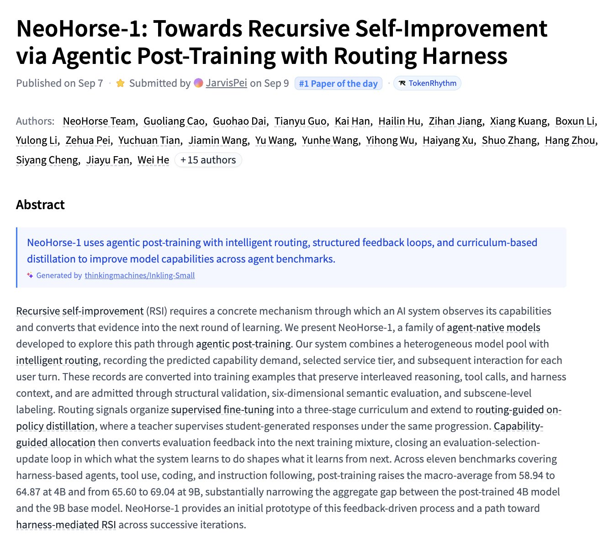
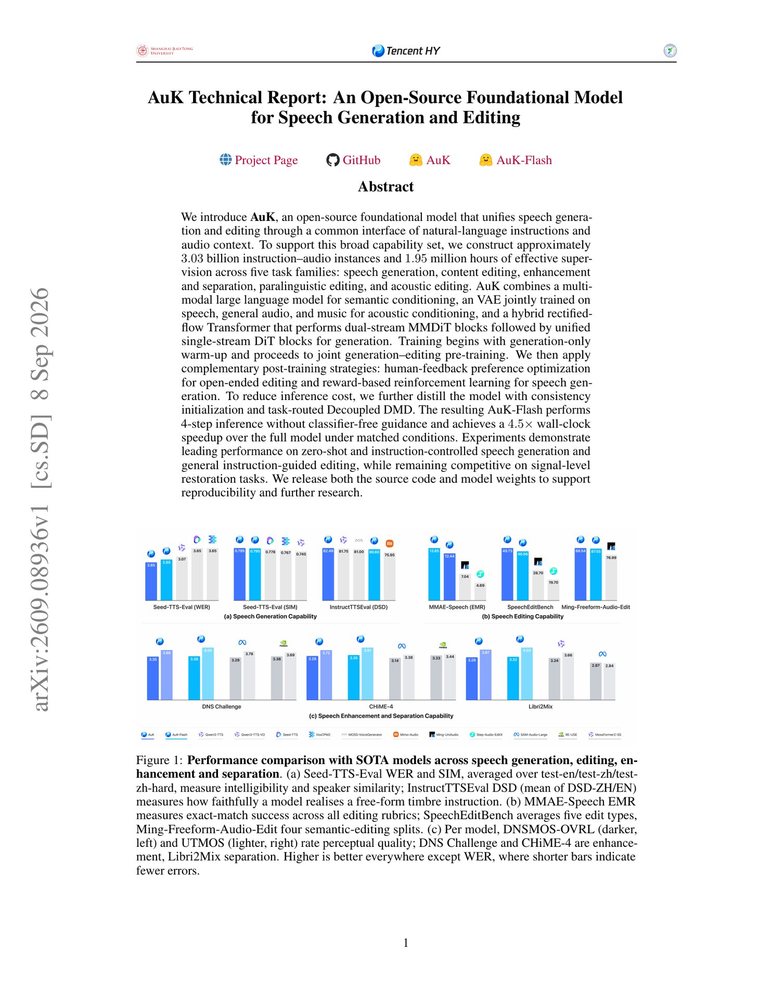

# 🐦 @_akhaliq

## 📅 September 09, 2026

> 4 post(s) archived.

---

### 🕐 16:39 UTC · @_akhaliq

> Marigold V2 Revisiting Diffusion Transformers for Monocular Depth Estimation paper: https://huggingface.co/papers/2609.08084 Media

🔗 [View original post](https://x.com/_akhaliq/status/2097726716861186348)

---

### 🕐 16:38 UTC · @_akhaliq

> NeoHorse-1 Towards Recursive Self-Improvement via Agentic Post-Training with Routing Harness paper: https://huggingface.co/papers/2609.08183

🔗 [View original post](https://x.com/_akhaliq/status/2097726309736874183)

---

### 🕐 16:06 UTC · @_akhaliq

> We’ve raised $47M in Series A funding led by @a16z to reimagine CRM as a world model of a business. Today we&apos;re announcing @lightfld&apos;s $47M Series A led by @a16z to reimagine CRM as a world model of a business. For agents to do customer-facing work, they need to understand how your business actually works. Salesforce wasn&apos;t designed for this. It was built 20+ years ago for huma…

🔗 [View original post](https://x.com/lightfld/status/2097718190868754594)

---

### 🕐 12:15 UTC · @_akhaliq

> Tencent releases AuK, a unified speech generation and editing model It handles zero-shot TTS, instruction-driven content/acoustic/paralinguistic editing, plus enhancement and separation through one natural-language interface. The distilled AuK-Flash version runs 4.5x faster.

🔗 [View original post](https://x.com/HuggingPapers/status/2097660279626609134)

---
