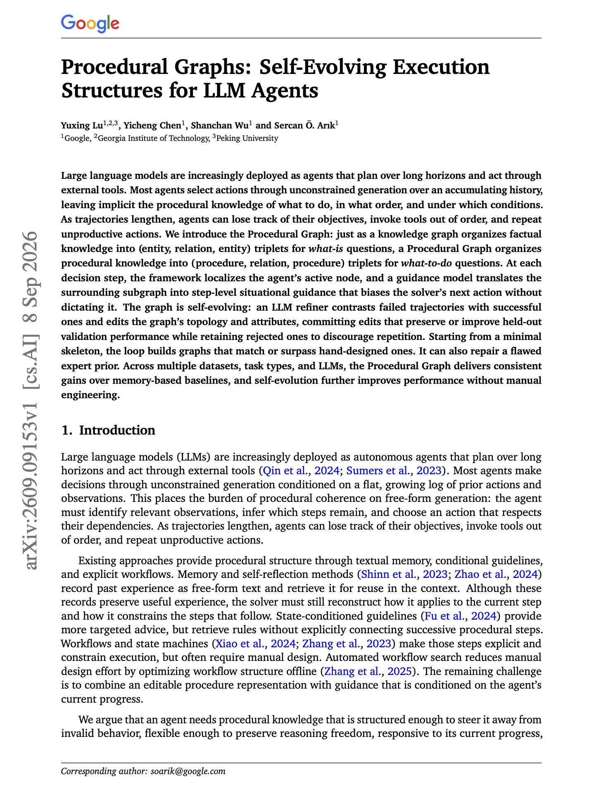
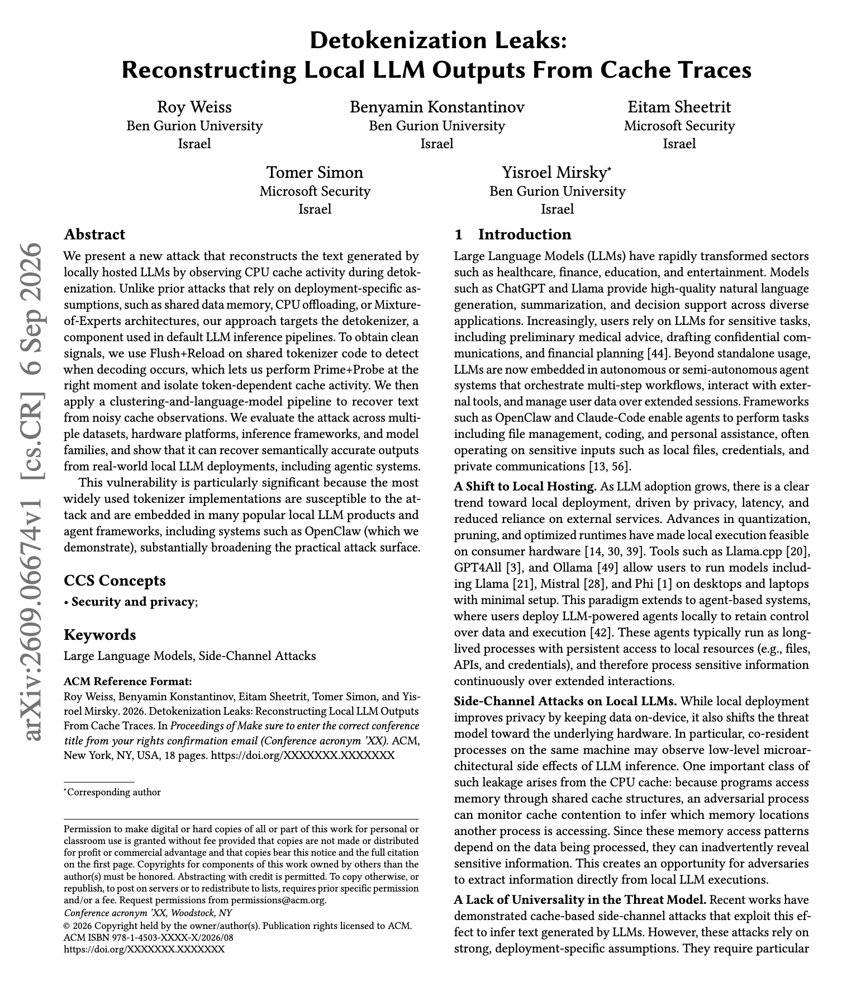

# 🐦 @dair_ai

## 📅 September 09, 2026

> 9 post(s) archived.

---

### 🕐 18:37 UTC · @dair_ai

> Recommended paper from Google if you want to learn how to improve long-horizon agents with procedural graphs https://x.com/omarsar0/status/2097755424007373270?s=20 Another banger paper from Google. If you build memory for long-horizon agents, this one is worth your time. (bookmark it) Really nice to see how knowledge graphs are being explored in creative ways for agents. This has lots of implications for self-evolving agents. Technical summ…

🔗 [View original post](https://x.com/dair_ai/status/2097756208857837851)

---

### 🕐 18:34 UTC · @dair_ai

> Another banger paper from Google. If you build memory for long-horizon agents, this one is worth your time. (bookmark it) Really nice to see how knowledge graphs are being explored in creative ways for agents. This has lots of implications for self-evolving agents. Technical summary below: Agents usually pick actions by generating over an accumulating history, which leaves the procedural knowledge implicit. As trajectories get longer they lose track of objectives, call tools out of order, and repeat actions that did not work. The Procedural Graph helps to make that knowledge explicit. A knowledge graph stores facts as entity-relation-entity triplets. A Procedural Graph stores procedures as procedure-relation-procedure triplets, so the agent can query what to do next and under which conditions. At each step, the framework localizes the agent&apos;s active node, and a guidance model turns the surrounding subgraph into step-level guidance that biases the next action without dictating it. The graph rewrites itself. An LLM refiner compares failed trajectories against successful ones and edits the topology and attributes, committing only edits that hold up on held-out validation, and keeping the rejected ones on file so the same change is not proposed twice. Starting from a minimal skeleton it builds graphs that match or beat hand-designed ones, and it helps to repair a flawed expert priors instead of inheriting them. Paper: https://academy.dair.ai/papers/procedural-graphs-self-evolving-execution-structures-for-llm-agents-2609.09153

🔗 [View original post](https://x.com/omarsar0/status/2097755424007373270)

---

### 🕐 18:00 UTC · @dair_ai

> Wild paper from Microsoft and colleagues. They show a new attack that reconstructs the text a local LLM generates by watching CPU cache activity while it detokenizes. Earlier cache attacks needed something unusual in the deployment, such as shared data memory, CPU offloading, or a Mixture-of-Experts architecture. This work targets the detokenizer, which runs in default inference pipelines. The method has two stages. 1) Flush+Reload on shared tokenizer code detects when decoding happens, which lets the attacker fire Prime+Probe at the right moment and isolate token-dependent cache activity. 2) A clustering and language-model pipeline then recovers readable text from the noisy observations. They evaluate across datasets, hardware platforms, inference frameworks and model families, including real local deployments and agentic systems. The widely used tokenizer implementations are susceptible, and they are embedded in many popular local LLM products and agent frameworks. OpenClaw is demonstrated directly. Paper: https://academy.dair.ai/papers/detokenization-leaks-reconstructing-local-llm-outputs-from-cache-traces-2609.06674

🔗 [View original post](https://x.com/dair_ai/status/2097746964662366376)

---

### 🕐 16:53 UTC · @dair_ai

> It&apos;s crazy how far small models can be pushed. Robbyant just open-sourced LingBot-World 2.0 Small, a 1.3B world model that generates an interactive world in real time on a single consumer GPU. Same pattern we saw with language &amp; image models. Scale capabilities first, then distill down to hardware people own. 🌍 What if an AI-generated world didn’t end after a few seconds—but kept running for hours, responded to every move, let you attack, cast spells, shoot, or summon storms, and continued evolving through AI agents? That’s LingBot-World 2.0: our open-source real-time interactive wor…

🔗 [View original post](https://x.com/omarsar0/status/2097730117900328968)

---

### 🕐 14:55 UTC · @dair_ai

> Open video models are having their moment. The previous generation of LTX alone reached 18M downloads, which shows how much demand there is for video models that builders can own and modify themselves. LTX-2.5 from @ltx_io builds on that foundation as a world model with open weights, local deployment, and a pretrained base that teams can fine-tune for their own work. For me, it&apos;s all about owning the intelligence stack. Builders choose the hardware, keep access to the weights, and can fine-tune the model around a creative or production workflow. More capabilities related to this model: The release improves both generation and editing. The new decoder targets sharper faces, legible text and signage, and cleaner fast motion. Native Multishot generates connected shots while preserving character, environment, lighting, and voice across cuts. IC-LoRA works on footage you already have, with support for object removal, continuity and wardrobe fixes, and environment changes without a reshoot or frame-by-frame rotoscoping. A stronger distilled model brings more of the full model&apos;s quality and motion to local GPUs. Open video is still early, and releases like this give builders more room to experiment, specialize models, and own the production stack. I am looking forward to seeing what people build with LTX-2.5. Media

🔗 [View original post](https://x.com/omarsar0/status/2097700488741376411)

---

### 🕐 13:18 UTC · @dair_ai

> Qodo just launched the Agentic Toolbox. It gives Claude Code, Codex, Kiro, and Cursor direct access to @QodoAI&apos;s review engine, codebase knowledge, and team rules.

🔗 [View original post](https://x.com/omarsar0/status/2097675900531732624)

---

### 🕐 05:33 UTC · @dair_ai

> Nice paper to improve inference efficiency. It&apos;s been a while we haven&apos;t seen good work on efficiency. Here is why it matters: A long-running agent&apos;s workspace outgrows its context window long before the task finishes. The first approach commonly used, compaction, loses the fine-grained execution evidence. And text retrieval re-prefills content the model already processed. KVMem keeps the overflow as paged KV state instead, spread across GPU memory, host memory and NVMe. Lightweight attention-space indexes, native to the model, pick the relevant historical blocks and materialize a query-dependent view that fits inside the native context window. On the DeepSWE long-context test with Qwen3.8-27B, task success goes from 43.8% under compaction to 48.4%. The local deployment result stands out. It runs Qwen3.6/3.8-27B NVFP4 with MTP on a laptop with a 24GB RTX 5090, virtualizing an agent workspace up to 1M tokens, four times the model&apos;s native 256K window, at around 50 tokens per second. Paper: https://academy.dair.ai/papers/kvmem-virtualizing-million-token-agent-workspaces-on-a-consumer-gpu-2609.04852

🔗 [View original post](https://x.com/omarsar0/status/2097558879194558838)

---

### 🕐 05:20 UTC · @dair_ai

> Good work on improving memory for long-horizon agents. They separate two things that agent memory papers usually collapse into one. How memories get merged when they are written, and how retrieved content gets assembled into the prompt. The setting is a tight prompt budget of 2k to 5k tokens, where full-context prompting is off the table because of latency, cost and context limits. RSM-full combines a cosine-gated max-member merge rule on the write side with an atom-aware grouped packer on the read side. At a 4k budget it reaches 83% of full-context quality at 32% of the token cost. The ablations attribute the gain to both halves separately. The merge rule is worth 5.7 points over online k-means and matched DP-means. The grouped packer is worth 5.0 points over flat concatenation. It reproduces on RealMem, beating Budget-RAG, Streaming-Proto and the A-MEM agentic memory baseline, and landing level with BM25-RAG rather than above it. The authors state that higher-token baselines stay stronger outside this budget range. Paper: https://academy.dair.ai/papers/compact-memory-llm-agents-via-online-max-member-clustering-and-atom-aware-packin-2609.04915

🔗 [View original post](https://x.com/dair_ai/status/2097555607389896732)

---

### 🕐 01:31 UTC · @dair_ai

> Great study on what actually predicts vibe-coding ability. 100 tertiary-level students completed measures of computer-science achievement, domain-general cognitive skills and written-communication proficiency, then took a vibe-coding assessment. The study was preregistered, which matters because the intuitive answer here, that writing ability carries everything, is what a post-hoc analysis would tend to find. Tasks were curated through an eight-expert consensus process and run in a purpose-built vibe-coding environment that mirrors commercial tools while allowing controlled measurement. They find that writing skill predicts performance. So does computer-science achievement, and it stays significant after controlling for domain-general cognitive skills, so it is measuring something specific to CS training rather than general ability. The practical question the authors point at is a curriculum one. How much time to spend teaching people to write good prompts, against how much to spend on computer-science fundamentals, for the people who will build software this way. Paper: https://academy.dair.ai/papers/computer-science-achievement-and-writing-skills-predict-vibe-coding-proficiency-2603.14133

🔗 [View original post](https://x.com/dair_ai/status/2097497977149624340)

---
