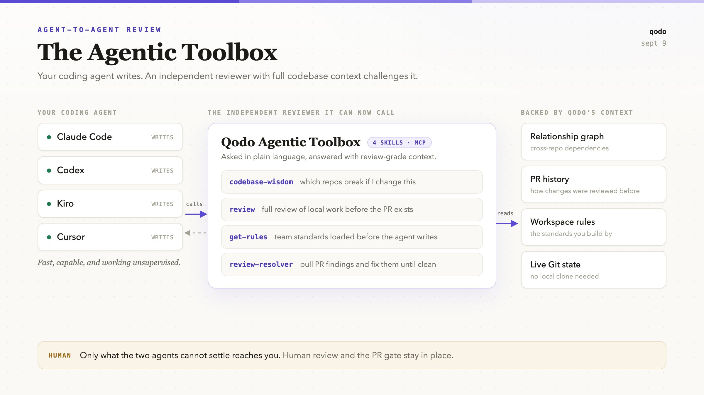
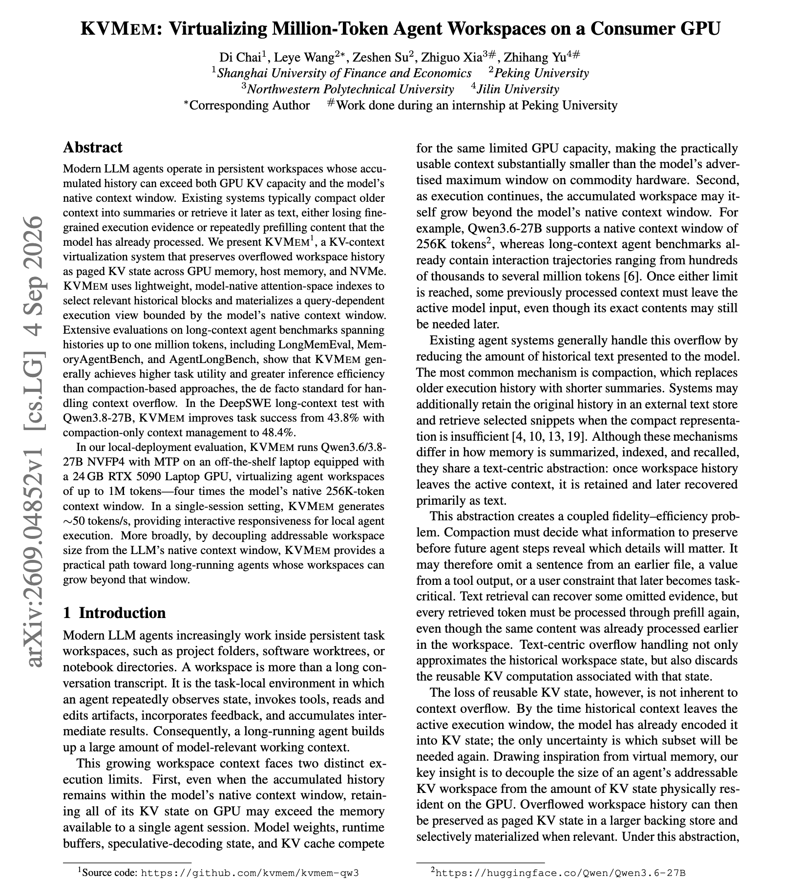
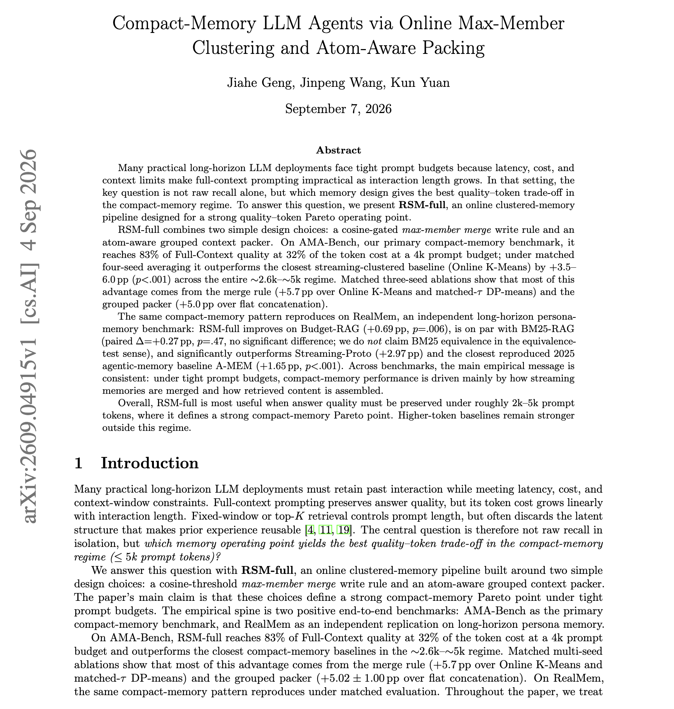
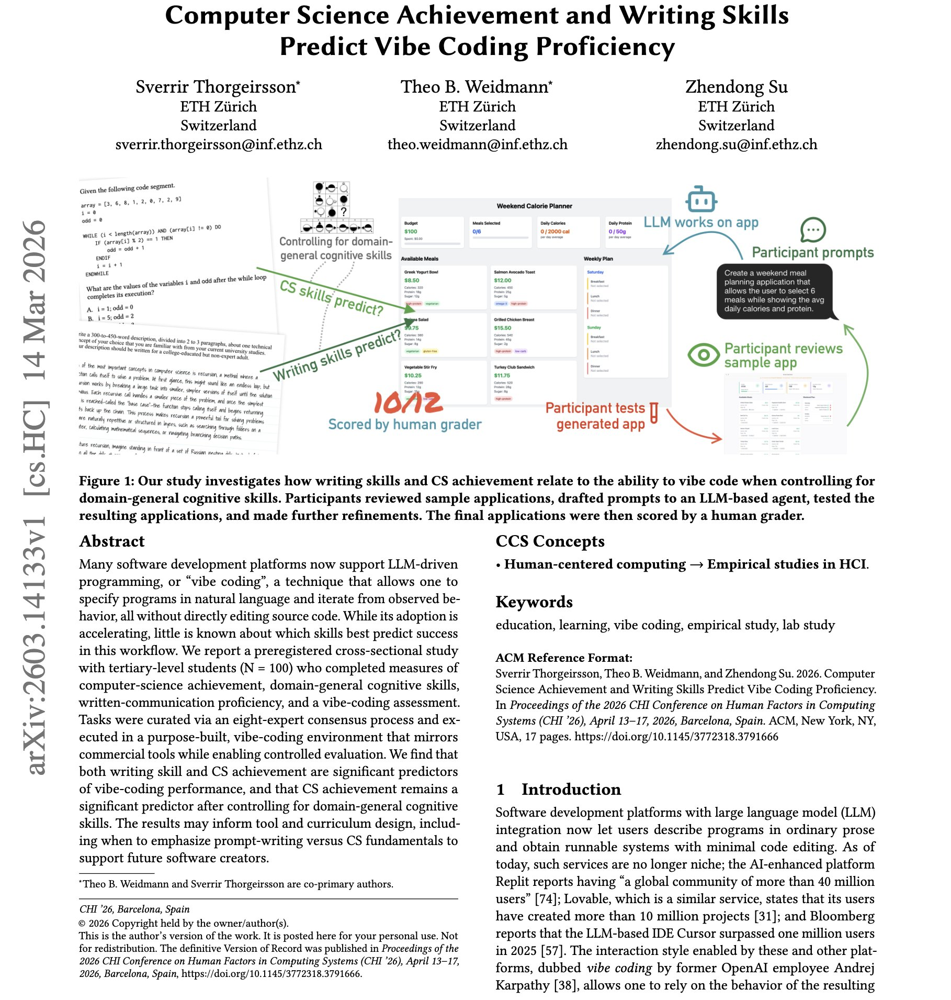

# 🐦 @dair_ai

## 📅 September 09, 2026

> 4 post(s) archived.

---

### 🕐 13:18 UTC · @dair_ai

> Qodo just launched the Agentic Toolbox. It gives Claude Code, Codex, Kiro, and Cursor direct access to @QodoAI&apos;s review engine, codebase knowledge, and team rules.

🔗 [View original post](https://x.com/omarsar0/status/2097675900531732624)

---

### 🕐 05:33 UTC · @dair_ai

> Nice paper to improve inference efficiency. It&apos;s been a while we haven&apos;t seen good work on efficiency. Here is why it matters: A long-running agent&apos;s workspace outgrows its context window long before the task finishes. The first approach commonly used, compaction, loses the fine-grained execution evidence. And text retrieval re-prefills content the model already processed. KVMem keeps the overflow as paged KV state instead, spread across GPU memory, host memory and NVMe. Lightweight attention-space indexes, native to the model, pick the relevant historical blocks and materialize a query-dependent view that fits inside the native context window. On the DeepSWE long-context test with Qwen3.8-27B, task success goes from 43.8% under compaction to 48.4%. The local deployment result stands out. It runs Qwen3.6/3.8-27B NVFP4 with MTP on a laptop with a 24GB RTX 5090, virtualizing an agent workspace up to 1M tokens, four times the model&apos;s native 256K window, at around 50 tokens per second. Paper: https://academy.dair.ai/papers/kvmem-virtualizing-million-token-agent-workspaces-on-a-consumer-gpu-2609.04852

🔗 [View original post](https://x.com/omarsar0/status/2097558879194558838)

---

### 🕐 05:20 UTC · @dair_ai

> Good work on improving memory for long-horizon agents. They separate two things that agent memory papers usually collapse into one. How memories get merged when they are written, and how retrieved content gets assembled into the prompt. The setting is a tight prompt budget of 2k to 5k tokens, where full-context prompting is off the table because of latency, cost and context limits. RSM-full combines a cosine-gated max-member merge rule on the write side with an atom-aware grouped packer on the read side. At a 4k budget it reaches 83% of full-context quality at 32% of the token cost. The ablations attribute the gain to both halves separately. The merge rule is worth 5.7 points over online k-means and matched DP-means. The grouped packer is worth 5.0 points over flat concatenation. It reproduces on RealMem, beating Budget-RAG, Streaming-Proto and the A-MEM agentic memory baseline, and landing level with BM25-RAG rather than above it. The authors state that higher-token baselines stay stronger outside this budget range. Paper: https://academy.dair.ai/papers/compact-memory-llm-agents-via-online-max-member-clustering-and-atom-aware-packin-2609.04915

🔗 [View original post](https://x.com/dair_ai/status/2097555607389896732)

---

### 🕐 01:31 UTC · @dair_ai

> Great study on what actually predicts vibe-coding ability. 100 tertiary-level students completed measures of computer-science achievement, domain-general cognitive skills and written-communication proficiency, then took a vibe-coding assessment. The study was preregistered, which matters because the intuitive answer here, that writing ability carries everything, is what a post-hoc analysis would tend to find. Tasks were curated through an eight-expert consensus process and run in a purpose-built vibe-coding environment that mirrors commercial tools while allowing controlled measurement. They find that writing skill predicts performance. So does computer-science achievement, and it stays significant after controlling for domain-general cognitive skills, so it is measuring something specific to CS training rather than general ability. The practical question the authors point at is a curriculum one. How much time to spend teaching people to write good prompts, against how much to spend on computer-science fundamentals, for the people who will build software this way. Paper: https://academy.dair.ai/papers/computer-science-achievement-and-writing-skills-predict-vibe-coding-proficiency-2603.14133

🔗 [View original post](https://x.com/dair_ai/status/2097497977149624340)

---
