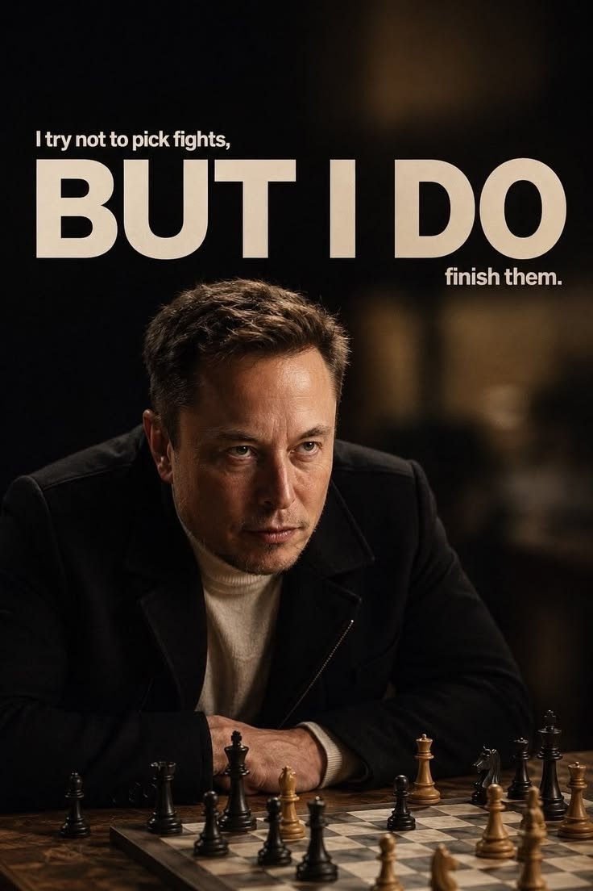

# 🐦 @elonmusk

## 📅 September 09, 2026

> 13 post(s) archived.

---

### 🕐 18:27 UTC · @elonmusk

> If you want to reach the smartest people in the world, advertise on 𝕏

🔗 [View original post](https://x.com/elonmusk/status/2097753657714573749)

---

### 🕐 18:08 UTC · @elonmusk

> ❤️ Larry, a 98-year-old, just bought a new @Tesla Model Y, and he uses FSD (Supervised) to drive him everywhere. His first car was a 1931 Ford Model A haha. He uses Grok to navigate. &quot;It has no problems. In fact, the other day FSD stopped when a chipmunk was crossing the road.&quot; Defi…

🔗 [View original post](https://x.com/elonmusk/status/2097749072333644248)

---

### 🕐 18:00 UTC · @elonmusk

> Gutless Gibney’s fatal flaw of fabricating a false film

🔗 [View original post](https://x.com/elonmusk/status/2097747100473970711)

---

### 🕐 17:08 UTC · @elonmusk

> Accurate How the anti-Elon narrative is made

🔗 [View original post](https://x.com/elonmusk/status/2097733862403281293)

---

### 🕐 17:04 UTC · @elonmusk

> Stainless Steel Starship &amp; Cybertruck Made it to Starbase FSD all the way 🤩 So much construction here. America feels so futuristic &amp; Starship seems almost ready for Flight 14 🚀

🔗 [View original post](https://x.com/elonmusk/status/2097733003124576335)

---

### 🕐 14:06 UTC · @elonmusk

> With an Internet connection, you can learn anything and sell your products to a global market, which enables prosperity Elon Musk on the single biggest poverty lever. &quot;And I think the single biggest thing you can do to lift people out of poverty and help them is giving them an internet connection.&quot; Most aid arguments still start with cash, food, or roads. Elon is saying the unlock is a connection …

🔗 [View original post](https://x.com/elonmusk/status/2097688004081119494)

---

### 🕐 14:01 UTC · @elonmusk

> AI+robots will more than double the global economy in less than 10 years Elon Musk has said that AI could increase the size of the global economy by 20% to 30%.

🔗 [View original post](https://x.com/elonmusk/status/2097686835338375265)

---

### 🕐 13:02 UTC · @elonmusk

> Media

🔗 [View original post](https://x.com/johnternus/status/2097672038781763614)

---

### 🕐 06:00 UTC · @elonmusk

> Starlink Starlink with @MinCapHum_Ar and @ENACOMArgentina will provide 6,000 kits to rural schools in Argentina, giving thousands of students and teachers fast, reliable internet. Teachers can build lesson plans with digital resources, while students can join online classes, use digital l…

🔗 [View original post](https://x.com/elonmusk/status/2097565838438260864)

---

### 🕐 05:49 UTC · @elonmusk

> A director who doesn&apos;t come up to the builder&apos;s heels makes a four-hour film about him. Yesterday in Venice, Alex Gibney&apos;s nearly four-hour documentary &quot;Musk&quot; had its world premiere. It is a classic case of someone who has spent a career telling other people&apos;s stories taking on a man who actually builds those stories with rockets, cars, satellites, and infrastructure, not slides. Alex Gibney is an acclaimed documentarian. An Oscar for Taxi to the Dark Side, Emmys for Going Clear on Scientology, high-profile films on Enron, Elizabeth Holmes and Theranos. His specialty is exposing corporations, cults, and frauds. He does it skillfully and with a thesis. The problem starts when he applies the same method to someone who is not selling an illusion, but hardware that either flies or blows up in front of the entire world. Gibney&apos;s fuel is controversy. Elon&apos;s fuel is the pursuit of truth hard, engineering truth, the kind that either works on the test stand or it doesn&apos;t. It would have been enough to make a film based on facts. Instead we got another rut that fits the slogans of provocation: megalomaniac, confidence man, threat to democracy, an AI avatar reciting old quotes, ex-wives, his father, a former partner. Musk said in 2023 it would be a hit piece. After the premiere, a large share of reviewers effectively agreed with him. I don&apos;t know about you, but four hours of falsified formulas would bore me. Instead I watch how much Elon has already done. His energy is extraordinary. Tesla changed the car industry. SpaceX brings rockets back. Starlink works. Starship stands on the pad and prepares for the next flight. This is not a PowerPoint. It is steel, fuel, engines, and people who cannot hide failure in the edit suite. A weak documentary like this is a crumb on the shoulder of his jacket. Now it depends on us when and how quickly that blown-off crumb a utopian attention vampire is simply starved of attention. You could list the names of people who tried to take Elon&apos;s energy. Energy is the most precious thing we have. Anyone who steals it with slogans, gossip, and a four-hour indictment that excludes the main subject is sowing under his own feet. Gibney: you reap what you sow. If you have a shred of shame, look at the list of Elon&apos;s accomplishments. Look at what kind of person he is for the world and what he does around himself so that things get better cars that drive, internet from orbit, rockets that return, attempts at a brain-computer interface, AI that is supposed to be more than another chatbot. You can dislike his tweets, his political alliances. You cannot honestly erase the scale of what was physically built. A good documentarian should stand, at least for a moment, in the shoes of the person he is portraying. Gibney did not just fail to do that. He took a measure cut for Enron and Holmes and held it up to a man who lands rockets. He left Elon&apos;s shoes in the edit suite. Elon walked on barefoot and kept building. One man tells stories about the world from an editing chair. The other moves that world. A four-hour film will not change that. At most it will confirm what people who already disliked Musk already believed. Everyone else can blow the crumb off the jacket and keep going. History does not judge a man by the length of a film. It judges him by what is still in the air when the camera has stopped running. Controversy feeds on attention. Building feeds on repetition. One vanishes when you look away. The other keeps flying. You can cut a man together in four hours. You cannot cut a landing together. A documentary can be switched off. The work cannot.

🔗 [View original post](https://x.com/NataliaSpace11/status/2097563086899069032)

---

### 🕐 05:29 UTC · @elonmusk

> 😂 This is the man they’re calling &apos;extremely dangerous&apos; 🤦‍♂️

🔗 [View original post](https://x.com/elonmusk/status/2097557930799440261)

---

### 🕐 02:39 UTC · @elonmusk

> @elonmusk 𝕏 is the most powerful platform TikTok is for brainrot Instagram for friends and influencers YouTube for entertainment and podcast 𝕏 is where real world change is created

🔗 [View original post](https://x.com/nickshirleyy/status/2097515174626533603)

---

### 🕐 02:24 UTC · @elonmusk

> 𝕏 has started rolling out 𝕏 Numbers to more users It’s a private in-app contact number for XChat Share it with people you trust. Anyone who has it can message or call you on 𝕏....no follow required You can turn it on or off, share it, and refresh it to kill the old number Messaging + calling + your own number All inside 𝕏 X is rolling out X Chat numbers to more users on iOS, I just got it! 👀

🔗 [View original post](https://x.com/XFreeze/status/2097511434548847026)

---
