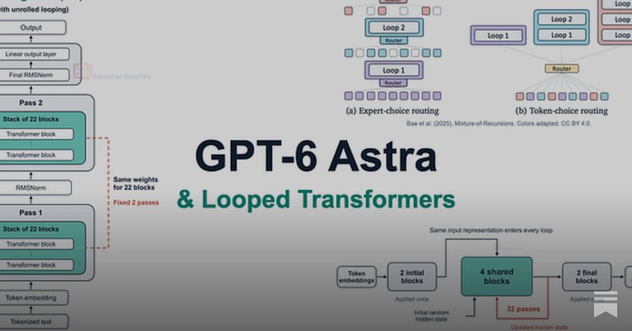
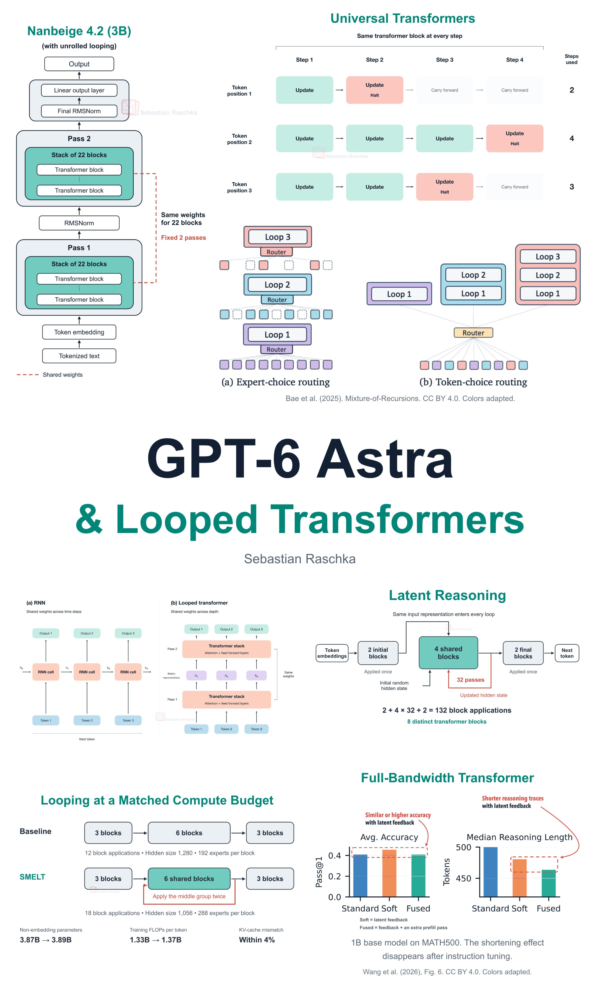

# 🐦 @rasbt

## 📅 September 09, 2026

> 2 post(s) archived.

---

### 🕐 13:26 UTC · @rasbt

> Here&apos;s a link to the article: https://magazine.sebastianraschka.com/p/gpt-6-astra-looped-transformers-and

🔗 [View original post](https://x.com/rasbt/status/2097677953450561596)

---

### 🕐 13:26 UTC · @rasbt

> I put together a mega write-up on GPT-6 Astra &amp; looped transformers. How looped transformers / recurrent depth works, cost-tradeoffs, whether it hides reasoning traces, with lots of figures and a tour of recent looped transformer research.

🔗 [View original post](https://x.com/rasbt/status/2097677950262939931)

---
