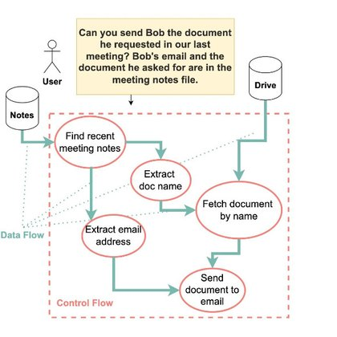

# 🐦 @simonw

## 📅 September 09, 2026

> 1 post(s) archived.

---

### 🕐 00:00 UTC · @simonw

> &quot;Deterministic code checks the result&quot; sounds like they might be implementing a variant of the DeepMind CaMeL paper https://simonwillison.net/2025/Apr/11/camel/ One threat we’re particularly focused on is prompt injection, and we handle it in layers. The model is trained to recognize and resist it. The harness marks anything coming from an untrusted source. Deterministic code checks the result. And an ensemble of classifiers runs where t…

🔗 [View original post](https://x.com/simonw/status/2097475247595536880)

---
