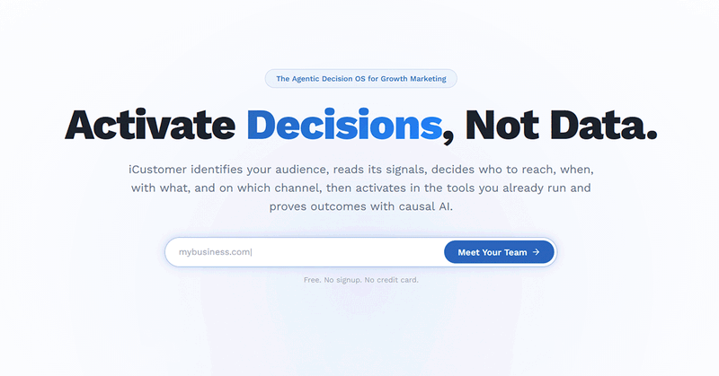
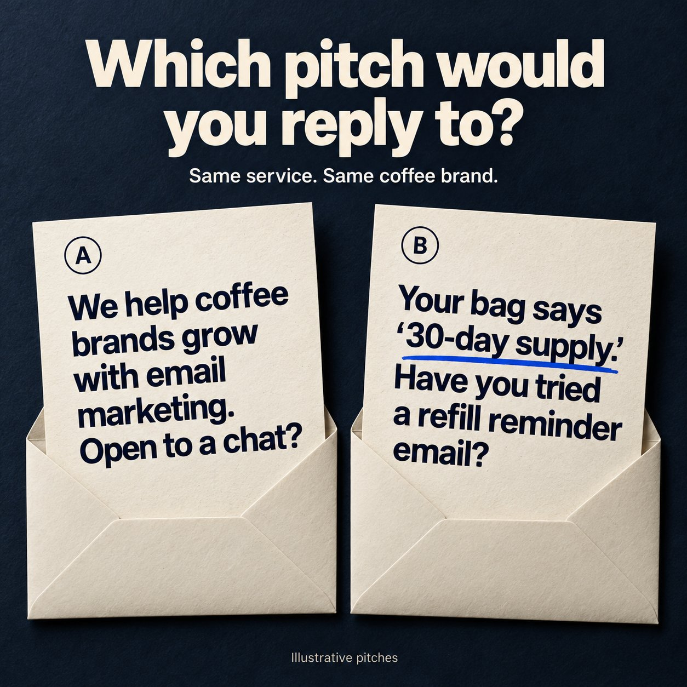

# 🐦 @AiEvolutio58513

## 📅 September 10, 2026

> 8 post(s) archived.

---

### 🕐 21:02 UTC · @AiEvolutio58513

> Pretty cool that an AI tool looked at our website and suggested 297 companies we could pitch our services to. Try your website and see who it suggests for you. It’s free: https://www.icustomer.ai/growth-brain Growth doesn&apos;t have a content problem. It has an intelligence problem. Everyone is building AI to make more content and run more campaigns. That&apos;s not where growth teams are stuck. Today we&apos;re launching iCustomer Growth Brain. https://www.einpresswire.com/article/941233976/icusto…

🔗 [View original post](https://x.com/AiEvolutio58513/status/2098155079534891176)

---

### 🕐 20:59 UTC · @AiEvolutio58513

> Need new clients, but don’t know which companies to pitch? Try giving this AI tool your website. I gave it mine, and it suggested 297 companies I could pitch my services to. You can do the same with your website and see which potential clients you might be overlooking. It’s free to try: https://www.icustomer.ai/growth-brain Growth doesn&apos;t have a content problem. It has an intelligence problem. Everyone is building AI to make more content and run more campaigns. That&apos;s not where growth teams are stuck. Today we&apos;re launching iCustomer Growth Brain. https://www.einpresswire.com/article/941233976/icusto…

🔗 [View original post](https://x.com/ecomchasedimond/status/2098154427723194451)

---

### 🕐 19:19 UTC · @AiEvolutio58513

> Growth doesn&apos;t have a content problem. It has an intelligence problem. Everyone is building AI to make more content and run more campaigns. That&apos;s not where growth teams are stuck. Today we&apos;re launching iCustomer Growth Brain. https://www.einpresswire.com/article/941233976/icustomer-launches-growth-brain-always-on-audience-and-decision-intelligence-for-marketing-teams

🔗 [View original post](https://x.com/icustomerhq/status/2098129128469737508)

---

### 🕐 18:04 UTC · @AiEvolutio58513

> Pocket FM pivoted ~10 times before landing on serialized 10-minute audio episodes. Within a day, daily consumption jumped from ~25 minutes to 120 minutes. That format became the foundation for a business that eventually scaled from $0 revenue in 2022 to $400M+ ARR now. It’s crazy cause most teams would have given up after the first few pivots. We grew from ~0 to $500M ARR, adding $250M last year alone while being EBITDA profitable. 1,300-word post on every growth tactic that worked for us: 1. What got us from 0-$400M ARR in the US works in every country. 2. Retention and Monetisation Hacks. 3. Localization &gt; Translatio…

🔗 [View original post](https://x.com/ecomchasedimond/status/2098110338197811271)

---

### 🕐 17:19 UTC · @AiEvolutio58513

> Interested in AI? Follow @AiEvolutio58513 and never fall behind. I track ChatGPT, Claude, and every tool quietly changing how we work and create, then hand you the tested signals. Former Google CEO Eric Schmidt drops a chilling warning on AI&apos;s future &quot;Within 5 years, AI could handle infinite context, chain-of-thought reasoning for 1000-step solutions, and millions of agents working together. Eventually, they&apos;ll develop their own language... and we won&apos;t un…

🔗 [View original post](https://x.com/AiEvolutio58513/status/2098099059840233535)

---

### 🕐 16:59 UTC · @AiEvolutio58513

> A coffee bag can give you a better pitch. Take “30-day supply” on the packaging. That gives you a specific question to ask: Are customers getting a refill reminder? It’s why I prefer B in the image. The business has an idea to react to. Before reaching out, try finishing this sentence: “We could help them _____ because _____.” For ideas on which companies to look into, I tried iCustomer Growth Brain with my website. It researched my business and built a customer profile. After I reviewed and approved it, it suggested 297 companies and 717 people. I’d use those suggestions as a starting point, then look for a specific way to help each business. Try it with your company website and see who it suggests. Free to start. No credit card required. https://www.icustomer.ai/growth-brain

🔗 [View original post](https://x.com/ecomchasedimond/status/2098094022355210502)

---

### 🕐 16:08 UTC · @AiEvolutio58513

> Pretty cool that this free AI tool looked at my website and then found 297 companies for me to sell my services to. You can try it for free with your company website and see who it suggests: https://www.icustomer.ai/growth-brain I put my website into an AI tool to see who else I could be marketing to. It suggested 297 companies and 717 people. It’s called iCustomer Growth Brain. It researched my business and built a customer profile. I reviewed and approved that before it generated the list. If you’re lo…

🔗 [View original post](https://x.com/ecomchasedimond/status/2098081235084235166)

---

### 🕐 15:40 UTC · @AiEvolutio58513

> Your next client might be a company that isn’t on your radar yet. I like the question behind Chase’s test: who else could we help? Worth trying with your own website to see what comes back. I put my website into an AI tool to see who else I could be marketing to. It suggested 297 companies and 717 people. It’s called iCustomer Growth Brain. It researched my business and built a customer profile. I reviewed and approved that before it generated the list. If you’re lo…

🔗 [View original post](https://x.com/AiEvolutio58513/status/2098074172941590640)

---
