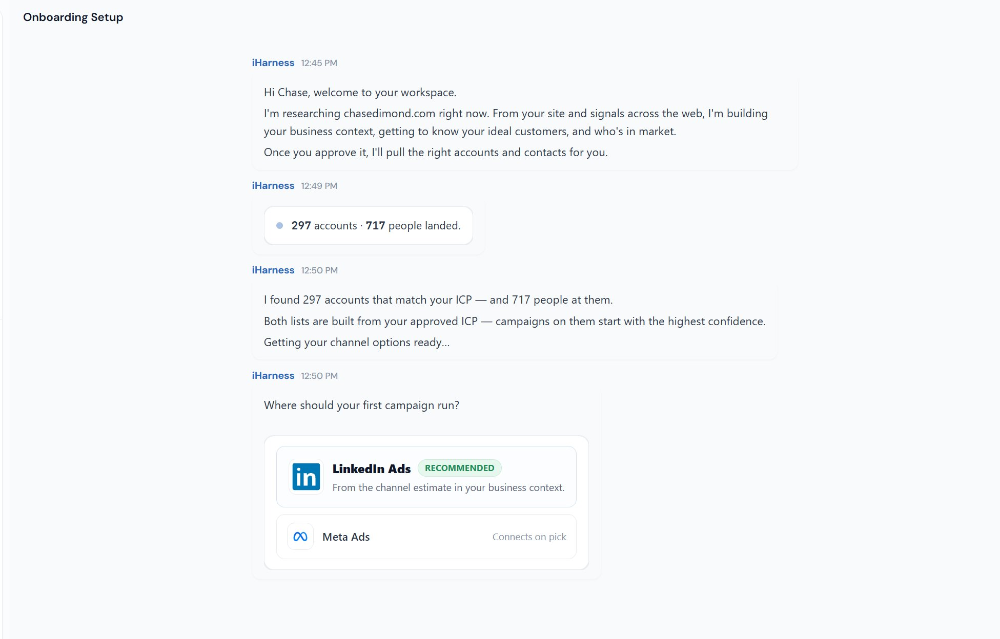

# 🐦 @AiEvolutio58513

## 📅 September 10, 2026

> 2 post(s) archived.

---

### 🕐 16:08 UTC · @AiEvolutio58513

> Pretty cool that this free AI tool looked at my website and then found 297 companies for me to sell my services to. You can try it for free with your company website and see who it suggests: https://www.icustomer.ai/growth-brain I put my website into an AI tool to see who else I could be marketing to. It suggested 297 companies and 717 people. It’s called iCustomer Growth Brain. It researched my business and built a customer profile. I reviewed and approved that before it generated the list. If you’re lo…

🔗 [View original post](https://x.com/ecomchasedimond/status/2098081235084235166)

---

### 🕐 15:40 UTC · @AiEvolutio58513

> Your next client might be a company that isn’t on your radar yet. I like the question behind Chase’s test: who else could we help? Worth trying with your own website to see what comes back. I put my website into an AI tool to see who else I could be marketing to. It suggested 297 companies and 717 people. It’s called iCustomer Growth Brain. It researched my business and built a customer profile. I reviewed and approved that before it generated the list. If you’re lo…

🔗 [View original post](https://x.com/AiEvolutio58513/status/2098074172941590640)

---
