# 🐦 @Unlockyourlife_

## 📅 September 10, 2026

> 37 post(s) archived.

---

### 🕐 20:35 UTC · @Unlockyourlife_

> 98% of men have developed this habit of trying to provide for everybody. Sadly, you have forgotten yourself. - No sleep - No gym - No hobbies - No friends - No boundaries - No rest - No self-care - No peace Just.. - Work - Overthink - Provide - Sacrifice - Repeat - Numb out - Burn out - Survive This is how men wake up at 50 not knowing who they are.

🔗 [View original post](https://x.com/Masculinjournal/status/2098148256207519852)

---

### 🕐 19:09 UTC · @Unlockyourlife_

> 7 Books That Can Change Your Life permanently. 1. Atomic Habits

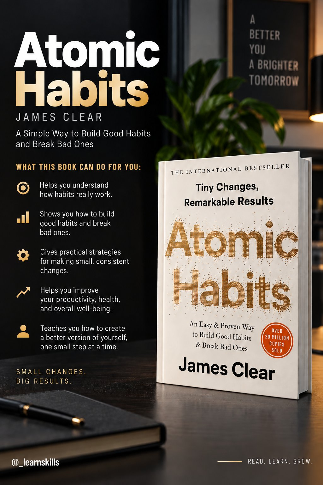

🔗 [View original post](https://x.com/_learnskills/status/2098126852095115455)

---

### 🕐 17:00 UTC · @Unlockyourlife_

> Good fats vs bad choices. Know the difference.

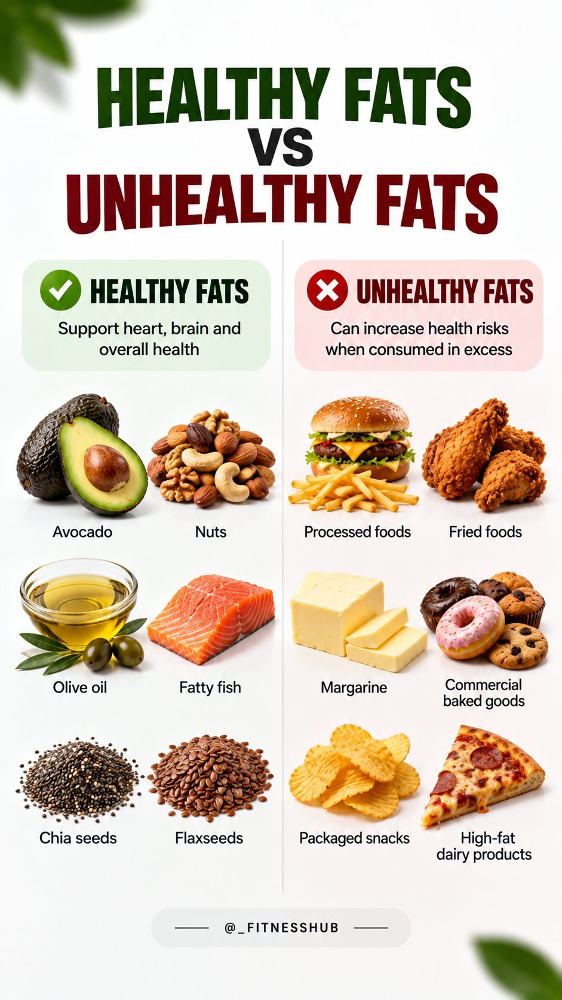

🔗 [View original post](https://x.com/_fitnesshub/status/2098094241721340209)

---

### 🕐 16:37 UTC · @Unlockyourlife_

> That burning pain in your upper stomach isn&apos;t always &quot;just acidity.&quot; Sometimes, it can be a sign of an ulcer. Let&apos;s break down what causes ulcers, what the symptoms can look like, and when you shouldn&apos;t ignore them.

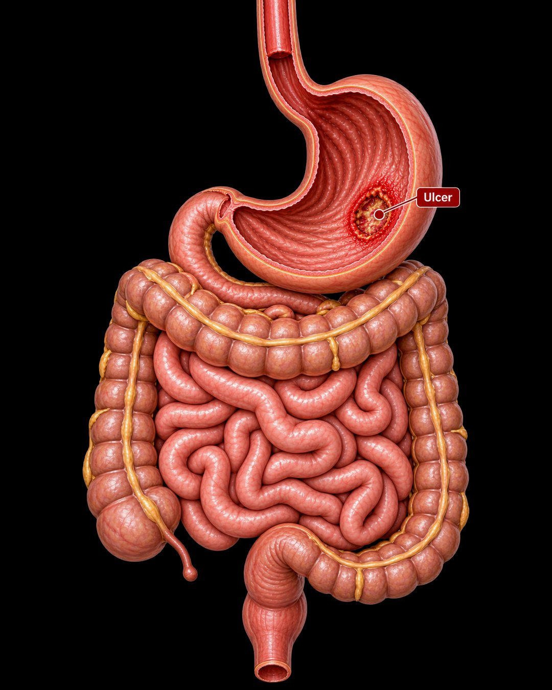

🔗 [View original post](https://x.com/FitnessDr_/status/2098088427866697954)

---

### 🕐 15:27 UTC · @Unlockyourlife_

> One of the biggest dating mistakes is ignoring how someone makes you feel because you like how they look. Attraction can make you negotiate with obvious problems. Ask the harder question: If the attraction disappeared tomorrow, would I still respect this person?

🔗 [View original post](https://x.com/Masculinjournal/status/2098070837920256055)

---

### 🕐 13:56 UTC · @Unlockyourlife_

> Fruits can be a simple way to add energy, hydration, fiber, antioxidants and important nutrients to your diet. You don’t need to stick to one “perfect” fruit. 🍌🍉🥑 Mix different fruits based on your goals, meals and preferences — and remember that your overall diet matters more than any single food. 💪

🔗 [View original post](https://x.com/_fitnesshub/status/2098047902543176149)

---

### 🕐 13:56 UTC · @Unlockyourlife_

> 5.

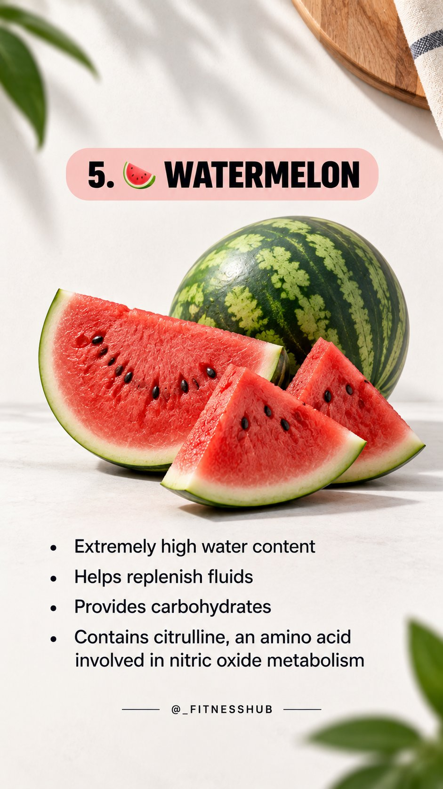

🔗 [View original post](https://x.com/_fitnesshub/status/2098047898344656920)

---

### 🕐 13:56 UTC · @Unlockyourlife_

> 4.

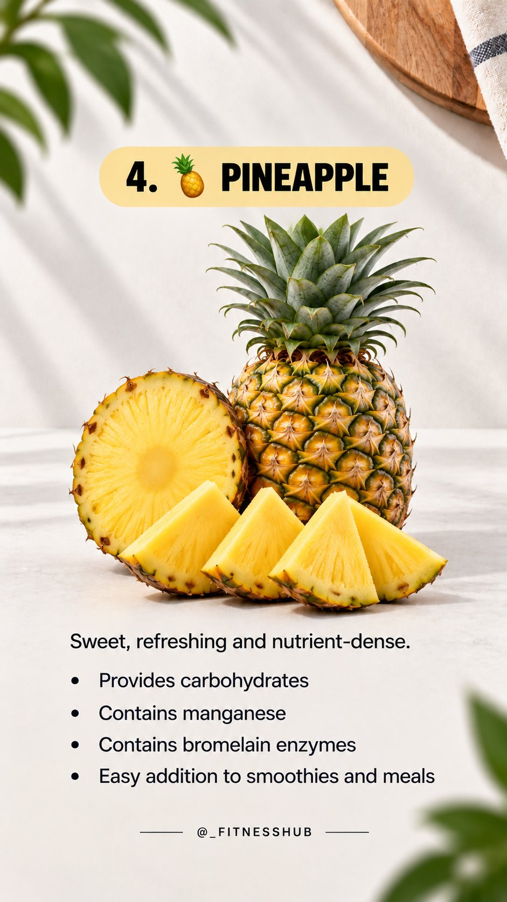

🔗 [View original post](https://x.com/_fitnesshub/status/2098047893332525434)

---

### 🕐 13:56 UTC · @Unlockyourlife_

> 3.

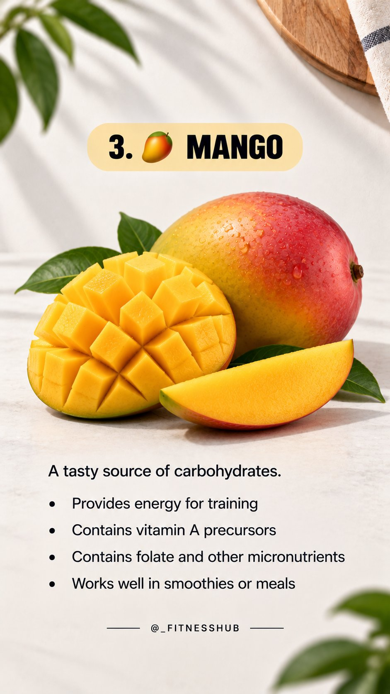

🔗 [View original post](https://x.com/_fitnesshub/status/2098047888022479276)

---

### 🕐 13:56 UTC · @Unlockyourlife_

> 2.

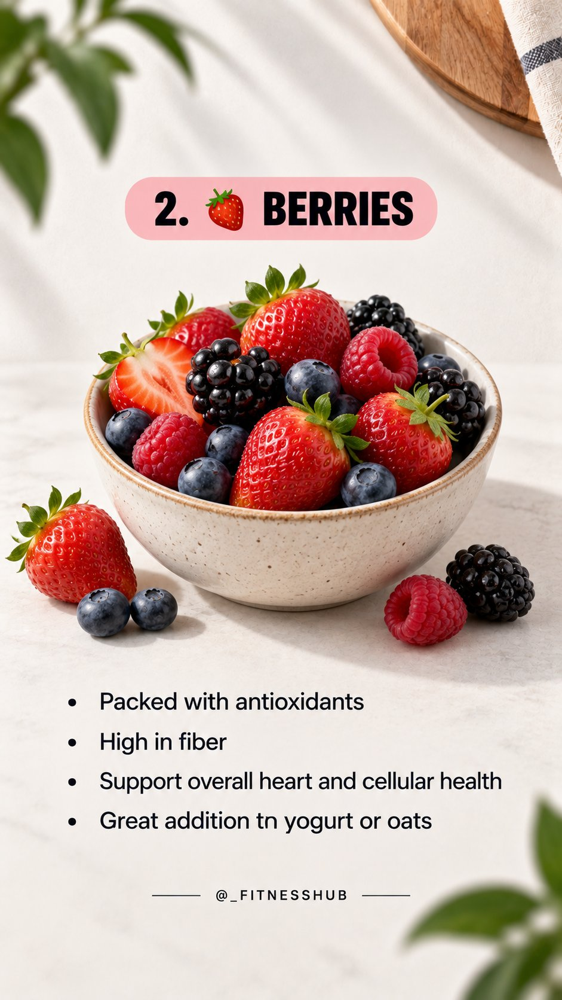

🔗 [View original post](https://x.com/_fitnesshub/status/2098047883161243710)

---

### 🕐 13:56 UTC · @Unlockyourlife_

> 5 FRUITS TO EAT IF YOU WORK OUT 🏋️ 1.

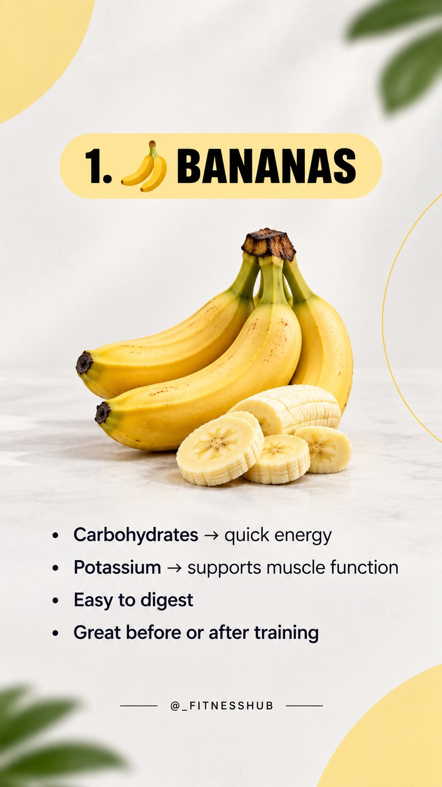

🔗 [View original post](https://x.com/_fitnesshub/status/2098047878421749996)

---

### 🕐 13:43 UTC · @Unlockyourlife_

> Which Material Can Cut Bundle Of Razor Blades ? Media

🔗 [View original post](https://x.com/_Brainboxx/status/2098044741224903005)

---

### 🕐 13:28 UTC · @Unlockyourlife_

> In 1990, New York had a problem that seemed impossible to fix. The city wasn’t just dangerous. It looked like nobody cared. And one theory changed how they fought back: The Broken Windows Theory.

🔗 [View original post](https://x.com/Mastering_life_/status/2098040917827707033)

---

### 🕐 13:23 UTC · @Unlockyourlife_

> Give yourself 14 days with this list and you&apos;ll go from &quot;just following a recipe&quot; to plating a seafood paella people think came from a restaurant in Valencia.

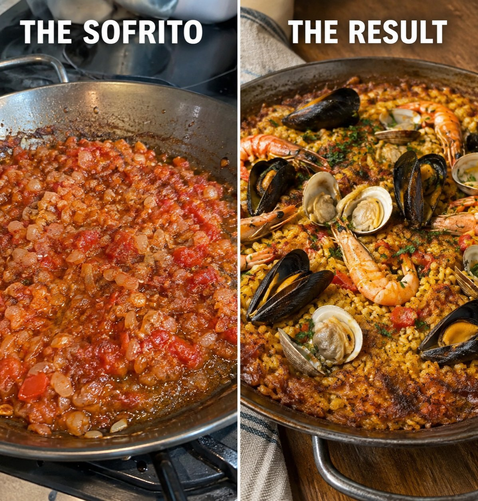

🔗 [View original post](https://x.com/Elitedelicacy/status/2098039722702500300)

---

### 🕐 13:17 UTC · @Unlockyourlife_

> Your gut bacteria are either protecting you from infection or setting you up for one. Most people have no idea which side they&apos;re on. Here&apos;s what actually determines that:

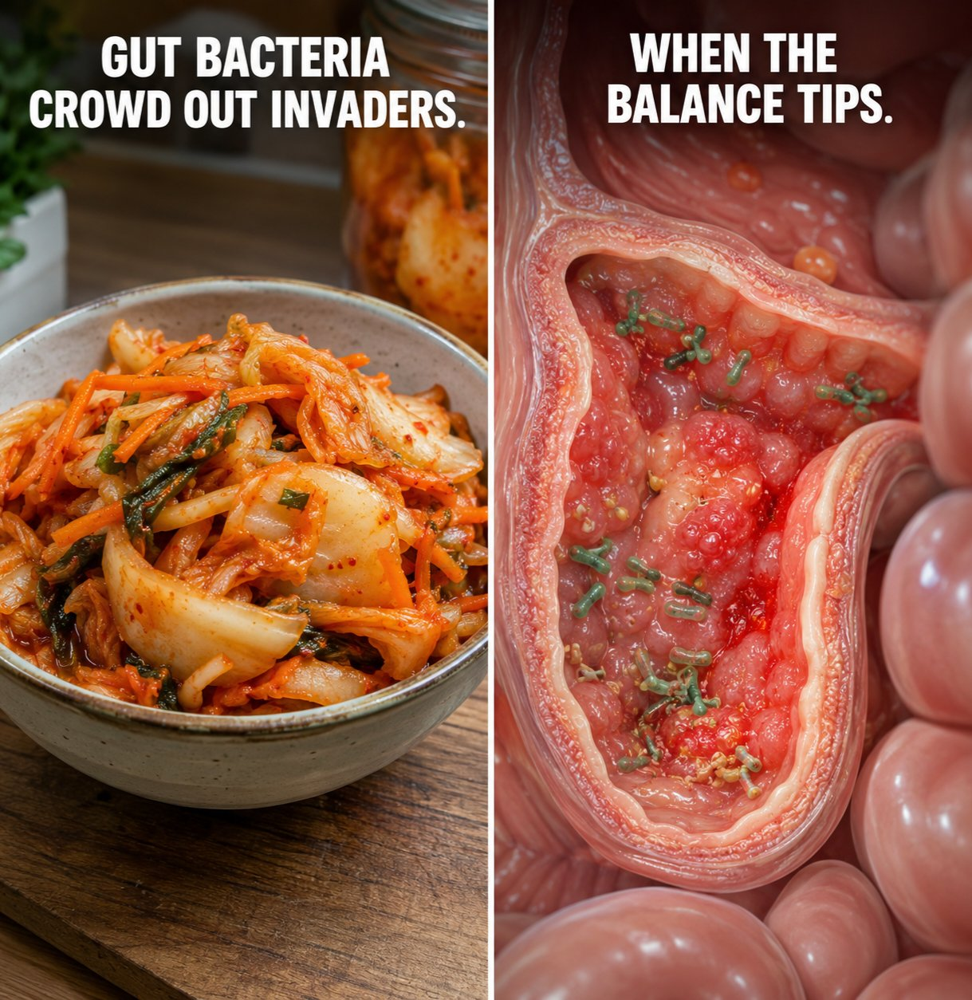

🔗 [View original post](https://x.com/BioLifex/status/2098038252653404324)

---

### 🕐 13:15 UTC · @Unlockyourlife_

> Your body was never the ceiling. Your mind was. Train it like you train everything else and watch what you were actually capable of the whole time.

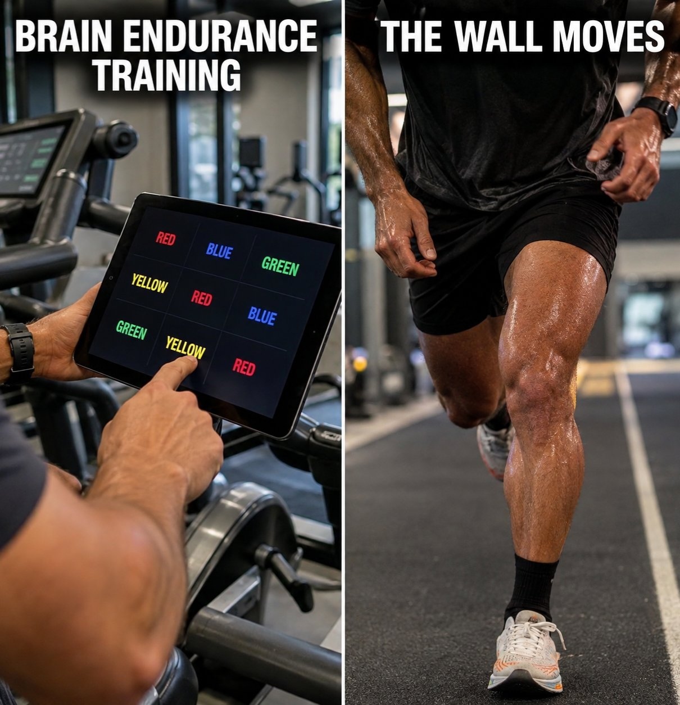

🔗 [View original post](https://x.com/_alphafit/status/2098037662573621661)

---

### 🕐 12:40 UTC · @Unlockyourlife_

> The first storm on Earth didn&apos;t last an hour—it lasted for thousands of years. 🌊 Media

🔗 [View original post](https://x.com/sciencepathx/status/2098028956125479357)

---

### 🕐 12:23 UTC · @Unlockyourlife_

> Man Builds a Home office in his Olive Field villa. Media

🔗 [View original post](https://x.com/Smart_Tipsx/status/2098024464961180158)

---

### 🕐 12:17 UTC · @Unlockyourlife_

> This Simple tricks will blow your mind. Media

🔗 [View original post](https://x.com/samx_reels/status/2098023023110402323)

---

### 🕐 10:54 UTC · @Unlockyourlife_

> What actually happens when you take creatine.

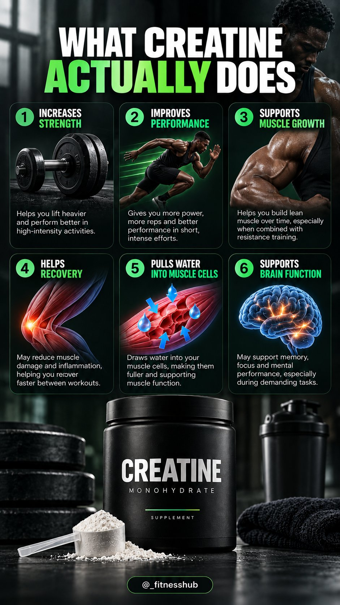

🔗 [View original post](https://x.com/_fitnesshub/status/2098002090031304930)

---

### 🕐 10:02 UTC · @Unlockyourlife_

> Health Conscious

🔗 [View original post](https://x.com/Elitedelicacy/status/2097988970126717122)

---

### 🕐 09:56 UTC · @Unlockyourlife_

> The Murph Challenge: Why This Brutal Hero WOD Breaks Even Elite Athletes&quot;

🔗 [View original post](https://x.com/_alphafit/status/2097987656583880782)

---

### 🕐 09:47 UTC · @Unlockyourlife_

> Host vs. Pathogen: The Battle Ground of the Human Immune System.

🔗 [View original post](https://x.com/BioLifex/status/2097985386207154200)

---

### 🕐 08:34 UTC · @Unlockyourlife_

> This is how Snakes replace their Fangs. Media

🔗 [View original post](https://x.com/sciencepathx/status/2097966989536846225)

---

### 🕐 08:22 UTC · @Unlockyourlife_

> The Truth About Free Electricity. Media

🔗 [View original post](https://x.com/Smart_Tipsx/status/2097963927543894052)

---

### 🕐 08:12 UTC · @Unlockyourlife_

> Run a Wall Clock Without Any Battery Secret Trick. Media

🔗 [View original post](https://x.com/samx_reels/status/2097961383056887860)

---

### 🕐 07:57 UTC · @Unlockyourlife_

> Your testosterone isn’t determined by one “superfood.” A balanced diet that provides enough calories, protein, healthy fats, vitamins and minerals—along with good sleep, exercise and a healthy body weight—supports normal testosterone levels.

🔗 [View original post](https://x.com/_fitnesshub/status/2097957651913003276)

---

### 🕐 07:57 UTC · @Unlockyourlife_

> 6.

🔗 [View original post](https://x.com/_fitnesshub/status/2097957648406614336)

---

### 🕐 07:57 UTC · @Unlockyourlife_

> 5.

🔗 [View original post](https://x.com/_fitnesshub/status/2097957643864150365)

---

### 🕐 07:57 UTC · @Unlockyourlife_

> 4.

🔗 [View original post](https://x.com/_fitnesshub/status/2097957639288152386)

---

### 🕐 07:57 UTC · @Unlockyourlife_

> 3.

🔗 [View original post](https://x.com/_fitnesshub/status/2097957634515108166)

---

### 🕐 07:57 UTC · @Unlockyourlife_

> 2.

🔗 [View original post](https://x.com/_fitnesshub/status/2097957629481865434)

---

### 🕐 07:57 UTC · @Unlockyourlife_

> 6 Meals That Support Healthy Testosterone Levels in Men💪 1.

🔗 [View original post](https://x.com/_fitnesshub/status/2097957624608121197)

---

### 🕐 07:47 UTC · @Unlockyourlife_

> Amazing Woodworking Idea for a Towel Holder Using a Marble. Media

🔗 [View original post](https://x.com/_Brainboxx/status/2097955183313453420)

---

### 🕐 07:07 UTC · @Unlockyourlife_

> Your protein source is failing you and you don&apos;t even know it. Stop reaching for chips. A handful of these does more for your body than half the &quot;health foods&quot; on the shelf.

🔗 [View original post](https://x.com/Elitedelicacy/status/2097944942685401595)

---

### 🕐 06:58 UTC · @Unlockyourlife_

> Your muscle gains will NEVER show up if your meals are guesswork.

🔗 [View original post](https://x.com/BioLifex/status/2097942807633654171)

---

### 🕐 06:53 UTC · @Unlockyourlife_

> Your legs will NEVER catch up to the rest of your body if you keep skipping leg day. Your legs carry your entire body every single day. Stop treating them like an afterthought.

🔗 [View original post](https://x.com/_alphafit/status/2097941635455705110)

---
