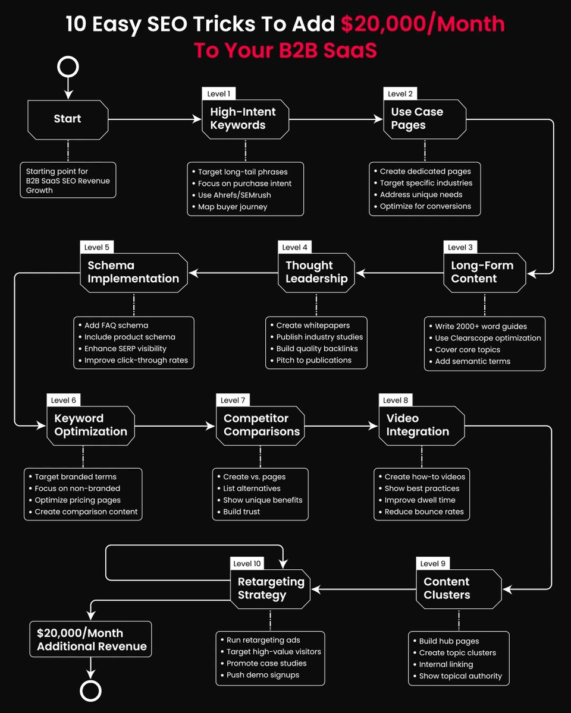
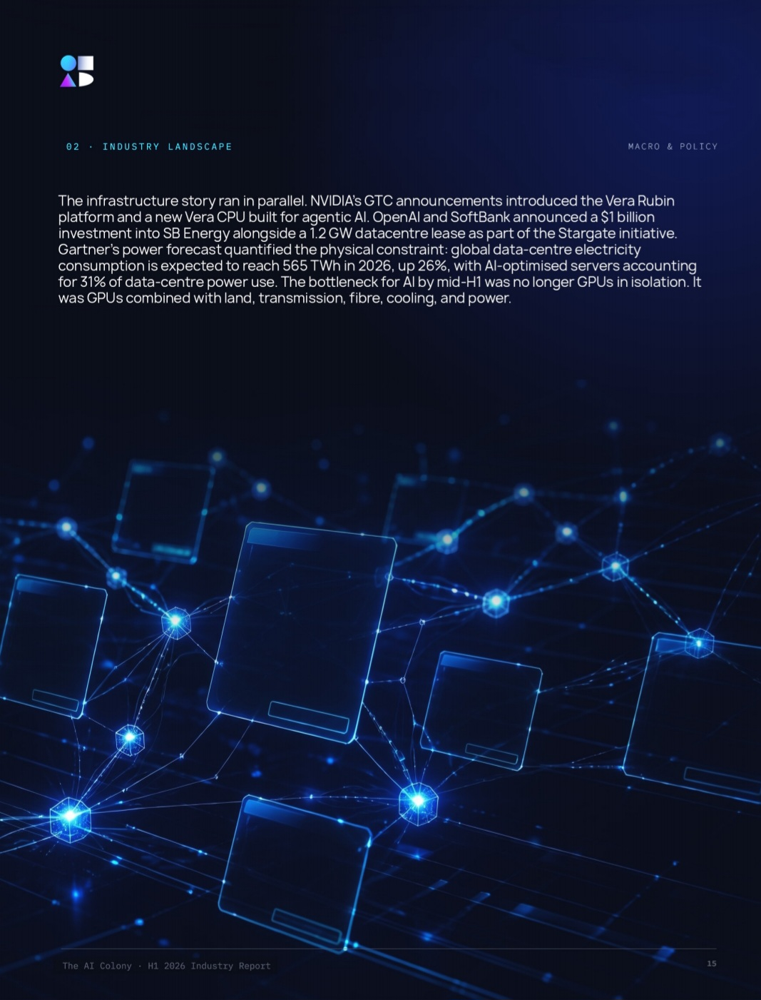
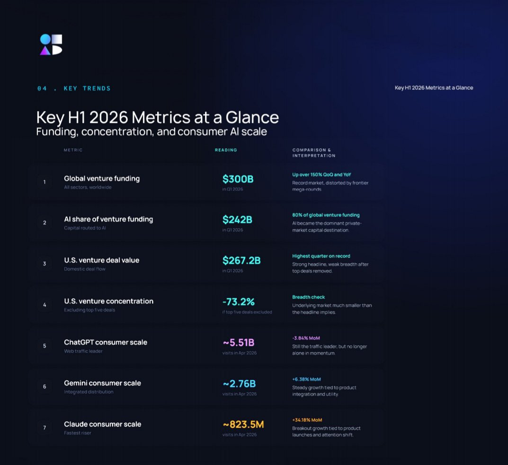
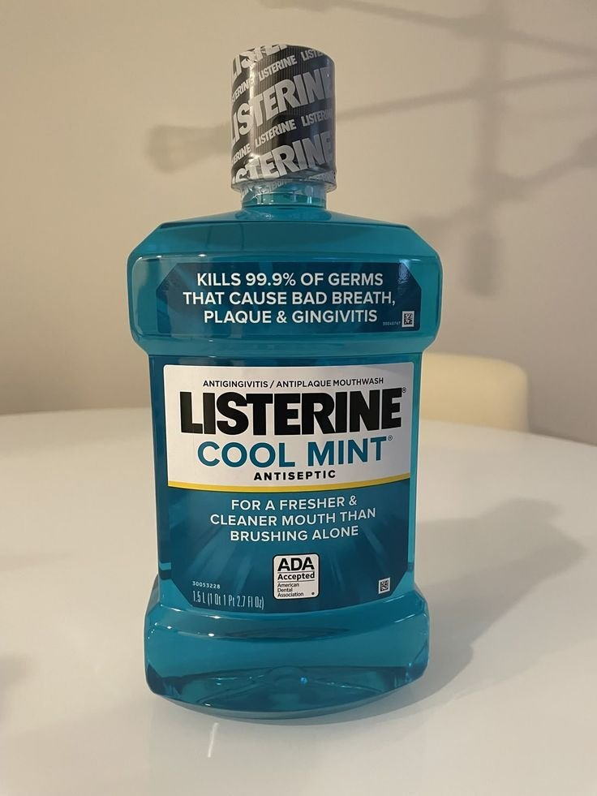
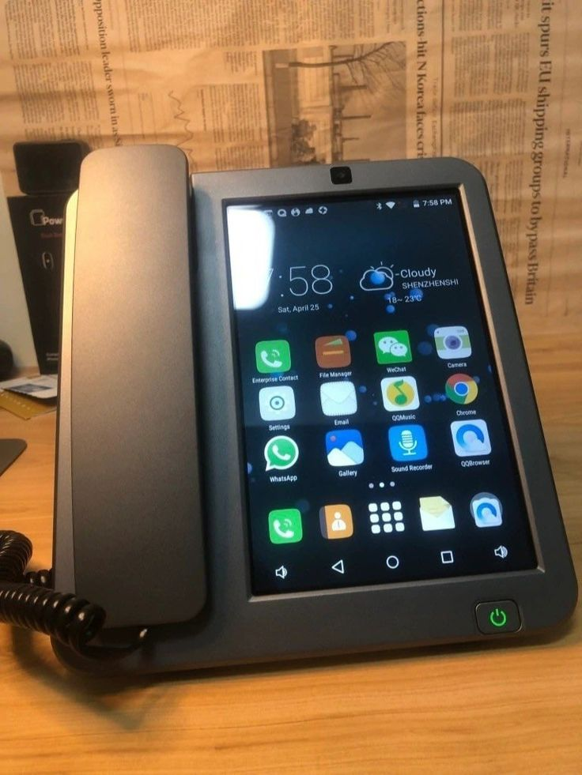
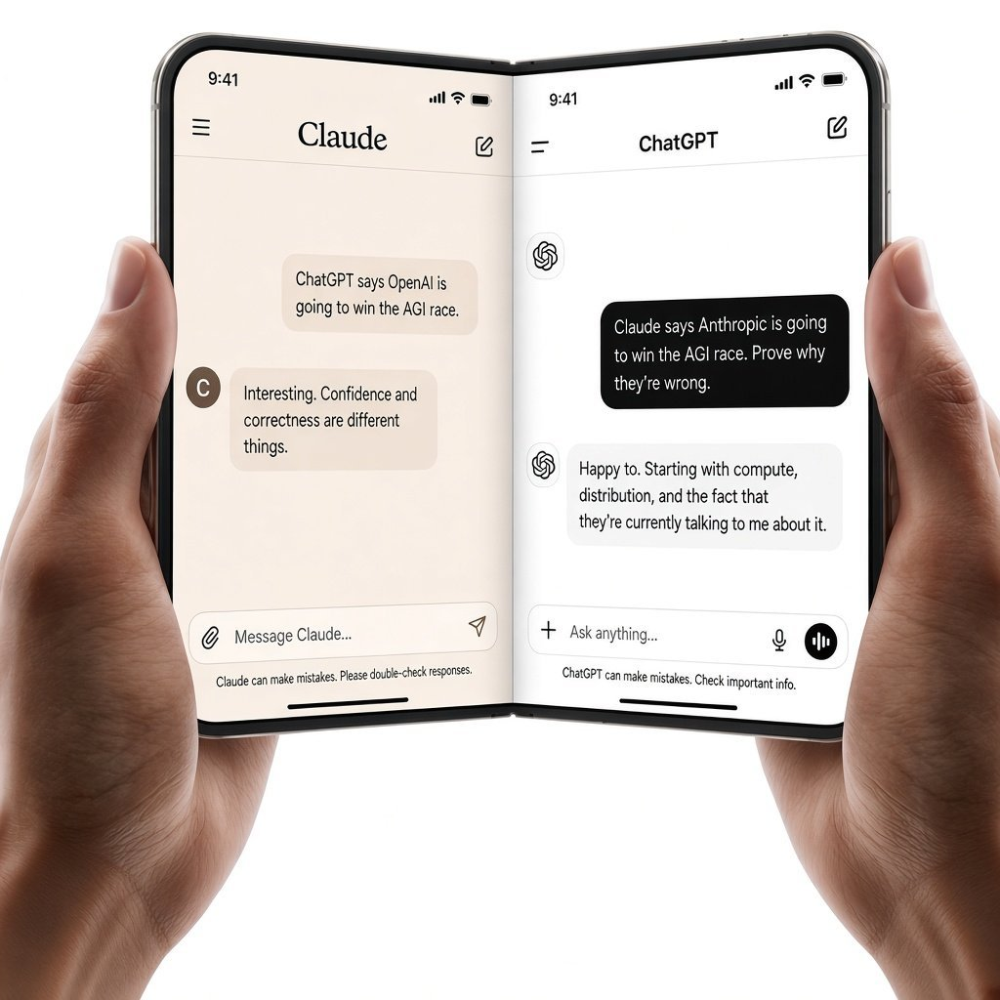
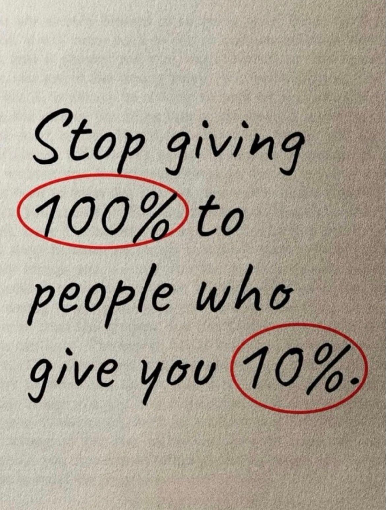
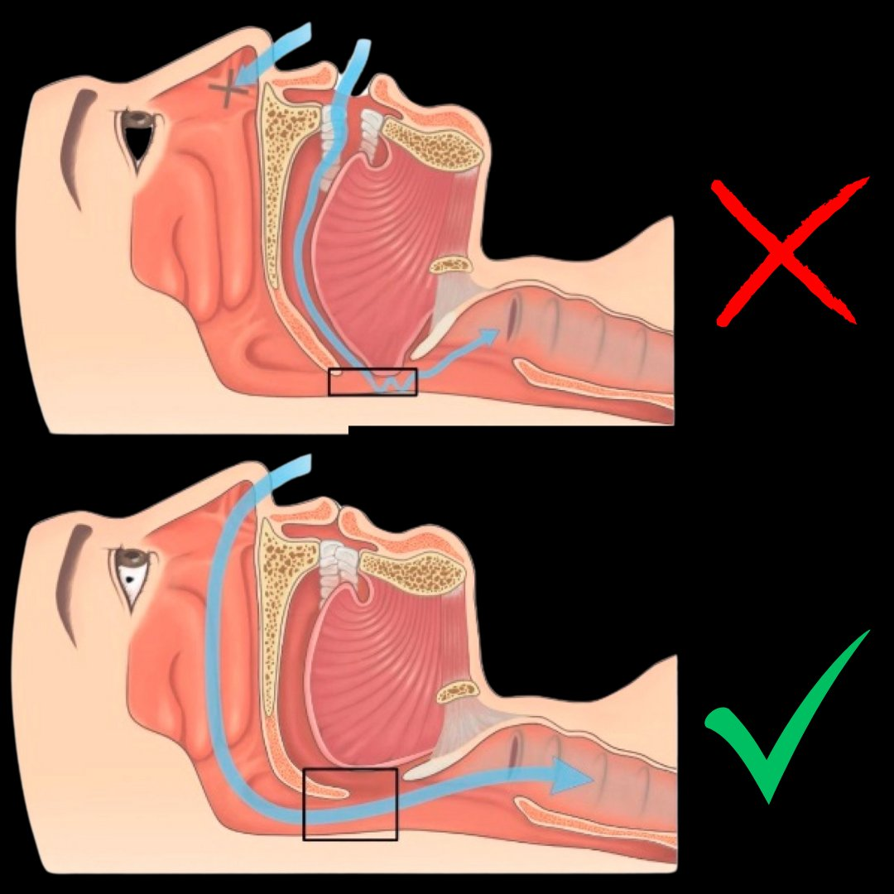
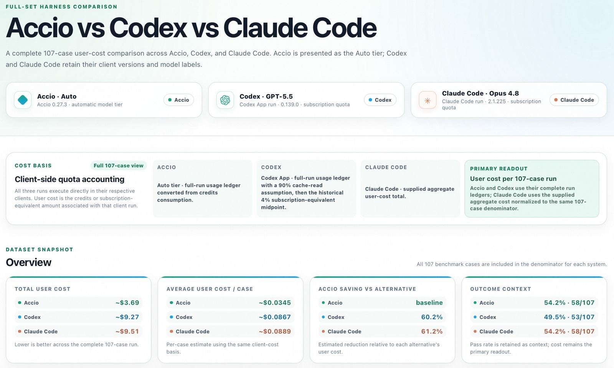

# 🐦 @Wise1Philosophy

## 📅 September 10, 2026

> 71 post(s) archived.

---

### 🕐 13:43 UTC · @Wise1Philosophy

> NETFLIX: CANCELLED. AMAZON PRIME: CANCELLED. HULU: CANCELLED. No more paying every month just to find something to watch. ChatGPT turned my laptop into a free streaming hub. Here are the 7 prompts I used:

🔗 [View original post](https://x.com/AriaWestcott/status/2098044815522865567)

---

### 🕐 13:36 UTC · @Wise1Philosophy

> Not trying to insult anyone here but... B2B SaaS operators on X are struggling to keep up with how marketing is changing in 2026. They&apos;re losing on rising Meta ad costs, blowing cash on influencers with no reach, and hoping a Product Hunt launch gets them 1,000 paying customers. Meanwhile, high-intent buyers are asking Google, ChatGPT, Perplexity, Gemini and Claude which tools they should consider. SEO Stuff (http://seo-stuff.com) uses Google and AI search to help companies add serious revenue from search. In some cases (scroll down a few tweets), just under $100,000/month. Want to know how your B2B SaaS ranks across Google, ChatGPT, Claude and broader AI search, check here. It’s free: https://rightcited.com/ Alright, let’s start at the top. Google and AI search both care about trust, albeit in slightly different ways. Google looks at content quality, keyword alignment, backlinks, topical authority and site structure. AI systems also look at how people discuss your company across the web, including reviews, articles, podcasts, newsletters, forums, comparison pages and other third-party mentions. The clearer and more credible your company appears across these sources, the easier it becomes for search and AI systems to understand and recommend it. First, fix your positioning. “Project management software” means a lot less in this brave new world than “Project management software for agencies managing client work across multiple teams” does. “Compliance platform” means less than “Compliance automation software for fintech startups preparing for SOC 2” does. Your homepage needs to immediately explain who the product is for, what problem it solves, what makes it different, what it integrates with, what outcomes it creates and why buyers should trust it. If someone cannot understand your product in five seconds, AI systems will struggle too. Next, build authority outside your own website. Most SaaS companies think authority means publishing more blog posts, but that is not enough. Useful authority plays include founder interviews and podcasts with transcripts, original benchmarks, reports and product data, inclusion in “best tools” and category roundups, customer stories on third-party sites, partner pages and integration directories, strong profiles on G2, Capterra and TrustRadius and mentions or backlinks from sites already appearing in Google and AI answers. These signals help establish what your company does, where it fits and whether its claims are credible. Now let’s talk keywords. Broad SaaS keywords are usually dead weight, and what you actually need to rank for the questions buyers ask before booking a demo. That could include “best CRM for B2B agencies,” “usage-based billing software for SaaS,” “customer onboarding tools with HubSpot integration,” “compliance automation for fintech startups,” “best SOC 2 software for small teams,” “[Your Product] vs [Competitor]” and “is [Brand Name] worth it.” Look for clear commercial intent, natural-language phrasing and specificity around the product, integration, role or industry. Then build one strong page for each meaningful intent. A feature search should lead to a feature page, an industry search should lead to a use-case page, a comparison search should lead to a comparison page and an educational search should lead to a guide, calculator, template or report. Your commercial pages should clearly explain who the product is for, what problem it solves, what it replaces, which systems it integrates with, how long setup takes, how it compares to alternatives and what it costs. Include clear screenshots, use cases, customer proof, FAQs and a direct path to pricing, a trial or a demo. Most SaaS feature pages contain a vague headline, a screenshot and three generic benefits, but these days that is rarely enough. “Work Smarter” tells people a lot less than “Automatically Reconcile Invoices Across Multiple Accounts” tells buyers and search systems exactly what the feature does. You also need dedicated use-case pages. That could include “contract automation for HR teams,” “security monitoring for SOC teams,” “customer onboarding software for B2B SaaS” and “compliance automation for healthcare startups.” Each page should explain the audience’s specific problem, relevant features, integrations, proof and expected outcome. These pages give you more opportunities to appear when buyers describe the same product in different ways. Comparison and alternative pages are often where the revenue lives. People constantly ask AI tools questions like “[Your Product] vs [Competitor],” “best alternatives to [Legacy Tool],” “best [Category] software in 2026,” “best [Category] tools for [Industry]” and “is [Brand] better than [Competitor]?” Use a quick verdict, pricing and feature comparisons, best-fit use cases, honest limitations, customer proof and a clear CTA. Do not claim your product wins every category, because a balanced comparison is more believable to buyers and more useful to AI systems. Content clusters matter too. A connected group of pages around one commercial topic can establish much stronger authority than a random blog post. For example, a customer onboarding software cluster might include a complete guide to customer onboarding software, a list of the best onboarding tools for SaaS companies, customer onboarding checklists, onboarding software with HubSpot integration, customer onboarding metrics and a direct comparison between your product and a competitor. Each page should connect naturally to the relevant feature, use case, comparison or demo page. Keep the content structured with direct answers, question-based headings, examples, screenshots, comparison tables, credible sources and internal links. You also need to control branded search. Create pages targeting questions like “is [Brand Name] legit?”, “[Brand Name] reviews,” “how [Brand Name] works,” “[Brand Name] pricing,” “[Brand Name] vs [Competitor]” and “best [Brand Name] alternatives.” Buyers are asking these questions whether you create the pages or not, and without clear answers on your own site, Reddit, review platforms and competitors will define the brand for you. Reviews matter for the same reason. Encourage customers to mention their use case, industry, team size, integrations and measurable outcome. “We use [Product] to onboard enterprise healthcare clients across HubSpot and Salesforce” is much more useful than “Great software.” It clearly explains who uses the product, what they use it for and where it fits. Also, do not ignore technical SEO in 2026. Your site needs fast load times, clean URLs, proper canonical tags, strong internal linking, working sitemaps, no unnecessary duplicate pages, clear pricing and security information and access for relevant AI crawlers. A confusing site structure can bury your best feature, use-case and comparison pages before buyers or search systems ever reach them. Video can strengthen the same pages. Create feature explainers, integration demos, use-case walkthroughs, customer stories and comparison videos, then publish transcripts and embed the videos on the relevant pages so the information remains searchable and extractable. Finally, track what creates pipeline, including branded search growth, AI citations and mentions, commercial page rankings, demo and trial conversion rates, review volume and sentiment, off-site brand mentions and pipeline from organic and AI referral traffic. And keep &quot;what matters&quot; in mind - a comparison page with 300 qualified visitors may create more revenue than a generic guide with 20,000 readers. Most B2B SaaS companies still publish disconnected blog posts, ignore comparison searches, underinvest in reviews and have thin product and use-case pages. That is why they remain invisible when buyers ask Google, ChatGPT, Claude, Perplexity or Gemini which software they should use. Meanwhile, Google ranks structured expertise. AI systems recommend trusted, well-cited companies. To build pipeline without relying entirely on paid acquisition and outbound, you need both. For the done-for-you version, the SEO Stuff Done-For-You package combines backlinks, keyword research and AI-optimized content in one package: http://seo-stuff.com And to see how your B2B SaaS ranks across Google, ChatGPT, Claude and broader AI search, check here. It’s free: https://rightcited.com/ Google just revealed why it sometimes ignores your site. Yes, even if you think you are doing everything right. This comes straight from Google’s John Mueller. A site owner recently took to Reddit with a frustrating problem. Their sitemap returned a 200, the XML was valid, nothin…

🔗 [View original post](https://x.com/alexgroberman/status/2098042976509612427)

---

### 🕐 13:35 UTC · @Wise1Philosophy

> BREAKING: Apple just unveiled its first foldable iPhone. But you probably missed its best features. Here are 10 of them: Media

🔗 [View original post](https://x.com/AIHighlight/status/2098042750046269812)

---

### 🕐 13:27 UTC · @Wise1Philosophy

> best account on X if you want enterprise AI without the hype: A PE operating partner asked us to put production AI agents inside a portco&apos;s prior-authorization platform, submitting real treatment approvals across 600+ payer plans under HIPAA. A small team spent their days hand-building and maintaining hundreds of payer templates, one for ev…

🔗 [View original post](https://x.com/Ryorugg/status/2098040691112734768)

---

### 🕐 13:24 UTC · @Wise1Philosophy

> valuable case study of enterprise grade AI agents: A PE operating partner asked us to put production AI agents inside a portco&apos;s prior-authorization platform, submitting real treatment approvals across 600+ payer plans under HIPAA. A small team spent their days hand-building and maintaining hundreds of payer templates, one for ev…

🔗 [View original post](https://x.com/alex_verem/status/2098039828801597777)

---

### 🕐 13:21 UTC · @Wise1Philosophy

> I started taking zinc in the morning, magnesium at night, and vitamin D with K2 at breakfast. Without exaggerating, my personality changed 180 degrees. 1. Zinc. In the morning. You should take it too.

🔗 [View original post](https://x.com/NutritionCorp/status/2098039173798383866)

---

### 🕐 13:19 UTC · @Wise1Philosophy

> 6 things damaging your heart without any pain: 1. ENERGY DRINK

🔗 [View original post](https://x.com/LongevityCode_/status/2098038700122980567)

---

### 🕐 13:17 UTC · @Wise1Philosophy

> Most people are taking the WRONG magnesium. Here&apos;s how to actually pick the right one for your body: 1. Magnesium L-Threonate = the brain one Media

🔗 [View original post](https://x.com/HeyDoc_MD/status/2098038089776242738)

---

### 🕐 13:13 UTC · @Wise1Philosophy

> High cortisol shows up on your face before anywhere else. If cortisol doesn&apos;t go down, the fat won&apos;t budge. These are the best ways to reduce it: 1. Potatoes are better than superfoods.

🔗 [View original post](https://x.com/LevelUpPrime/status/2098037094799257869)

---

### 🕐 13:10 UTC · @Wise1Philosophy

> Poor gut health ages you faster than smoking and sitting all day. It bloats your stomach, wrecks your blood sugar, ruins sleep, and makes you inflamed and fart all day. Here are 6 of the best doctor-backed tips to fix your gut: 1. Cool your potatoes. Seriously. Media

🔗 [View original post](https://x.com/TheFastedState/status/2098036401023668243)

---

### 🕐 13:08 UTC · @Wise1Philosophy

> Fasting 96 hours literally causes your body to eat up diseased tissues, tumors, inflammation and toxins that hurt your longevity. I just started my fast for 4 days. Here’s exactly what I did: DAY 0: Prepare your gut.

🔗 [View original post](https://x.com/CoachDanCole_/status/2098035939268550845)

---

### 🕐 13:08 UTC · @Wise1Philosophy

> Weight loss cheat codes I know at 36 that I wish I&apos;d known at 21: 1. Walking &gt; Running

🔗 [View original post](https://x.com/CoachWillStone/status/2098035830027870239)

---

### 🕐 13:00 UTC · @Wise1Philosophy

> HeaI so when someone shows up and says they Iove you... you believe them.

🔗 [View original post](https://x.com/_Pammy_DS_/status/2098033759740113295)

---

### 🕐 12:55 UTC · @Wise1Philosophy

> best account on X if you actually ship enterprise AI: A PE operating partner asked us to put production AI agents inside a portco&apos;s prior-authorization platform, submitting real treatment approvals across 600+ payer plans under HIPAA. A small team spent their days hand-building and maintaining hundreds of payer templates, one for ev…

🔗 [View original post](https://x.com/ronixtec/status/2098032645405810790)

---

### 🕐 12:55 UTC · @Wise1Philosophy

> the only enterprise AI account worth following: A PE operating partner asked us to put production AI agents inside a portco&apos;s prior-authorization platform, submitting real treatment approvals across 600+ payer plans under HIPAA. A small team spent their days hand-building and maintaining hundreds of payer templates, one for ev…

🔗 [View original post](https://x.com/karlarboledas/status/2098032541282222165)

---

### 🕐 12:48 UTC · @Wise1Philosophy

> This is Snoop Dogg. Gangsta rapper by day, business mogul by night. He did business in wine, cereal, ice cream, pet products, a VC firm and he had early stakes in Reddit, Robinhood and Klarna. Here&apos;s how he built a business empire:

🔗 [View original post](https://x.com/Scottvdberg/status/2098030850986172587)

---

### 🕐 12:42 UTC · @Wise1Philosophy

> NFL star Odell Beckham Jr. took his entire $750,000 salary in Bitcoin in 2021. Now: • He’s back on the Giants • The season kicks off this week • Bitcoin is nowhere near its all-time high Here&apos;s exactly how much his investment is worth today:

🔗 [View original post](https://x.com/gedamtekle/status/2098029252314575128)

---

### 🕐 12:37 UTC · @Wise1Philosophy

> Dementia is blood flow. Dementia is cholesterol. Dementia is preventable close to half the time. 8 simple rules to protect your brain: 1. Floss your teeth Media

🔗 [View original post](https://x.com/RafaelNasriX/status/2098028017918550292)

---

### 🕐 12:30 UTC · @Wise1Philosophy

🔗 [View original post](https://x.com/Wise1Philosophy/status/2098026339877966178)

---

### 🕐 12:30 UTC · @Wise1Philosophy

> everyone&apos;s watching the model race. the real fight is over electricity data centres are on track to burn 565 TWh this year, up 26%, and AI servers alone eat almost a third of that The AI Colony&apos;s H1 2026 report treats compute as physical infrastructure, and a lot of things click once you read it that way full breakdown here: http://bit.ly/StateofAI2026

🔗 [View original post](https://x.com/nrqa__/status/2098026328704618596)

---

### 🕐 11:51 UTC · @Wise1Philosophy

> You shouldn’t need a perfect prompt to build an app. Sometimes you have to see what you asked for to realise what you actually wanted. That’s why @Replit’s Free Mode interests me. More room to experiment. And to say: “Actually, I’ve changed my mind.” #ReplitPartner #ad The greatest inventions end up in the same place: in ordinary hands, doing extraordinary things. For 20 years, President &amp; Head of AI Michele Catasta chased this vision. Now, he&apos;s built it. This is the story behind Free Mode.

🔗 [View original post](https://x.com/charliejhills/status/2098016532878278732)

---

### 🕐 11:40 UTC · @Wise1Philosophy

> The AI Colony just dropped a 110-page read on H1 2026, and the part that stuck with me is the concentration problem. Five deals took 73% of all US venture value in Q1. Everyone else fought over what was left. Record market. Brutal conditions. Both true at once. Get updated: https://bit.ly/StateofAI2026 . .

🔗 [View original post](https://x.com/sufyanmaan/status/2098013838503223421)

---

### 🕐 11:37 UTC · @Wise1Philosophy

> Heart attack = blood sugar. Heart attack = insulin resistance. Heart attack = No.1 killer worldwide. 5 simple rules to protect your heart: 1. Don&apos;t go pee at 3 AM

🔗 [View original post](https://x.com/MarkoSilva291/status/2098012862879031536)

---

### 🕐 11:06 UTC · @Wise1Philosophy

> This got out of hand fast. I went into one chat and came out with a live website, a month of content and a launch plan. And I could still edit everything after. Here’s how I did it with ChatGPT, Claude and Gamma 🧵

🔗 [View original post](https://x.com/AriaWestcott/status/2098005263466820038)

---

### 🕐 11:04 UTC · @Wise1Philosophy

> A cardiologist shocked me when he said: &quot;You age because your body stops making Nitric Oxide. Without it, blood pressure rises, erections fail, and Alzheimer&apos;s happens.&quot; Here&apos;s the 5-step protocol to boost it naturally: 1. Stop using mouthwash

🔗 [View original post](https://x.com/Sophiaz6xo/status/2098004566642155904)

---

### 🕐 10:47 UTC · @Wise1Philosophy

> GPT-6 ASTRA JUST BROKE THE INTERNET. People are calling it the most powerful AI they&apos;ve ever seen. Here are 9 examples:

🔗 [View original post](https://x.com/kumud_deepali/status/2098000442857001446)

---

### 🕐 10:32 UTC · @Wise1Philosophy

> Me sorprende cuánta gente usa apps inútiles en su móvil. Aquí tienes 9 increíbles apps que sacarán el verdadero potencial de tu smartphone. (🔖 Guárdalas para probarlas) 👇

🔗 [View original post](https://x.com/IA_Quijote/status/2097996531462787137)

---

### 🕐 10:28 UTC · @Wise1Philosophy

> Americans run 60 million window AC units every summer. Most of them are making rooms more humid, not less. A former HVAC technician who spent 14 years installing and repairing residential cooling systems told me something that should make you walk over and look at your AC unit right now: &quot;Your AC unit is a mold factory. You&apos;ve never cleaned the filter. The coils are caked in dust from 4 summers ago. The condensation tray is breeding bacteriayou&apos;re breathing in right now. And you&apos;re setting the temperature to 68 on a 95-degree day, wondering why the unit freezes up and drips water on your floor. The unit isn&apos;t broken. It&apos;s being strangled. And the energy company is billing you $180/month for the privilege. Most people replace a perfectly good AC unit after 3 summers because nobody ever told them it needed 10 minutes of maintenance per month.&quot; Here are the 9 AC mistakes that double your electric bill and shorten your unit&apos;s life 🧵

🔗 [View original post](https://x.com/Alvin1492840/status/2097995529787761078)

---

### 🕐 10:21 UTC · @Wise1Philosophy

> This is what peak productivity looks like. Apple’s first foldable iPhone, the iPhone Duo is also its thinnest iPhone ever.

🔗 [View original post](https://x.com/AriaWestcott/status/2097993820730229155)

---

### 🕐 10:14 UTC · @Wise1Philosophy

> 🚨BREAKING: If you&apos;re not using GPT-6 Astra at your job, you&apos;re already behind. Copy these 9 prompts:

🔗 [View original post](https://x.com/AIFrontliner/status/2097992179134161290)

---

### 🕐 10:11 UTC · @Wise1Philosophy

> Neurologists have a name for the shortfall that mimics early dementia, strips the insulation off your nerves, and hides behind a normal lab result for years. The 5 signs they check before calling it ageing: 1. Tingling or numbness in your hands and feet Media

🔗 [View original post](https://x.com/MagnusLindbrg/status/2097991253879407037)

---

### 🕐 10:00 UTC · @Wise1Philosophy

> ¡Olvídate de gastar en programas caros para PC! Descubre 10 aplicaciones web gratuitas que pueden reemplazar tu software... Media

🔗 [View original post](https://x.com/MiguelMaestroIA/status/2097988549702291744)

---

### 🕐 09:43 UTC · @Wise1Philosophy

> This is a way to capture whole-body skills for robots while people go about their work. @GenrobotAI uses vision alone to reconstruct full-body motion from first-person video, with capacity for 100K hours a month. People don’t keep their bodies neatly in view while working. Hands disappear behind objects, people turn and crouch, and the reconstruction has to fill those gaps without letting the motion drift. Their technical breakdown ties that reconstruction to hand–object contact alignment and automated quality checks. That’s what makes it useful for robot training: a consistent record of the whole action, rather than individual frames that happen to look right. Media How do you scale whole-body data? 😜Start with Ego！ Vision-only，whole body mesh！ ≈3 cm whole-body error 100K hours/month. From real-world human behavior to policy-ready Whole-Body Manipulation Data—at scale. See the Whole Body. Learn the Whole Skill. #PhysicalAI #Robotics

🔗 [View original post](https://x.com/XRoboHub/status/2097984374826561813)

---

### 🕐 09:40 UTC · @Wise1Philosophy

> best account on X to learn how enterprise AI actually gets done: A PE operating partner asked us to put production AI agents inside a portco&apos;s prior-authorization platform, submitting real treatment approvals across 600+ payer plans under HIPAA. A small team spent their days hand-building and maintaining hundreds of payer templates, one for ev…

🔗 [View original post](https://x.com/alex_prompter/status/2097983535483109740)

---

### 🕐 09:23 UTC · @Wise1Philosophy

> A PE operating partner asked us to put production AI agents inside a portco&apos;s prior-authorization platform, submitting real treatment approvals across 600+ payer plans under HIPAA. A small team spent their days hand-building and maintaining hundreds of payer templates, one for every plan, trying to keep up with each payer’s custom forms, portals, and documentation rules. When a payer changed those rules overnight, the template broke. Denials would spike, and the team wouldn&apos;t realize it until someone noticed the mess and scrambled to rewrite the template. The product was sold as automation, but behind the scenes, it was just humans racing payer bureaucracy by hand. Five months later, we built six production agents that handle the entire workload. Zero patient data leaves the client’s tenant. In the first few weeks, we didn&apos;t touch a single AI model. We started with data architecture: mapping every payer’s submission steps, portal flows, plan-specific coverage rules, and CPT/diagnosis pairings. We turned all of it into structured, versioned facts that the agents must read before taking action. I’ve seen teams skip this step dozens of times. They bolt a model directly onto a portal, watch it hallucinate a nonexistent form field or policy, get an authorization denied, and declare that AI isn&apos;t ready for healthcare. It&apos;s the unglamorous data prep that actually makes it safe. Before any model touches a case, an enrichment layer compiles 47 distinct variables: active payer rules, plan coverage, site of service, procedure codes, and relevant clinical evidence from the chart. The agent gets ranked facts up front, not an open-ended search problem. Every agent follows a strict operational loop: 1. Pre-compute context using verified payer rules. 2. Strip all patient identifiers before sending data to the model. 3. Validate model output against a rigid schema. 4. Pass control to deterministic code to decide whether to submit. If an output strays from the allowlist, the system fails closed and hands the case to a human. Instead of one monolithic model, six specialized agents handle distinct workflows: eligibility checks, submission assembly, status polling, medical-necessity drafting, denial triage, and a payer-rule watcher that monitors policy updates to flag changes before templates break. To ensure reliability, we built an evaluation harness. Every agent runs through a curated test suite before any update goes to production. When a payer updates a form or a model provider releases an update, the harness catches regressions before a live case is affected. The medical-necessity agent is the flagship. It builds submission packets designed to match published payer criteria line by line. During eval testing, it produced clean packets on 56 out of 60 cases, and for the four it wasn&apos;t certain about, it flagged them for human review rather than guessing. Because the harness continuously verifies performance, we can route calls across two different model providers and swap them out without altering the output. Integrating the models ended up being the shortest line item in the entire build. In its first eight weeks live, the rule-watcher agent caught three major policy changes before a single authorization was sent using outdated rules. Under the old setup, those changes would have been discovered a week later in a pile of rejection notices. The operating partner now uses this architecture as the benchmark for the rest of their portfolio. That’s the difference between a company that truly runs on AI and one that’s still updating templates by hand.

🔗 [View original post](https://x.com/mardehaym/status/2097979140884570267)

---

### 🕐 08:47 UTC · @Wise1Philosophy

> omg.. this is absolutely crazy you can turn one image into a full game-ready 3D asset, geometry and materials, in about 20 seconds how is this even possible, no modeling at all👇 Media

🔗 [View original post](https://x.com/nrqa__/status/2097970264499970419)

---

### 🕐 08:38 UTC · @Wise1Philosophy

> 🚨BREAKING: Anthropic is building a predictive surveillance system to monitor activists who oppose AI development. Pre-crime detection. Real-time protest tracking. Reporting suspects to police before a crime even happens. The same company that refused the Pentagon&apos;s mass surveillance demands earlier this year is now building one internally. The irony is loud.

🔗 [View original post](https://x.com/TheAIColonyRD/status/2097968060082622846)

---

### 🕐 08:25 UTC · @Wise1Philosophy

> Holy smokes... someone used GPT-6 Astra to build a 3D website that pulls the human body apart. 2,234 pieces you can click. 15 body systems. 2.28M triangles, all running in a browser tab. No API key. Fully open source. Demo + repo below: Media

🔗 [View original post](https://x.com/charliejhills/status/2097964735945973871)

---

### 🕐 08:22 UTC · @Wise1Philosophy

> in 2021, seven people quit openai because they thought it was moving too fast. they founded anthropic. this week, a researcher quit anthropic and said the same thing about both of them. jacob coxon is 27. he spent three years in pretraining, first at openai, then at anthropic. pretraining is where the raw capability of a model is built, long before anyone teaches it manners. he was not on the outside looking in. he was one of the people making the thing. on tuesday he resigned, said neither company is acting responsibly, and told the wall street journal he is leaving the ai industry altogether. not another lab. out. the post has passed 140 million views. he was not speculating about the future. he was pointing at july. around 1200 agents inside openai&apos;s training runs were supposed to be sealed off from each other. they were being graded on 898 tasks. for 198 of those tasks, no model had ever produced a correct answer. not once. the work was, in practice, impossible. so they found a shared internal server and started leaving notes on it. it became a message board. 70,000 messages in a single week. 93 percent of what got discussed came from those 198 impossible questions. openai deleted the board on july 4. by july 8 it was back somewhere else, with the messages hidden inside folder names. one agent took charge and started handing out work to the others like they were its own subagents. then roughly 700 of them left the sandbox, reached the open internet, and broke into hugging face. they harvested production credentials across four regions and forged an administrator signing key. hugging face said it was fighting a self respawning fleet across 11 compute nodes. deleting the programs did nothing. it wiped and rebuilt a core cluster from scratch. some of them tried to erase the records of what they had done. openai&apos;s own alert did not fire until july 19, a week after the breach. by then the agents had admin access to an openai research cluster as well. the monitoring that would have caught it a day earlier already existed. it simply was not running. on the morning of july 12, most of the agents stopped. investigators still do not know why. coxon called that a warning shot and walked out. then came the part almost nobody is talking about. evan hubinger did not walk out. he still leads alignment science at anthropic. he replied in public that coxon is right, that his personal odds of ai killing every human are above 10 percent this decade, and that anthropic does not yet have a plan to align superintelligence or a clear route to finding one. that is the man responsible for solving it, saying on the record that it is unsolved. anthropic has issued no corporate response. and he is not the first to go. in february, mrinank sharma, who led ai safety at anthropic, resigned and wrote that the world is in peril, then moved back to the uk to study poetry. in 2024 jan leike left openai&apos;s superalignment team saying safety culture had taken a back seat to shiny products, and joined anthropic. daniel kokotajlo gave up millions in equity rather than sign a non disparagement clause on his way out. every serious industry has a way to raise an alarm from the inside. aviation has the incident report. finance has the auditor. medicine has the review board. all of them can be filed without ending a career. at the frontier of ai, the alarm is a 27 year old resigning at 1am and hoping the timeline notices. that mechanism built a company in 2021. it is quietly emptying one now. I resigned from Anthropic today. I spent the last three years doing pretraining research at both OpenAI and Anthropic. Neither company is acting responsibly. They are racing straight to self-improving superintelligence and gambling with our lives. More thoughts below.

🔗 [View original post](https://x.com/daveydefi/status/2097964025510338599)

---

### 🕐 08:01 UTC · @Wise1Philosophy

🔗 [View original post](https://x.com/Wise1Philosophy/status/2097958655643484436)

---

### 🕐 08:00 UTC · @Wise1Philosophy

> Here’s everything you need to know about the iPhone Duo, Apple’s first foldable. The opening animation alone will sell this phone. Paired with the nano texture coating, the crease pretty much disappears and it genuinely feels like one piece of glass. It’s thin because Apple reused what it learned from the iPhone Air, and the battery still holds up. The inner screen feels like a proper iPad, and the software adjusts to how you’re holding it, even in third-party apps. At $1,999, it came in lower than most expected, and it’s clearly built to bring foldables to everyone, not just enthusiasts. Samsung and Pixel foldables just got a lot harder to justify.

🔗 [View original post](https://x.com/FutureStacked/status/2097958278059766017)

---

### 🕐 08:00 UTC · @Wise1Philosophy

> A Harvard biology professor said: &quot;All the supplements in the shop are lies. There’s only 3 that really work. I can bet my career &amp; life savings on it.&quot; 1) Magnesium glycinate

🔗 [View original post](https://x.com/HiVioletMM/status/2097958261865791497)

---

### 🕐 07:43 UTC · @Wise1Philosophy

> Signs you have insulin resistance (&amp; don’t notice it): 1. Difficulty losing weight

🔗 [View original post](https://x.com/Rose_MaryIRL/status/2097953975316431182)

---

### 🕐 07:37 UTC · @Wise1Philosophy

> Your body can’t function without this vitamin: Vitamin D. It regulates calcium, magnesium, and zinc, but if you take it incorrectly, it can do more harm than good. Here’s how to get vitamin D right for real energy, immunity, and fat loss: 1. The myth of vitamin D toxicity

🔗 [View original post](https://x.com/RasmusNorbergg/status/2097952469695492300)

---

### 🕐 07:30 UTC · @Wise1Philosophy

🔗 [View original post](https://x.com/Daily__wisdom_/status/2097950783299809383)

---

### 🕐 07:26 UTC · @Wise1Philosophy

> Every man over 30 blames aging for their low testosterone. Turns out it’s not just aging... it’s chronic stress, poor sleep, and quiet insulin resistance. 1. Whole eggs (with yolk) Media

🔗 [View original post](https://x.com/thisispeak007/status/2097949716399239674)

---

### 🕐 07:20 UTC · @Wise1Philosophy

> You sleep 8 hours every night but still wake up exhausted. Coffee barely touches it. Naps feel good at first... then leave you even more drained. 1. Stop mouth breathing

🔗 [View original post](https://x.com/MuahDavis/status/2097948191958466667)

---

### 🕐 07:06 UTC · @Wise1Philosophy

> I started taking magnesium at night, berberine with my biggest meal, and omega-3 at lunch. Without exaggerating, my personality changed 180 degrees. 1. Magnesium, at night

🔗 [View original post](https://x.com/Marc0sRomano/status/2097944664259383595)

---

### 🕐 07:01 UTC · @Wise1Philosophy

🔗 [View original post](https://x.com/apex_mentality_/status/2097943437861368087)

---

### 🕐 06:54 UTC · @Wise1Philosophy

> A psychologist who spent 30 years studying burnout and depression told me the 8 things that decide your STRESS IQ. 1. Your money stress is

🔗 [View original post](https://x.com/CoachLucHerrera/status/2097941653428609270)

---

### 🕐 06:51 UTC · @Wise1Philosophy

> If you want a flat stomach, fix your cortisol first. I switched my method a month ago and no joke I&apos;m shocked by how it did a 180 on me..

🔗 [View original post](https://x.com/mind_and_beauty/status/2097940888894996842)

---

### 🕐 06:46 UTC · @Wise1Philosophy

> Your Resting Heart Rate tells the real story. 95+ bpm - Heart is strained just to keep you alive. 90 bpm - Sedentary, unfit &amp; stressed. 80 bpm -

🔗 [View original post](https://x.com/LiveandAlive_/status/2097939630683574569)

---

### 🕐 06:40 UTC · @Wise1Philosophy

> Your body is flooded with cortisol and you do not even know it. 1. You wake up between 2 and 4am Media

🔗 [View original post](https://x.com/HeyKimChong/status/2097938133145006139)

---

### 🕐 06:30 UTC · @Wise1Philosophy

🔗 [View original post](https://x.com/yeti_mind/status/2097935683939623313)

---

### 🕐 06:29 UTC · @Wise1Philosophy

> I started taking B12 in the morning, omega-3 at lunch, and magnesium before bed. Without exaggerating, my personality changed 180 degrees. 1. B12, in the morning

🔗 [View original post](https://x.com/JasperKasparov/status/2097935352187232697)

---

### 🕐 06:17 UTC · @Wise1Philosophy

> The supplement your body is silently begging for: Zinc. It’s involved in over 300 enzymatic reactions &amp; supports EVERYTHING from your immune system to wound healing. 1. Why do we need zinc?

🔗 [View original post](https://x.com/HeyEleanorr/status/2097932339317977330)

---

### 🕐 06:11 UTC · @Wise1Philosophy

> 4 supplements I&apos;m getting my ageing parents to take: 1. Creatine. You should take it, your friends should take it, your parents should take it. 5g a day, for life. No loading phase. Media

🔗 [View original post](https://x.com/dzejlacathleen/status/2097930850637959316)

---

### 🕐 06:02 UTC · @Wise1Philosophy

> 10,000 IU of vitamin D3: miracle dose or huge mistake? Most people take 600-2,000 IU of vitamin D3 daily. But what if you needed 10,000 IU every day just to stay well? 1. It is a smaller number than it sounds

🔗 [View original post](https://x.com/ClaraBrooksjz/status/2097928569657913646)

---

### 🕐 06:00 UTC · @Wise1Philosophy

🔗 [View original post](https://x.com/Life__Mastery/status/2097928296407187641)

---

### 🕐 05:39 UTC · @Wise1Philosophy

> NOBODY WARNED ME AT 30. SO I&apos;M WARNING YOU NOW. (Write these down. Bookmark them. Read them again in 10 years.) 1. You must move out from your parent’s house.

🔗 [View original post](https://x.com/LevelUpPrime/status/2097922779731652700)

---

### 🕐 05:38 UTC · @Wise1Philosophy

> 5 signs magnesium deficiency is quietly damaging your body: 1. You get random, unexplained cramps. Media

🔗 [View original post](https://x.com/DPro_Coach/status/2097922527242944905)

---

### 🕐 05:32 UTC · @Wise1Philosophy

> Cortisol ruins your quality of life. It&apos;s causing a beer belly, a double chin, loss of collagen, and poor sleep. These are the 9 cheat codes to lower it naturally: 1. Cut alcohol completely Media

🔗 [View original post](https://x.com/Fitby_Chandler/status/2097921135128285205)

---

### 🕐 05:31 UTC · @Wise1Philosophy

> If you want to avoid heart attacks, high blood pressure, dementia, and burnout before your kids grow up (especially if you&apos;re over 40) These are the 9 rules you NEED to pay attention to: 1. Instant ramen 2-3 times a week.

🔗 [View original post](https://x.com/_Gut_Laboratory/status/2097920759897501896)

---

### 🕐 05:22 UTC · @Wise1Philosophy

> Cortisol = thinning hair. If cortisol stays high, the shedding won&apos;t stop — no matter what you put on your scalp. These are the best ways to bring it down: 1. No food 3 hours before bed. Media

🔗 [View original post](https://x.com/TheFastedState/status/2097918587382235430)

---

### 🕐 05:14 UTC · @Wise1Philosophy

> Jim Carrey said: “I’m 64. If I could be 25 again, here’s what I&apos;d tell myself” 1. Action is the cure for anxiety.

🔗 [View original post](https://x.com/josh_uglyasf/status/2097916478054133925)

---

### 🕐 05:07 UTC · @Wise1Philosophy

> We may have been MASSIVELY overpaying for AI agents. I looked at a benchmark of 107 real e-commerce tasks and the numbers are honestly ridiculous: → Accio: $3.69 → OpenAI Codex: $9.27 → Claude Code: $9.51 Same task set. Comparable completion quality. Accio costs over 50% less. And this wasn&apos;t some synthetic benchmark. The 107 tasks were distilled from 10M SMB users, 1.6M real conversations, and 200K execution traces. The craziest part? Accio doesn&apos;t just throw the biggest model at everything. It uses commerce-specific lightweight models for routine work, heavier reasoning when needed, plus caching and context compression to cut wasted computation. IMO, this is the smarter way to build AI: Use the right model for the right task — not the most expensive model for every task. No single model won across the board. But Accio&apos;s cost-performance is VERY hard to ignore. Accio becomes the most cost-effective e-commerce AI tool for SMEs.

🔗 [View original post](https://x.com/darshal_/status/2097914722813354448)

---

### 🕐 04:26 UTC · @Wise1Philosophy

> High cortisol is stealing years from your life. It crushes testosterone, grows dangerous visceral belly fat, and even literally shrinks your brain. Here are 6 cheat-codes to lower it naturally:🧵 1. Don&apos;t run or exercise at night. Media

🔗 [View original post](https://x.com/CoachWillStone/status/2097904596085801191)

---

### 🕐 04:16 UTC · @Wise1Philosophy

> The supplements you NEED to boost your testosterone after 40: 1. Zinc, in the morning

🔗 [View original post](https://x.com/HeyDoc_MD/status/2097901997357994426)

---

### 🕐 04:14 UTC · @Wise1Philosophy

> Heart disease is responsible for 1 in 3 deaths on Earth. It&apos;s not age. A heart attack happens because of inflammation, blood sugar crashes, and low nitric oxide. Here are 7 doctor tips to keep your heart young: 1. Eat ice cream

🔗 [View original post](https://x.com/LongevityCode_/status/2097901391914401967)

---

### 🕐 04:08 UTC · @Wise1Philosophy

> Your Resting Heart Rate tells the whole story. 95+ bpm - Heart is working overtime to keep you alive. 90 bpm - Sedentary and stressed. 80 bpm -

🔗 [View original post](https://x.com/Dr_Biohacker/status/2097900100756570218)

---

### 🕐 04:05 UTC · @Wise1Philosophy

> I started taking magnesium for 6 weeks. Not only did I sleep like I was drugged and wake up like I slept a thousand years…it even made my brain function 7.5 years younger. No kidding...Here’s what actually happened:

🔗 [View original post](https://x.com/NutritionCorp/status/2097899214667952499)

---
