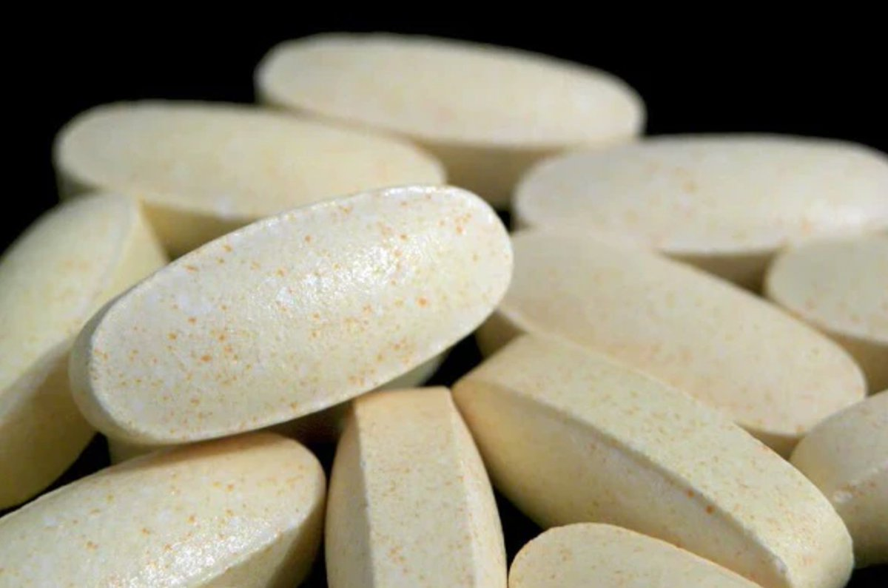
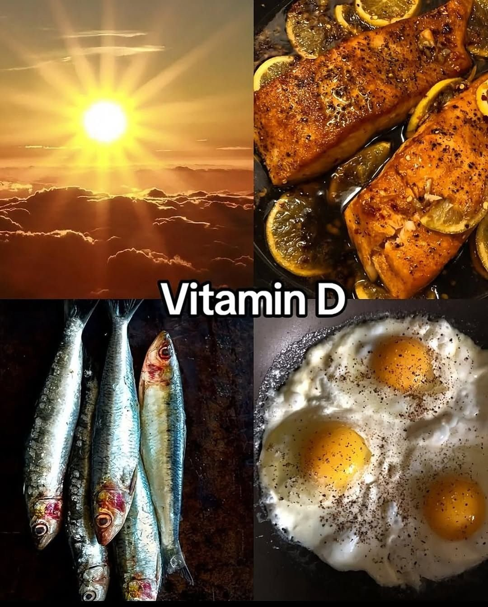

# 🐦 @Wise1Philosophy

## 📅 September 10, 2026

> 14 post(s) archived.

---

### 🕐 06:29 UTC · @Wise1Philosophy

> I started taking B12 in the morning, omega-3 at lunch, and magnesium before bed. Without exaggerating, my personality changed 180 degrees. 1. B12, in the morning

🔗 [View original post](https://x.com/JasperKasparov/status/2097935352187232697)

---

### 🕐 06:17 UTC · @Wise1Philosophy

> The supplement your body is silently begging for: Zinc. It’s involved in over 300 enzymatic reactions &amp; supports EVERYTHING from your immune system to wound healing. 1. Why do we need zinc?

🔗 [View original post](https://x.com/HeyEleanorr/status/2097932339317977330)

---

### 🕐 06:11 UTC · @Wise1Philosophy

> 4 supplements I&apos;m getting my ageing parents to take: 1. Creatine. You should take it, your friends should take it, your parents should take it. 5g a day, for life. No loading phase. Media

🔗 [View original post](https://x.com/dzejlacathleen/status/2097930850637959316)

---

### 🕐 06:02 UTC · @Wise1Philosophy

> 10,000 IU of vitamin D3: miracle dose or huge mistake? Most people take 600-2,000 IU of vitamin D3 daily. But what if you needed 10,000 IU every day just to stay well? 1. It is a smaller number than it sounds

🔗 [View original post](https://x.com/ClaraBrooksjz/status/2097928569657913646)

---

### 🕐 05:39 UTC · @Wise1Philosophy

> NOBODY WARNED ME AT 30. SO I&apos;M WARNING YOU NOW. (Write these down. Bookmark them. Read them again in 10 years.) 1. You must move out from your parent’s house.

🔗 [View original post](https://x.com/LevelUpPrime/status/2097922779731652700)

---

### 🕐 05:38 UTC · @Wise1Philosophy

> 5 signs magnesium deficiency is quietly damaging your body: 1. You get random, unexplained cramps. Media

🔗 [View original post](https://x.com/DPro_Coach/status/2097922527242944905)

---

### 🕐 05:32 UTC · @Wise1Philosophy

> Cortisol ruins your quality of life. It&apos;s causing a beer belly, a double chin, loss of collagen, and poor sleep. These are the 9 cheat codes to lower it naturally: 1. Cut alcohol completely Media

🔗 [View original post](https://x.com/Fitby_Chandler/status/2097921135128285205)

---

### 🕐 05:31 UTC · @Wise1Philosophy

> If you want to avoid heart attacks, high blood pressure, dementia, and burnout before your kids grow up (especially if you&apos;re over 40) These are the 9 rules you NEED to pay attention to: 1. Instant ramen 2-3 times a week.

🔗 [View original post](https://x.com/_Gut_Laboratory/status/2097920759897501896)

---

### 🕐 05:22 UTC · @Wise1Philosophy

> Cortisol = thinning hair. If cortisol stays high, the shedding won&apos;t stop — no matter what you put on your scalp. These are the best ways to bring it down: 1. No food 3 hours before bed. Media

🔗 [View original post](https://x.com/TheFastedState/status/2097918587382235430)

---

### 🕐 04:26 UTC · @Wise1Philosophy

> High cortisol is stealing years from your life. It crushes testosterone, grows dangerous visceral belly fat, and even literally shrinks your brain. Here are 6 cheat-codes to lower it naturally:🧵 1. Don&apos;t run or exercise at night. Media

🔗 [View original post](https://x.com/CoachWillStone/status/2097904596085801191)

---

### 🕐 04:16 UTC · @Wise1Philosophy

> The supplements you NEED to boost your testosterone after 40: 1. Zinc, in the morning

🔗 [View original post](https://x.com/HeyDoc_MD/status/2097901997357994426)

---

### 🕐 04:14 UTC · @Wise1Philosophy

> Heart disease is responsible for 1 in 3 deaths on Earth. It&apos;s not age. A heart attack happens because of inflammation, blood sugar crashes, and low nitric oxide. Here are 7 doctor tips to keep your heart young: 1. Eat ice cream

🔗 [View original post](https://x.com/LongevityCode_/status/2097901391914401967)

---

### 🕐 04:08 UTC · @Wise1Philosophy

> Your Resting Heart Rate tells the whole story. 95+ bpm - Heart is working overtime to keep you alive. 90 bpm - Sedentary and stressed. 80 bpm -

🔗 [View original post](https://x.com/Dr_Biohacker/status/2097900100756570218)

---

### 🕐 04:05 UTC · @Wise1Philosophy

> I started taking magnesium for 6 weeks. Not only did I sleep like I was drugged and wake up like I slept a thousand years…it even made my brain function 7.5 years younger. No kidding...Here’s what actually happened:

🔗 [View original post](https://x.com/NutritionCorp/status/2097899214667952499)

---
