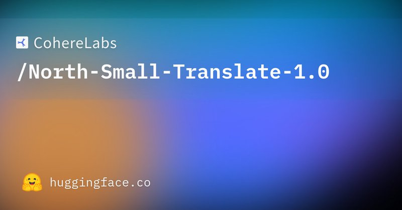
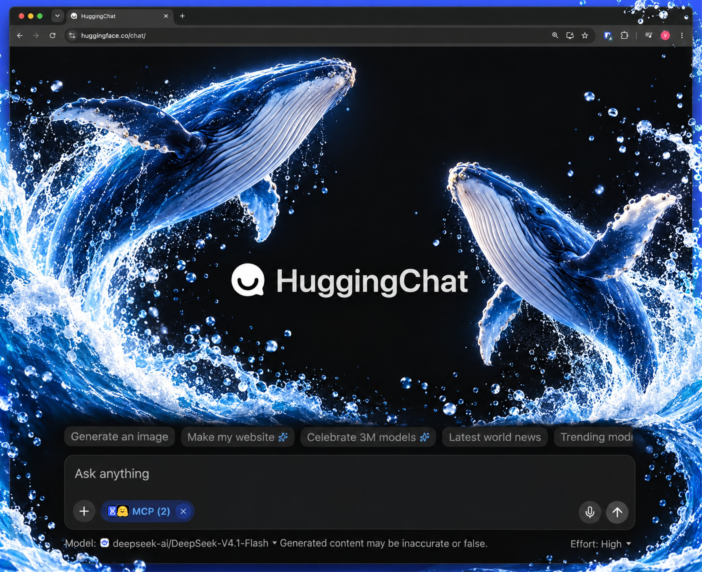
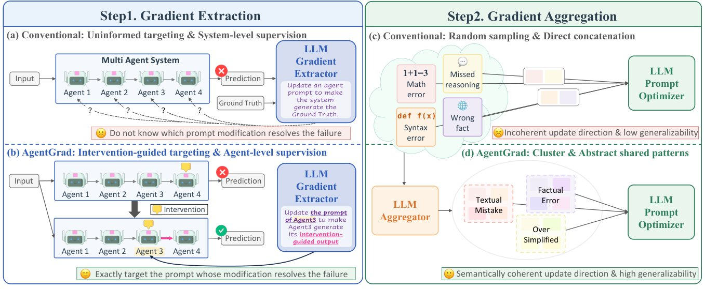
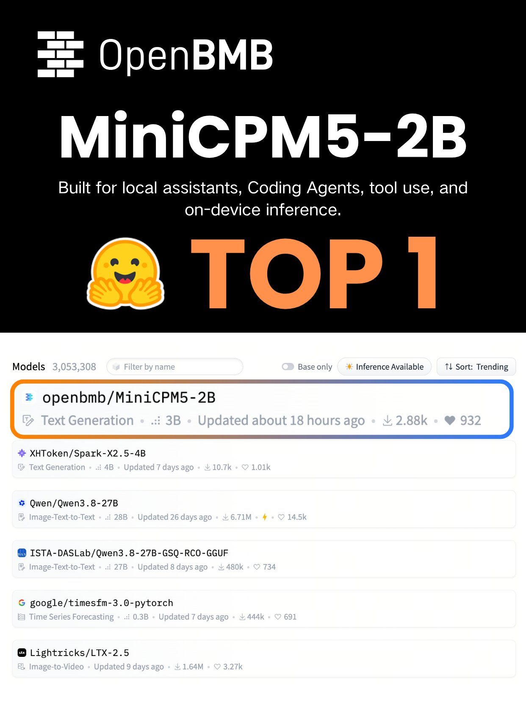
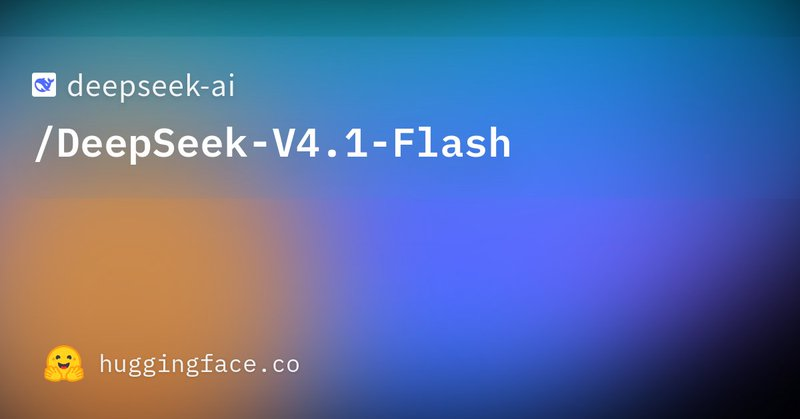
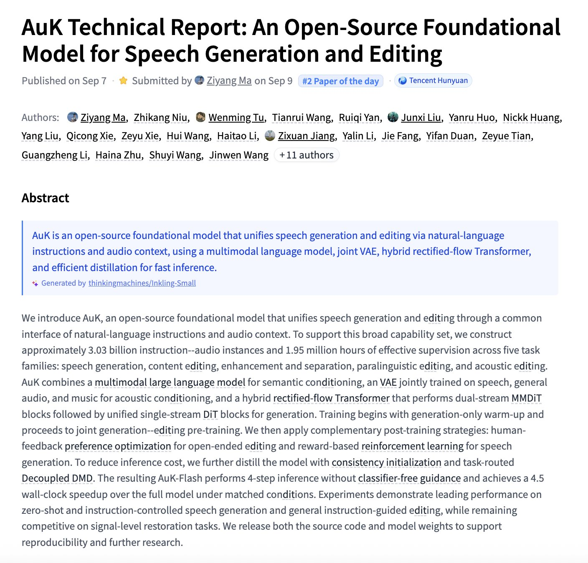

# 🐦 @_akhaliq

## 📅 September 10, 2026

> 9 post(s) archived.

---

### 🕐 21:31 UTC · @_akhaliq

> Yesterday we announced our series A to reimagine CRM as a business world model. I wanted explain what we mean by that, and why the CRM is the practical place to start building something much larger. https://x.com/i/article/2098159001070673920

🔗 [View original post](https://x.com/hliriani/status/2098162367075164170)

---

### 🕐 16:11 UTC · @_akhaliq

> We were founded on advancements in translation. We couldn’t be prouder to continue that legacy. Find the weights on Hugging Face (available in several quants) under a CC BY-NC 4.0 license. https://huggingface.co/CohereLabs/North-Small-Translate-1.0

🔗 [View original post](https://x.com/cohere/status/2098081941027192883)

---

### 🕐 16:05 UTC · @_akhaliq

> Two big updates 1. I published an @FT op-ed on the OpenAI/HF incident &amp; follow-ups 2. We’re starting an Open Alignment team at @huggingface to work on safety &amp; alignment for open models, incl cybersecurity Need 100x more transparency &amp; research on this https://www.ft.com/content/9faf688d-9192-418e-b7d3-c2202526e85e

🔗 [View original post](https://x.com/Thom_Wolf/status/2098080470235762702)

---

### 🕐 16:04 UTC · @_akhaliq

> I can confirm it now, DeepSeek V4.1 Flash is amazing 🥹 DeepSeek V4.1 Flash is available in HuggingChat 🐋 (absolute must try if you have a HF account!)

🔗 [View original post](https://x.com/victormustar/status/2098080125203976632)

---

### 🕐 14:01 UTC · @_akhaliq

> Ramp made a real Broadway musical starring Billy Porter, Billy Zane and Jessica Billy Vosk. It’s a show about bills. By Bills. Starring Bills—with original songs, full choreography, and an actual Broadway playwright. In the 1950s and ’60s, America’s biggest companies staged lavish musicals about cars, appliances, and soda. Somewhere along the way, we lost our nerve. We’re bringing back the industrial musical. One night only, September 25, at the Broadhurst Theatre. http://billpaythemusical.com Media

🔗 [View original post](https://x.com/eglyman/status/2098049270553383031)

---

### 🕐 12:15 UTC · @_akhaliq

> AgentGrad: Intervention-guided Prompt Optimization Improves multi-agent prompt optimization via sequential intervention and semantic textual gradient abstraction, achieving SOTA on 5 MAS benchmarks and 2.5x faster optimization.

🔗 [View original post](https://x.com/HuggingPapers/status/2098022487405793367)

---

### 🕐 08:45 UTC · @_akhaliq

> 🚀MiniCPM5-2B hits #1 on @huggingface Trending! 🏆 Huge thanks to the community for the incredible support!💗 Ranked #1 among open-weight models under 4B parameters worldwide in the @ArtificialAnlys Intelligence Index. 🤖 Built for Agentic AI Tool calling, deep search, code generation, and more—bringing capable Agents to phones, PCs, and vehicles. 🧠 More than model weights We’re opening up training code, Agent SFT/RL data, UltraX, Meshy, and JustRL II, enabling deeper research and easier reproduction. 📱 Ready for the edge Day 0 support for Intel, AMD &amp; Arm, plus mainstream inference and fine-tuning frameworks. Try the model here: 🤗 Hugging Face: http://huggingface.co/openbmb/MiniCPM5-2B 💻 GitHub: http://github.com/OpenBMB/MiniCPM

🔗 [View original post](https://x.com/OpenBMB/status/2097969683408544148)

---

### 🕐 06:10 UTC · @_akhaliq

> 🌐 Supporting open source. Expanding deployment options. We’ll work closely with the open-source community on V4.1-Flash inference support and explore more deployment options. Planning a large-scale deployment with 2,000 GPUs + a storage cluster? Let’s talk. 🔹 Model: https://huggingface.co/deepseek-ai/DeepSeek-V4.1-Flash 🔹 Paper: https://huggingface.co/deepseek-ai/DeepSeek-V4.1-Flash/blob/main/DeepSeek_V41_Tech_Report.pdf 6/6

🔗 [View original post](https://x.com/deepseek_ai/status/2097930627949711516)

---

### 🕐 01:20 UTC · @_akhaliq

> AuK Technical Report An Open-Source Foundational Model for Speech Generation and Editing paper: https://huggingface.co/papers/2609.08936

🔗 [View original post](https://x.com/_akhaliq/status/2097857652651167838)

---
