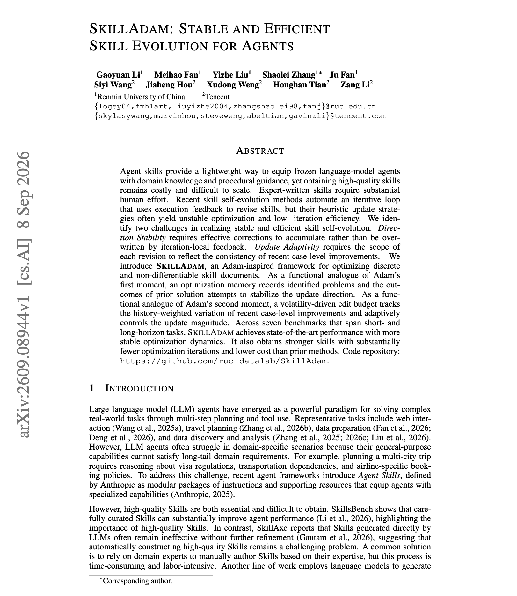
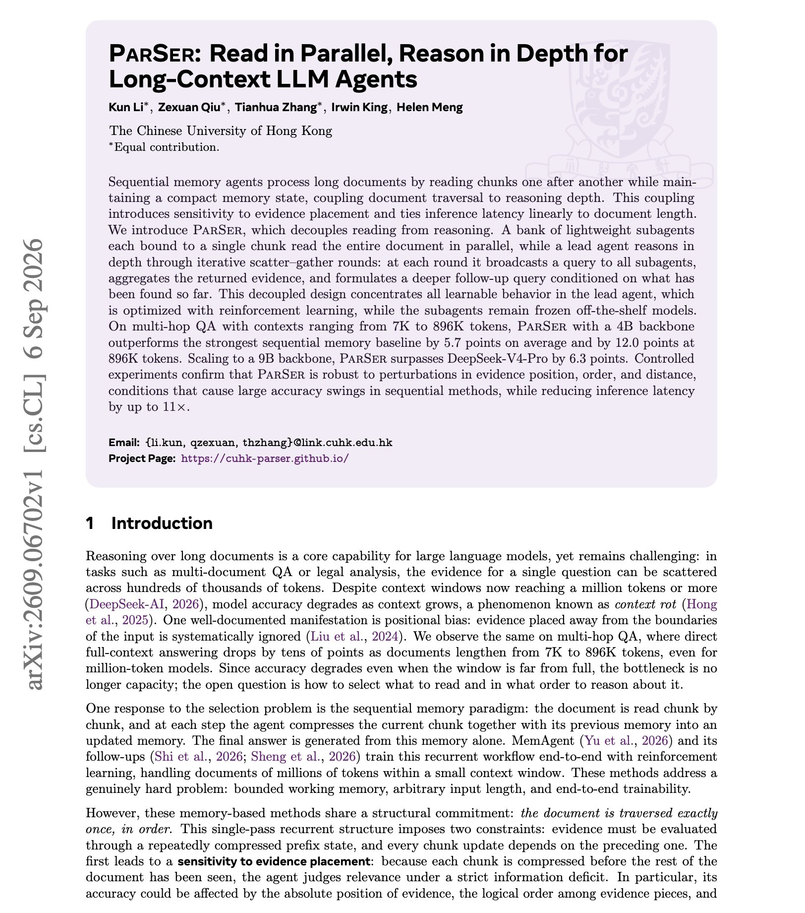
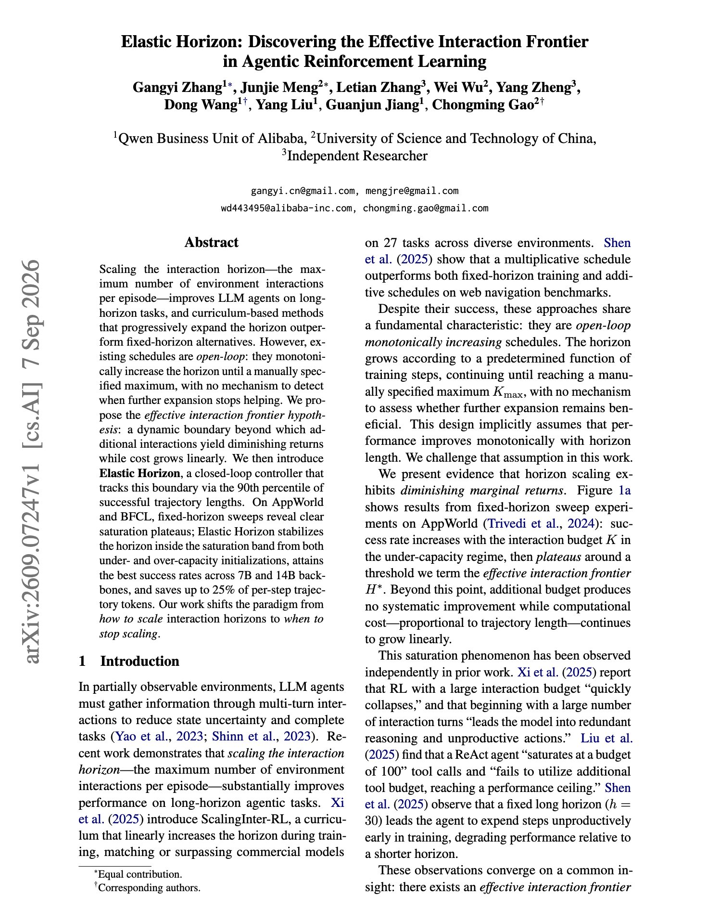
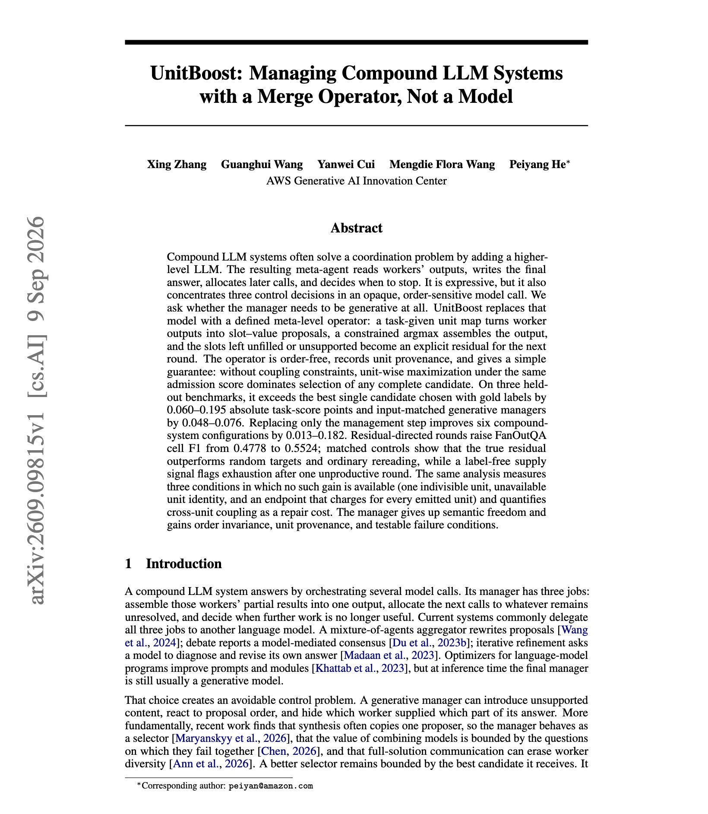
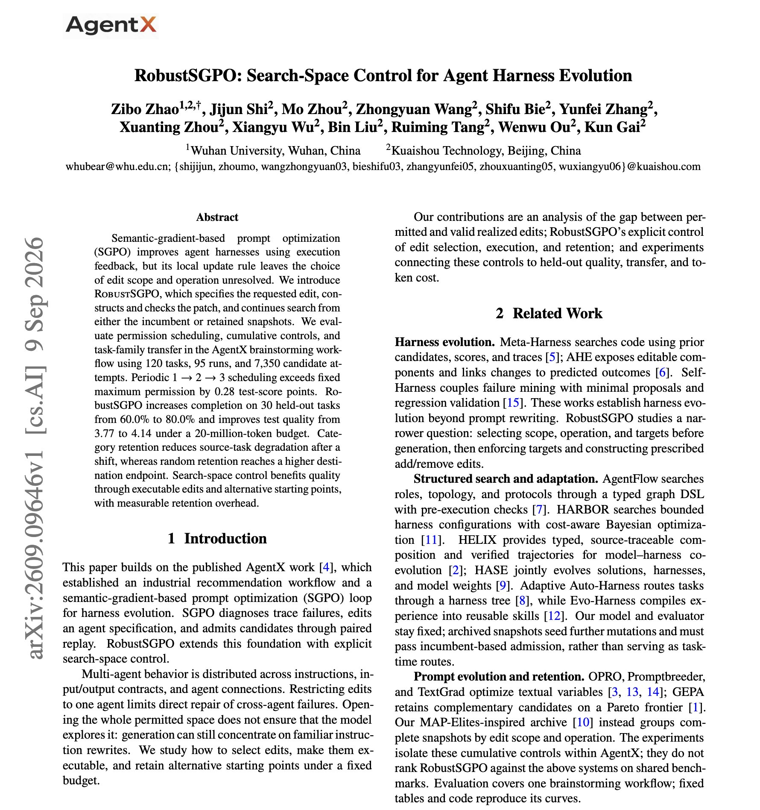
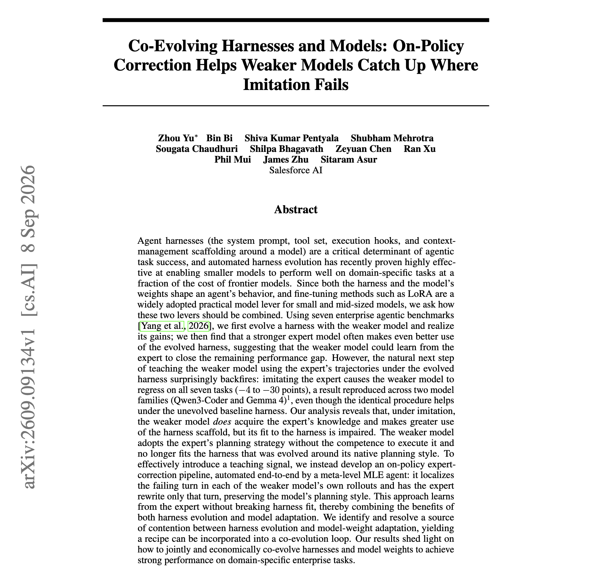
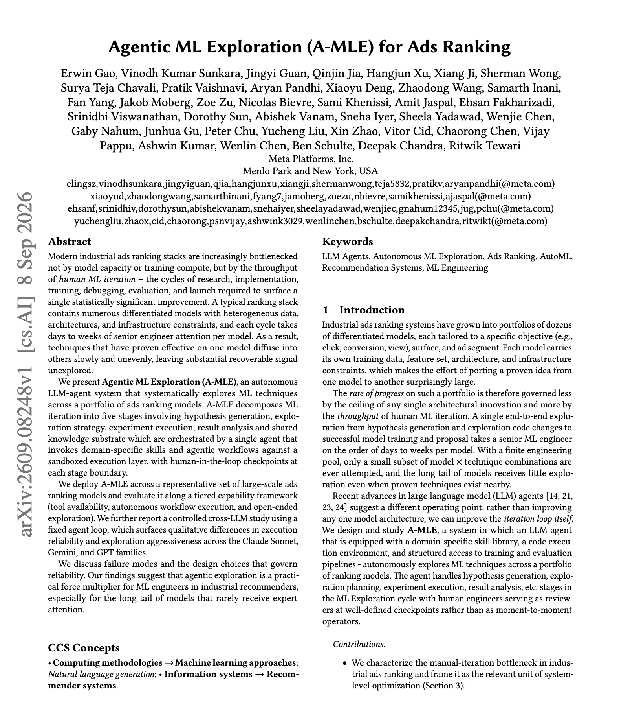

# 🐦 @dair_ai

## 📅 September 10, 2026

> 8 post(s) archived.

---

### 🕐 21:00 UTC · @dair_ai

> Another interesting approach to self-evolve agent skills. But it&apos;s important to know that skill self-evolution loops fail in two specific ways: 1. Direction instability. Effective corrections get overwritten by iteration-local feedback instead of accumulating, so the loop keeps undoing its own fixes. 2. Fixed update scope. Every revision changes about the same amount regardless of whether recent case-level improvements were consistent or noisy. SkillAdam addresses both by porting Adam&apos;s two moment estimates to discrete, non-differentiable skill documents. As a functional analogue of the first moment, an optimization memory records identified problems and the outcomes of prior solution attempts, which stabilizes the update direction. As an analogue of the second moment, a volatility-driven edit budget tracks the history-weighted variation of recent case-level improvements and controls how large each revision is allowed to be. Across seven benchmarks spanning short and long-horizon tasks it reaches state of the art with more stable optimization dynamics, and it gets there in substantially fewer iterations and at lower cost than prior methods. Paper: https://academy.dair.ai/papers/skilladam-stable-and-efficient-skill-evolution-for-agents-2609.08944

🔗 [View original post](https://x.com/dair_ai/status/2098154641854992676)

---

### 🕐 20:05 UTC · @dair_ai

> This is a brilliant paper. It&apos;s of the cleanest long-context agent designs I have seen in the past couple of months. Sequential memory agents read chunks one after another while maintaining a compact memory state. This behavior ties reasoning depth to document traversal and makes accuracy sensitive to where the evidence sits. It also makes latency grow linearly with document length. PARSER decouples the two. A bank of lightweight subagents, each bound to a single chunk, reads the whole document in parallel. A lead agent reasons through iterative scatter-gather rounds, broadcasting a query to all subagents, aggregating the returned evidence, and forming a deeper follow-up query conditioned on what it has found. All the learnable behavior is build into the lead agent, which is trained with RL. The subagents stay frozen off-the-shelf models. On multi-hop QA from 7K to 896K tokens, a 4B PARSER beats the strongest sequential memory baseline by 5.7 points on average and 12.0 points at 896K. At 9B it passes DeepSeek-V4-Pro by 6.3 points. Controlled experiments show it holds up under perturbations to evidence position, order and distance, which cause large accuracy swings in sequential methods, while cutting inference latency by up to 11x. Paper: https://academy.dair.ai/papers/parser-read-in-parallel-reason-in-depth-for-long-context-llm-agents-2609.06702

🔗 [View original post](https://x.com/omarsar0/status/2098140712504332411)

---

### 🕐 18:00 UTC · @dair_ai

> Recommended read. Interaction horizon scheduling is an underexplored control problem in agentic RL This paper from the Qwen team takes a closer look at the problem. Scaling the maximum number of environment interactions per episode improves long-horizon agents, and curriculum methods that expand the horizon beat fixed-horizon training. But those schedules are open-loop. They increase monotonically to a manually specified maximum with no way to detect that expansion stopped helping. The authors propose the effective interaction frontier, a dynamic boundary past which extra interactions give diminishing returns while cost keeps growing linearly. Fixed-horizon sweeps on AppWorld and BFCL show clear saturation plateaus. Elastic Horizon is a closed-loop controller that tracks the boundary using the 90th percentile of successful trajectory lengths, a statistic already available during training. It settles inside the saturation band from both under-capacity and over-capacity starts, gets the best success rates across 7B and 14B backbones, and saves up to 25% of per-step trajectory tokens. Paper: https://academy.dair.ai/papers/elastic-horizon-discovering-the-effective-interaction-frontier-in-agentic-reinfo-2609.07247

🔗 [View original post](https://x.com/dair_ai/status/2098109386568925397)

---

### 🕐 15:30 UTC · @dair_ai

> Great paper from AWS. I use a similar setup where an agent orchestrator sits on top of a multi-agent system. (bookmark it) This work introduces one of the many approaches available to manage compound LLM systems. Compound LLM systems usually solve coordination by adding a higher-level model. That meta-agent reads worker outputs, writes the final answer, allocates later calls and decides when to stop, which concentrates three separate control decisions in one opaque, order-sensitive call. UnitBoost investigates whether the manager needs to be generative at all. A task-given unit map turns worker outputs into slot-value proposals, a constrained argmax assembles the output, and slots left unfilled or unsupported become an explicit residual that directs the next round. On three held-out benchmarks it beats the best single candidate chosen with gold labels by 0.060 to 0.195 task-score points, and beats input-matched generative managers by 0.048 to 0.076. Replacing only the management step improves six compound-system configurations. Residual-directed rounds raise FanOutQA cell F1 from 0.4778 to 0.5524. Chat with Paper: https://academy.dair.ai/papers/unitboost-managing-compound-llm-systems-with-a-merge-operator-not-a-model-2609.09815

🔗 [View original post](https://x.com/omarsar0/status/2098071565040853118)

---

### 🕐 15:15 UTC · @dair_ai

> If you run automated prompt or harness evolution, this one is worth your time. (bookmark it) Semantic-gradient prompt optimization improves an agent harness from execution feedback, but its local update rule never decides how large an edit to request or which operation to apply. RobustSGPO adds that. It specifies the requested edit, constructs and checks the patch before accepting it, and continues search from either the incumbent or a retained snapshot. Measured over 120 tasks, 95 runs and 7,350 candidate attempts in the AgentX brainstorming workflow, completion on 30 held-out tasks rises from 60.0% to 80.0% and test quality from 3.77 to 4.14 under a 20-million-token budget. Periodic 1 to 2 to 3 edit-permission scheduling beats fixed maximum permission by 0.28 test-score points, so how much the optimizer is allowed to change per step is itself worth scheduling. Retention is a real trade. Category retention reduces source-task degradation after a task-family shift, while random retention reaches a higher destination endpoint, and both carry measurable overhead. Chat with Paper: https://academy.dair.ai/papers/robustsgpo-search-space-control-for-agent-harness-evolution-2609.09646

🔗 [View original post](https://x.com/dair_ai/status/2098067735389593926)

---

### 🕐 15:02 UTC · @dair_ai

> Another goated release by DeepSeek. Open weight, btw. Outperforms Opus 5 on key benchmarks, btw. Lower prices too. Looks like an extremely efficient model. What a legendary run. 🚀 Introducing DeepSeek-V4.1-Flash: smarter, faster, more efficient. 🔹 Introducing the smallest model in our new architecture family, with native visual understanding. 🔹 Designed for greater capability, faster inference, higher throughput, and scaling to larger models. 1/6

🔗 [View original post](https://x.com/omarsar0/status/2098064464536818141)

---

### 🕐 08:00 UTC · @dair_ai

> Nice paper from Salesforce on co-evolving harnesses and models. Harness engineering is a hot topic right now. So this is a great read. (bookmark it) Salesforce evolved a harness with a weak model across seven enterprise agent tasks, then trained that model on a stronger expert&apos;s full trajectories under the same harness. Performance dropped on all seven tasks, by 4 to 30 points across Qwen3-Coder and Gemma 4. The same fine-tuning helps under the unevolved harness. So the harness is what changes the outcome. Their analysis points at model-harness fit. Imitation transfers knowledge and increases scaffold usage, but the weaker model adopts the expert&apos;s planning strategy without the competence to execute it, and it no longer matches a harness that was evolved around its own native planning style. The fix is to stop copying whole trajectories. A meta-level agent finds the failing turn in the weaker model&apos;s own rollout and asks the expert to rewrite only that turn. That keeps the model&apos;s planning style intact and combines the gains from harness evolution and weight updates. Paper: https://academy.dair.ai/papers/co-evolving-harnesses-and-models-on-policy-correction-helps-weaker-models-catch-2609.09134

🔗 [View original post](https://x.com/omarsar0/status/2097958286146605446)

---

### 🕐 06:29 UTC · @dair_ai

> Another brilliant paper from Meta. This one is worth reading if you work on production-grade ranking or recommendation systems. Meta deployed an autonomous agent that runs the ML iteration cycle across a portfolio of production ads ranking models. Modern ads ranking is limited by how many research, implement, train, debug, evaluate and launch cycles engineers can run, rather than by model capacity or training compute. Each cycle takes days to weeks of senior engineer attention per model, so techniques proven on one model spread slowly to the rest. A-MLE splits the cycle into five stages covering hypothesis generation, exploration strategy, experiment execution, result analysis, and a shared knowledge substrate. One agent orchestrates them, calling domain-specific skills and workflows against a sandboxed execution layer, with human checkpoints at every stage boundary. They evaluate deployment along three tiers of tool availability, autonomous workflow execution, and open-ended exploration. They also ran a controlled cross-LLM study with the agent loop held fixed. The Claude Sonnet, Gemini and GPT families differ in execution reliability and exploration aggressiveness. Paper: https://academy.dair.ai/papers/agentic-ml-exploration-a-mle-for-ads-ranking-2609.08248

🔗 [View original post](https://x.com/dair_ai/status/2097935359384719537)

---
