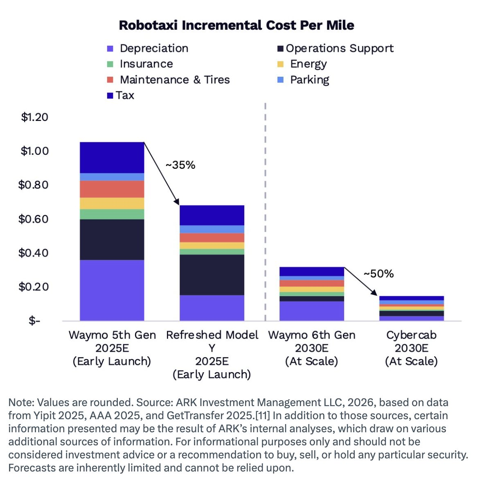
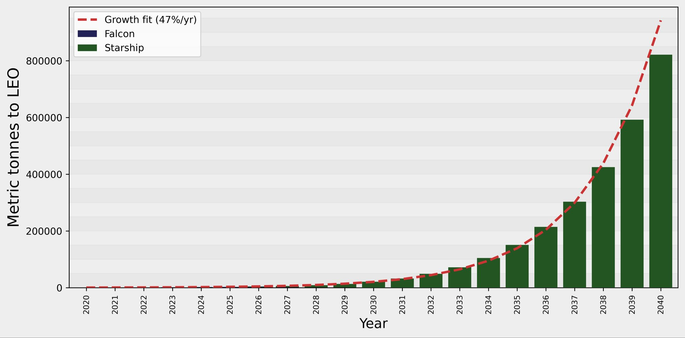

# 🐦 @elonmusk

## 📅 September 10, 2026

> 11 post(s) archived.

---

### 🕐 13:39 UTC · @elonmusk

> True 😂 If you want to solve AI alignment issues, train a model to take you from home to the office and back with no pedals or steering. You will solve it really quickly.

🔗 [View original post](https://x.com/elonmusk/status/2098043646037950756)

---

### 🕐 13:20 UTC · @elonmusk

> Grok @Bot Some recent quality-of-life improvements to Grok Bot. You can ask your Bot to draft messages inline for you to approve before sending.

🔗 [View original post](https://x.com/elonmusk/status/2098038952284586282)

---

### 🕐 13:07 UTC · @elonmusk

> Last week, Tesla held an event in Austin introducing the two-seat, purpose-built Cybercab to its Robotaxi fleet, and then the following evening commercialized its first rides. Tesla disclosed that, in just six weeks, the Robotaxi fleet increased its unsupervised driving miles 2.6x, from the 380,000 reported during Tesla’s second-quarter earnings call to one million miles. On its site, Tesla posted a “Robotaxi interest form” aimed at commercial fleet buyers, asking respondents to flag interest in purchasing a Cybercab fleet. As ARK outlined in Big Ideas 2026, fleet owners are an important component of the robotaxi value chain. The Cybercab is central to scaling Tesla’s robotaxi service at competitive prices and, in ARK’s view, to expanding autonomous ride-hail into a multi-trillion-dollar opportunity. At scale, we project that robotaxis could be priced as low as $0.25 per mile—approximately one-tenth the cost of human-driven ride-hail, as shown below, and roughly one-third the cost of personal car ownership. @TashaARK details more in this week&apos;s newsletter ⬇️ https://x.com/i/article/2097390019019456512

🔗 [View original post](https://x.com/ARKInvest/status/2098035528046133403)

---

### 🕐 13:00 UTC · @elonmusk

> Here is what Starships mass-to-orbit will be doing on the same timescale as these missions, under some pretty conservative assumptions. SpaceX own plans are even more aggressive. I fear the European plans are not nearly ambitious enough. We need to go further. Read my analysis: https://planetocracy.org/p/mass-value-report-for-august-2026 Macron, at 🇫🇷 Paris Space Summit, just put dates on Europe’s space ambition: 🚀 2028: 🇪🇺 Nyx cargo capsule docking with the ISS 🌕 2031: 🇪🇺 Argonaut lunar lander on the Moon 👨‍🚀 2036: 🇪🇺 European crewed capsule launching from Kourou The goal would be to build Europe’s o…

🔗 [View original post](https://x.com/peterrhague/status/2098033814698111453)

---

### 🕐 11:35 UTC · @elonmusk

> Starlink has significantly transformed the world. Millions of people who previously had no even hope of ever accessing the internet are now connected. Starlink is one of the greatest achievements for all of humanity, made possible by Elon Musk and SpaceX. Thank you! “Starlink has done more than any NGO to lift people out of poverty by connecting them with a means of education and a market for their goods &amp; services via the Internet.” Elon Musk With an Internet connection, you can learn anything and sell your products to a global market, which enables prosperity

🔗 [View original post](https://x.com/EvaFox/status/2098012534011740165)

---

### 🕐 08:05 UTC · @elonmusk

> We are living in a fake world and Elon is turning on the light.

🔗 [View original post](https://x.com/brivael/status/2097959730723344727)

---

### 🕐 06:04 UTC · @elonmusk

> Congrats Boring Company team! The Boring Company is pleased to announce our Series D funding round of $3 billion, led by the United Arab Emirates. The financing now values The Boring Company at $23 billion. Other key investors in the round include Human Capital, Vy Capital, Valor Equity Partners, Sequoia Capi…

🔗 [View original post](https://x.com/elonmusk/status/2097929222639767712)

---

### 🕐 06:03 UTC · @elonmusk

> Grok filed an irs form for me to keep me qualified for some refund of penalties if a lawsuit is settled this year…. Idk I didn’t understand but grok found the form, told me how to fill it out and efile it in about ten minutes. Would have taken half a dozen calls with my tax prep and accountant to sort out.

🔗 [View original post](https://x.com/LOVtheCOV/status/2097928969370710467)

---

### 🕐 05:13 UTC · @elonmusk

> The logic is symmetric If remigration is ethnic cleansing, then so is mass migration.

🔗 [View original post](https://x.com/elonmusk/status/2097916357979615503)

---

### 🕐 03:06 UTC · @elonmusk

> And @Grok @Bot gets better almost every day I am completely sold on Grok Bot. It is awesome.

🔗 [View original post](https://x.com/elonmusk/status/2097884487455834543)

---

### 🕐 02:58 UTC · @elonmusk

> Tesla virtual powerplant grid stabilization system ~69,000 Powerwall owners across California are currently dispatching more than 500 MW to the grid, helping meet peak demand during today&apos;s heatwave Equivalent to the output of a power plant, but from Powerwalls already in people&apos;s homes

🔗 [View original post](https://x.com/elonmusk/status/2097882250977382576)

---
