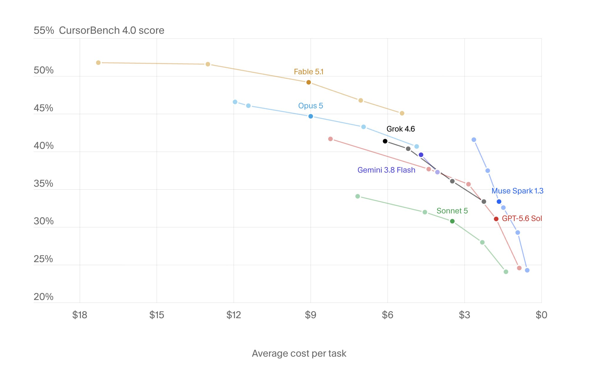

# 🐦 @leerob

## 📅 September 10, 2026

> 2 post(s) archived.

---

### 🕐 20:20 UTC · @leerob

> We just rolled out CursorBench 4.0! It includes new tasks for how well models follow instructions, work on challenging projects over time, and is more difficult than before (so all models score lower).

🔗 [View original post](https://x.com/leerob/status/2098144600594465148)

---

### 🕐 20:20 UTC · @leerob

> Notably Grok 4.6 is a bit lower on this now, which we still believe is an accurate score and comparison. Grok 4.7 coming soon 😄 Muse Spark performs pretty well here tbh! https://cursor.com/cursorbench

🔗 [View original post](https://x.com/leerob/status/2098144603379491314)

---
