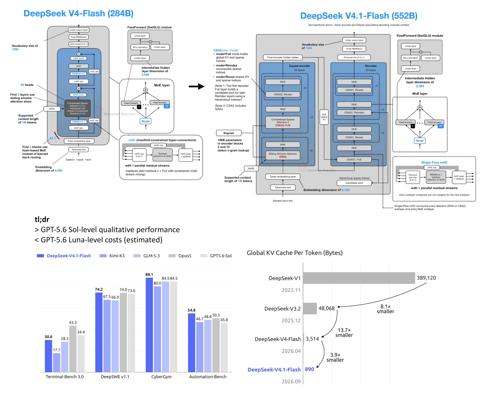

# 🐦 @rasbt

## 📅 September 10, 2026

> 2 post(s) archived.

---

### 🕐 20:12 UTC · @rasbt

> Big overhaul on DeepSeek V4.1 using an encoder-decoder setup. Tbh they should have called it DeepSeek V5! Super cool and refreshing, though! 🚀 Introducing DeepSeek-V4.1-Flash: smarter, faster, more efficient. 🔹 Introducing the smallest model in our new architecture family, with native visual understanding. 🔹 Designed for greater capability, faster inference, higher throughput, and scaling to larger models. 1/6

🔗 [View original post](https://x.com/rasbt/status/2098142625819672603)

---

### 🕐 19:22 UTC · @rasbt

> Nice showcase that interesting LLM work can be done on single GPU! I extended the GPT-2-style code from @rasbt&apos;s &quot;Build a Large Language Model (from Scratch)&quot; so that it was a 6-expert (2 active) mixture-of-experts, and trained it from scratch over 8 days. It worked well! Full writeup with maths and code at https://www.gilesthomas.com/2026/09/gp…

🔗 [View original post](https://x.com/rasbt/status/2098129926708707824)

---
