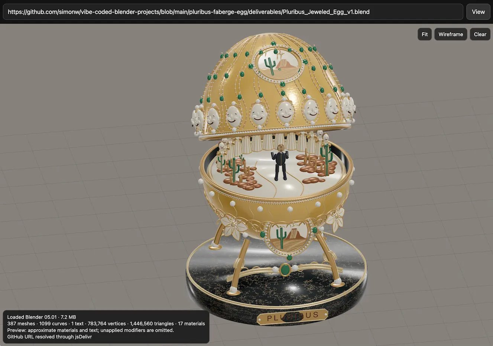

# 🐦 @simonw

## 📅 September 10, 2026

> 3 post(s) archived.

---

### 🕐 18:49 UTC · @simonw

> DwarfStar running DeepSeek v4.1 Flash on a 128GB M5 Max. I didn&apos;t expect with SSD streaming it could be so fast. Recent SSD streaming changes to retain the right experts surely helped, but also maybe DS4.1 uses the same experts more. Will push online when ready QA &gt; ASAP. Media

🔗 [View original post](https://x.com/antirez/status/2098121665771110540)

---

### 🕐 00:41 UTC · @simonw

> I also had Astra vibe code up an online Blender model viewing tool, so you can explore the egg interactively in your browser here: https://tools.simonwillison.net/blender-viewer?url=https%3A%2F%2Fgithub.com%2Fsimonw%2Fvibe-coded-blender-projects%2Fblob%2Fmain%2Fpluribus-faberge-egg%2Fdeliverables%2FPluribus_Jeweled_Egg_v1.blend

🔗 [View original post](https://x.com/simonw/status/2097847779033018746)

---

### 🕐 00:40 UTC · @simonw

> Here&apos;s a Blender model of a Pluribus themed Fabergé egg I had GPT-6 Astra build - I generated the concept image using ChatGPT Images 2.5, then pasted the image into Codex and told Astra to turn that into a Blender file Details here: https://simonwillison.net/2026/Sep/9/blender-viewer/

🔗 [View original post](https://x.com/simonw/status/2097847628155523242)

---
