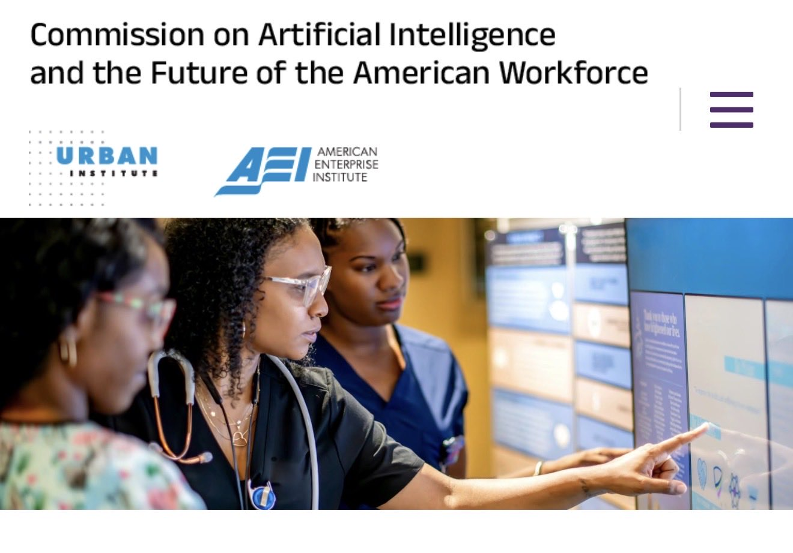

# 🐦 @tunguz

## 📅 September 10, 2026

> 8 post(s) archived.

---

### 🕐 19:39 UTC · @tunguz

> They are going to get Riemann by the end of the year, aren’t they?

🔗 [View original post](https://x.com/tunguz/status/2098134307214590100)

---

### 🕐 17:32 UTC · @tunguz

> I mean, primates share 98% of genes with humans and cost 1.4% to maintain. 🤷‍♂️ WTF 😅🚀😳 “98% of Astra’s score at 1.4% of cost” Cancel the fucking IPOs 😂

🔗 [View original post](https://x.com/tunguz/status/2098102366071582887)

---

### 🕐 15:46 UTC · @tunguz

> There is no crying in AI.

🔗 [View original post](https://x.com/tunguz/status/2098075704252387384)

---

### 🕐 14:03 UTC · @tunguz

> Link to the commission website: https://aiworkforcecommission.org

🔗 [View original post](https://x.com/tunguz/status/2098049841687363676)

---

### 🕐 14:03 UTC · @tunguz

> I am honored to announce that I will serve as a Research Director for the Technology Industry on the Commission on AI and the Future of the American Workforce. This is a bipartisan data-driven effort hosted by @AEI and @urbaninstitute. AI is having a major impact on the workforce, but it is my firm belief that we as a society can prepare ourselves for all the challenges. I hope that my own contributions to that effort can help us navigate this transition.

🔗 [View original post](https://x.com/tunguz/status/2098049686884044841)

---

### 🕐 13:59 UTC · @tunguz

> Link to the commission website: https://aiworkforcecommission.org

🔗 [View original post](https://x.com/tunguz/status/2098048708688445805)

---

### 🕐 03:39 UTC · @tunguz

> Campaign against nuclear energy is just one of the examples of where anti-progress doomerism consigned us to much worse world than we should have been able to attain with the technology we had access to. This is one of the main reasons why I’ve become instinctively knee-jerk about all other forms of unbridled safetism. Nuclear power is banned in Australia because anti-nuke activists--some of them Soviet-funded--were so effective at stigmatising the technology. We know it&apos;s safe, clean, and scalable. Yet people are still scared.

🔗 [View original post](https://x.com/tunguz/status/2097892660270748158)

---

### 🕐 00:32 UTC · @tunguz

> GPT-7 will one-shot GTA-6. Which comes first?

🔗 [View original post](https://x.com/tunguz/status/2097845724566216949)

---
