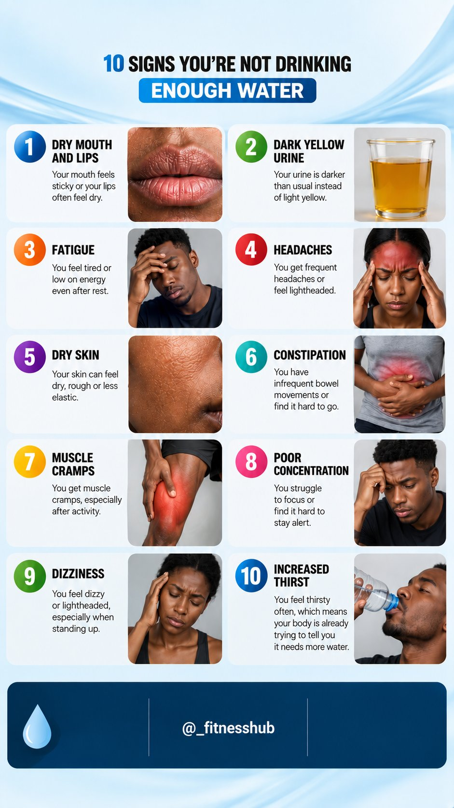
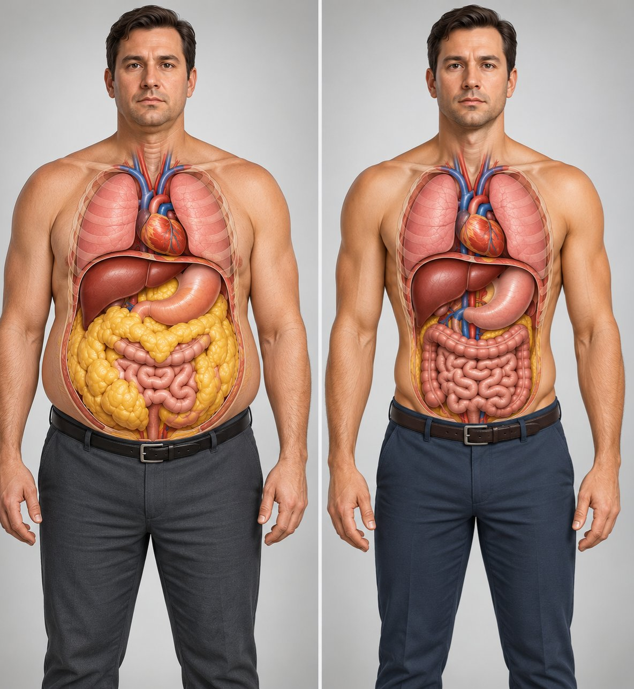
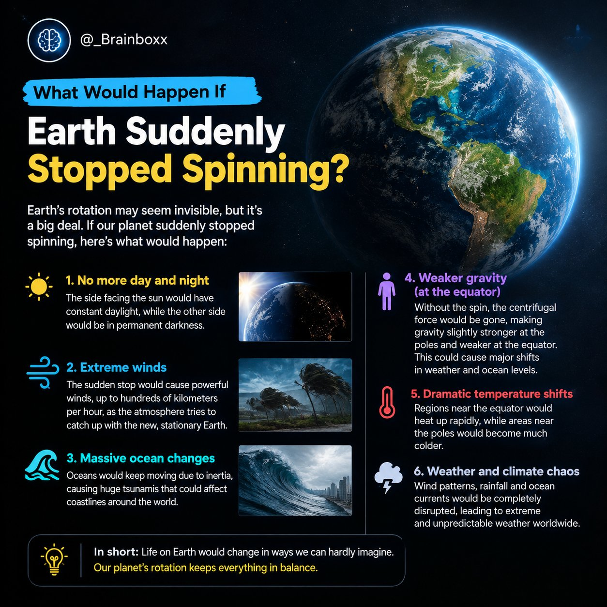
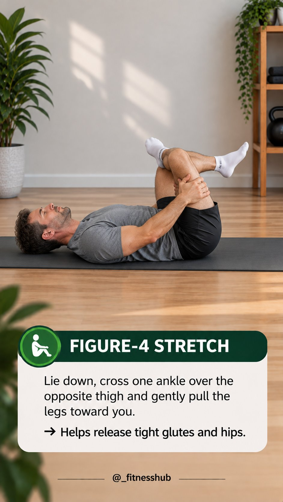
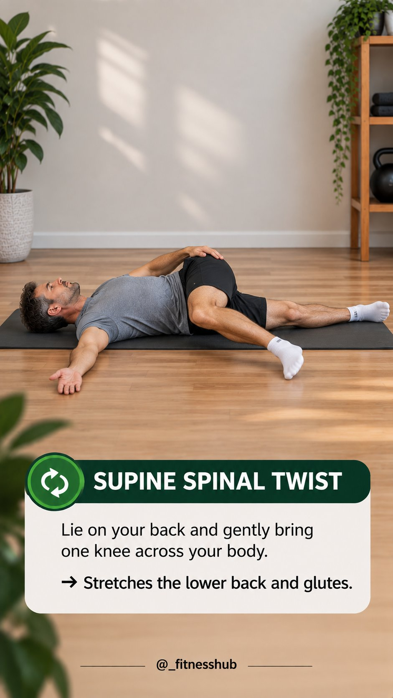
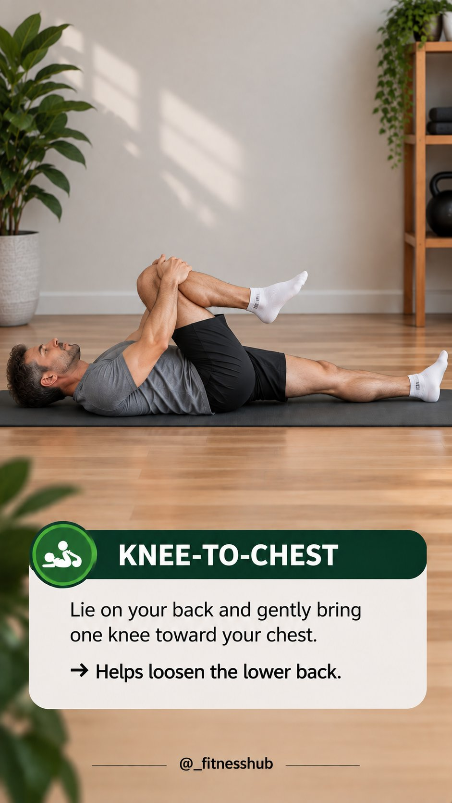
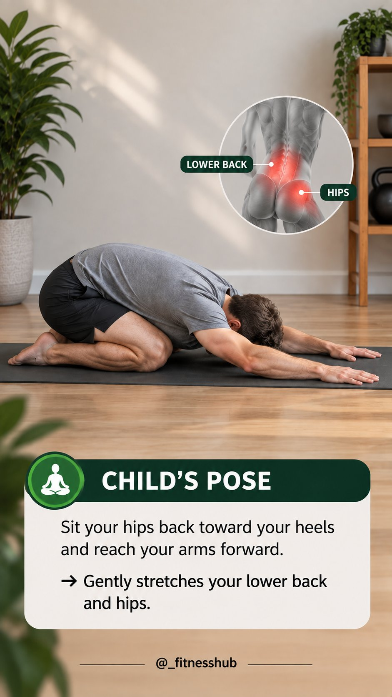
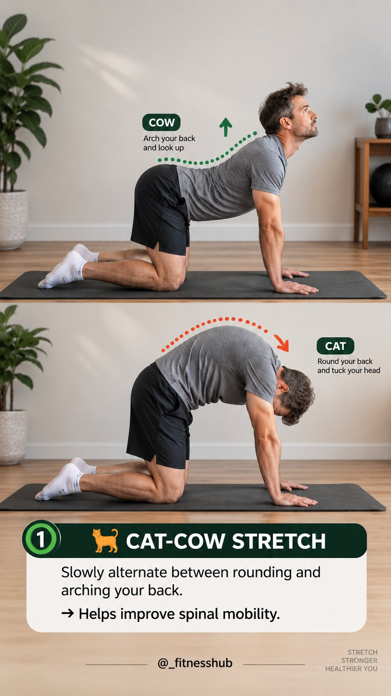
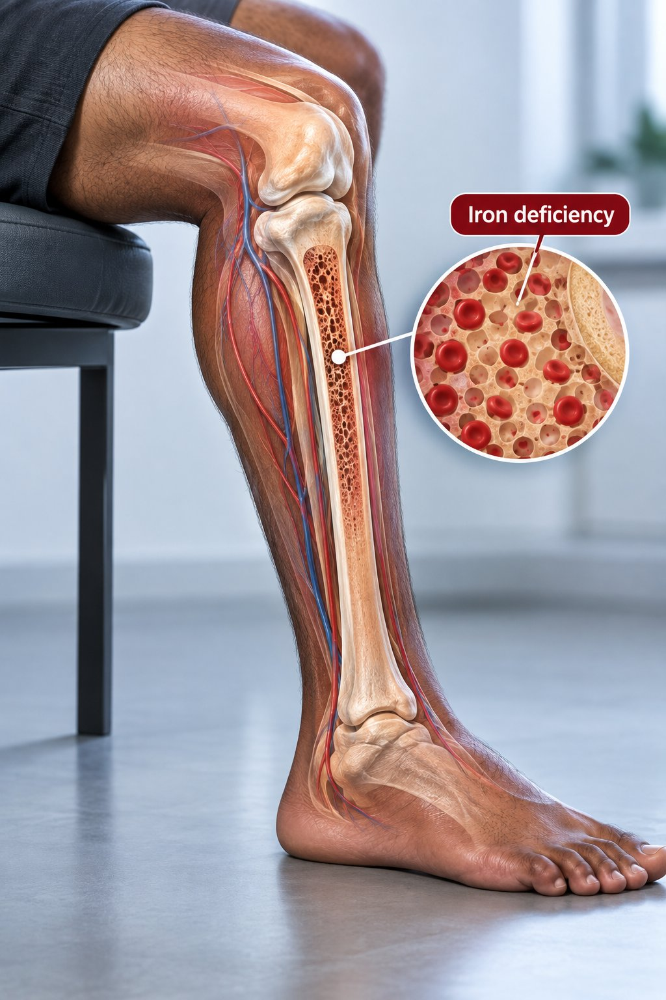

# 🐦 @Unlockyourlife_

## 📅 September 11, 2026

> 16 post(s) archived.

---

### 🕐 11:07 UTC · @Unlockyourlife_

> Stop telling everyone your plans. - Work quietly. - Build quietly. - Save quietly. - Improve quietly. Then let the results introduce you. Not everyone who listens to your plans is rooting for them.

🔗 [View original post](https://x.com/Masculinjournal/status/2098367739622514963)

---

### 🕐 10:58 UTC · @Unlockyourlife_

> 💧 Hydration matters more than you think.

🔗 [View original post](https://x.com/_fitnesshub/status/2098365489273540930)

---

### 🕐 09:22 UTC · @Unlockyourlife_

> That stubborn fat around your waist is not just a cosmetic problem. If you have excess visceral fat, these are the lifestyle changes that can help you reduce it.

🔗 [View original post](https://x.com/_alphafit/status/2098341475184435474)

---

### 🕐 08:19 UTC · @Unlockyourlife_

> What would happen if earth suddenly stopped spinning?

🔗 [View original post](https://x.com/_Brainboxx/status/2098325458550976790)

---

### 🕐 08:01 UTC · @Unlockyourlife_

> Fixing Deep Scratches on this M3 Media

🔗 [View original post](https://x.com/Smart_Tipsx/status/2098321046449369144)

---

### 🕐 07:56 UTC · @Unlockyourlife_

> You don’t need a 30-minute workout first thing in the morning. Even 5–10 minutes of gentle stretching can help you start the day feeling looser and more mobile. Save this for tomorrow morning.

🔗 [View original post](https://x.com/_fitnesshub/status/2098319657614606633)

---

### 🕐 07:56 UTC · @Unlockyourlife_

> 5.

🔗 [View original post](https://x.com/_fitnesshub/status/2098319649351795118)

---

### 🕐 07:56 UTC · @Unlockyourlife_

> 4.

🔗 [View original post](https://x.com/_fitnesshub/status/2098319644763329000)

---

### 🕐 07:56 UTC · @Unlockyourlife_

> 3.

🔗 [View original post](https://x.com/_fitnesshub/status/2098319639952372042)

---

### 🕐 07:56 UTC · @Unlockyourlife_

> 2.

🔗 [View original post](https://x.com/_fitnesshub/status/2098319634638250111)

---

### 🕐 07:55 UTC · @Unlockyourlife_

> 🧵 6 BEST EARLY-MORNING STRETCHES TO HELP AVOID BACK PAIN 1.

🔗 [View original post](https://x.com/_fitnesshub/status/2098319628875317655)

---

### 🕐 07:43 UTC · @Unlockyourlife_

> Your Body Is Trying to Tell You Something. Low iron doesn&apos;t always start with obvious symptoms. It can quietly affect your energy, skin, hair, nails, breathing and even your legs. Here are 6 ways iron deficiency can show up in your body🧵

🔗 [View original post](https://x.com/FitnessDr_/status/2098316437068616041)

---

### 🕐 06:50 UTC · @Unlockyourlife_

> Diabetes can damage your body quietly for years. You may feel completely fine while high blood sugar is gradually affecting your blood vessels, nerves, eyes and kidneys. Here are 7 things about diabetes you should know.

🔗 [View original post](https://x.com/BioLifex/status/2098303051006185490)

---

### 🕐 06:34 UTC · @Unlockyourlife_

> Your 20s are not supposed to look perfect. • You&apos;re going to make mistakes. • Lose money. • Choose the wrong people. • Change careers. • Get rejected. • Start again. • Learn. The goal isn&apos;t to have everything figured out early. The goal is to become wiser with every year.

🔗 [View original post](https://x.com/Masculinjournal/status/2098299180359860707)

---

### 🕐 05:27 UTC · @Unlockyourlife_

> A man doesn&apos;t need to win every argument. Sometimes the strongest response is silence. You don&apos;t have to prove your intelligence to someone committed to misunderstanding you. You don&apos;t have to defend yourself against every opinion. Choose your battles. Peace is sometimes more valuable than being right.

🔗 [View original post](https://x.com/Masculinjournal/status/2098282160562020828)

---

### 🕐 01:05 UTC · @Unlockyourlife_

> Build a life you don&apos;t constantly need to escape from. • Work toward financial stability. • Take care of your body. • Choose good people. • Build meaningful relationships. • Develop your mind. • Have faith. And learn to enjoy ordinary days. Success isn&apos;t only about having more. It&apos;s also about needing less to feel at peace.

🔗 [View original post](https://x.com/Masculinjournal/status/2098216309326594118)

---
