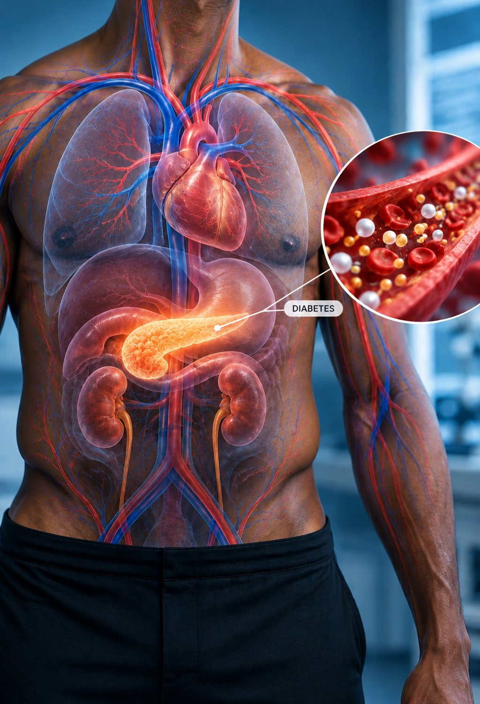

# 🐦 @Unlockyourlife_

## 📅 September 11, 2026

> 4 post(s) archived.

---

### 🕐 06:50 UTC · @Unlockyourlife_

> Diabetes can damage your body quietly for years. You may feel completely fine while high blood sugar is gradually affecting your blood vessels, nerves, eyes and kidneys. Here are 7 things about diabetes you should know.

🔗 [View original post](https://x.com/BioLifex/status/2098303051006185490)

---

### 🕐 06:34 UTC · @Unlockyourlife_

> Your 20s are not supposed to look perfect. • You&apos;re going to make mistakes. • Lose money. • Choose the wrong people. • Change careers. • Get rejected. • Start again. • Learn. The goal isn&apos;t to have everything figured out early. The goal is to become wiser with every year.

🔗 [View original post](https://x.com/Masculinjournal/status/2098299180359860707)

---

### 🕐 05:27 UTC · @Unlockyourlife_

> A man doesn&apos;t need to win every argument. Sometimes the strongest response is silence. You don&apos;t have to prove your intelligence to someone committed to misunderstanding you. You don&apos;t have to defend yourself against every opinion. Choose your battles. Peace is sometimes more valuable than being right.

🔗 [View original post](https://x.com/Masculinjournal/status/2098282160562020828)

---

### 🕐 01:05 UTC · @Unlockyourlife_

> Build a life you don&apos;t constantly need to escape from. • Work toward financial stability. • Take care of your body. • Choose good people. • Build meaningful relationships. • Develop your mind. • Have faith. And learn to enjoy ordinary days. Success isn&apos;t only about having more. It&apos;s also about needing less to feel at peace.

🔗 [View original post](https://x.com/Masculinjournal/status/2098216309326594118)

---
