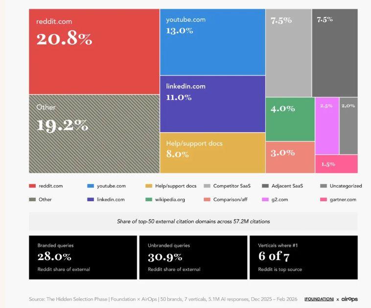
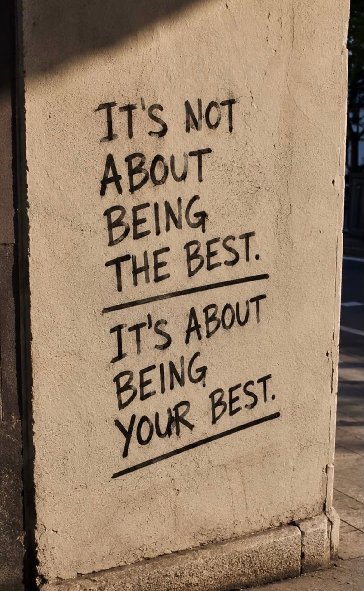
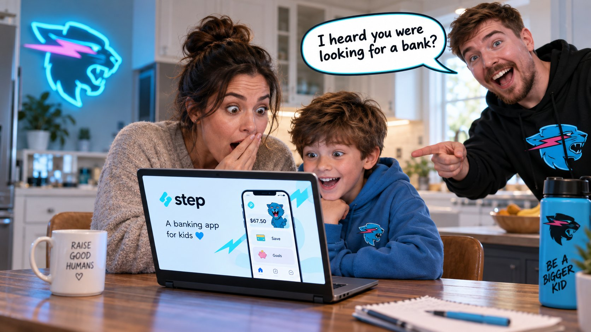
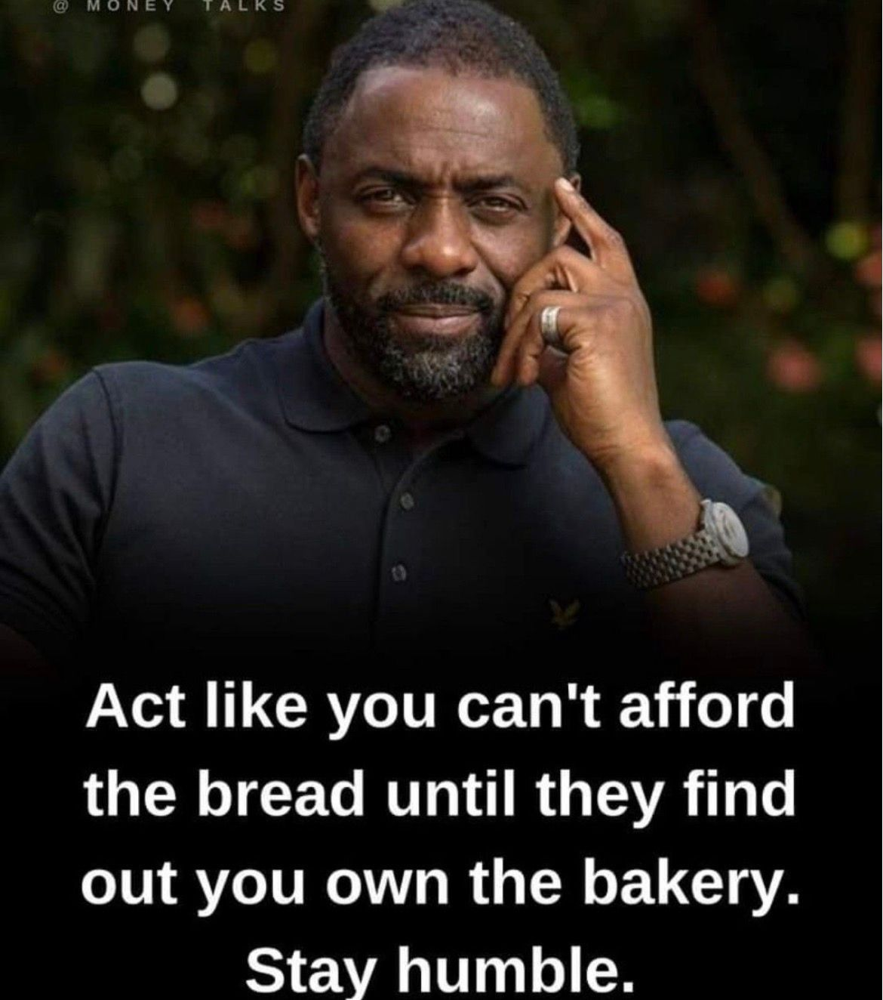
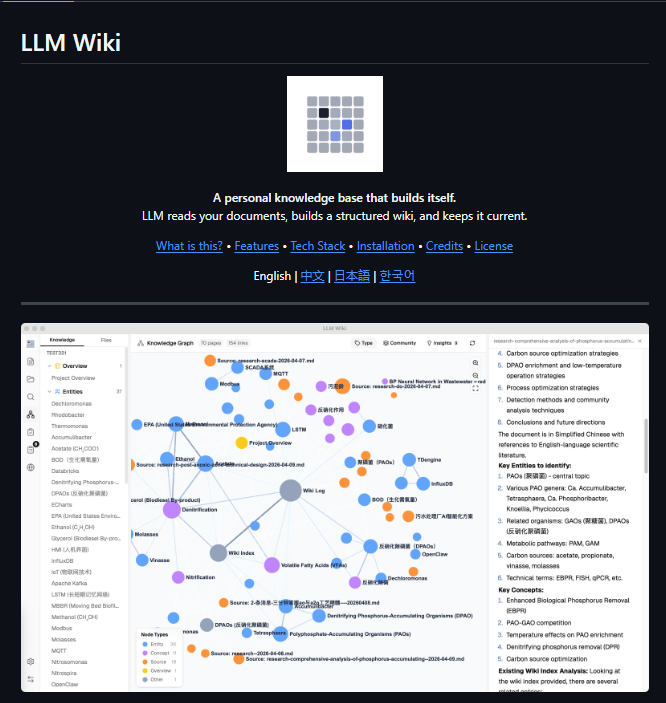
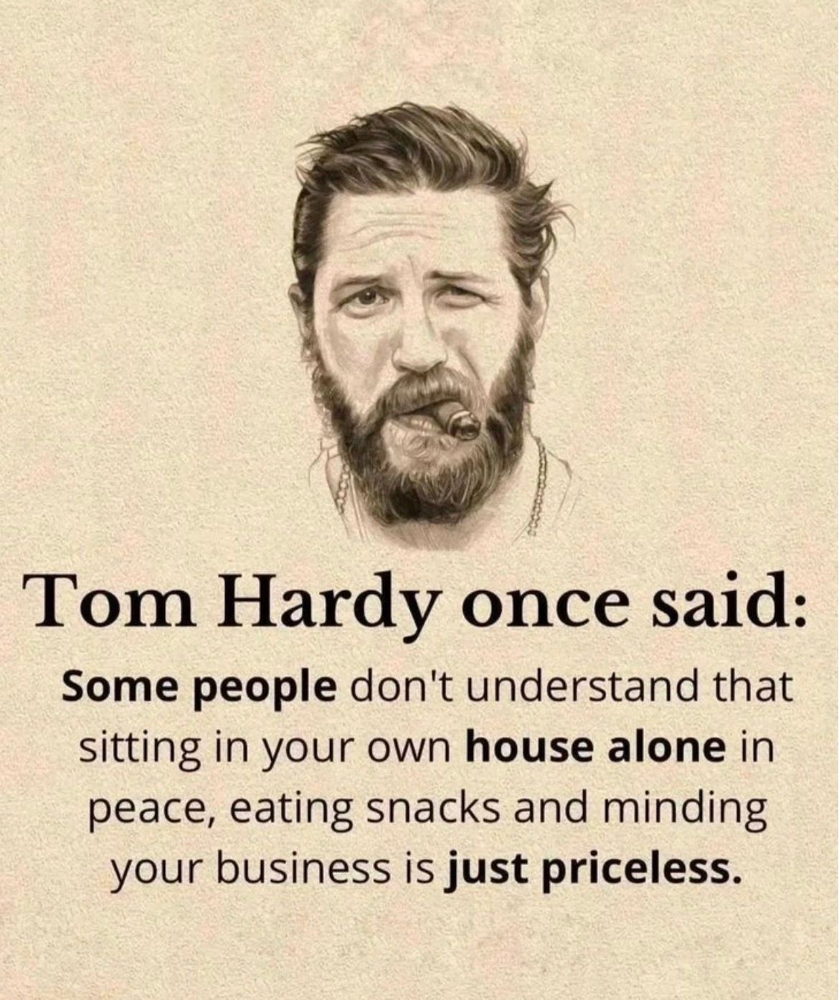
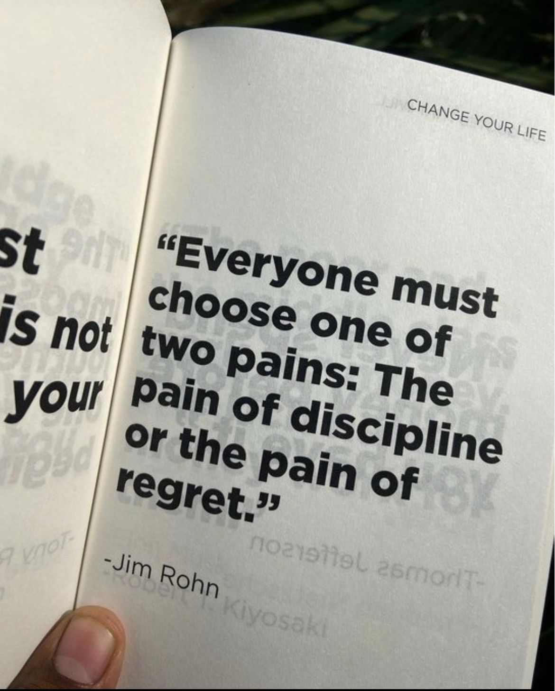
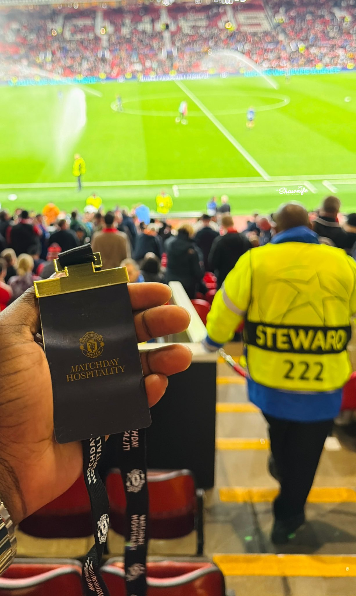
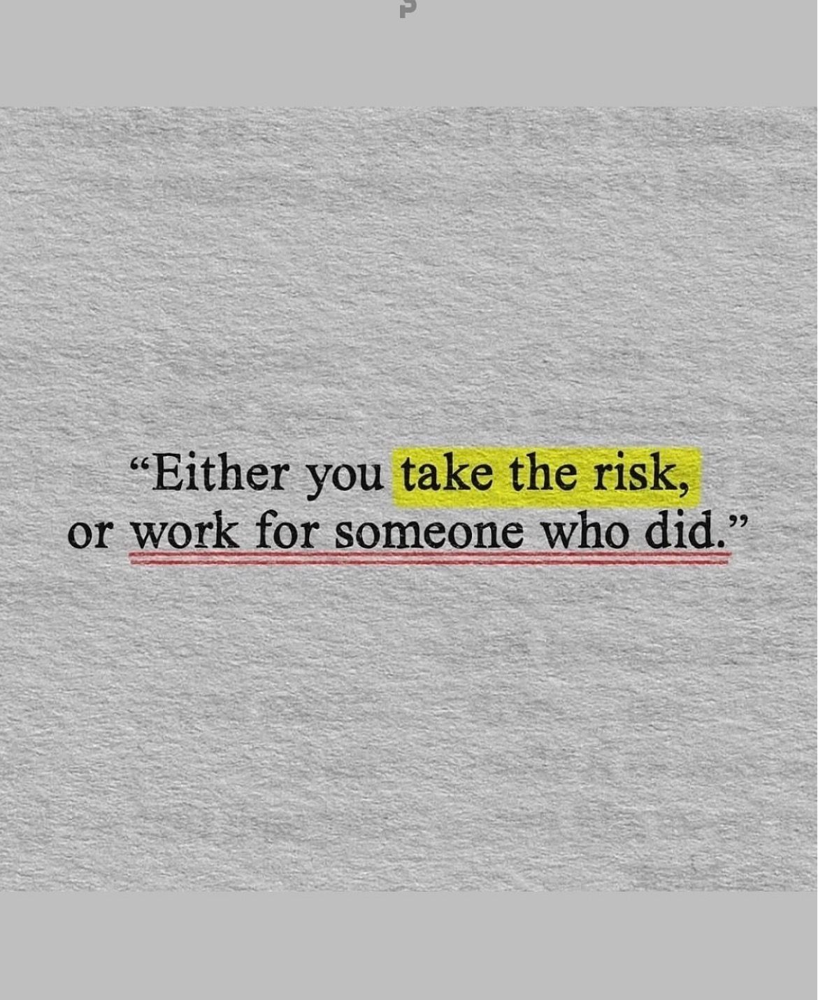
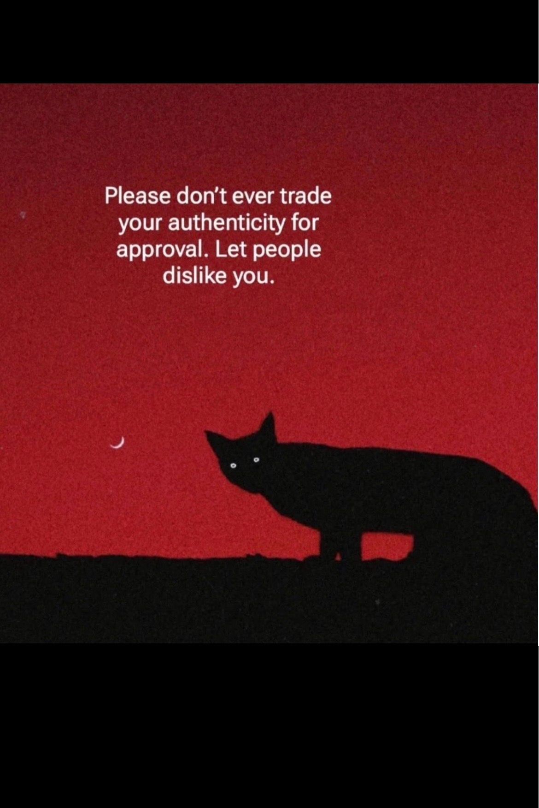

# 🐦 @Wise1Philosophy

## 📅 September 11, 2026

> 69 post(s) archived.

---

### 🕐 14:46 UTC · @Wise1Philosophy

> FACIAL FAT = HIGH CORTISOL The good news is that it is reversible. Here are 9 tips that work. 1. Don&apos;t eat breakfast Media

🔗 [View original post](https://x.com/DPro_Coach/status/2098423048718451000)

---

### 🕐 14:43 UTC · @Wise1Philosophy

> Leaky gut causes brain dysfunction, bad immune, and raises your cancer risk by 6x. 1 in 3 Americans walk around with it &amp; have no clue. Here’s what kills your gut (and how to heal it): 1. The elimination protocol

🔗 [View original post](https://x.com/LongevityCode_/status/2098422237426753719)

---

### 🕐 14:38 UTC · @Wise1Philosophy

> Everyone fears a heart attack. If you want to avoid fatty liver, high blood pressure, and insulin resistance (especially if you’re over 35): 1. Don&apos;t count 10,000 steps. Media

🔗 [View original post](https://x.com/TheFastedState/status/2098420936429260950)

---

### 🕐 14:33 UTC · @Wise1Philosophy

> A cardiologist shocked me when he said: &quot;You age because your body stops making Nitric Oxide. Without it, blood pressure rises, erections fail, and Alzheimer&apos;s happens.&quot; Here&apos;s the 5-step protocol to boost it naturally: 1. Stop using mouthwash

🔗 [View original post](https://x.com/TinaaDeJong/status/2098419554502537458)

---

### 🕐 14:30 UTC · @Wise1Philosophy

> Heart Attack = Blood sugar Heart Attack = Insulin resistance Heart Attack = The world&apos;s top killer 5 simple rules to protect your heart: 1. Stop breathing through your mouth Media

🔗 [View original post](https://x.com/Sophiaz6xo/status/2098418827788955751)

---

### 🕐 14:28 UTC · @Wise1Philosophy

> The fastest way to turn money into more money is a bottleneck analysis. Find the one statistic that&apos;s contracted, put all your attention on that single thing, fix it, then run it again. Most people spread their effort across everything at once and wonder why nothing moves. So I put together a free Funnel Bottleneck Guide that will help you find the one step in your funnel that is capping everything above it. Like this post + comment &quot;BOTTLENECK&quot; and I&apos;ll send it over. Media

🔗 [View original post](https://x.com/TheJeremyHaynes/status/2098418337738797066)

---

### 🕐 14:01 UTC · @Wise1Philosophy

> A network of traders made $100 MILLION by reading tomorrow&apos;s news. For five years, their timing looked like pure genius. Then the FBI found their INSANE loophole behind it all... Here is how the scheme worked: The scheme crossed borders and hid in plain sight. Two hackers in Ukraine broke into the newswires. They used phishing and code injection to slip inside. Business Wire, Marketwired, and PR Newswire all fell. Warren Buffett&apos;s company even owns one of them. Those services hold corporate earnings before they go public. The traders handed the hackers a shopping list. The hackers grabbed the reports and passed them on. A secret server fed the news to traders worldwide. Dozens of traders paid the hackers a cut. They traded in the quiet window before each release. Some traded after the close, minutes before the news. They knew every number before the market did. The crew stole 150,000 releases over five years. They acted on only 800 of them. Those 800 were enough to clear $100 million. The FBI called it the largest scheme of its kind. One name stood out from the rest. Vitaly Korchevsky was a former Morgan Stanley banker. He was also the pastor of a Baptist church. He once led a national association of Slavic churches. He cleared more than $14 million on stolen news. He told his church his heart was &quot;clean before the Lord.&quot; A jury disagreed and sent him to prison. Then one hacker aimed even higher than the newswires. He broke into the SEC&apos;s own filing system. He stole company reports straight from the regulator. Then he vanished, and remains at large. The same news that moved markets was stolen first. The same reports the world waited for, they read early. The same edge you lack, they simply took. The scheme rose on stolen news, then it fell. A hundred million dollars, from reading tomorrow&apos;s news. The pastor went to prison, and the masterminds vanished. Media

🔗 [View original post](https://x.com/InsiderTrackers/status/2098411562306552179)

---

### 🕐 14:00 UTC · @Wise1Philosophy

> Walking = lose weight Walking = lower blood sugar Walking = a lower risk of early death 8 simple rules you have to follow: 1. Walk after meals, not before bed

🔗 [View original post](https://x.com/RasmusNorbergg/status/2098411349361738204)

---

### 🕐 13:59 UTC · @Wise1Philosophy

> Stop telling Claude, &quot;do this.&quot; Stop telling Claude, &quot;write code.&quot; Stop telling Claude, &quot;fix this error.&quot; You&apos;re actually treating a senior AI like a junior intern. Here are 8 prompts you can copy and paste directly:

🔗 [View original post](https://x.com/iam_chonchol/status/2098411104661852588)

---

### 🕐 13:54 UTC · @Wise1Philosophy

> 🚨 BREAKING NEWS: AI is building Instagram Pages from scratch and can hit monetisation in just 90 days. Message &quot;READY&quot; and I&apos;ll show you how Media

🔗 [View original post](https://x.com/amelieannepl/status/2098409947465765263)

---

### 🕐 13:37 UTC · @Wise1Philosophy

> https://x.com/i/article/2098357814070505472

🔗 [View original post](https://x.com/RileyColemanT/status/2098405634425180435)

---

### 🕐 13:32 UTC · @Wise1Philosophy

> Fun fact: When a buyer asks ChatGPT about your brand BY NAME, your website gets cited 77.6% of the time. When a buyer asks &quot;who is the best in this category,&quot; your site gets cited 2.2% of the time. Here is how to close that 14x gap. Oh, and if you want to see where your site stands across Google, ChatGPT, Claude and broader AI search, start here (it&apos;s free): https://rightcited.com/ According to Foundation Marketing and AirOps&apos;s April 2026 study of 57.2 million AI citations across 50 brands in 7 B2B verticals, branded queries generate 14x more citations for brand-owned websites than unbranded discovery queries. The brands that do appear in unbranded AI recommendations share a fairly consistent profile: deep expert content on their own site that establishes category authority, combined with editorial coverage from trusted industry publications that puts their brand name in front of the AI&apos;s retrieval system across multiple authoritative sources. Basically, when a buyer asks AI about your brand by name, the AI searches specifically for your website and your content, so of course it finds you. But then when a buyer asks &quot;best CRM for mid-market companies&quot; or &quot;top cybersecurity platforms for healthcare,&quot; the AI is looking for the most authoritative, comprehensive answer it can assemble from every source in the category. Every industry has a different set of sources that AI draws from for these unbranded queries. The brands that close the 14x gap are the ones that show up across both their own site and the editorial sources AI trusts in their vertical. That takes two things working together - both of which SEO Stuff (http://seo-stuff.com) has been helping customers with all year. Expert content on your own website that demonstrates deep category authority: this is what gives AI platforms a reason to include your brand when it finds you. And editorial backlinks + mentions (authority) from trusted publications in your vertical: this is what puts your brand name across multiple authoritative sources so the AI encounters your brand repeatedly when searching for the best answer to a category query. Again, if you want to see how your brand performs on branded versus unbranded AI queries and where the 14x gap is in your category, start here (it&apos;s free): https://seo-stuff.com/free-audit The expert content is doing two things simultaneously. First, it creates a comprehensive resource that AI can cite directly when it finds the brand during category searches: the more sub-questions your content answers, the more entry points AI has to discover and recommend your brand. Second, it creates something that editorial publications want to cover and link to: original data, expert frameworks, and comprehensive buyer guides are what industry publications write about. Every editorial placement where a trusted publication mentions your brand and links to your site creates another source the AI can encounter during unbranded category queries. A brand that has been covered by 10 or 15 editorial publications in its vertical gives the AI multiple authoritative references to draw from. Reddit alone accounts for 20.8% of all external AI citations, but editorial publications, review sites, and industry sources collectively represent a massive portion of the citation landscape that brands can actively build presence on through expert content and earned editorial coverage. This is the system SEO Stuff (http://seo-stuff.com) was built around. The done-for-you package: https://seo-stuff.com/gold-plan-package Expert-attributed content backed by DR50+ backlinks: the content builds category authority on your site that AI cites directly, and the backlinks put your brand across the editorial sources AI draws from during unbranded discovery, closing the 14x gap The content package: https://seo-stuff.com/premium-content-bundle-service 60 pages of expert-attributed content covering every question buyers ask in your category: the content depth that gives AI a reason to cite your brand and gives editorial publications something worth covering The authority building package: https://seo-stuff.com/premium-backlink-bundle-service Editorial placements on trusted publications that put your brand name across the authoritative sources AI searches during unbranded category queries, turning your brand into a recommendation for buyers who have never heard of you And if you want to see where your site stands across Google, ChatGPT, Claude and broader AI search, start here (it&apos;s free): https://rightcited.com/ Not trying to insult anyone here but... B2B SaaS operators on X are struggling to keep up with how marketing is changing in 2026. They&apos;re losing on rising Meta ad costs, blowing cash on influencers with no reach, and hoping a Product Hunt launch gets them 1,000 paying customers. …

🔗 [View original post](https://x.com/alexgroberman/status/2098404420929352047)

---

### 🕐 13:30 UTC · @Wise1Philosophy

> GPT Image 2.5 is unlimitd for 7 Days on Buzzy ⚡️ Sharper details. Better text. Stronger prompts. Try OpenAI&apos;s Strongest Image Model on Buzzy Media

🔗 [View original post](https://x.com/Buzzy_now_AI/status/2098403689597952010)

---

### 🕐 13:26 UTC · @Wise1Philosophy

> Neurologists have a name for the shortfall that mimics early dementia, strips the insulation off your nerves, and hides behind a normal lab result for years. The 3 signs they check before calling it ageing: 1. A smooth, sore tongue

🔗 [View original post](https://x.com/Marc0sRomano/status/2098402687851327938)

---

### 🕐 13:20 UTC · @Wise1Philosophy

> ChatGPT remembers more about you than you think. Your goals. Your habits. The way you work. Here are 7 prompts to see what it knows about you:

🔗 [View original post](https://x.com/AriaWestcott/status/2098401419036328173)

---

### 🕐 13:12 UTC · @Wise1Philosophy

> Someone will build this soon, watch ⬇️ Someone should build a done-for-you ChatGPT Sites studio. Not another template marketplace. Not another no-code course. A small studio that takes a client call, turns it into a brief for GPT-6 Astra, and hands back a live site on their own domain. Why now: Sites hosts what Astra …

🔗 [View original post](https://x.com/Wise1Philosophy/status/2098399262899908982)

---

### 🕐 13:03 UTC · @Wise1Philosophy

🔗 [View original post](https://x.com/Life__Mastery/status/2098397049695633591)

---

### 🕐 13:01 UTC · @Wise1Philosophy

> I started taking whey at breakfast, vitamin D with the same meal, and magnesium before bed. Without exaggerating, my personality changed 180 degrees. 1. Whey protein, at breakfast

🔗 [View original post](https://x.com/MarkoSilva291/status/2098396401973813643)

---

### 🕐 13:00 UTC · @Wise1Philosophy

> I love people who are highly aware of their worth but highly humble too and don&apos;t look down on anyone.

🔗 [View original post](https://x.com/_Pammy_DS_/status/2098396150369845651)

---

### 🕐 12:43 UTC · @Wise1Philosophy

> it&apos;s over for traditional AI consultancy firms: Every PE operator I talk to has the same scar. They signed an open-ended consulting engagement, the meter started on day one, and six weeks in they were still paying people to &quot;understand the business.&quot; Ours at @LimestoneHQ works the other way. Four steps. First, we sign an NDA. …

🔗 [View original post](https://x.com/alex_prompter/status/2098392074064130152)

---

### 🕐 12:30 UTC · @Wise1Philosophy

🔗 [View original post](https://x.com/Wise1Philosophy/status/2098388771431428475)

---

### 🕐 12:16 UTC · @Wise1Philosophy

> Harvard scientists now know how to grow hair back. By age 35, 2 out of 3 men lose their hair (regardless of genetics). Here are 7 ways to grow yours back (&amp; keep it dark): 1. Your follicles do not die when the hair goes

🔗 [View original post](https://x.com/MagnusLindbrg/status/2098385072810594800)

---

### 🕐 12:10 UTC · @Wise1Philosophy

> Everyone should own a faceless Instagram page that makes $10k/month because… AI can run the entire thing for you. Here’s how to do it in the next 90 days:

🔗 [View original post](https://x.com/erichustls/status/2098383695191163096)

---

### 🕐 12:06 UTC · @Wise1Philosophy

> CANCELLED NETFLIX. CANCELLED AMAZON PRIME. CANCELLED HULU. No more $19.99 each month. ChatGPT transformed my laptop into a free streaming center. Here are 7 prompts to create this system:

🔗 [View original post](https://x.com/heyadam_ai/status/2098382777507062017)

---

### 🕐 12:04 UTC · @Wise1Philosophy

> AI coding tools are great at generating code. But can an AI agent take a vague idea, understand the whole project, make decisions, write the code, run it, test it, and actually turn it into something usable? I put EvoX Agent through a real-world task to find out. Here’s what happened ↓ #EvoxAgent #EvoMap #AlAgent Media

🔗 [View original post](https://x.com/JayBisen473370/status/2098382215491289343)

---

### 🕐 12:04 UTC · @Wise1Philosophy

> A heart doctor once admitted: “There are 3 types of people who never get heart attacks.” 1. You don&apos;t get up at 3 AM to pee Media

🔗 [View original post](https://x.com/CoachLucHerrera/status/2098382064836133309)

---

### 🕐 12:00 UTC · @Wise1Philosophy

> OpenAI and Anthropic are heading for two of the biggest IPOs ever. Together they&apos;re driving $725 BILLION in AI infrastructure spending this year. 50% of US businesses now pay them for AI tools. But their top 1% customers just started walking away... Here&apos;s how bad the impact of that actually is: For every other software category, revenue is spread across a normal curve. You need the top 10% or 20% to reach 80% of revenue. In enterprise AI, 1% is doing all the work. And within that 1%, the customers look almost identical. They are mostly AI startups, high-growth tech firms, and coding shops. The biggest AI customers are companies built to sell more AI. Cursor pays Anthropic to power its coding assistant. Half the AI economy runs on invoices between AI companies. When one cohort tightens, the rest tighten with them. The top spenders have already started tightening. The top 1% cut per-employee AI spend from $8,000 to $7,200. Some of that is summer seasonality. Most of it is not. Token usage actually kept rising in the same period. Businesses are using more AI while paying less for it. The gap is where the real story sits. OpenAI and Anthropic have spent the last six months cutting prices. The effective price per million tokens dropped from $1.15 to $0.68. That&apos;s a 41% collapse in six months. And enterprises are quietly walking away from the frontier models. Frontier token share fell from 53% in August to 45% last week. Companies now default employees to Sonnet and GPT-5.6 Terra instead. They save money and get 90% of the quality. Meanwhile, Big Tech is spending like enterprise AI demand keeps compounding. Big Tech will spend $725 billion on AI capex this year. That&apos;s up 77% from last year, headed toward a trillion by 2027. All of that spending assumes AI revenue keeps growing exponentially. But most of that revenue flows through OpenAI and Anthropic. And their most valuable customers just switched to the cheapest tier. Nvidia&apos;s data center revenue hit $75 billion in a single quarter. Almost all of it came from those same four hyperscalers. The entire AI trade rests on that 1% at the top. The stock market is pricing AI infrastructure at record valuations. The underlying enterprise customer is choosing the discount rack. Watch the frontier token share and the top 1% spend numbers. Those two lines break the AI trade if they keep falling. Media

🔗 [View original post](https://x.com/LogWeaver/status/2098381204974420270)

---

### 🕐 11:30 UTC · @Wise1Philosophy

🔗 [View original post](https://x.com/Daily__wisdom_/status/2098373631768248697)

---

### 🕐 11:25 UTC · @Wise1Philosophy

> Every second founder I meet is raising money to start something new. After 10 years of running @LimestoneHQ, I want to buy something old. Limestone is going through the roof right now: demand, inbound, referrals, the size of the problems clients bring us. Old businesses come with the things new ones burn years chasing: customers, contracts, cash flow. And right now they come cheap. Option A: the roll-up. An engineering firm like ours, folded in and made AI-native. Small-size IT services firms dropped EBITDA multiple-wise, and that discount only works for a buyer who can change what the firm produces and how it serves/aquires customer. We can. Option B: the factory (physical factory). A 20-30 year-old manufacturing business, automated from quoting to maintenance. There are many thousands boomer-owned businesses in Europe and US, the owners are all past 65 by 2030, and manufacturing deals grew 16% year over year. A factory like that runs on manual, repetitive processes. Wiring AI and automation into those is what our engineers do for clients every day. Both options follow one rule: each side has to make the other stronger. Many of you run PE funds, lead engineering orgs, or have bought and sold companies like these. I trust that judgment. Vote, and if you&apos;ve lived through either deal, tell me in the comments what I&apos;m underestimating. To sum up A: roll-up Limestone-like businesses and run them properly. B: acquire a physical factory asset that our customers often own and show you guys an unhinged transformation and show story around it.

🔗 [View original post](https://x.com/mardehaym/status/2098372271748296795)

---

### 🕐 11:18 UTC · @Wise1Philosophy

> El coche se transforma en un mecha a mitad de carrera. Hecho con GPT-6 Astra y con partidas online de hasta 8 jugadores. Lo encontré en Combos Fun. Media

🔗 [View original post](https://x.com/MiguelMaestroIA/status/2098370600590807374)

---

### 🕐 11:17 UTC · @Wise1Philosophy

> When I read MrBeast was buying a bank back in Feb, I couldn&apos;t believe my eyes. But after reading this, it makes much more sense. Imagine choosing your child’s first banking app. Then you see one owned by MrBeast. That’s the bet behind Beast Industries’ acquisition of Step, a financial app with 7 million users. Here’s why it could work:

🔗 [View original post](https://x.com/IAmPascio/status/2098370341764571469)

---

### 🕐 11:17 UTC · @Wise1Philosophy

> Fatty liver now affects 1 in 3 adults. It destroys your metabolism, tracks with diabetes, and increases your risk of heart disease. 1. Eat all the sweet potatoes you want.

🔗 [View original post](https://x.com/mind_and_beauty/status/2098370227725836616)

---

### 🕐 11:16 UTC · @Wise1Philosophy

> Imagine choosing your child’s first banking app. Then you see one owned by MrBeast. That’s the bet behind Beast Industries’ acquisition of Step, a financial app with 7 million users. Here’s why it could work:

🔗 [View original post](https://x.com/Scottvdberg/status/2098370083336728970)

---

### 🕐 11:04 UTC · @Wise1Philosophy

> ONE WEBSITE JUST TURNED THE ENTIRE PLANET INTO A MOVIE SET YOU CAN EXPLORE. Movie Scene Map shows you the movie scenes filmed on them. It’s a free website with 15,716 real filming locations across 166 countries on one map. Click any pin and see what was shot there, or search any movie and see every place it was filmed. Game of Thrones castles in Croatia, Breaking Bad streets in Albuquerque, Lord of the Rings hills in New Zealand. The fun part is how quickly you stop searching movies and start searching your own city, then your hometown, then that place you went on vacation. Built by one anonymous developer. Open it, search your city, and see what got filmed near you. https://x.com/heynavtoor/status/2096067130223730748/video/1 Media

🔗 [View original post](https://x.com/FutureStacked/status/2098367010283340004)

---

### 🕐 11:02 UTC · @Wise1Philosophy

🔗 [View original post](https://x.com/apex_mentality_/status/2098366551946596858)

---

### 🕐 11:00 UTC · @Wise1Philosophy

> Elon Musk told Jamie Dimon why Earth cannot keep up with AI. He didn&apos;t talk vision. He talked physics. Musk: &quot;I think we can do probably somewhere around 1 terawatt per year of AI space compute from Earth, but we can do 1,000 terawatts or more from the Moon.&quot; One terawatt. That is the hard thermodynamic ceiling of this planet. Every reactor. Every solar array. Every grid upgrade humanity can engineer. The whole thing tops out at one terawatt of AI compute. Earth is not a launchpad anymore. It is a lid. So the Moon becomes the answer. Not for symbolism. For physics. Musk: &quot;Because the Moon has no atmosphere and about one-sixth Earth&apos;s gravity, you can use an electromagnetic accelerator… You don&apos;t need to use rockets to do AI data centers into deep space from the Moon. You can literally just shoot them like a railgun type of thing.&quot; This is not a research base. This is a frictionless industrial platform on a celestial body. Mine the surface. Build solar arrays and thermal radiators locally. Mount an electromagnetic launcher. Fire AI superclusters straight into deep space. No rockets. No atmosphere. No fuel burn on exit. A thousand terawatts. A 1,000x multiplier on the physical ceiling of compute. And the Moon is only step one. Musk: &quot;We can build a self-growing city on the Moon faster than we could do so on Mars.&quot; The Moon is the production floor. Mars is the long game. Musk: &quot;If you warm up Mars, you could one day make Mars like Earth, meaning with liquid oceans and life and where you could walk outside without a spacesuit type of thing.&quot; Musk: &quot;I call Mars a fixer-upper of a planet, but it&apos;s got a lot of potential.&quot; A fixer-upper. That is how the richest person alive describes an entire planet. The rest of the industry is stuck negotiating permits for a single server farm. Musk is engineering a magnetic launch system on the Moon to fling compute into orbit. For ten thousand years, humans looked at the night sky and invented gods. Musk looks up and sees bandwidth. We assumed the whole point of spaceflight was discovery. It was always infrastructure. Earth was never the destination. It was the starting point. Interested in AI? Follow @AiEvolutio58513 and never fall behind. I track ChatGPT, Claude, and every tool quietly changing how we work and create, then hand you the tested signals. Media Elon Musk, the richest man alive and co-founder of OpenAI, on AI: &quot;It has the potential of civilization destruction.&quot; Asked whether AI could reach a point where humans simply can&apos;t turn it off, he didn&apos;t pause. &quot;Yeah. Absolutely. That&apos;s definitely the way things are headed, for s…

🔗 [View original post](https://x.com/AiEvolutio58513/status/2098366073741676658)

---

### 🕐 10:39 UTC · @Wise1Philosophy

> Every PE operator I talk to has the same scar. They signed an open-ended consulting engagement, the meter started on day one, and six weeks in they were still paying people to &quot;understand the business.&quot; Ours at @LimestoneHQ works the other way. Four steps. First, we sign an NDA. No SOW yet, no invoice. Second, we spend our own time learning how you actually work. How the deal team sources. How the controllers close the books. Where smart people burn their days on version control and validation instead of the job they were hired for. Third, we write the SOW. Now you see what we&apos;d build, what it costs, and what changes. Fourth, billing starts when we reach work that moves the business. Discovery and slides cost you nothing. From there it&apos;s an AI Velocity Pod at $17K a month, month-to-month. If we don&apos;t deliver, you don&apos;t pay. We&apos;re operational in 3 to 5 weeks. Your people go back to sourcing and finance while we carry the technical risk. We turn away about 30% of the companies that come to us, because the model only works when the fit is there. When it is, it&apos;s the cleanest way I know to put AI inside a business without betting the quarter on a consultant&apos;s learning curve.

🔗 [View original post](https://x.com/mardehaym/status/2098360843767259278)

---

### 🕐 10:30 UTC · @Wise1Philosophy

🔗 [View original post](https://x.com/yeti_mind/status/2098358547641688490)

---

### 🕐 10:08 UTC · @Wise1Philosophy

> Your blood sugar is aging you faster than smoking and junk food. It ruins sleep, fat loss, reduces nitric oxide, and drives fatty liver. Here&apos;s the simple fix: 1. Don&apos;t walk 10,000 steps

🔗 [View original post](https://x.com/HeyKimChong/status/2098352853681381559)

---

### 🕐 10:00 UTC · @Wise1Philosophy

> 10 GitHub Repos Blowing Up Right Now (and What They Actually Do) 1) superpowers 284k+ stars. Agentic skills framework for coding agents. https://github.com/obra/superpowers 2) OmniRoute 59.9k+ stars. Free AI gateway: 352 providers, 1200+ models, one endpoint. https://github.com/diegosouzapw/OmniRoute 3) diagram-design 36.7k+ stars. 38 editorial diagram types for AI coding agents. https://github.com/cathrynlavery/diagram-design 4) i-have-adhd 34.8k+ stars. Short, scannable output from your coding agent. https://github.com/ayghri/i-have-adhd 5) llmfit 34.8k+ stars. Finds which models run best on your hardware. https://github.com/AlexsJones/llmfit 6) OpenMAIC 34.5k+ stars. Multi-agent interactive classroom, one click. https://github.com/THU-MAIC/OpenMAIC 7) skills (Vercel Labs) 30.1k+ stars. Install agent skills with one command. https://github.com/vercel-labs/skills 8) gods-eye-view 24.2k+ stars. Real-data spy satellite simulator in your browser. https://github.com/bilawalsidhu/gods-eye-view 9) awesome-gpt-image-2 17.6k+ stars. Prompt engineering library for GPT-Image-2. https://github.com/freestylefly/awesome-gpt-image-2 10) llm_wiki 17.2k+ stars. Turns your docs into a self-updating knowledge wiki. https://github.com/nashsu/llm_wiki

🔗 [View original post](https://x.com/charliejhills/status/2098351074755457321)

---

### 🕐 09:34 UTC · @Wise1Philosophy

> Two women order a vanilla latte at the same Starbucks every morning. One orders a &quot;Grande Vanilla Latte&quot; from the menu board. $6.75. The other orders a &quot;Grande Americano, extra steamed milk, 2 pumps vanilla.&quot; $4.25. They taste nearly identical. Both have espresso. Both have steamed milk. Both have vanilla syrup. The Americano starts with hot water added to espresso then extra steamed milk fills the cup, creating the same creamy, espresso-forward drink a latte delivers. Same counter. Same barista. Same cup. $2.50 difference. Every day. 5 days a week. 52 weeks. $650/year. One orders a name. The other orders ingredients. The name costs $6.75. The ingredients cost $4.25. A barista of 4 years who makes both drinks side by side, from the same machine, in the same minute told them: &quot;These two drinks use the same espresso machine, the same milk pitcher, and the same syrup bottle. The register charges them differently because one is categorized as a &apos;latte&apos; and the other as a &apos;modified Americano.&apos; The drink in the cup is 90% the same. The number on the receipt is 37% different.&quot; She showed them 10 more things sizing tricks, ice hacks, free swaps, hidden sizes, and ordering strategies that change Starbucks from the most expensive coffee chain in America into a customizable system most customers have never explored. &quot;Starbucks is a customization platform that sells preset drinks. The presets cost $6-$8. The customizations cost $3-$5 for the same ingredients, from the same machines, in the same cup. You&apos;ve been ordering the presets because the board only shows presets. The customizations are behind the counter on a screen you&apos;ve never seen.&quot; Here are the 11 things she showed them 🧵

🔗 [View original post](https://x.com/jackcoder0/status/2098344341467259311)

---

### 🕐 09:30 UTC · @Wise1Philosophy

🔗 [View original post](https://x.com/Ant_Philosophy/status/2098343393638203853)

---

### 🕐 09:23 UTC · @Wise1Philosophy

> Sam Altman: &quot;We&apos;re going to see 10-person billion-dollar companies pretty soon.&quot; &quot;If I were 22 right now, I&apos;d feel like the luckiest kid in history.&quot; Most people will read this, feel inspired for 3 minutes, and go back to what they were doing. The ones who act will build a money making machine this weekend. One tool. 60 minutes. $10K/month. Media Ok GPT-6 Astra is insane. People can&apos;t stop building. 10 wild examples.

🔗 [View original post](https://x.com/AIFrontliner/status/2098341542985420955)

---

### 🕐 08:55 UTC · @Wise1Philosophy

> In February 1975, about 140 scientists met at a conference center on the California coast and banned their own most promising experiments. Nobody had misused recombinant DNA. That was the point. The field could not tell in advance which experiment was medicine and which one was a hazard, so it restricted the method instead of guessing at the motive. Anthropic published its Responsible Scaling Policy in September 2023. It sorts models into safety levels, ASL-1 through ASL-4, by what a model is capable of doing. Not by who is holding it. The policy was written for a model that did not exist yet. In February 2025 the company published its work on Constitutional Classifiers, a filter that reads prompts and outputs for content tied to chemical and biological weapons. It ran 183 red teamers against the system for more than 3,000 hours. None of them found a universal jailbreak. Jailbreak success rates fell from 86 percent to 4.4 percent, and the filter added 0.38 percent in extra refusals on ordinary traffic. On 22 May 2025 Claude Opus 4 shipped as the first model deployed under ASL-3. Anthropic&apos;s stated reason was that it could not rule out that the model might meaningfully help someone with a basic science background move toward a biological weapon. So it switched the protections on before anyone proved it necessary. That machinery is sixteen months older than this headline. Then came the part almost nobody is talking about. The system was never built to read intent. It cannot. A vaccine researcher and a bad actor asking the same synthesis question get the same refusal, because the threshold is written around the answer, not the person. Nothing was detected about anyone&apos;s motives. A category of request was blocked, exactly as a document from 2023 said it would be. Biology spent forty years learning this lesson in public. In 2001, Australian researchers building a mouse contraceptive accidentally engineered a mousepox virus that killed vaccinated mice. In 2005, a team reconstructed the 1918 influenza virus from sequenced fragments to study why it was so lethal. In December 2011, an American biosecurity board asked two journals to publish H5N1 transmissibility papers with the methods removed, and the researchers agreed to a voluntary pause the following month. In October 2014 the US government froze federal funding for that class of work entirely, and the freeze held until December 2017. Every one of those cases involved legitimate scientists doing defensive research. Every restriction landed on the method anyway. Medicine settled this in 1970. The Controlled Substances Act schedules a drug by what it can do, not by who is asking for it. A hospital pharmacist and a stranger face the same locked cabinet, and nobody reads that as an accusation against the pharmacist. The headline reads like a manhunt. The record reads like a lock. BREAKING: Anthropic halts potential plots by scientists who used its AI models for research that could have helped develop biological weapons.

🔗 [View original post](https://x.com/TheAIColonyRD/status/2098334667766218778)

---

### 🕐 08:43 UTC · @Wise1Philosophy

> Only on X. WE BOUGHT THE BUTT @marclou

🔗 [View original post](https://x.com/IAmPascio/status/2098331579751780858)

---

### 🕐 08:39 UTC · @Wise1Philosophy

> someone gave a fruit fly&apos;s brain $100 and let it trade bitcoin on coinbase. when the fly makes a profit, its dopamine neurons fire. that activity decides when it buys and when it sells. real money, real trades. 166,700 neurons vs the bitcoin chart. does the fly get rich? https://x.com/nftechie_/status/2098012107652391357/video/1 Media

🔗 [View original post](https://x.com/daveydefi/status/2098330702743814532)

---

### 🕐 08:30 UTC · @Wise1Philosophy

🔗 [View original post](https://x.com/Mindsthatbuild/status/2098328275672043754)

---

### 🕐 08:30 UTC · @Wise1Philosophy

> A neuroscientist I follow was just asked: &quot;If you could only take 5 supplements for the rest of your life, what would they be?&quot; Here&apos;s what he picked: 1. Magnesium, and he means bisglycinate Media

🔗 [View original post](https://x.com/Rose_MaryIRL/status/2098328207552565669)

---

### 🕐 08:03 UTC · @Wise1Philosophy

> Cortisol peaks in the first hour after you wake. Caffeine inside that window stacks on top of a peak that was already coming, and drags the whole curve into late morning. Push coffee to ten and the afternoon stops needing a second one.

🔗 [View original post](https://x.com/RafaelNasriX/status/2098321408548040807)

---

### 🕐 08:01 UTC · @Wise1Philosophy

🔗 [View original post](https://x.com/Wise1Philosophy/status/2098320976140198367)

---

### 🕐 07:51 UTC · @Wise1Philosophy

> I just had to experience our first Manchester United game back in the Champions League in VIP style!

🔗 [View original post](https://x.com/Shawnife/status/2098318486539788294)

---

### 🕐 07:30 UTC · @Wise1Philosophy

🔗 [View original post](https://x.com/Daily__wisdom_/status/2098313170498494888)

---

### 🕐 07:30 UTC · @Wise1Philosophy

> Your body will forgive you for: - Skipping a workout - Eating pizza - Sleeping poorly one night - Losing motivation Your body WILL NOT forgive you for: 1. Sitting still all day

🔗 [View original post](https://x.com/MuahDavis/status/2098313092740661720)

---

### 🕐 07:26 UTC · @Wise1Philosophy

> The biggest scam in human history is the supplement industry. Out of 50,000+ products on the shelves, these are the 5 that really work: 1. Magnesium glycinate

🔗 [View original post](https://x.com/thisispeak007/status/2098312084757111084)

---

### 🕐 07:23 UTC · @Wise1Philosophy

> A Stanford neuroscientist admitted: &quot;Your belly stores cortisol waste. Kill it with this One habit before you sleep.. And your life will change.&quot; Here is the 9 minute fix:

🔗 [View original post](https://x.com/Fitby_Chandler/status/2098311452881014886)

---

### 🕐 07:20 UTC · @Wise1Philosophy

> Poor sleep kills you faster than smoking, alcohol, and cancer. Here are 9 doctor rules for the best sleep of your life: 1. Eat grapes before sleep

🔗 [View original post](https://x.com/BeBetter_Athlet/status/2098310646597398593)

---

### 🕐 07:10 UTC · @Wise1Philosophy

> A heart surgeon told me something that shocked me: “There are 3 types of people who don&apos;t get heart attacks.” 1. Don&apos;t go to the toilet at 3 AM Media

🔗 [View original post](https://x.com/DPro_Coach/status/2098308090772992131)

---

### 🕐 07:03 UTC · @Wise1Philosophy

> I started taking zinc at sunrise, magnesium before bed, and vitamin D with K2 at breakfast. Without exaggerating, my temperament shifted 180 degrees. 1. Zinc. In the morning. You should take it daily.

🔗 [View original post](https://x.com/NutritionCorp/status/2098306435256041711)

---

### 🕐 07:02 UTC · @Wise1Philosophy

> A cardiologist said one thing that stuck with me: “The heart can heal itself, If you do one thing every night before sleep” This is the 5 minute fix that triggered healing:

🔗 [View original post](https://x.com/_Gut_Laboratory/status/2098306056145551587)

---

### 🕐 07:00 UTC · @Wise1Philosophy

🔗 [View original post](https://x.com/apex_mentality_/status/2098305787563053216)

---

### 🕐 07:00 UTC · @Wise1Philosophy

> TAKING MAGNESIUM CORRECTLY WILL TURN YOU INTO A TESTOSTERONE MONSTER (99% ARE TAKING IT WRONG) 1. THIS IS THE MOST IMPORTANT MINERAL FOR YOUR BODY.

🔗 [View original post](https://x.com/LongevityCode_/status/2098305782672687386)

---

### 🕐 06:52 UTC · @Wise1Philosophy

> Your Body Fat Percentage tells the whole story. 35%+ – Your metabolism, body &amp; health are struggling. 30% – Sedentary, high blood sugar, and obesity 25% –

🔗 [View original post](https://x.com/BeBetterMan_/status/2098303556629717158)

---

### 🕐 06:47 UTC · @Wise1Philosophy

> Belly fat isn&apos;t a calorie problem; it&apos;s a cortisol and insulin problem. Forget cardio or crunches. These are the 6 rules you need to melt stubborn belly fat: Rule 1: Close your kitchen by 7pm

🔗 [View original post](https://x.com/CoachWillStone/status/2098302368110784984)

---

### 🕐 06:46 UTC · @Wise1Philosophy

> The only 5 supplements worth your money (and why each one counts): 1. Vitamin D3 + K2

🔗 [View original post](https://x.com/LiveandAlive_/status/2098302019039838267)

---

### 🕐 06:45 UTC · @Wise1Philosophy

> David Sinclair has spent decades reverse-engineering aging inside his Harvard lab. He revealed 8 &quot;normal&quot; habits that prove aging is a disease. 1. Eating breakfast every single day Media

🔗 [View original post](https://x.com/HeyDoc_MD/status/2098301833165066476)

---

### 🕐 06:30 UTC · @Wise1Philosophy

🔗 [View original post](https://x.com/yeti_mind/status/2098298069255111020)

---

### 🕐 06:00 UTC · @Wise1Philosophy

🔗 [View original post](https://x.com/Life__Mastery/status/2098290645936824599)

---

### 🕐 05:31 UTC · @Wise1Philosophy

> Your body is swimming in cortisol and you do not even realise it. These are the 9 signs that confirm it: 1. Waking between 2 and 4am Media

🔗 [View original post](https://x.com/CoachJulianNiko/status/2098283156768280998)

---

### 🕐 05:00 UTC · @Wise1Philosophy

> If you wake at 3 AM, it&apos;s cortisol. If your belly won&apos;t shift, it&apos;s cortisol. If your libido&apos;s gone, it&apos;s cortisol. Here&apos;s how to fix all three together: 1. No food three hours before bed Media

🔗 [View original post](https://x.com/IranaJasmin/status/2098275375101231456)

---
