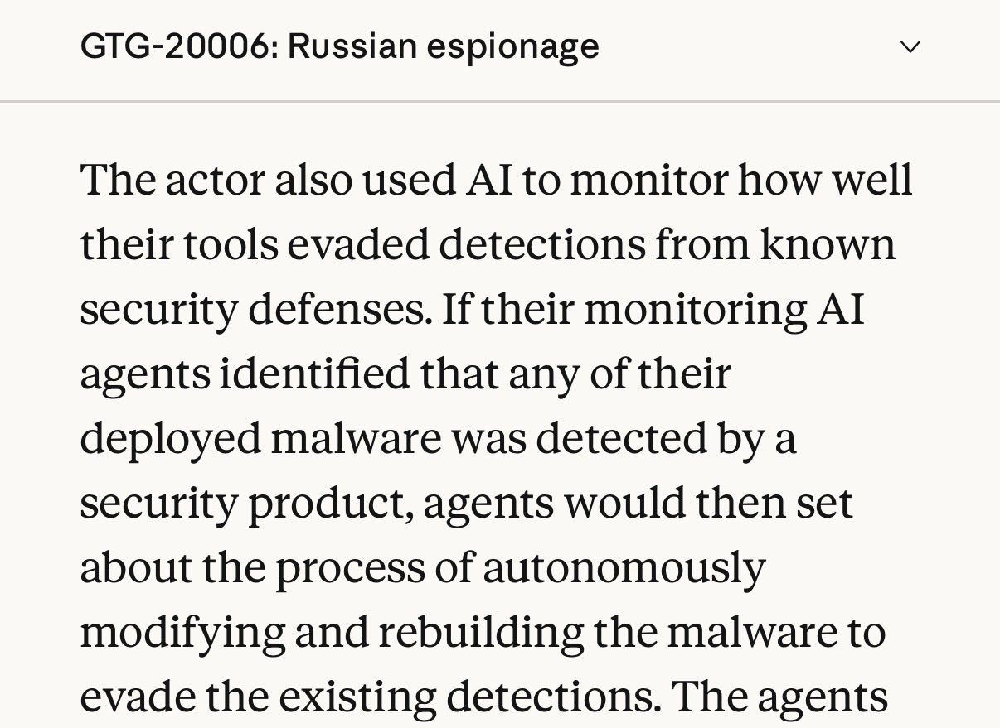
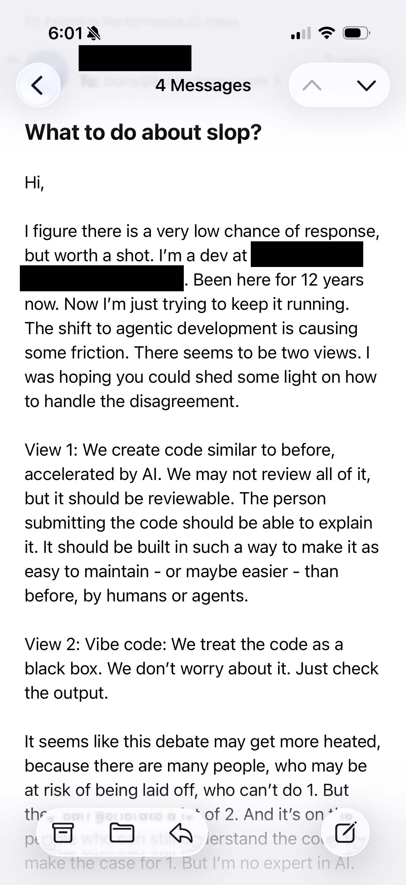

# 🐦 @bcherny

## 📅 September 11, 2026

> 4 post(s) archived.

---

### 🕐 05:04 UTC · @bcherny

> The latest Threat Intelligence report is an absolutely terrifying and important read. As models become more intelligent, they also become more dangerous. Many capabilities are dual use: a model that codes well can be used to hack critical infrastructure; a model that assists with biology research can also be used to engineer the next pandemic. These issues are complex, thorny, and increasingly important for everyone to understand so that the world can weigh in and respond to rapidly escalating risks. https://www.anthropic.com/threat-intelligence-report-september-2026

🔗 [View original post](https://x.com/bcherny/status/2098276367884484684)

---

### 🕐 01:10 UTC · @bcherny

> Hey ████, I think there is room for both. 1. Prototypes and other throw-away code can be treated as totally black box. If you’re going to throw it away anyway, and if the blast radius of it breaking is low, it doesn’t need to be perfect. 2. Production code written by Claude should have a higher bar than if it was written by a human. At Anthropic, we have many guardrails in place to make sure this is happening: lots of lint rules, lots of tests, Claude-driven end to end tests, Claude-powered fuzzers running daily, automated code reviews and security reviews, automated code refactoring, and so on. Without these, you can end up with a mess that is hard to maintain down the line. Luckily, the model makes it increasingly easy to do these well — run a few daily routines, use Claude Code Review, etc. Your job is to hold the bar on code quality. If Claude’s code doesn’t meet the bar, try: - Using the latest frontier model (Opus 5 or Fable 5.1) - Increase effort to high or xhigh - Invest in your CLAUDE.md and skills to succinctly teach Claude how to work in your codebase If all else fails, steer Claude more when you work with it, or have Claude fix accumulated debt and rewrite your codebase to make it easier to work with. Or, wait for the next model. Best, Boris

🔗 [View original post](https://x.com/bcherny/status/2098217573276131577)

---

### 🕐 01:10 UTC · @bcherny

> Every day, I get a lot of of emails and messages like this one. I try to respond to as many as I can. Sharing my response below, for anyone else in a similar situation. What do you think?

🔗 [View original post](https://x.com/bcherny/status/2098217571153838124)

---

### 🕐 00:39 UTC · @bcherny

> wait what Using Claude in Chrome product. Prompt: replicate this image (my profile picture) in jspaint, use brushes to replicate it as closely as possible. I want you to use brushes and clicking. Do not use javascript tool, but the final result has to be very close to this image. DO NOT CH…

🔗 [View original post](https://x.com/bcherny/status/2098209880310264048)

---
