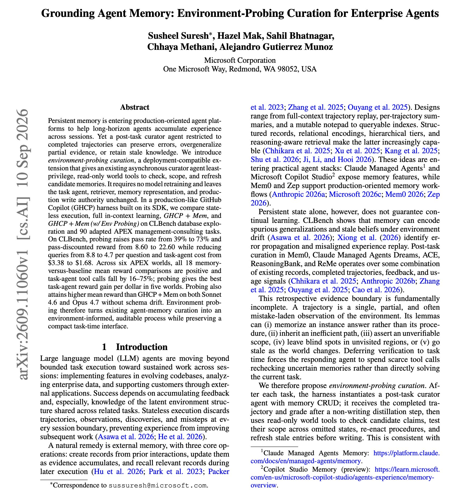
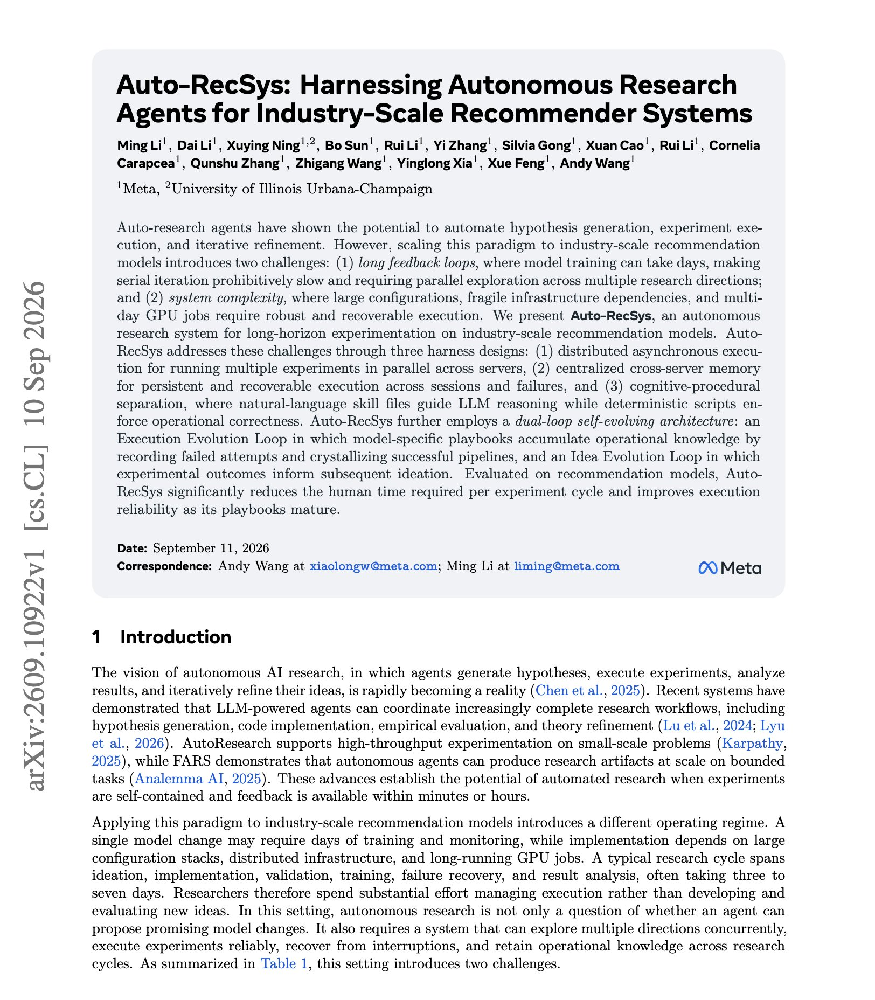

# 🐦 @dair_ai

## 📅 September 11, 2026

> 2 post(s) archived.

---

### 🕐 15:19 UTC · @dair_ai

> Interesting paper from Microsoft. If you run persistent memory for a production agent, this one is worth your time. (bookmark it) Memory curators usually read only the finished trajectory. That lets them save the agent&apos;s mistakes, overgeneralize from partial evidence, and keep facts that have gone stale. Microsoft researchers give the curator a few read-only tools to check each candidate memory against the live environment before it is saved. The task agent, retriever and memory format stay the same, and nothing is retrained. In a GitHub Copilot harness on CLBench, pass rate goes from 39% to 73%. Queries per question drop from 8.8 to 4.7 and task-agent cost falls from $3.38 to $1.68. On 90 consulting tasks across six environments, every memory configuration beats the baseline, and tool calls fall by 16 to 75%. Paper: https://arxiv.org/abs/2609.11060 Chat with Paper: https://academy.dair.ai/papers/grounding-agent-memory-environment-probing-curation-for-enterprise-agents-2609.11060

🔗 [View original post](https://x.com/dair_ai/status/2098431126343929985)

---

### 🕐 15:01 UTC · @dair_ai

> Harness engineering is a top skill right now This new Meta paper is a good production example. Auto-RecSys runs autonomous research on Meta&apos;s industry-scale recommendation models, where one training run can take days. It runs experiments in parallel across servers, keeps a shared memory so work survives failures and new sessions, and splits guidance into natural-language skill files for reasoning and deterministic scripts for anything operational. Two loops improve it over time. Model-specific playbooks record failed attempts and keep working pipelines. Experimental results feed the next round of ideas. As the playbook matured, major fixes per iteration fell from 4.0 to 1.3, and the failures fell into repeatable categories. Paper: https://arxiv.org/abs/2609.10922 Chat with Paper: https://academy.dair.ai/papers/auto-recsys-harnessing-autonomous-research-agents-for-industry-scale-recommender-2609.10922

🔗 [View original post](https://x.com/omarsar0/status/2098426608793362916)

---
