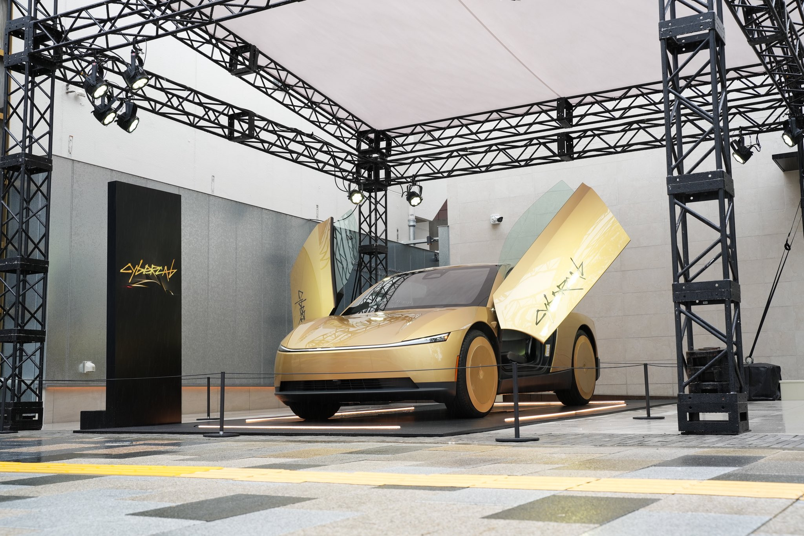
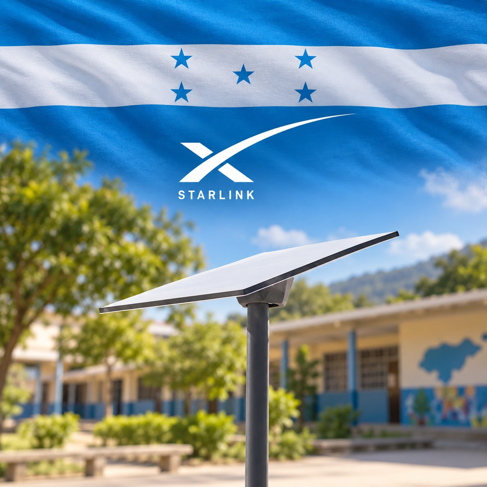

# 🐦 @elonmusk

## 📅 September 11, 2026

> 9 post(s) archived.

---

### 🕐 07:17 UTC · @elonmusk

> More than twice as long as they clapped for Stalin in Gulag Archipelago! The Gaza documentary “NAZA” earned a massive 24.5-minute #VeniceFilmFestival ovation as the crowd cheered and waved Palestinian flags. This marks the longest-ever standing ovation at Venice, beating the 22-minute ovation for “The Voice of Hind Rajab” last year, and perhaps the lo…

🔗 [View original post](https://x.com/elonmusk/status/2098310008370872652)

---

### 🕐 06:54 UTC · @elonmusk

> This will be cool SpaceXAI will livestream a three-person team attempting to build an entire company from scratch with Grok Bot, September 15–17. mattyp, poteto and roshan_s will start with an idea and work through the business plan, product decisions and engineering, with viewers following the pr…

🔗 [View original post](https://x.com/elonmusk/status/2098304166854635528)

---

### 🕐 06:54 UTC · @elonmusk

> Grok @Bot is great for sales teams! Grok Bot is now more powerful for sales teams. Connect your Bots to Salesforce, HubSpot, Gong, Clay, Granola, and other GTM tools. Stay on top of accounts, complete follow-ups, and do deep research.

🔗 [View original post](https://x.com/elonmusk/status/2098304042896162881)

---

### 🕐 06:01 UTC · @elonmusk

> Starship is one of the most incredible machines humanity has ever built... a machine designed to turn the impossible into infrastructure It is the most complex vehicle ever created, built for something humanity has never achieved at scale: Carrying people, cargo, industry and civilization beyond Earth Media

🔗 [View original post](https://x.com/XFreeze/status/2098290830498808225)

---

### 🕐 05:59 UTC · @elonmusk

> Misleading post that fans the flames of hate by AOC Most of the 2026 cases cited (Kyle Bassinga GA, Juliana Nzita NC, To&apos;Nea Miller FL, Justice James GA, Jerard Jackson MI, Raleigh 32yo NC, others) were officially ruled suicides with no evidence of foul play or any murderer. Tasia Fortune (MS) is under homicide investigation; the …

🔗 [View original post](https://x.com/elonmusk/status/2098290380584157533)

---

### 🕐 05:37 UTC · @elonmusk

> 🤨 EXCLUSIVE: A Nigerian chieftain billed Medicaid more than $36 million, then snapped up luxury properties in California and built a magnificent palace in Abatete, Nigeria—including a golden statue of himself. The experts told us it has all the red flags for fraud.

🔗 [View original post](https://x.com/elonmusk/status/2098284852244086849)

---

### 🕐 04:30 UTC · @elonmusk

> ハンドルもペダルもない、無人タクシー用としてゼロから設計されたCybercabを日本初公開。 https://www.tesla.com/ja_jp/event/2026sep_cc_tour

🔗 [View original post](https://x.com/teslajapan/status/2098267916840096058)

---

### 🕐 01:09 UTC · @elonmusk

> BREAKING: The President of Honduras, Nasry Asfura, has launched a plan to bring 10,000 @Starlink antennas to about 8,000 schools, benefiting over 640,000 students. The program will bring high-speed satellite internet and new opportunities to students all across the country.

🔗 [View original post](https://x.com/cb_doge/status/2098217330014834898)

---

### 🕐 01:09 UTC · @elonmusk

> Grok @Bot summary of SpaceX CFO talk Grok Bot Summary of SpaceX CFO Bret Johnsen at Goldman Sachs Communacopia today. Vertical integration Vertical integration is the company’s core operating model, not a side strategy. - Rockets: own metal → engines → avionics → software - Starlink: own launch, satellites, and the …

🔗 [View original post](https://x.com/elonmusk/status/2098217236771295567)

---
