# 🐦 @Unlockyourlife_

## 📅 September 12, 2026

> 33 post(s) archived.

---

### 🕐 18:30 UTC · @Unlockyourlife_

> SUPER idea with duct tape and a bag for survival Media

🔗 [View original post](https://x.com/_learnskills/status/2098841729818308820)

---

### 🕐 17:41 UTC · @Unlockyourlife_

> Long-term relationships need intentional effort because familiarity can make people careless. Keep dating each other. Keep asking questions. Keep noticing the little things.

🔗 [View original post](https://x.com/ThePartnersCode/status/2098829467300884796)

---

### 🕐 17:12 UTC · @Unlockyourlife_

> A simple 5-day split to build muscle 💪🔥

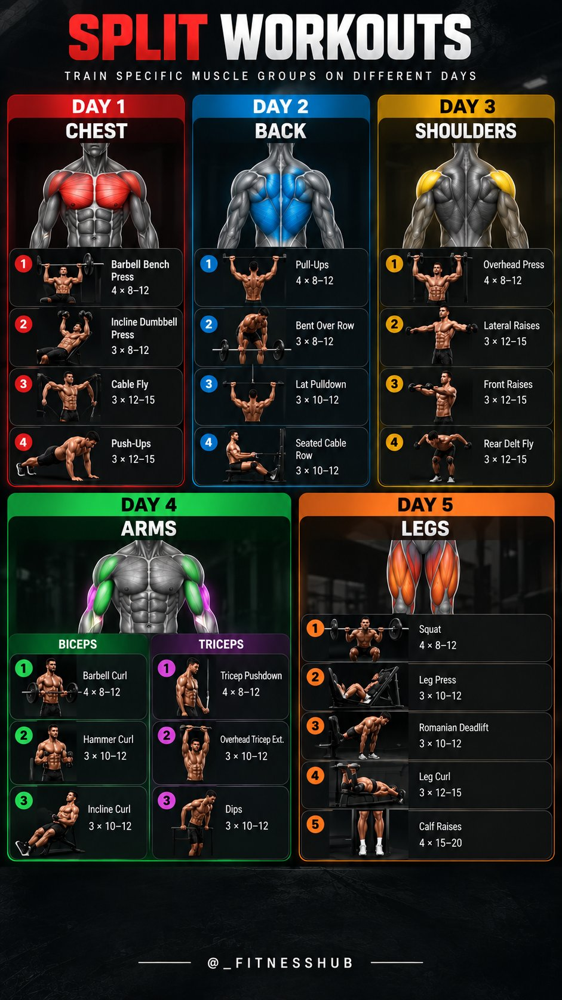

🔗 [View original post](https://x.com/_fitnesshub/status/2098821960486539284)

---

### 🕐 16:28 UTC · @Unlockyourlife_

> JUST BECAUSE A MEDICATION IS COMMON DOESN&apos;T MEAN IT&apos;S SAFE FOR YOU. Some medicines that you can buy easily or are prescribed routinely can cause serious problems in certain people. Here are 6 common medications some people need to avoid. 1. IBUPROFEN

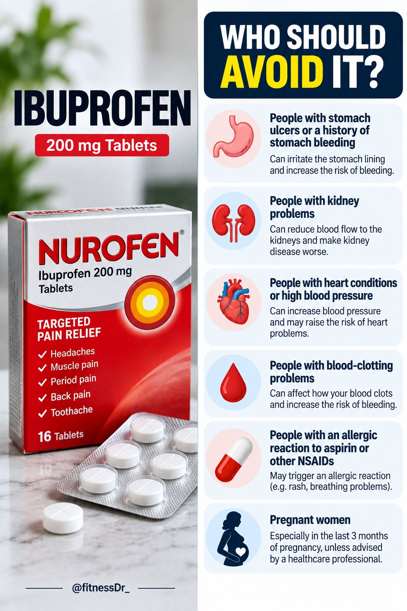

🔗 [View original post](https://x.com/FitnessDr_/status/2098810933074125304)

---

### 🕐 15:05 UTC · @Unlockyourlife_

> the difference between people who win and those who don’t, is consistency over time.

🔗 [View original post](https://x.com/Unlockyourlife_/status/2098790199262101676)

---

### 🕐 14:59 UTC · @Unlockyourlife_

> Napoleon Bonaparte was once forced into a chaotic retreat by a charging horde of rabbits. This bizarre attack happened because his staff made a critical error, buying tame rabbits that expected food instead of wild ones. What&apos;s the most underrated logistical failure in history?

🔗 [View original post](https://x.com/Mastering_life_/status/2098788610413920431)

---

### 🕐 14:48 UTC · @Unlockyourlife_

> As a man: 1. Stop chasing validation → Validate yourself 2. Stop impressing people → Improve yourself 3. Stop posting everything → Move in silence 4. Stop fake lifestyle → Build real value 5. Stop attention seeking → Stay focused 6. Stop overexplaining → Let results talk 7. Stop proving yourself → Show results 8. Stop noise → Stay quiet 9. Stop clout chasing → Build respect 10. Stop talking → Start doing

🔗 [View original post](https://x.com/Masculinjournal/status/2098785834241503678)

---

### 🕐 14:00 UTC · @Unlockyourlife_

> Don’t ignore persistent or unusual changes in your body. They don’t always mean something serious, but listening early and getting the right medical advice can help you catch potential problems before they become bigger ones. 🫶🏽

🔗 [View original post](https://x.com/_fitnesshub/status/2098773671720423747)

---

### 🕐 14:00 UTC · @Unlockyourlife_

> 7.

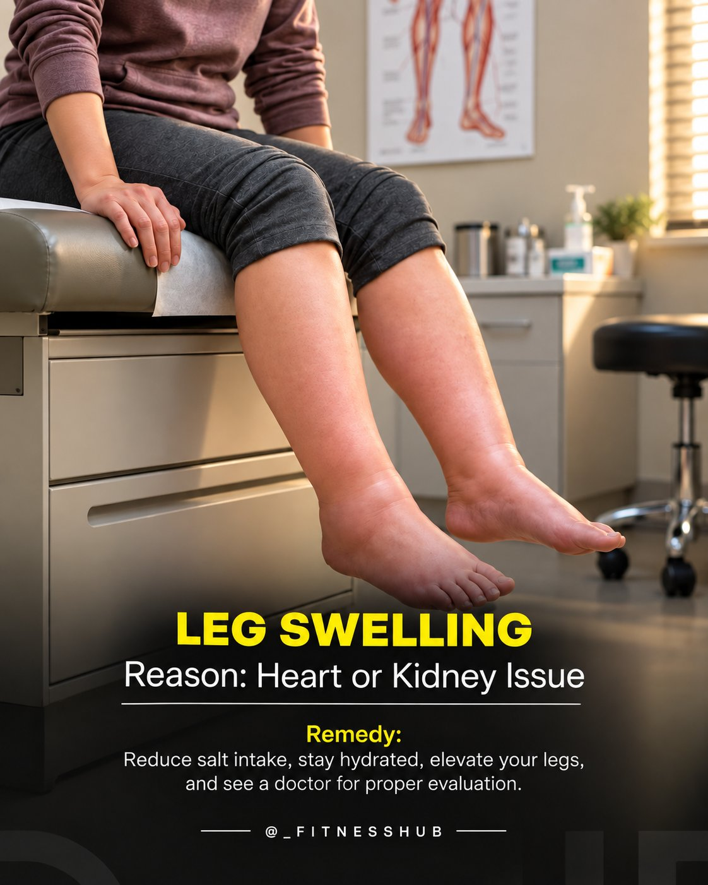

🔗 [View original post](https://x.com/_fitnesshub/status/2098773667136119196)

---

### 🕐 14:00 UTC · @Unlockyourlife_

> 6.

🔗 [View original post](https://x.com/_fitnesshub/status/2098773661377241105)

---

### 🕐 14:00 UTC · @Unlockyourlife_

> 5.

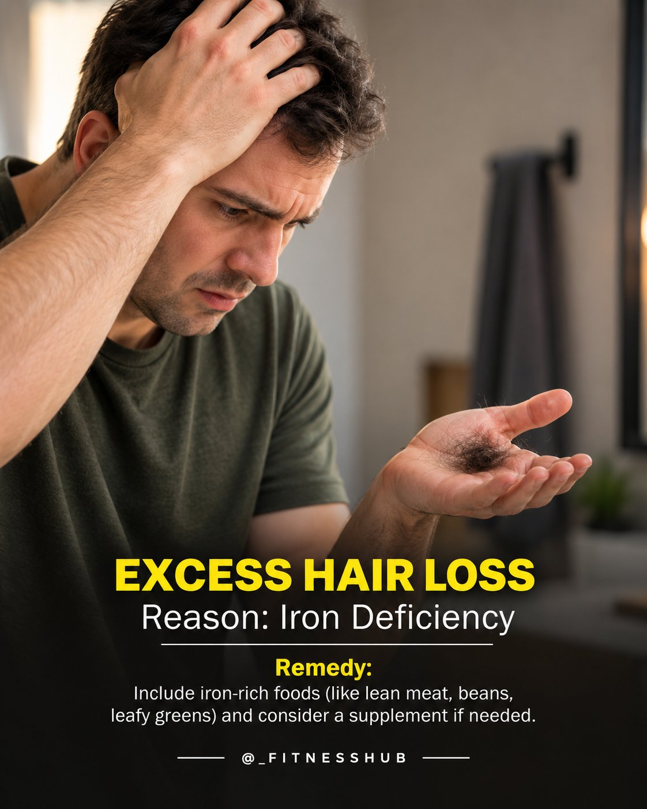

🔗 [View original post](https://x.com/_fitnesshub/status/2098773655295521017)

---

### 🕐 14:00 UTC · @Unlockyourlife_

> 4.

🔗 [View original post](https://x.com/_fitnesshub/status/2098773648861475017)

---

### 🕐 14:00 UTC · @Unlockyourlife_

> 3.

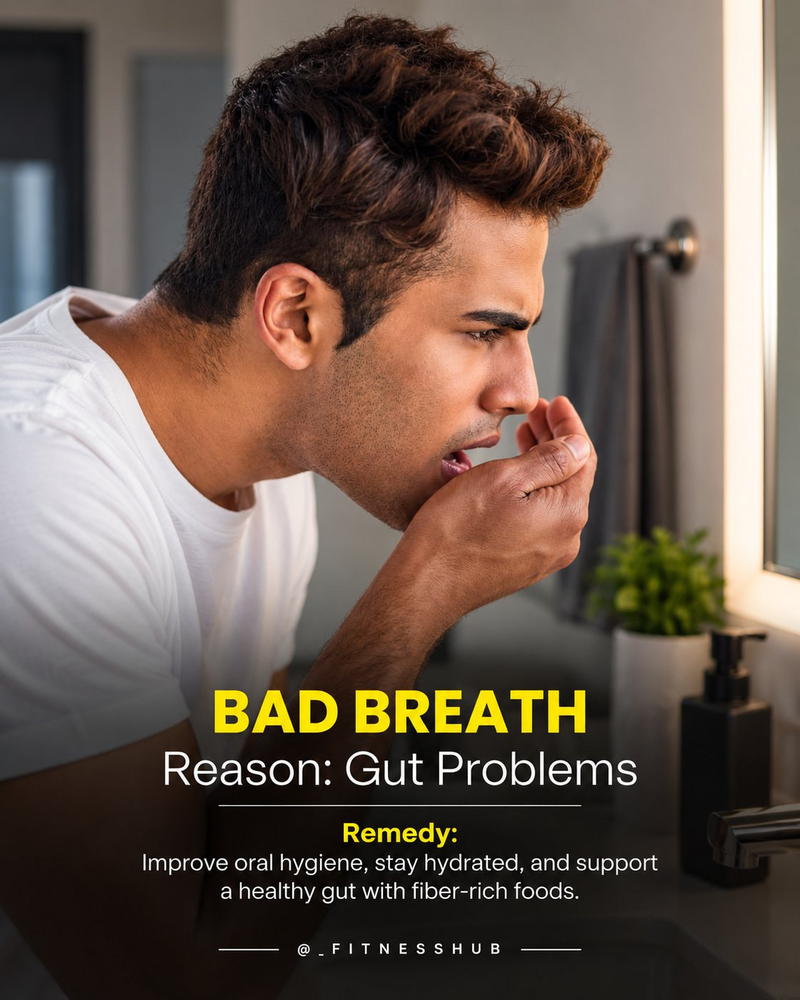

🔗 [View original post](https://x.com/_fitnesshub/status/2098773642343518234)

---

### 🕐 14:00 UTC · @Unlockyourlife_

> 2.

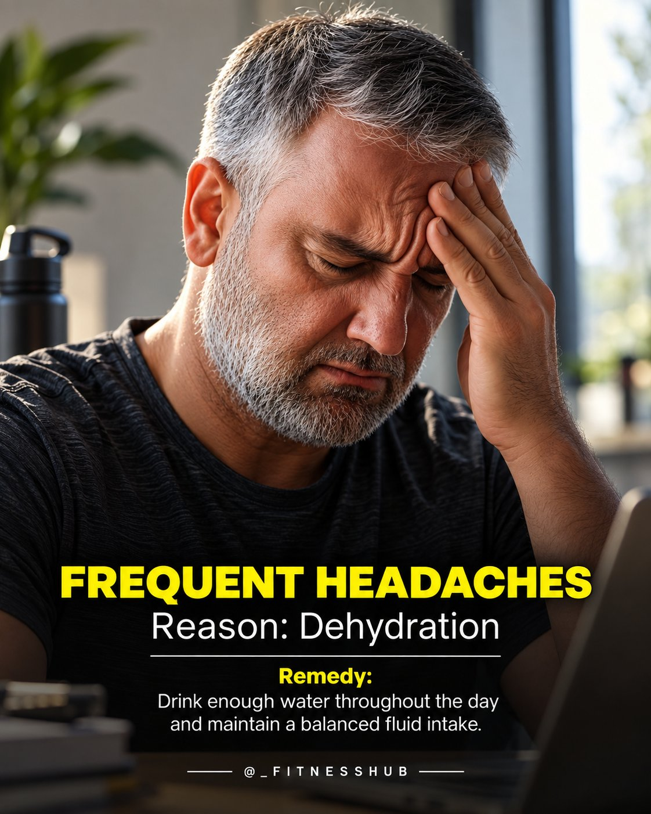

🔗 [View original post](https://x.com/_fitnesshub/status/2098773634701500908)

---

### 🕐 14:00 UTC · @Unlockyourlife_

> 7 warning signs your body is sending you. Your body is constantly sending you signals, but some of them are easy to overlook. 👀 Here are 7 signs you need to take notice of. 🧠 1.

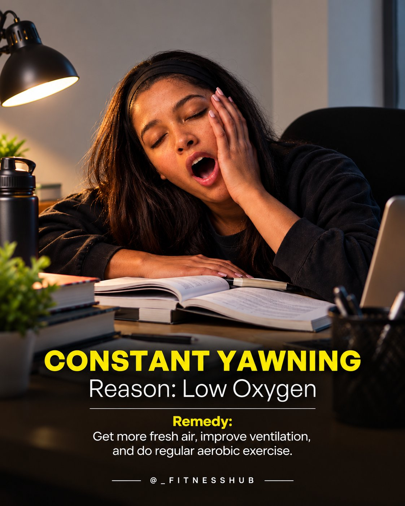

🔗 [View original post](https://x.com/_fitnesshub/status/2098773628082938263)

---

### 🕐 12:26 UTC · @Unlockyourlife_

> A lasting relationship isn&apos;t about finding someone who perfectly meets every expectation. It&apos;s about finding two people willing to communicate honestly, compromise wisely, repair sincerely, and grow together.

🔗 [View original post](https://x.com/ThePartnersCode/status/2098750152001339780)

---

### 🕐 12:08 UTC · @Unlockyourlife_

> You don&apos;t need to get everything before you get married. Take that step.

🔗 [View original post](https://x.com/Masculinjournal/status/2098745623730094486)

---

### 🕐 12:02 UTC · @Unlockyourlife_

> 50 passive income ideas to start today

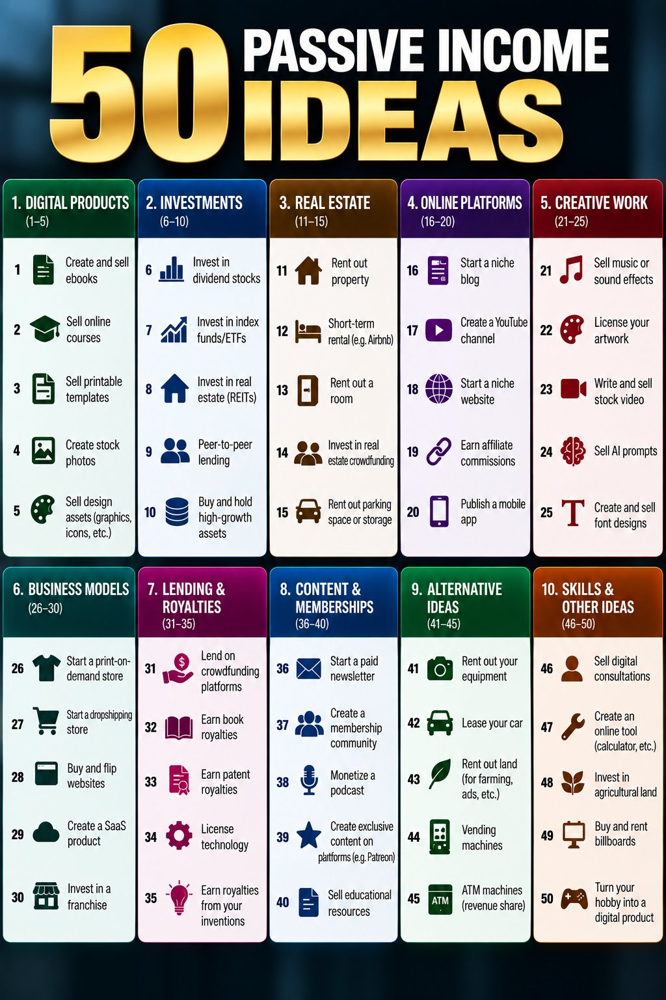

🔗 [View original post](https://x.com/_learnskills/status/2098743946755097010)

---

### 🕐 11:24 UTC · @Unlockyourlife_

> A man should have something bigger than entertainment. - A purpose. - A craft. - A business. - A family. - A mission. Something worth sacrificing comfort for. Too much comfort without purpose eventually becomes stagnation.

🔗 [View original post](https://x.com/Masculinjournal/status/2098734444425163229)

---

### 🕐 11:21 UTC · @Unlockyourlife_

> 5 foods that are almost impossible to resist: 🍗 Crispy fried chicken 🍕 Freshly baked pizza 🍫 Warm chocolate brownies 🍟 Loaded fries 🍝 Creamy pasta The only problem? They all taste better when you&apos;re supposed to be eating healthy. 😂

🔗 [View original post](https://x.com/Elitedelicacy/status/2098733824205095156)

---

### 🕐 11:02 UTC · @Unlockyourlife_

> What happens when you make cold showers a daily habit

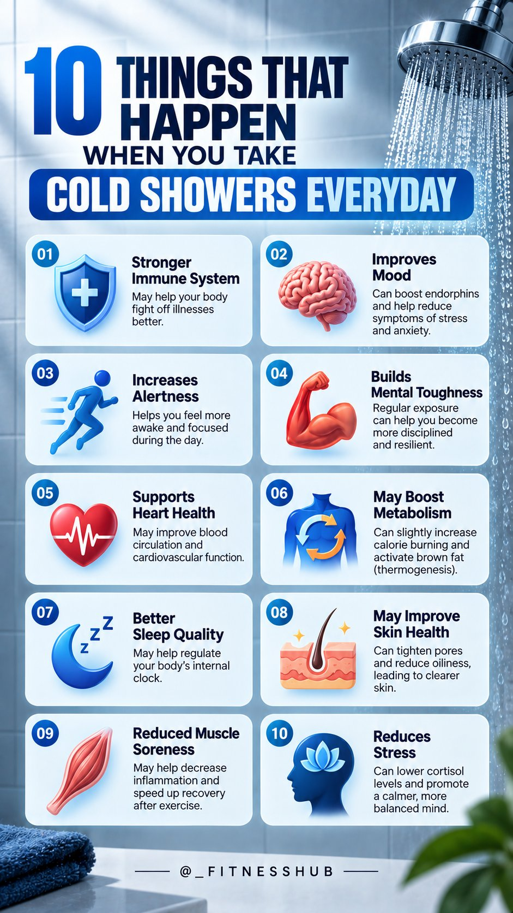

🔗 [View original post](https://x.com/_fitnesshub/status/2098728954697765028)

---

### 🕐 10:36 UTC · @Unlockyourlife_

> You spend most of your day sitting, then wonder why your back hurts, your legs feel stiff and your energy stays low. The problem may not be your age. It may be how little you move throughout the day.

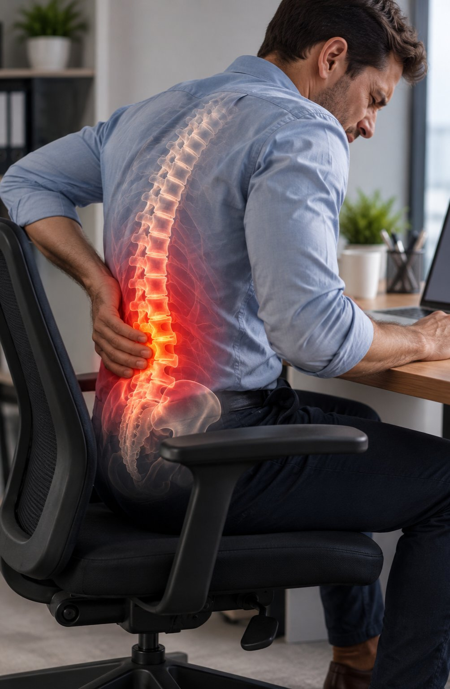

🔗 [View original post](https://x.com/BioLifex/status/2098722470614245406)

---

### 🕐 10:21 UTC · @Unlockyourlife_

> Walking is underrated because it isn&apos;t impressive. But that&apos;s exactly why it&apos;s useful. You can do it regularly. It doesn&apos;t destroy your recovery. It increases daily activity. And it can help create the energy deficit needed for fat loss. You don&apos;t need every form of exercise to feel brutal.

🔗 [View original post](https://x.com/_alphafit/status/2098718669475926374)

---

### 🕐 09:19 UTC · @Unlockyourlife_

> You may be experiencing changes in your weight, energy, heartbeat, body temperature or mood But what if the problem isn&apos;t simply your lifestyle? Your thyroid could be involved. Here are the thyroid diseases you should know about.👇

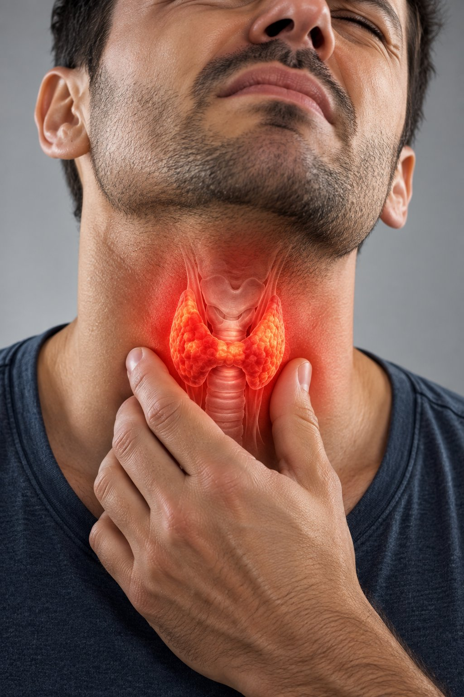

🔗 [View original post](https://x.com/FitnessDr_/status/2098702998113333721)

---

### 🕐 07:58 UTC · @Unlockyourlife_

> Your lungs don’t just need clean air — they also benefit from a healthy, balanced diet. You don’t have to completely avoid these foods, but eating them less often and choosing more whole, nutrient-rich foods can support better overall and lung health.

🔗 [View original post](https://x.com/_fitnesshub/status/2098682610033598715)

---

### 🕐 07:58 UTC · @Unlockyourlife_

> 5.

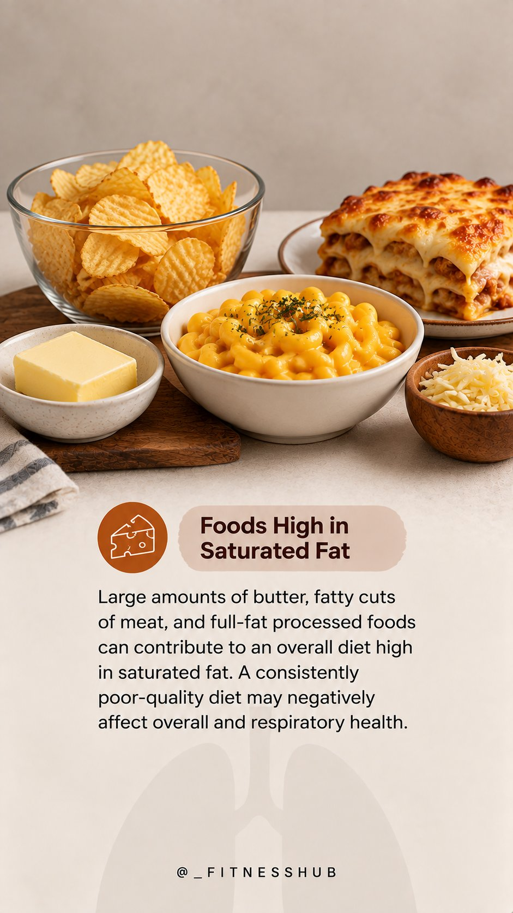

🔗 [View original post](https://x.com/_fitnesshub/status/2098682604539068483)

---

### 🕐 07:58 UTC · @Unlockyourlife_

> 4.

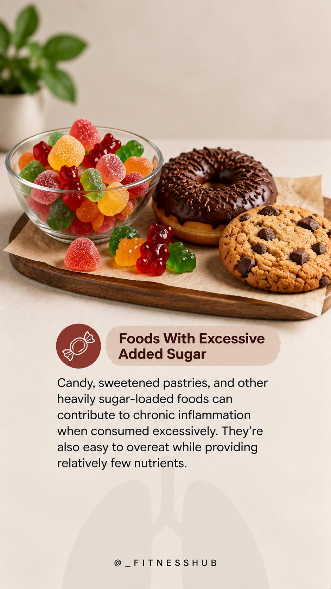

🔗 [View original post](https://x.com/_fitnesshub/status/2098682598100791647)

---

### 🕐 07:58 UTC · @Unlockyourlife_

> 3.

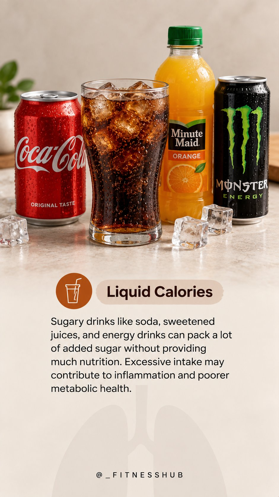

🔗 [View original post](https://x.com/_fitnesshub/status/2098682590924267955)

---

### 🕐 07:58 UTC · @Unlockyourlife_

> 2.

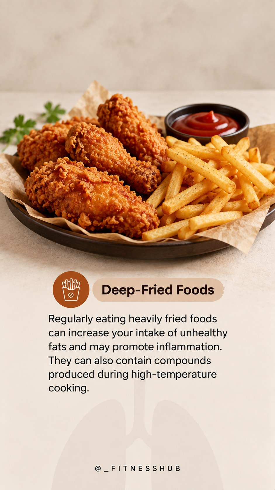

🔗 [View original post](https://x.com/_fitnesshub/status/2098682585438106106)

---

### 🕐 07:58 UTC · @Unlockyourlife_

> 🫁 5 Foods That May Slowly Harm Your Lung Health. Some foods may be quietly working against your lung health. Here are 5 you shouldn&apos;t overdo. 🫁

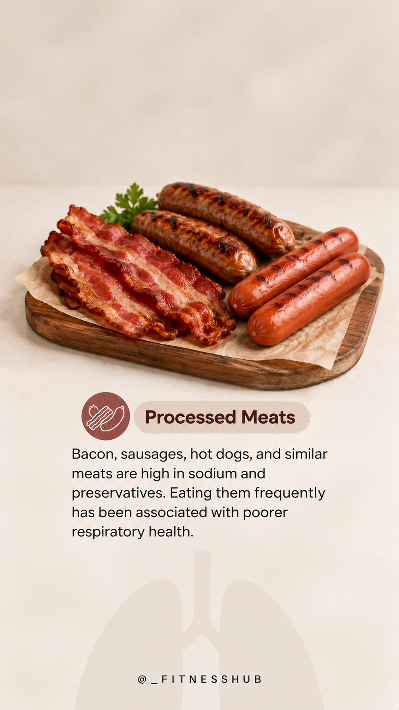

🔗 [View original post](https://x.com/_fitnesshub/status/2098682579658408368)

---

### 🕐 07:27 UTC · @Unlockyourlife_

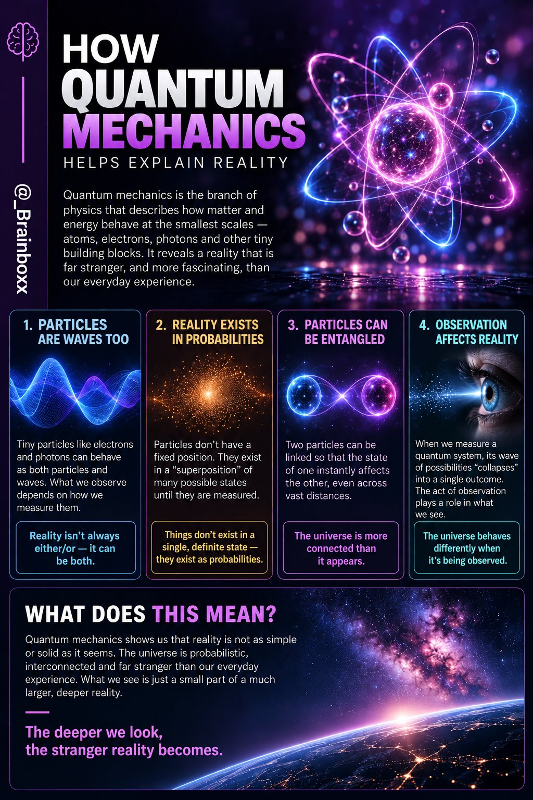

🔗 [View original post](https://x.com/_Brainboxx/status/2098674735034835244)

---

### 🕐 06:45 UTC · @Unlockyourlife_

> To maintain good health, focus on the basics: • Eat a varied, balanced diet • Exercise regularly • Sleep 7–9 hours when possible • Stay adequately hydrated • Avoid smoking • Limit alcohol • Keep up with recommended health checks These habits reduce the risk of many chronic diseases.

🔗 [View original post](https://x.com/BioLifex/status/2098664393118519753)

---

### 🕐 06:15 UTC · @Unlockyourlife_

> One day, the things you&apos;re currently rushing to achieve may become ordinary. The bigger house. The better car. The higher salary. So don&apos;t postpone your entire life until you &quot;make it.&quot; Build ambition without forgetting gratitude. A successful man should still know how to enjoy the life he&apos;s building.

🔗 [View original post](https://x.com/Masculinjournal/status/2098656608540668330)

---
