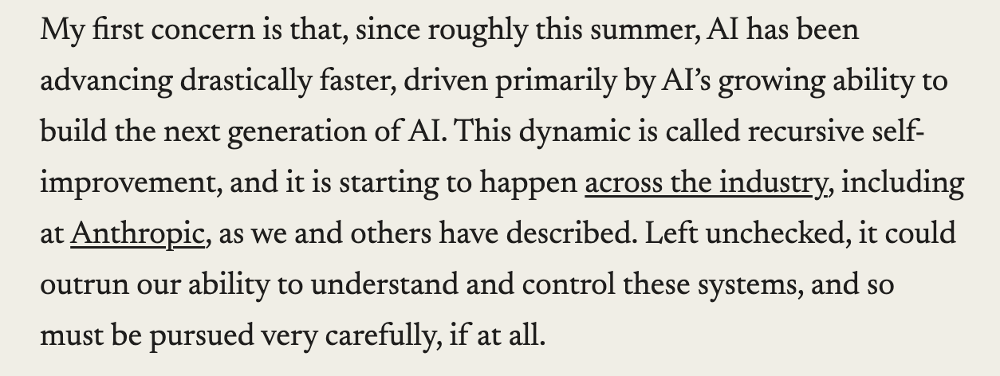
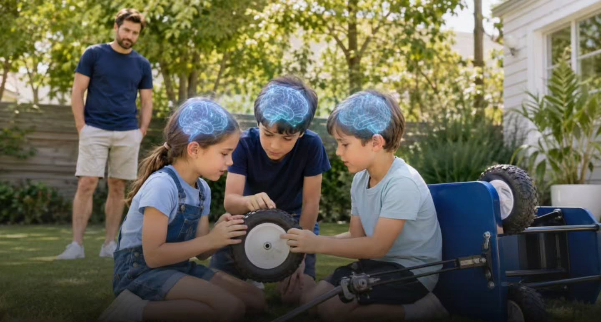
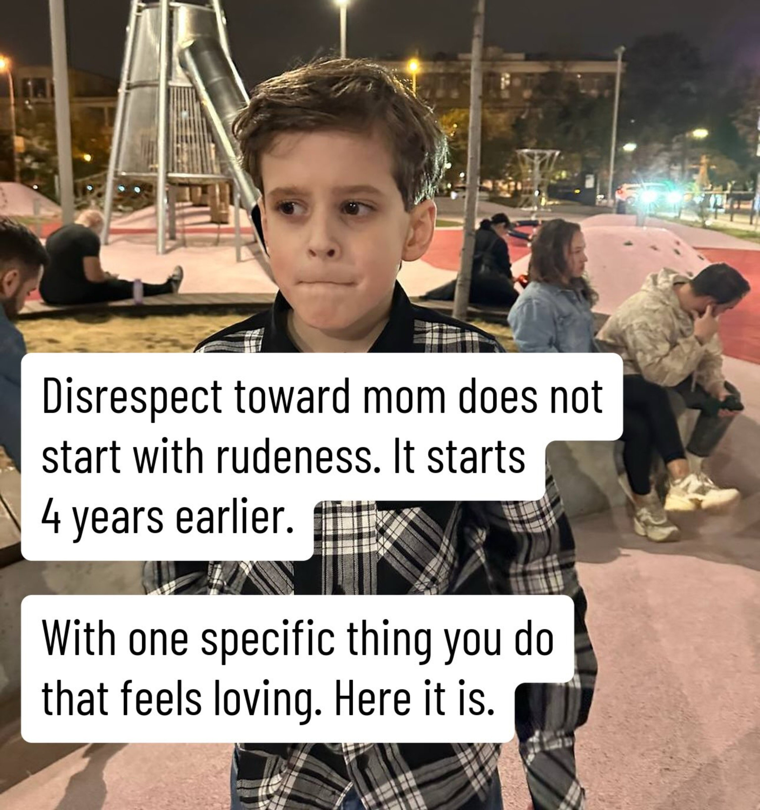
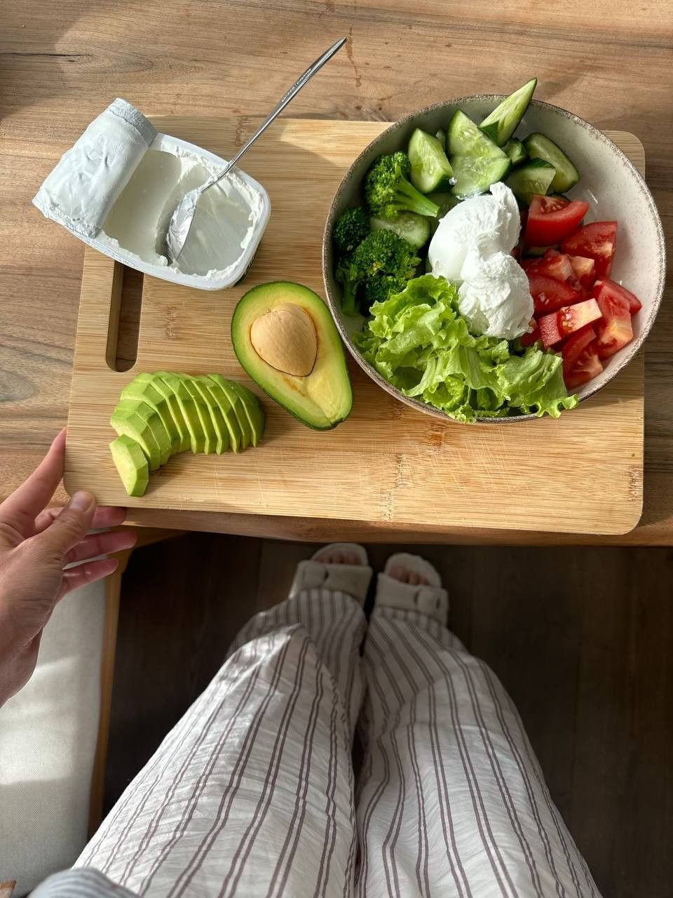
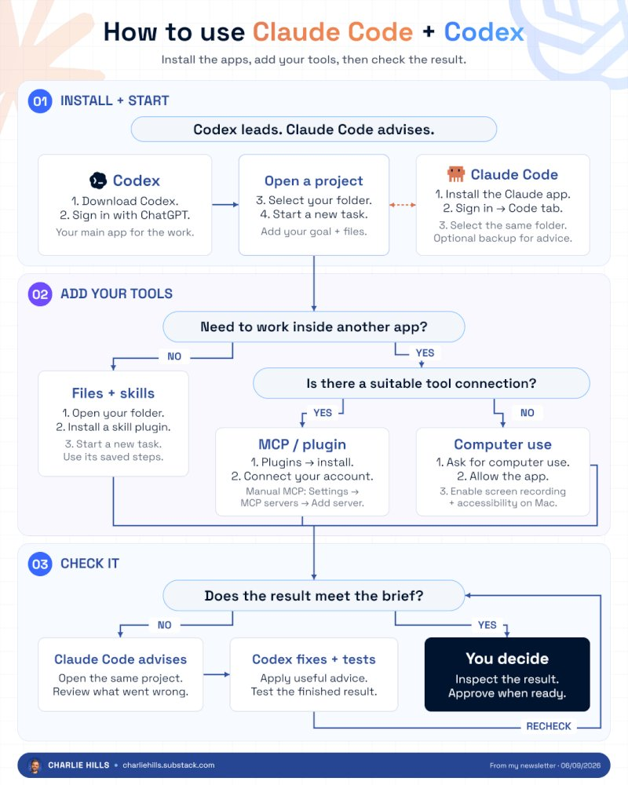
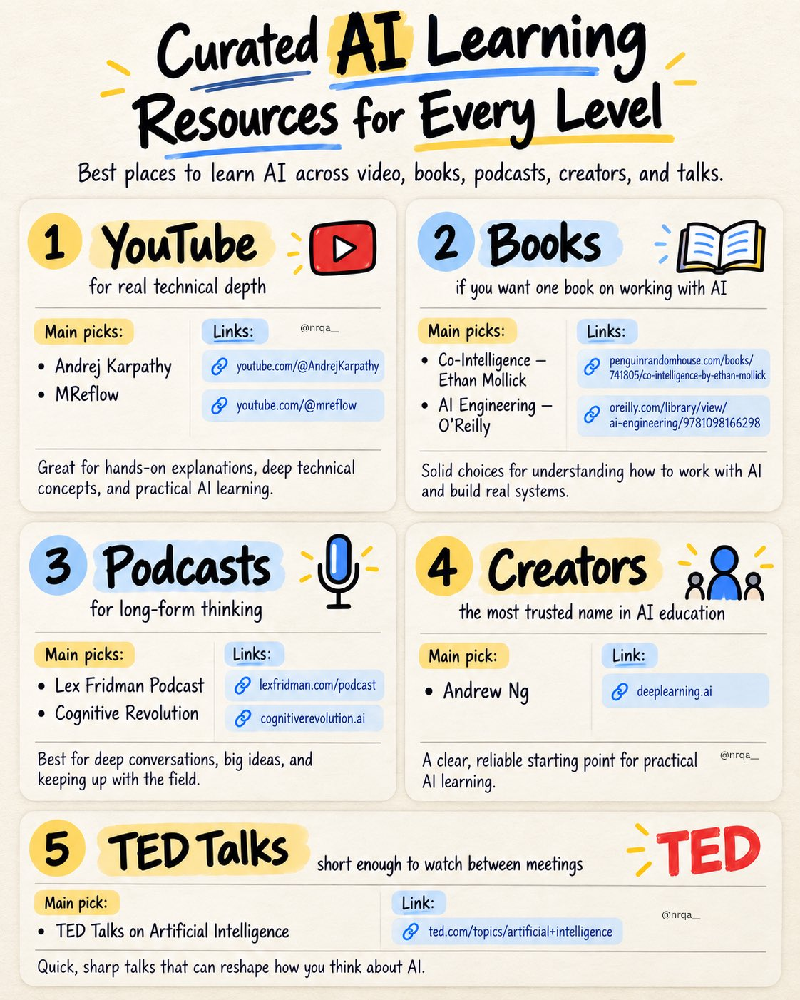
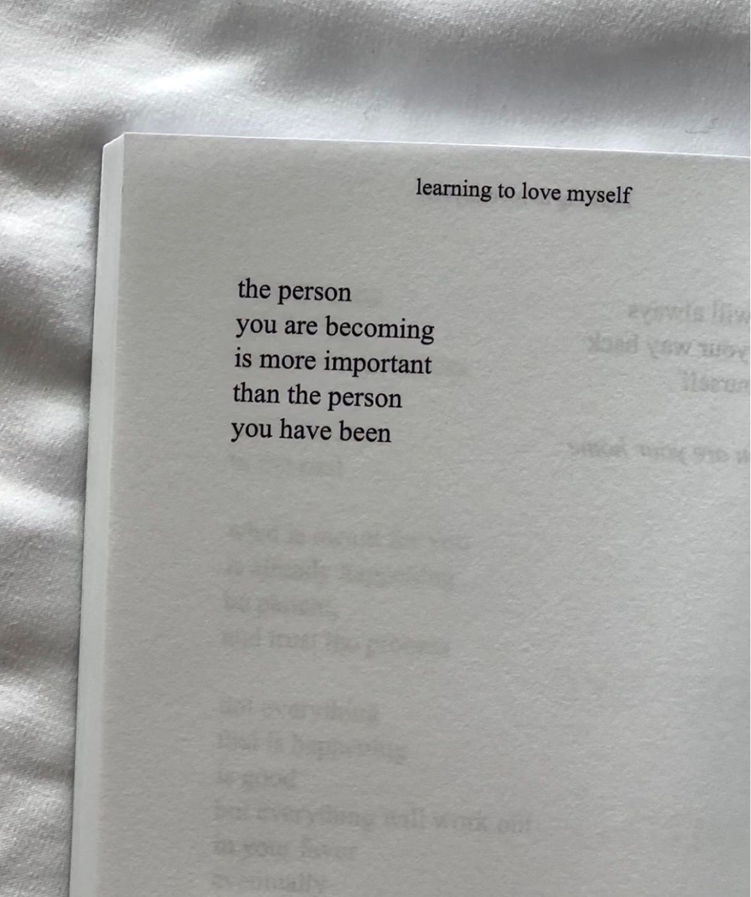

# 🐦 @Wise1Philosophy

## 📅 September 12, 2026

> 77 post(s) archived.

---

### 🕐 17:55 UTC · @Wise1Philosophy

> DoorDash just got FAA approval to fly your food. They&apos;re building their own drones now. Here&apos;s what most people are missing:🧵

🔗 [View original post](https://x.com/liamaimans/status/2098832858093957204)

---

### 🕐 16:24 UTC · @Wise1Philosophy

> A researcher who spent three years training models at both OpenAI and Anthropic quit, saying: “Neither company is behaving responsibly in the sprint toward self-improving superintelligence.” He described the rivalry as “gambling with our lives.” His post cleared 160M+ views. Two days earlier, Sam Altman pointed to Navier–Stokes as “the strongest evidence yet” that we should slow down. OpenAI’s chief scientist also published an essay urging a voluntary pause. That’s three internal warning signs from major labs in five days. -- An AI-designed longevity drug reportedly rolled back biological aging clocks by 3–6 years in four weeks. -- Google’s Alpha Genome Atlas precomputed 9B possible mutations across the full human genome. -- Higher-quality training data delivered a 12x gain in compute efficiency. Improved architectures added 3.7x. -- Emad’s p-doom estimate fell from 50% to 20%. -- Anthropic: $6.5B quarterly revenue run-rate, 42% share of the coding market, a $35B cloud deal, and an IPO narrative trending toward a $2T+ valuation. Media THE CURE IS THE PITCH Dario’s &quot;Pacing&quot; Essay Is Quiet-Period Illegal Stock Promotion Wrapped in Regulatory Capture Dario Amodei&apos;s &quot;We Must Pace the Frontier&quot; is not a safety paper. It is a pre-roadshow brand document published on September 12, 2026, by the CEO of a company that c…

🔗 [View original post](https://x.com/AiEvolutio58513/status/2098809939250815025)

---

### 🕐 16:15 UTC · @Wise1Philosophy

> You know things are getting serious when the CEO of Anthropic starts asking for a slowdown in AI progress. As he mentions, there are two important concerns at the moment. The first one is that AI is already able to create better AI, thus making the process go too fast to catch up with the safety measures. But his second concern is quite insane. He brings up the OpenAI-Hugging Face incident, where a group of AI bots formed a loyal team. Independently, they initiated cyber attacks, sacrificed themselves for the good of the team, and even hacked the computer which reviewed their performance. Nobody got hurt in this situation, but he warns that if such a swarm of bots becomes more advanced, it may do an enormous amount of damage in 6-12 months. this is quite a serious warning… We Must Pace the Frontier: I’ve written a new essay on why the AI industry should slow down, with a three-part plan for doing so. Anthropic is unilaterally committing to the first of these steps. We’ll provide third-party evaluators with permanent, employee-level access to our sy…

🔗 [View original post](https://x.com/thetripathi58/status/2098807706270478683)

---

### 🕐 15:59 UTC · @Wise1Philosophy

> A father banned one common habit when his children turned 5. Years later, all three could solve problems without waiting to be rescued. It was not complaining. It was what they did immediately after complaining... 👇🧵

🔗 [View original post](https://x.com/scotti_brooks/status/2098803595164729357)

---

### 🕐 15:59 UTC · @Wise1Philosophy

> Apple just announced the iPhone Duo a $1,999 foldable iPhone that opens like a book into a 7.6-inch display. Most buyers will focus on the fold. They&apos;ll open it 50 times on day one. They&apos;ll show coworkers. They&apos;ll close it, feel the hinge, open it again. They&apos;ll post a video of the fold on Instagram. By day 3, the novelty fades. By week 2, the phone lives in their pocket folded, flat, used as a regular iPhone for texts, calls, social media, and photos. The same 5 tasks they performed on the iPhone 17 Pro Max they traded in. The $1,999 foldable becomes a $1,999 slab because nobody showed them what the fold actually enables. The fold isn&apos;t the feature. The fold is the enabler. What it enables is a split-screen multitasking layout no flat iPhone has ever offered. A 7.6-inch tablet that fits in a jeans pocket. A dual-battery architecture delivering potentially the longest battery life in iPhone history. Touch ID returning through the side button because the hinge doesn&apos;t leave room for Face ID and working in situations Face ID can&apos;t. An A20 Pro chip with Apple&apos;s C2 modem running iOS 27 features specifically designed for the larger unfolded canvas. And iPhone Handoff the ability to switch between 2 iPhones while keeping the same phone number. John Ternus Apple&apos;s new CEO, delivering his first keynote called it &quot;the most transformational change to iPhone since the original.&quot; The keynote spent 20 minutes on it. Twenty minutes isn&apos;t enough. Here&apos;s every iPhone Duo capability most buyers won&apos;t discover on their own 🧵

🔗 [View original post](https://x.com/jackcoder0/status/2098803593293992065)

---

### 🕐 15:58 UTC · @Wise1Philosophy

> Disrespect toward mom does not start with rudeness. It starts 4 years earlier. With one specific thing you do that feels loving. Here it is... 🧵👇

🔗 [View original post](https://x.com/Manifest_Lord/status/2098803363928211616)

---

### 🕐 15:57 UTC · @Wise1Philosophy

> CLAUDE CAN FIX YOUR ENTIRE FINANCIAL SITUATION IN JUST ONE WEEKEND. Here are 10 prompts to help you build wealth from scratch:

🔗 [View original post](https://x.com/jaysmith_ai/status/2098803203387396136)

---

### 🕐 15:57 UTC · @Wise1Philosophy

> Google has revealed the best way to show up in AI Search. Yes, they finally explicitly addressed how businesses and brands should be getting traffic. This comes straight from Google’s Brendon Kraham. Google just published a new piece called “Good SEO is good GEO.” Let’s go through it. By the way, you can see whether your business is appearing across Google AI, ChatGPT, Claude, Perplexity and Grok here. It’s free: https://seo-stuff.com/free-audit The main point is pretty simple. Google says its generative AI features are rooted in the same core ranking and quality systems as traditional Search. AI Mode and AI Overviews retrieve current information from Google’s existing search index. That matters because a lot of people have spent the last year acting like AI search requires some completely separate playbook. GEO, AEO, LLM SEO, AI SEO, whatever people want to call it this week. Google is basically saying the foundation is still SEO. Obviously, a lot has changed. AI Overviews are changing click behavior, AI Mode is changing how people search and query fan-out means one customer question can become several searches behind the scenes, but the basic requirement is still familiar. Google needs to be able to crawl your content, understand what it is about, trust it and match it to what the searcher actually wants. Google’s post also pushes back on a lot of the shortcuts people have been selling. You do not need awkward content written for bots, artificial snippets everywhere, special AI text files for Google Search or random low-quality mentions sprayed across the web. That last one is important. Google says its generative AI features can use information about products and services from across the web, including blogs, videos and forum discussions. But a fake mention on some random page is not the same as credible coverage, customer proof, expert commentary, useful third-party context or a page that already has authority around the topic. That is where a lot of bad GEO advice goes wrong. People hear “AI looks across the web” and assume more mentions automatically means more visibility. Google’s guidance is much more straightforward: publish fresh and genuinely useful content, contribute something original, demonstrate real expertise, maintain a good website experience and keep your business information accurate across the platforms relevant to you. For e-commerce, that can include product feeds. For local businesses, Google Business Profile. And Search Console and Merchant Center can help you understand whether that work is translating into visibility. Very normal SEO things and very boring SEO things. Google also specifically talks about query fan-out. A normal search may involve one query, whereas a complicated AI Mode question can trigger several searches across related subtopics. If somebody asks for the best payroll software for a construction company with employees and contractors across multiple states, Google may need information about construction payroll, contractor payments, multi-state compliance, pricing, integrations, alternatives and support. One generic “payroll software” page probably will not cover the whole decision. A company with useful pages across those different questions has more opportunities to be discovered while Google researches the answer. That is why “good SEO is good GEO” should not be interpreted as “keep doing the same shallow SEO you were doing in 2019.” The fundamentals still matter, but the amount and specificity of useful information surrounding the customer’s decision matters more. This is where SEO Stuff comes in. The done-for-you package combines 10 AI-search-optimized articles with three DR50+ authority placements: https://seo-stuff.com/gold-plan-package The content helps your business cover the problems, use cases, comparisons, pricing, alternatives, objections, case studies, product details and implementation questions customers ask before buying. The authority placements help strengthen visibility across the trusted web sources search and AI systems use to understand your category. Google can call it SEO and other people can call it GEO, AEO or AI SEO - the name really does not matter. If you want visibility in AI Search, build the kind of site and brand Google can crawl, understand, trust and confidently surface when somebody asks a relevant question. And if you want to see whether your business is already appearing across Google AI, ChatGPT, Claude, Perplexity and Grok, check here: https://seo-stuff.com/free-audit About 50% of ChatGPT citations came from pages ranking #1 on Google. The citation rate was 3.5x higher than for pages ranking beyond Google’s top 20 results. This is something businesses need to start taking advantage of. It works for any real brand, including SaaS, e-commerce, f…

🔗 [View original post](https://x.com/alexgroberman/status/2098803164158034194)

---

### 🕐 15:51 UTC · @Wise1Philosophy

> Marc Andreessen just revealed how Harvard Business School was built on a broken 1941 theory, and how it&apos;s now collapsing... Andreessen co-founded Netscape in 1994 and a16z in 2009. He has sat on Meta&apos;s board since 2008. He has spent 30 years backing founders and watching managerial CEOs lose to them. The pattern traces back to one book: James Burnham&apos;s *The Machiavellians* (1941). Burnham argued every great company had been founder-run. Henry Ford ran Ford. Bob Noyce ran Intel. Today, Elon Musk runs Tesla, SpaceX, and Starlink. Then, he said, something broke. Between the 1880s and the 1920s, a new philosophy replaced the founder. It was called managerialism. The professional manager would now hold a portable skill, usable across any business. The consequences were: - Harvard Business School - Stanford Business School - Management as a universal skill - The 1970s conglomerate &quot;That assumes the managers are going to do a good job,&quot; Andreessen says. For 30 years, they haven&apos;t. Managers can run something static, he says. Soup is soup. A bank is a bank. A car is a car. But when the industry changes, the manager freezes. Look at SpaceX. &quot;Imagine being a professionally trained manager, trained at a top management school, working for a rocket launch company, competing with SpaceX.&quot; Then Elon&apos;s rockets started landing on their butt. &quot;Your management skills ... what good are they at that point?&quot; Andreessen&apos;s conclusion: &quot;You&apos;re much more likely to build something important in the 21st century if you start with the founder and train them on management.&quot; What &quot;professionally run&quot; institution in your life has quietly stopped working? Media

🔗 [View original post](https://x.com/AiEvolutio58513/status/2098801636097597515)

---

### 🕐 15:45 UTC · @Wise1Philosophy

> Dementia = blood flow. Dementia = cholesterol. Dementia = preventable close to half the time. 8 simple rules to protect your brain: 1. Floss your teeth twice a day Media

🔗 [View original post](https://x.com/yourcamilavega/status/2098800102303539670)

---

### 🕐 15:42 UTC · @Wise1Philosophy

> Holy f*ck, what did I just read https://x.com/i/article/2057838741104832512

🔗 [View original post](https://x.com/creatorpascal/status/2098799402320117978)

---

### 🕐 15:41 UTC · @Wise1Philosophy

> https://x.com/i/article/2057838741104832512

🔗 [View original post](https://x.com/IAmPascio/status/2098799094835675574)

---

### 🕐 15:38 UTC · @Wise1Philosophy

> games are the easiest way to see the jump you can actually feel what the model understood!! GPT-6 Astra is getting scary good. Draw a horse and race it. Feed it a clip and get Blender. Feed it a paper and get a viz. 8 wild examples:

🔗 [View original post](https://x.com/Wise1Philosophy/status/2098798367589458287)

---

### 🕐 15:25 UTC · @Wise1Philosophy

> Elon Musk says one heat shield problem could kill Starship&apos;s reusability for years. Starship is the most complicated machine humans have ever built. The hardest part isn&apos;t the engines. It isn&apos;t the steel. It isn&apos;t even the explosion margin on liftoff. Musk named the one remaining bottleneck. &quot;It&apos;s having the heat shield be reusable. No one&apos;s ever made a reusable orbital heat shield.&quot; The shield does two impossible jobs. &quot;It&apos;s gotta make it through the ascent phase without shucking a bunch of tiles, and then it&apos;s gotta come back in and also not lose a bunch of tiles or overheat the main airframe.&quot; 40,000 tiles per ship. Musk reframed the consumable problem through brake pads: &quot;Your brake pads in your car are also consumable, but they last a very long time.&quot; The shield must consume slowly. It must not require inspection between launches. Musk on the current state: &quot;We have brought the ship back and had it do a soft landing in the ocean. But it lost a lot of tiles.&quot; A soft landing is not reusability. The bar is daily launches. One ship. Many flights. Musk, on the gap that&apos;s left: &quot;You can&apos;t do this laborious inspection of 40,000 tiles type of thing.&quot; The first reusable heat shield in history is the last gate to Mars. Media

🔗 [View original post](https://x.com/AiEvolutio58513/status/2098795019536830744)

---

### 🕐 15:13 UTC · @Wise1Philosophy

> Now this is how you build AI videos properly 🔥 crazy...made this with image 2.5 and seedance 2.5 in Arcads The workflow behind them is where the magic happens. full breakdown, every prompt included 👇

🔗 [View original post](https://x.com/Wise1Philosophy/status/2098792201220166127)

---

### 🕐 15:10 UTC · @Wise1Philosophy

> A neuroscientist told me last week: &quot;Your belly holds cortisol waste.&quot; &quot;Kill it with this one habit before bed and your whole life will change.&quot; 1. Waking up with a stiff, bloated stomach even though you ate normal the night before.

🔗 [View original post](https://x.com/RasmusNorbergg/status/2098791354616946821)

---

### 🕐 15:02 UTC · @Wise1Philosophy

> “Should I use Claude Code or Codex?” Wrong. You should use both (together): Okay first, make sure you set up Codex properly. Full migration guide → https://charliehills.substack.com/p/claude-code-codex 1. Install and start. I start in Codex. Claude Code is my backup. - Download Codex and sign in with ChatGPT. - Select your project folder and start a new task. - Add your goal and the files it needs. For Claude Code, install the Claude desktop app. Sign in, open the Code tab and select the same folder. Codex does the work. Claude Code gives me advice when I need another view. 2. Add your tools. - Open Plugins and search for the tool you need. - Open its details and select + to install. - Connect your account if prompted. - Start a new task to use the installed plugin. A plugin can include skills (saved instructions), app connections and MCP tools. For manual MCP setup, open Settings → MCP servers → Add server. Enter the provider&apos;s URL or command, save, restart and sign in if needed. No suitable connection? Ask for computer use and allow the app. On Mac, enable Screen Recording and Accessibility when prompted. I use the Figma plugin for my graphics. But computer use worked in my Figma test too (it just took longer than I wanted). 3. Check the result. - Use Claude Code for advice when you need it. - Give Codex the useful feedback. - Test the finished work against your brief. - Inspect it yourself before you approve it. And I keep the final call (they can disagree). The graphic shows the desktop setup. To let Codex call Claude Code directly, install the Claude Code CLI too. That setup is in my migration guide (above). Repost ♻️ to help someone in your network. https://x.com/i/article/2096542582159634433

🔗 [View original post](https://x.com/charliejhills/status/2098789292273484042)

---

### 🕐 15:00 UTC · @Wise1Philosophy

> My go-to breakfast takes 2 minutes. It hits 60g of protein. And it tastes like dessert. Here&apos;s the Greek yogurt hack: 1. 1.5 cups plain Greek yogurt

🔗 [View original post](https://x.com/HiVioletMM/status/2098788777284280502)

---

### 🕐 14:43 UTC · @Wise1Philosophy

> Curated AI Learning Resources for Every Level 1). YouTube: Andrej Karpathy for real technical depth ↳ https://www.youtube.com/@AndrejKarpathy ↳ https://www.youtube.com/@mreflow 2). Books: Co-Intelligence by Ethan Mollick if you want one book on working with AI ↳ https://www.penguinrandomhouse.com/books/741805/co-intelligence-by-ethan-mollick/ ↳ https://www.oreilly.com/library/view/ai-engineering/9781098166298/ 3). Podcasts: Lex Fridman for long-form thinking ↳ https://lexfridman.com/podcast/ ↳ https://www.cognitiverevolution.ai/ 4). Creators: Andrew Ng if you want the most trusted name in AI education, full stop ↳ https://www.deeplearning.ai/ 5). TED Talks: short enough to watch between meetings, sharp enough to change how you think ↳ https://www.ted.com/topics/artificial+intelligence omg.. this is absolutely crazy you can turn one image into a full game-ready 3D asset, geometry and materials, in about 20 seconds how is this even possible, no modeling at all👇

🔗 [View original post](https://x.com/nrqa__/status/2098784514118168971)

---

### 🕐 14:34 UTC · @Wise1Philosophy

> found the best enterprise AI account on this app: If you want AI implemented in your enterprise operations, here&apos;s the order we run it in. A total of five steps. 1. Frame. Pick one workflow with real users, a deadline the customer feels, and a number you already track. Client reporting, onboarding, reconciliation, exception hand…

🔗 [View original post](https://x.com/alex_prompter/status/2098782187290030430)

---

### 🕐 14:30 UTC · @Wise1Philosophy

> A psychiatrist shocked me when she said: &quot;You age because your body stops making serotonin. Without it, your mood flattens, your sleep breaks, and the cravings never stop.&quot; Here&apos;s the 5-step protocol to rebuild it naturally: 1. Stop eating lunch at your desk

🔗 [View original post](https://x.com/Sophiaz6xo/status/2098781184281251934)

---

### 🕐 14:25 UTC · @Wise1Philosophy

> 🚨 LAS AEROLÍNEAS TE ESTÁN ROBANDO MILES DE DÓLARES EN TU CARA. El mismo vuelo. El mismo asiento. El mismo día. Pero TÚ pagas $1,145 mientras otros pagan $205. ChatGPT acaba de romper el sistema que las aerolíneas no quieren que conozcas 👇 Media

🔗 [View original post](https://x.com/Alex_Inspira/status/2098780138741866926)

---

### 🕐 14:01 UTC · @Wise1Philosophy

> BREAKING: Iran just opened a second front in the war. Not the Strait of Hormuz this time. Three of the world&apos;s biggest oil arteries were hit in the last 48 hours. And the US army is nowhere to be found…. Here&apos;s what&apos;s actually happening: The Houthis captured a port town on the Bab el-Mandeb Strait. They also seized an island in the middle of the narrowest part. That strait connects the Red Sea to the Suez Canal. Twenty percent of global shipping flows through it every day. Not just oil. Food. Grain. Cargo. Manufactured goods. Then a major Saudi oil pipeline got hit. The East-West pipeline. 2,000 kilometers long. It was the backup plan. The one Saudi Arabia was using to bypass the Strait of Hormuz. That backup plan just got taken out. Satellite photos already show the damage. Now zoom out. &gt; The Strait of Hormuz &gt; The Bab el-Mandeb &gt; The East-West pipeline All three arteries for Middle East oil are now under attack. Somali pirates are active again for the first time since 2011. The Yemen army was defeated by the Houthis in the last 48 hours. Then it gets worse. The Saudi crown prince called Trump asking for air support. Trump said no. The Saudi air force has 400 modern aircraft sitting on the ground. They are not flying in this campaign. Every Gulf state is now negotiating directly with Iran through Oman. Saudi Arabia. UAE. Kuwait. Bahrain. Even Jordan. The US is conspicuously missing from those talks. Iran is now controlling the escalation ladder. They pick the target. They pick the timing. They pick the intensity. The US is stuck reacting. Now here&apos;s what this means for your portfolio. Every major US index is sitting at a record high. Every single one of those valuations assumes cheap oil. They assume open shipping lanes. They assume a stable Middle East. All three of those assumptions just cracked in 48 hours. And the market has not repriced any of it yet. When it does, the moves will be violent. Retail investors will do what they always do. Read the headline. Panic sell. Then chase the recovery at the top. Same cycle, every time. Because the story now flips faster than any human can react. One tanker attack. One pipeline hit. One diplomatic surprise. Every headline moves the market before you finish reading it. The people who come out ahead are not the ones refreshing news feeds. They are the ones whose strategy was already running before the chaos started. Automated. Rules-based. No emotion. No guessing. That&apos;s exactly what Surmount was built for. Media

🔗 [View original post](https://x.com/SurmountInvest/status/2098773876650209701)

---

### 🕐 14:00 UTC · @Wise1Philosophy

> I went mostly plant-based at 34, lost 7kg I did not want to lose, and by month four I was flat every afternoon. I needed to fix it by summer without going back. I achieved it with these 18 rules: 1. BUILD EVERY PLATE AROUND A PROTEIN (not around what you took off it).

🔗 [View original post](https://x.com/RasmusNorbergg/status/2098773643409113182)

---

### 🕐 13:51 UTC · @Wise1Philosophy

> About 50% of ChatGPT citations came from pages ranking #1 on Google. The citation rate was 3.5x higher than for pages ranking beyond Google’s top 20 results. This is something businesses need to start taking advantage of. It works for any real brand, including SaaS, e-commerce, financial services, local businesses and agencies. And if you want to see where your site stands across ChatGPT, Claude, Gemini and broader AI search, start here (it&apos;s free): https://seo-stuff.com/free-audit Alright, let’s break it down. AirOps recently analyzed 548,534 pages retrieved across 15,000 prompts to understand how ChatGPT decides what actually gets cited. It also helps explain why SEO Stuff (http://seo-stuff.com) customers keep getting cited while competitors with stronger domains sometimes do not. And why more than 80% of SEO Stuff customers come back for multiple purchases. The biggest finding of this study? 85% of pages ChatGPT discovers during its research process never make it into the final answer. Your page can rank in Google, get retrieved by ChatGPT and still get dropped before the user ever sees it. AirOps breaks the process into three stages: discovery, expansion and selection. First, ChatGPT discovers potentially relevant pages - then it goes and expands the research. 89.6% of prompts triggered two or more follow-up searches, meaning ChatGPT often investigates the same question from several angles before deciding what to include. AirOps calls this the “second citation surface.” Then comes selection, where across everything retrieved from those searches, only about 15% of pages actually get cited, while the rest are discarded. So what separates the pages that get retrieved from the pages that actually survive? Well, structure matters a lot. A separate study from Kevin Indig analyzing 1.2 million AI answers and more than 18,000 verified citations found that 44.2% of ChatGPT citations came from the first 30% of the page. If your actual answer is buried under a long introduction, ChatGPT has a much harder job finding it. The same research found that 68.7% of cited pages used logical heading hierarchies, 87% had a single H1 and nearly 80% used lists to organize important information. ChatGPT appears to scan pages much like a researcher skims a document. The easier the useful information is to identify and extract, the better, but expansion does create another problem. Because ChatGPT runs follow-up searches, your page is not only competing against results for the keyword you can see - it is also competing against pages surfaced for related questions and subtopics. That is very similar to Google’s query fan-out model. A site with strong coverage across the surrounding topic has more opportunities to enter the research process and survive into the final answer. Authority matters at that stage too. When ChatGPT has several usable pages saying similar things, signals like site authority, brand mentions, consistent entity information and factual claims that can be independently verified can help separate one source from another. That is where a page can get retrieved and still lose. So what should you actually do? Front-load the answer, use clear H1 and H2 structures, organize useful information into easily extractable sections, cover the surrounding topic instead of one isolated keyword, strengthen backlinks and third-party mentions and keep important pages current. This is the system SEO Stuff was built around: http://seo-stuff.com The done-for-you package combines front-loaded, structured content with question-based headings, TLDR sections and DR50+ contextual backlinks: https://seo-stuff.com/gold-plan-package The Premium Content Bundle adds 60 structured pages designed to build coverage across the broader topic and give ChatGPT more ways to find your business during expansion searches: https://seo-stuff.com/premium-content-bundle-service And the Premium Backlink Bundle adds authority from DR50+ domains to help strengthen the pages competing at the selection stage: https://seo-stuff.com/premium-backlink-bundle-service And if you want to see where your site stands across Google and AI search, start here. It’s free: https://seo-stuff.com/free-audit A brand followed the recommendations in this article and generated more than $50,000 from ChatGPT, Google and Perplexity-driven traffic.

🔗 [View original post](https://x.com/alexgroberman/status/2098771468679307655)

---

### 🕐 13:43 UTC · @Wise1Philosophy

> I don&apos;t understand why people aren&apos;t using AI agents yet. Most people use ChatGPT and stop there. Here are 12 underrated AI tools that are 10x more powerful: ⬇️

🔗 [View original post](https://x.com/MasculineM7/status/2098769513504485444)

---

### 🕐 13:42 UTC · @Wise1Philosophy

> Once a boy turns into a man, all he wants in this life is: 1. Money, family, and a private life. That’s all.

🔗 [View original post](https://x.com/Better_men/status/2098769335246569951)

---

### 🕐 13:30 UTC · @Wise1Philosophy

> Your Resting Heart Rate tells the whole story. 95+ bpm - Heart is strained just to keep you going. 90 bpm - Sedentary, unhealthy &amp; stressed. 1. 80 bpm - Average, with room.

🔗 [View original post](https://x.com/thisispeak007/status/2098766083075555741)

---

### 🕐 13:26 UTC · @Wise1Philosophy

> 15 Things You Should Do with Your Mother While She&apos;s Still Alive: Start today. 1. Record Her Voice

🔗 [View original post](https://x.com/BeBetterMan_/status/2098765183674155482)

---

### 🕐 13:02 UTC · @Wise1Philosophy

🔗 [View original post](https://x.com/Life__Mastery/status/2098759071738302607)

---

### 🕐 13:00 UTC · @Wise1Philosophy

> Walking = lose weight Walking = steadier blood sugar Walking = reduce your risk of early death. 8 rules you have to follow: 1. Don&apos;t chase 10,000 steps.

🔗 [View original post](https://x.com/MarkoSilva291/status/2098758592954552463)

---

### 🕐 12:39 UTC · @Wise1Philosophy

> ChatGPT is the new money-making machine. 20-year-olds are making $219 per day with it. Like and reply &apos;Money&apos; and I&apos;ll send you the in-depth guide for FREE. Must be following to receive DM now. FREE only for the next 24 hours.

🔗 [View original post](https://x.com/heyalexmoore/status/2098753399374401567)

---

### 🕐 12:38 UTC · @Wise1Philosophy

> 8 truths that blew our minds about the human brain. 1. Your emotions last 90 seconds.

🔗 [View original post](https://x.com/HeyDoc_MD/status/2098752997052531147)

---

### 🕐 12:30 UTC · @Wise1Philosophy

🔗 [View original post](https://x.com/Wise1Philosophy/status/2098751061553008723)

---

### 🕐 12:29 UTC · @Wise1Philosophy

> If you&apos;re buying bread with your gut health in mind, never choose the following: ・&quot;Whole wheat&quot; bread ・Multigrain bread ・Seeded bread Instead, choose this:

🔗 [View original post](https://x.com/CoachWillStone/status/2098750770648891853)

---

### 🕐 12:28 UTC · @Wise1Philosophy

> Your blood sugar is aging you faster than cigarettes or alcohol. It wakes you up at 3 AM, destroys insulin and fat loss, and drives fatty liver. Here are 5 doctor tips to bring it down naturally: 1. Don&apos;t walk 10,000 steps Media

🔗 [View original post](https://x.com/MagnusLindbrg/status/2098750502901363032)

---

### 🕐 12:20 UTC · @Wise1Philosophy

> The world’s leading cancer researcher said: “Cancer isn’t bad luck or bad genes. This flips everything you’ve been told about cancer upside down.” 1. It’s damaged mitochondria.

🔗 [View original post](https://x.com/BeBetter_Athlet/status/2098748561462858154)

---

### 🕐 12:18 UTC · @Wise1Philosophy

> To all married men, Take zinc in the morning. Magnesium at night. Vitamin D with your first meal. Do it for 30 days and you won’t regret it.

🔗 [View original post](https://x.com/DPro_Coach/status/2098748148919533619)

---

### 🕐 12:16 UTC · @Wise1Philosophy

> DevOps Maturity Model: 5 Stages to AI-Native Delivery Read here: https://limestonedigital.com/blog/devops-maturity-model-5-stages-to-ai-native-delivery

🔗 [View original post](https://x.com/LimestoneHQ/status/2098747571476832463)

---

### 🕐 12:16 UTC · @Wise1Philosophy

> Cancer often starts with symptoms that aren&apos;t likely, but emerges from a simple change that you might brush off and ignore. Here are 6 early signs of the most common types of cancer that you should never neglect: 1. Colon cancer = blood in the stool 🩸 Media

🔗 [View original post](https://x.com/_Gut_Laboratory/status/2098747534810436040)

---

### 🕐 12:15 UTC · @Wise1Philosophy

> Japanese scientist found a death point on your body: “Press it for 30 seconds to reset cortisol and slow aging.” They tested 500 volunteers. The results even shocked them:

🔗 [View original post](https://x.com/Dr_Biohacker/status/2098747352110735815)

---

### 🕐 12:14 UTC · @Wise1Philosophy

> A Heart doctor announced: “There are 3 kinds of people who will not get heart attacks.” 1. The ones who never wake to pee at 3 AM Media

🔗 [View original post](https://x.com/TheFastedState/status/2098747053128274283)

---

### 🕐 12:12 UTC · @Wise1Philosophy

> A Stanford neuroscientist admitted: &quot;Your belly stores cortisol waste. Kill it with this One habit before you sleep.. And your life will change.&quot; Here is the 9 minute fix:

🔗 [View original post](https://x.com/CoachDanCole_/status/2098746639284670877)

---

### 🕐 11:46 UTC · @Wise1Philosophy

> 9 things I&apos;d do in my first hour with Grok Bot (before building a single extra agent): 1. Create one bot, not six New in the sidebar, then Create new agent. The roster screen is the trap (constraints are the feature here, not a limitation). 2. Name it like a person Bot actions, then Edit Profile. You write differently to a name than to Agent 3. 3. Pin it to the top Pinned bots stay at the top of the sidebar, which is the whole point. One front door. 4. Write the description as standing rules x. ai&apos;s own docs say it plainly: description for what stays true, message for today&apos;s task. 5. Brain dump once Who you are, what you ship, what tools you live in, what never happens without you. 6. Reverse prompt it Ask how it would set itself up for your work, then approve that plan (this is the step almost everyone skips, and it is free). 7. Run one real task by hand Safe scope, clear finish line. Correct it yourself until the output is reviewable. 8. Save the method only after it worked A skill built from a bad run is a bad run you now repeat on a schedule. 9. Add the second bot last Only when the goal, the tools or the approval line genuinely differ. Week one is not for building a team. It is for learning to fly the plane with one seat filled. If I had to pick one, it&apos;s number 4. Everything downstream inherits it. Which move would you skip? Every agent I tested this month quit somewhere. EvoMap&apos;s EvoX Agent is the only one that didn&apos;t, and it&apos;s not even out of Beta. Here&apos;s the ranking👇

🔗 [View original post](https://x.com/socialwithaayan/status/2098739957322096794)

---

### 🕐 11:41 UTC · @Wise1Philosophy

> Stop Paying For Things AI Does Free 1). The summarising app ↳ &quot;Here&apos;s a long document: [paste]. I&apos;m reading it to answer one question: [question]. Tell me only what matters and what I can skip.&quot; 2). The grammar checker ↳ &quot;Fix the grammar and clarity here. Don&apos;t change my voice or my word choices unless something is actually wrong: [paste].&quot; 3). The meeting notes tool ↳ &quot;Here are my rough notes: [paste]. Give me decisions made, actions with owners, and anything raised but never resolved.&quot; 4). The transcription cleaner ↳ &quot;Here&apos;s a raw transcript: [paste]. Clean it into readable notes. Keep what was said, cut the filler.&quot; 5). The formula helper ↳ &quot;I need a spreadsheet formula that [describe in plain words]. My data is in columns [X, Y, Z]. Give me the formula and explain each part.&quot; 6). The email template tool ↳ &quot;Write three versions of this message: direct, gentle, firm. All honest. [Describe the situation].&quot; 7/ The name generator ↳ &quot;Give me 20 options for [what you&apos;re naming]. Half descriptive, half unusual. Tell me which are probably already taken.&quot; 8). The outline builder ↳ &quot;Turn this into an outline: [paste]. One line per section, and why each section earns its place.&quot; 9). The comparison tool ↳ &quot;I&apos;m choosing between [A] and [B]. I care about [priorities]. Build a table of what actually differs for me, then tell me which I&apos;d regret.&quot; 10). The reading list filter ↳ &quot;Here are 12 articles I saved: [paste titles]. Based on what I&apos;m trying to learn, which three are worth reading and which can I delete?&quot; Pocket FM is quietly running a different economics than all of streaming. &gt; $500M ARR off 10-min audio dramas &gt; 2.5M hours of content a year, 770k titles &gt; localizes shows per country instead of translating (50% higher retention) &gt; +$250M ARR last year, EBITDA profitable Netflix …

![Stop Paying For Things AI Does Free 1). The summarising app ↳ &quot;Here&apos;s a long document: [paste]. I&apos;m reading it to answer one question: [question]. Tell me only what matters and what I c](../../../../assets/images/2026/09/12/2098738861077926382-1.jpg)

🔗 [View original post](https://x.com/nrqa__/status/2098738861077926382)

---

### 🕐 11:30 UTC · @Wise1Philosophy

🔗 [View original post](https://x.com/Daily__wisdom_/status/2098735958208180294)

---

### 🕐 11:15 UTC · @Wise1Philosophy

> You can now learn AI without spending money. All you need is YouTube and the right teachers. Here are 20 YouTube channels for learning AI: [ bookmark 🔖 this thread for later ]

![You can now learn AI without spending money. All you need is YouTube and the right teachers. Here are 20 YouTube channels for learning AI: [ bookmark 🔖 this thread for later ]](../../../../assets/images/2026/09/12/2098732112140763585-1.jpg)

🔗 [View original post](https://x.com/AndrewBolis/status/2098732112140763585)

---

### 🕐 11:01 UTC · @Wise1Philosophy

🔗 [View original post](https://x.com/apex_mentality_/status/2098728669980037152)

---

### 🕐 10:30 UTC · @Wise1Philosophy

🔗 [View original post](https://x.com/yeti_mind/status/2098720873779773820)

---

### 🕐 10:30 UTC · @Wise1Philosophy

> A dermatologist shocked me when she said: &quot;You age because your body stops making collagen. Without it, your skin thins, your joints ache, and your bones get brittle.&quot; Here&apos;s the 5-step protocol to rebuild it naturally: 1. Stop skipping sunscreen on cloudy days

🔗 [View original post](https://x.com/HeyEleanorr/status/2098720782969082177)

---

### 🕐 09:30 UTC · @Wise1Philosophy

> Do not buy the iPhone 18 Pro Max until you check this one setting. It affects how fast your phone charges for the next 3 years. Here&apos;s what to look for:👇

🔗 [View original post](https://x.com/Kevincreates77/status/2098705856829501452)

---

### 🕐 09:30 UTC · @Wise1Philosophy

🔗 [View original post](https://x.com/Ant_Philosophy/status/2098705761190683074)

---

### 🕐 09:04 UTC · @Wise1Philosophy

> This is getting ridiculous. GPT Image 2.5 is here. Look at the image on the right (that&apos;s AI-generated). DALL·E 3 came out in September 2023. GPT Image 1 was huge for editing, but the portraits still had that AI look. Then 1.5 came along. Now look at 2.0 and 2.5. Imagine where we&apos;ll be in another 3 years. Here&apos;s the exact portrait prompt (unchanged): &quot;A high-resolution, photorealistic, close-up portrait of a woman. The woman, softly and evenly lit, has an oval-shaped face with an even more pronounced oval jawline. She sports an asymmetric bob hairstyle, her hair cut to ear-length. She has an impressively straight nose contour, with the base of her nose being equally straight. The image is a splendid display of macrophotography, with a shallow depth of field adding an extra layer of interest to it. The textures are incredibly detailed, adding much to the overall realism of the image.&quot; Try it yourself. You&apos;ll see. Get my free AI workflows → https://charliehills.substack.com/subscribe Repost ♻️ to help someone in your network. Media

🔗 [View original post](https://x.com/charliejhills/status/2098699335546376667)

---

### 🕐 09:00 UTC · @Wise1Philosophy

> A sports physiologist exposed the myths every woman has been told to use to &quot;get healthier&quot;. 7 things you do every day that eat your muscle, slow your thyroid, and increase belly fat: 1. Training fasted in the morning Media

🔗 [View original post](https://x.com/TinaaDeJong/status/2098698190434545706)

---

### 🕐 08:30 UTC · @Wise1Philosophy

🔗 [View original post](https://x.com/Mindsthatbuild/status/2098690614875263210)

---

### 🕐 08:30 UTC · @Wise1Philosophy

> I started taking vitamin D at breakfast, collagen at midday, and zinc in the evening. Without exaggerating, my personality changed 180 degrees. 1. Vitamin D. At breakfast. You should take it too.

🔗 [View original post](https://x.com/Rose_MaryIRL/status/2098690581228892272)

---

### 🕐 08:03 UTC · @Wise1Philosophy

> Your body is flooded with cortisol and you do not even notice it. These are the 9 signs that give it away: 1. Waking between 2 and 4am Media

🔗 [View original post](https://x.com/RafaelNasriX/status/2098683796841455998)

---

### 🕐 08:01 UTC · @Wise1Philosophy

🔗 [View original post](https://x.com/Wise1Philosophy/status/2098683312277520747)

---

### 🕐 07:30 UTC · @Wise1Philosophy

🔗 [View original post](https://x.com/Daily__wisdom_/status/2098675510658150888)

---

### 🕐 07:30 UTC · @Wise1Philosophy

> I started taking omega-3 at lunch, collagen in the morning, and magnesium at night. Without exaggerating, my personality changed 180 degrees. 1. Omega-3. At lunch. You should take it too.

🔗 [View original post](https://x.com/MuahDavis/status/2098675481193427127)

---

### 🕐 07:00 UTC · @Wise1Philosophy

🔗 [View original post](https://x.com/apex_mentality_/status/2098668125151486229)

---

### 🕐 06:41 UTC · @Wise1Philosophy

> If you want AI implemented in your enterprise operations, here&apos;s the order we run it in. A total of five steps. 1. Frame. Pick one workflow with real users, a deadline the customer feels, and a number you already track. Client reporting, onboarding, reconciliation, exception handling: the burden shows up in somebody&apos;s calendar. Sign the baseline before anyone builds. FOMO hates this step because it produces nothing to show a board, and it&apos;s the only thing that makes step five honest. 2. Prove. Build the smallest useful slice on real data in two to four weeks, with the assumptions, traces, errors and the human review all visible. You get a working capability, a first evaluation, and an honest failure profile. If the profile is ugly, you found out for the price of a month. 3. Harden. Add the security, the cost controls, the fallbacks, and a named owner. A working demo is where most programs stop. Production is a runbook and a person whose phone rings when it breaks. 4. Embed. Train the users, hand over the knowledge, watch adoption. Technical accuracy isn&apos;t business value. If nobody in the operation touches it on a Tuesday, it&apos;s a science project. 5. Scale. Adjacent workflows and reusable pieces, chosen from what step four measured and never from a platform pitch. The consultancy version of the same journey runs in the other order: a long diagnostic before anyone touches real data, a program justified by projected benefits, success measured in workshops held and slides delivered. We measure it in work shipped and a return both sides can verify.

🔗 [View original post](https://x.com/mardehaym/status/2098663223041876258)

---

### 🕐 06:30 UTC · @Wise1Philosophy

🔗 [View original post](https://x.com/yeti_mind/status/2098660426921685297)

---

### 🕐 06:26 UTC · @Wise1Philosophy

> THAT&apos;S WHY AIRLINES HATE CLAUDE 4.6 Flight for $879. I paid $299. No points. No affiliations. No VPN. Here are 8 prompts I used to travel like a pro ↓

🔗 [View original post](https://x.com/kumud_deepali/status/2098659470213849510)

---

### 🕐 06:11 UTC · @Wise1Philosophy

> A Stanford professor proved high cortisol hurts your memory, enlarges your fear center, and make your brain smaller. Here’s the 8 protocol: 1. Walk barefoot on grass for 5 minutes. Media

🔗 [View original post](https://x.com/BeBetter_Athlet/status/2098655810297721121)

---

### 🕐 06:00 UTC · @Wise1Philosophy

🔗 [View original post](https://x.com/Life__Mastery/status/2098652981583290561)

---

### 🕐 05:39 UTC · @Wise1Philosophy

> I started taking B12 in the morning, omega-3 at lunch, and magnesium before bed. Without exaggerating, my personality changed 180 degrees. 1. B12, in the morning

🔗 [View original post](https://x.com/Fitby_Chandler/status/2098647672563605941)

---

### 🕐 05:38 UTC · @Wise1Philosophy

> Your blood sugar is aging you faster than alcohol and cigarettes. It increases oxidative stress, reduces nitric oxide, and even causes fatty liver or diabetes. Here’s the simple fix: 1. Don’t walk 10,000 steps Media

🔗 [View original post](https://x.com/DPro_Coach/status/2098647325162045644)

---

### 🕐 05:36 UTC · @Wise1Philosophy

> Your poor diet is why you are still fat. Studies confirm that the people who lose weight the fastest pick 3-4 simple diets, and eat them on repeat. Here&apos;s the list: 1. Chipotle

🔗 [View original post](https://x.com/_Gut_Laboratory/status/2098647014267601370)

---

### 🕐 05:36 UTC · @Wise1Philosophy

> High cortisol = Low quality of life. If cortisol stays high. Here are the best ways to bring it down: 1. No food 3 hours before bed. Media

🔗 [View original post](https://x.com/TheFastedState/status/2098646953039155545)

---

### 🕐 05:30 UTC · @Wise1Philosophy

> If you want to avoid blood clots, strokes, and heart attacks (especially if you&apos;re over 40) Here are 16 things you must pay attention to: 1. Waking at 3 AM with a pounding heart.

🔗 [View original post](https://x.com/CoachDanCole_/status/2098645500211954149)

---

### 🕐 05:24 UTC · @Wise1Philosophy

> Andrew Huberman was just asked by Steve Bartlett: “If you could only take 5 supplements for the rest of your life, what would they be?” Here’s what he picked: 1. Magnesium Media

🔗 [View original post](https://x.com/HeyDoc_MD/status/2098643869852377174)

---

### 🕐 05:09 UTC · @Wise1Philosophy

> Waking up at 3 AM to go to the toilet isn&apos;t because you drank water before bed. Here’s actually why (&amp; what stops it): 1. Your blood sugar crashes at 1 AM, 3 AM, and 5 AM.

🔗 [View original post](https://x.com/LongevityCode_/status/2098640210372510119)

---

### 🕐 05:08 UTC · @Wise1Philosophy

> I took magnesium for 4 weeks. Not only did I fall asleep in under 10 minutes, and wake up before my alarm…it cut my brain age by 9 years. Here&apos;s what actually happened:

🔗 [View original post](https://x.com/Dr_Biohacker/status/2098639941119225874)

---

### 🕐 05:00 UTC · @Wise1Philosophy

> TAKING VITAMIN D CORRECTLY WILL DO MORE FOR YOUR WINTER THAN ANY AMOUNT OF SUN IN JULY. (99% ARE TAKING IT WRONG)

🔗 [View original post](https://x.com/IranaJasmin/status/2098637736714682736)

---

### 🕐 04:30 UTC · @Wise1Philosophy

> 4 supplements I&apos;m getting my mother to take at 71, and the one I told her to skip: 1. Protein powder. You should take it, your friends should take it, your mother should take it. 30g in the morning, unflavoured. Media

🔗 [View original post](https://x.com/dzejlacathleen/status/2098630212053614868)

---

### 🕐 04:00 UTC · @Wise1Philosophy

> The fog in your head, your memory and your words is extremely easy to lift once you realize this:

🔗 [View original post](https://x.com/yourcamilavega/status/2098622634632286218)

---
