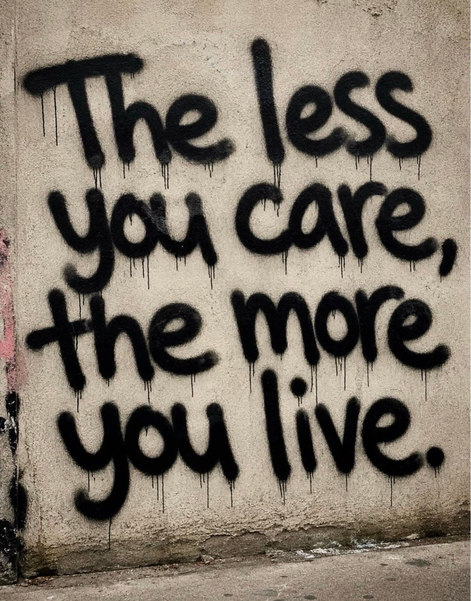

# 🐦 @Wise1Philosophy

## 📅 September 12, 2026

> 26 post(s) archived.

---

### 🕐 09:30 UTC · @Wise1Philosophy

> Do not buy the iPhone 18 Pro Max until you check this one setting. It affects how fast your phone charges for the next 3 years. Here&apos;s what to look for:👇

🔗 [View original post](https://x.com/Kevincreates77/status/2098705856829501452)

---

### 🕐 09:04 UTC · @Wise1Philosophy

> This is getting ridiculous. GPT Image 2.5 is here. Look at the image on the right (that&apos;s AI-generated). DALL·E 3 came out in September 2023. GPT Image 1 was huge for editing, but the portraits still had that AI look. Then 1.5 came along. Now look at 2.0 and 2.5. Imagine where we&apos;ll be in another 3 years. Here&apos;s the exact portrait prompt (unchanged): &quot;A high-resolution, photorealistic, close-up portrait of a woman. The woman, softly and evenly lit, has an oval-shaped face with an even more pronounced oval jawline. She sports an asymmetric bob hairstyle, her hair cut to ear-length. She has an impressively straight nose contour, with the base of her nose being equally straight. The image is a splendid display of macrophotography, with a shallow depth of field adding an extra layer of interest to it. The textures are incredibly detailed, adding much to the overall realism of the image.&quot; Try it yourself. You&apos;ll see. Get my free AI workflows → https://charliehills.substack.com/subscribe Repost ♻️ to help someone in your network. Media

🔗 [View original post](https://x.com/charliejhills/status/2098699335546376667)

---

### 🕐 09:00 UTC · @Wise1Philosophy

> A sports physiologist exposed the myths every woman has been told to use to &quot;get healthier&quot;. 7 things you do every day that eat your muscle, slow your thyroid, and increase belly fat: 1. Training fasted in the morning Media

🔗 [View original post](https://x.com/TinaaDeJong/status/2098698190434545706)

---

### 🕐 08:30 UTC · @Wise1Philosophy

🔗 [View original post](https://x.com/Mindsthatbuild/status/2098690614875263210)

---

### 🕐 08:30 UTC · @Wise1Philosophy

> I started taking vitamin D at breakfast, collagen at midday, and zinc in the evening. Without exaggerating, my personality changed 180 degrees. 1. Vitamin D. At breakfast. You should take it too.

🔗 [View original post](https://x.com/Rose_MaryIRL/status/2098690581228892272)

---

### 🕐 08:03 UTC · @Wise1Philosophy

> Your body is flooded with cortisol and you do not even notice it. These are the 9 signs that give it away: 1. Waking between 2 and 4am Media

🔗 [View original post](https://x.com/RafaelNasriX/status/2098683796841455998)

---

### 🕐 08:01 UTC · @Wise1Philosophy

🔗 [View original post](https://x.com/Wise1Philosophy/status/2098683312277520747)

---

### 🕐 07:30 UTC · @Wise1Philosophy

🔗 [View original post](https://x.com/Daily__wisdom_/status/2098675510658150888)

---

### 🕐 07:30 UTC · @Wise1Philosophy

> I started taking omega-3 at lunch, collagen in the morning, and magnesium at night. Without exaggerating, my personality changed 180 degrees. 1. Omega-3. At lunch. You should take it too.

🔗 [View original post](https://x.com/MuahDavis/status/2098675481193427127)

---

### 🕐 07:00 UTC · @Wise1Philosophy

🔗 [View original post](https://x.com/apex_mentality_/status/2098668125151486229)

---

### 🕐 06:41 UTC · @Wise1Philosophy

> If you want AI implemented in your enterprise operations, here&apos;s the order we run it in. A total of five steps. 1. Frame. Pick one workflow with real users, a deadline the customer feels, and a number you already track. Client reporting, onboarding, reconciliation, exception handling: the burden shows up in somebody&apos;s calendar. Sign the baseline before anyone builds. FOMO hates this step because it produces nothing to show a board, and it&apos;s the only thing that makes step five honest. 2. Prove. Build the smallest useful slice on real data in two to four weeks, with the assumptions, traces, errors and the human review all visible. You get a working capability, a first evaluation, and an honest failure profile. If the profile is ugly, you found out for the price of a month. 3. Harden. Add the security, the cost controls, the fallbacks, and a named owner. A working demo is where most programs stop. Production is a runbook and a person whose phone rings when it breaks. 4. Embed. Train the users, hand over the knowledge, watch adoption. Technical accuracy isn&apos;t business value. If nobody in the operation touches it on a Tuesday, it&apos;s a science project. 5. Scale. Adjacent workflows and reusable pieces, chosen from what step four measured and never from a platform pitch. The consultancy version of the same journey runs in the other order: a long diagnostic before anyone touches real data, a program justified by projected benefits, success measured in workshops held and slides delivered. We measure it in work shipped and a return both sides can verify.

🔗 [View original post](https://x.com/mardehaym/status/2098663223041876258)

---

### 🕐 06:30 UTC · @Wise1Philosophy

🔗 [View original post](https://x.com/yeti_mind/status/2098660426921685297)

---

### 🕐 06:26 UTC · @Wise1Philosophy

> THAT&apos;S WHY AIRLINES HATE CLAUDE 4.6 Flight for $879. I paid $299. No points. No affiliations. No VPN. Here are 8 prompts I used to travel like a pro ↓

🔗 [View original post](https://x.com/kumud_deepali/status/2098659470213849510)

---

### 🕐 06:11 UTC · @Wise1Philosophy

> A Stanford professor proved high cortisol hurts your memory, enlarges your fear center, and make your brain smaller. Here’s the 8 protocol: 1. Walk barefoot on grass for 5 minutes. Media

🔗 [View original post](https://x.com/BeBetter_Athlet/status/2098655810297721121)

---

### 🕐 06:00 UTC · @Wise1Philosophy

🔗 [View original post](https://x.com/Life__Mastery/status/2098652981583290561)

---

### 🕐 05:39 UTC · @Wise1Philosophy

> I started taking B12 in the morning, omega-3 at lunch, and magnesium before bed. Without exaggerating, my personality changed 180 degrees. 1. B12, in the morning

🔗 [View original post](https://x.com/Fitby_Chandler/status/2098647672563605941)

---

### 🕐 05:38 UTC · @Wise1Philosophy

> Your blood sugar is aging you faster than alcohol and cigarettes. It increases oxidative stress, reduces nitric oxide, and even causes fatty liver or diabetes. Here’s the simple fix: 1. Don’t walk 10,000 steps Media

🔗 [View original post](https://x.com/DPro_Coach/status/2098647325162045644)

---

### 🕐 05:36 UTC · @Wise1Philosophy

> Your poor diet is why you are still fat. Studies confirm that the people who lose weight the fastest pick 3-4 simple diets, and eat them on repeat. Here&apos;s the list: 1. Chipotle

🔗 [View original post](https://x.com/_Gut_Laboratory/status/2098647014267601370)

---

### 🕐 05:36 UTC · @Wise1Philosophy

> High cortisol = Low quality of life. If cortisol stays high. Here are the best ways to bring it down: 1. No food 3 hours before bed. Media

🔗 [View original post](https://x.com/TheFastedState/status/2098646953039155545)

---

### 🕐 05:30 UTC · @Wise1Philosophy

> If you want to avoid blood clots, strokes, and heart attacks (especially if you&apos;re over 40) Here are 16 things you must pay attention to: 1. Waking at 3 AM with a pounding heart.

🔗 [View original post](https://x.com/CoachDanCole_/status/2098645500211954149)

---

### 🕐 05:24 UTC · @Wise1Philosophy

> Andrew Huberman was just asked by Steve Bartlett: “If you could only take 5 supplements for the rest of your life, what would they be?” Here’s what he picked: 1. Magnesium Media

🔗 [View original post](https://x.com/HeyDoc_MD/status/2098643869852377174)

---

### 🕐 05:09 UTC · @Wise1Philosophy

> Waking up at 3 AM to go to the toilet isn&apos;t because you drank water before bed. Here’s actually why (&amp; what stops it): 1. Your blood sugar crashes at 1 AM, 3 AM, and 5 AM.

🔗 [View original post](https://x.com/LongevityCode_/status/2098640210372510119)

---

### 🕐 05:08 UTC · @Wise1Philosophy

> I took magnesium for 4 weeks. Not only did I fall asleep in under 10 minutes, and wake up before my alarm…it cut my brain age by 9 years. Here&apos;s what actually happened:

🔗 [View original post](https://x.com/Dr_Biohacker/status/2098639941119225874)

---

### 🕐 05:00 UTC · @Wise1Philosophy

> TAKING VITAMIN D CORRECTLY WILL DO MORE FOR YOUR WINTER THAN ANY AMOUNT OF SUN IN JULY. (99% ARE TAKING IT WRONG)

🔗 [View original post](https://x.com/IranaJasmin/status/2098637736714682736)

---

### 🕐 04:30 UTC · @Wise1Philosophy

> 4 supplements I&apos;m getting my mother to take at 71, and the one I told her to skip: 1. Protein powder. You should take it, your friends should take it, your mother should take it. 30g in the morning, unflavoured. Media

🔗 [View original post](https://x.com/dzejlacathleen/status/2098630212053614868)

---

### 🕐 04:00 UTC · @Wise1Philosophy

> The fog in your head, your memory and your words is extremely easy to lift once you realize this:

🔗 [View original post](https://x.com/yourcamilavega/status/2098622634632286218)

---
