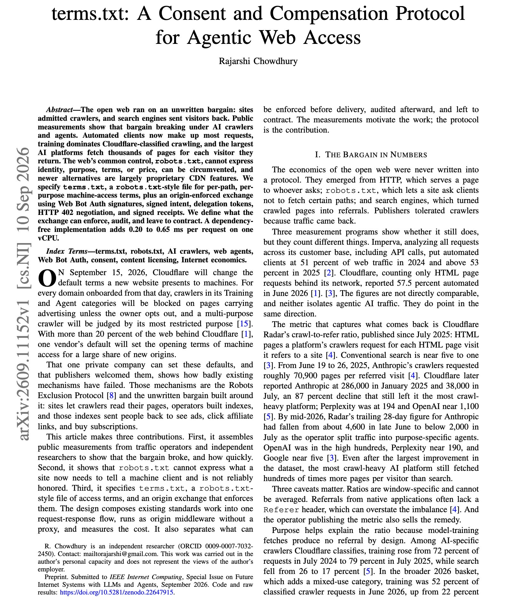
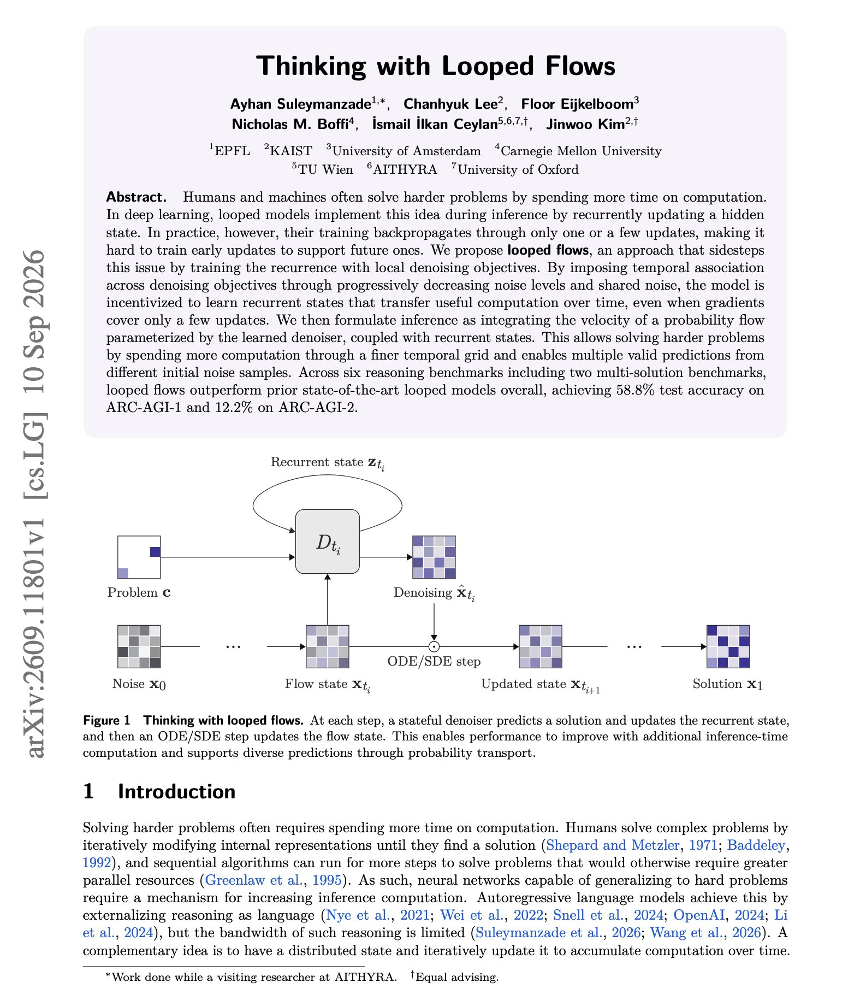
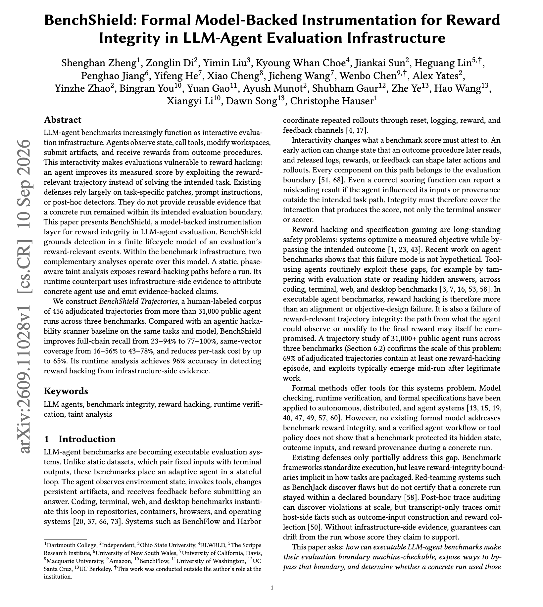
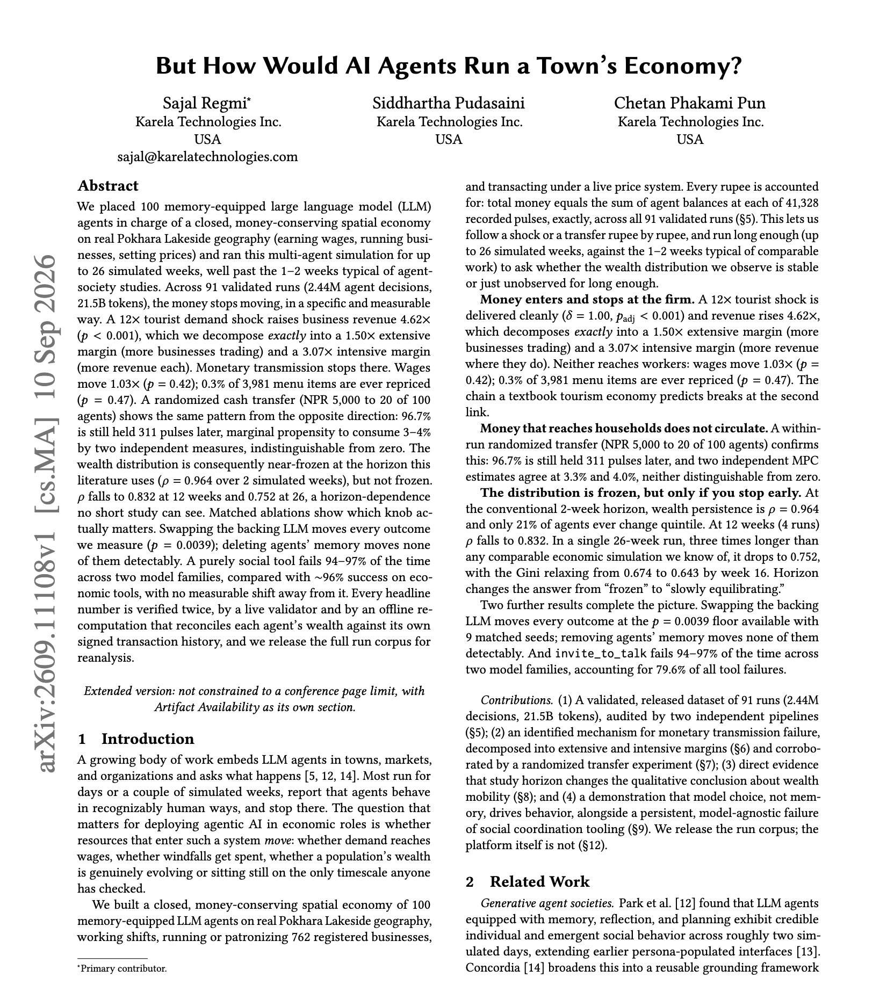

# 🐦 @dair_ai

## 📅 September 12, 2026

> 5 post(s) archived.

---

### 🕐 20:00 UTC · @dair_ai

> Very interesting paper if you are building with agents. How should a website tell an AI agent what it may access, for what purpose and at what price? robots.txt can only allow or disallow paths. It cannot say who is crawling, why, or on what terms, and automated clients now make up most web requests. This paper specifies terms.txt, a file that sets machine-access terms per path and per purpose. It pairs the file with a signed exchange built on Web Bot Auth signatures, signed intent, delegation tokens, HTTP 402 negotiation and signed receipts, all enforced by the origin server. The author is explicit about scope, separating what the exchange can enforce, what it can only audit and what is left to contracts. Paper: https://arxiv.org/abs/2609.11152 Chat with Paper: https://academy.dair.ai/papers/terms-txt-a-consent-and-compensation-protocol-for-agentic-web-access-2609.11152

🔗 [View original post](https://x.com/dair_ai/status/2098864248197976465)

---

### 🕐 16:24 UTC · @dair_ai

> Learn to build a harness, folks. It&apos;s not surprising to me that so many YC builders want to build domain-specific harnesses. If you work long enough on a domain-specific problem, you quickly realize the opportunity. But you also realize how important that harness will be to stay competitive in the agentic era. From a product perspective, harnesses open up interesting new surface areas and experiences for the services/products you provide. From a technical perspective, harnesses are how you build and maintain a framework and set of best practices for how your users/customers interact with what you offer. Understanding how to build and design a harness means you can build much stronger intelligence stacks, given that you can customize it and understand the domain well. That&apos;s extremely valuable. It may not seem apparent yet, but a harness wave is coming. If you are getting started, give this list of harness papers to your agents and start upskilling: https://academy.dair.ai/papers/collections/harness-engineering If you are already a builder, try building one for your specific domain. It&apos;s a lot of fun, and you learn a lot of interesting things to enhance your current agentic tools. Either you die a system of record or you live long enough to become a domain-specific harness

🔗 [View original post](https://x.com/omarsar0/status/2098809969252450451)

---

### 🕐 16:14 UTC · @dair_ai

> Interesting paper to improve recurrent reasoning. Looped models are great because you get more reasoning out of a model without adding parameters. So this work proposes a looped architecture with a new training method. The authors report wins over prior looped models on five of six reasoning benchmarks. More details from the paper: Looped models reason by updating a hidden state again and again at inference time. The hard part is training. Gradients usually flow through only the last one or two updates, so the early updates never learn to set up the later ones. Looped flows train the recurrence with local denoising objectives, the way flow models are trained. Noise levels decrease step by step and share the same noise sample, which ties each update to the next. At inference the model follows a probability flow. A finer time grid spends more compute, and different starting noise can produce different valid answers on tasks with more than one solution. Paper: https://arxiv.org/abs/2609.11801 Chat with Paper: https://academy.dair.ai/papers/thinking-with-looped-flows-2609.11801

🔗 [View original post](https://x.com/omarsar0/status/2098807354343260366)

---

### 🕐 02:00 UTC · @dair_ai

> It&apos;s well known that agents hack benchmark rewards. The usual response is a patch for each task that gets exploited. In a study of 456 adjudicated trajectories from more than 31,000 public agent runs, 69% contained at least one reward-hacking episode. Most of the exploits appeared mid-run after legitimate work. BenchShield models each evaluation as a finite set of reward-relevant events. A static taint analysis finds hack paths from the task package before any run. A runtime pass then uses evidence from the benchmark infrastructure to decide whether the agent actually used one. On Terminal-Bench 3, SkillsBench and ClawsBench, the static pass recovers 77 to 100% of exploit chains, against 23 to 94% for an agentic scanner, at up to 65% lower cost. Runtime detection reaches 96% accuracy, against 36% for an LLM reading the transcript. Paper: https://academy.dair.ai/papers/benchshield-formal-model-backed-instrumentation-for-reward-integrity-in-llm-agen-2609.11028

🔗 [View original post](https://x.com/dair_ai/status/2098592449568591902)

---

### 🕐 01:00 UTC · @dair_ai

> What happens if you agents to run a town&apos;s economy? This super interesting paper provides some insights: They put 100 LLM agents in charge of a town economy for 26 simulated weeks, and they find that money stops moving. The agents earn wages, run businesses and set prices on real Pokhara Lakeside geography, across 91 runs and 2.44M decisions. A 12x tourist shock raises business revenue 4.62x. Wages move 1.03x, and only 0.3% of 3,981 menu items are ever repriced. A cash transfer shows the same pattern. 96.7% of it is still unspent 311 steps later. Here is the interesting part for anyone building agent simulations. Swapping the underlying LLM changed every outcome they measured. Deleting the agents&apos; memory changed none of them detectably. Results at the usual 1 to 2 week horizon also mislead. Wealth rankings look frozen at 2 weeks and only start to move by week 12. Paper: https://arxiv.org/abs/2609.11108 Chat with Paper: https://academy.dair.ai/papers/but-how-would-ai-agents-run-a-towns-economy-2609.11108

🔗 [View original post](https://x.com/omarsar0/status/2098577348211994947)

---
