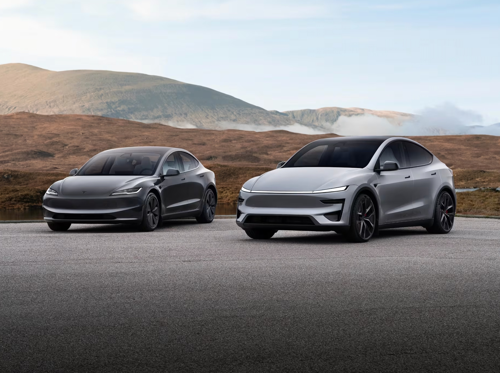

# 🐦 @elonmusk

## 📅 September 12, 2026

> 4 post(s) archived.

---

### 🕐 13:12 UTC · @elonmusk

> Bravo! A partir del próximo año, El Salvador invertirá el 8% del PIB en educación.

🔗 [View original post](https://x.com/elonmusk/status/2098761631530356824)

---

### 🕐 04:24 UTC · @elonmusk

> Starlink NEWS: 254 Starlink kits were handed over to bring internet to villages, schools &amp; hospitals across Vietnam. Telecommunications Authority, under the Ministry of Science &amp; Technology, jointly held the ceremony with Starlink Services Vietnam. Starlink is changing lives in Vietnam.

🔗 [View original post](https://x.com/elonmusk/status/2098628727164846490)

---

### 🕐 02:45 UTC · @elonmusk

> I think people are significantly underestimating just how much FSD has become a major driver of Tesla sales in North America. When I ask most people buying their first Tesla why they’re getting it, they now say: FSD. This wasn&apos;t the case even early this year. There has been a real shift these last 3-6 months in terms of awareness of this technology.

🔗 [View original post](https://x.com/SawyerMerritt/status/2098603783819325742)

---

### 🕐 02:24 UTC · @elonmusk

> Friday night tunneling in Nashville! Prufrock-MB2 is boring through the Music City limestone using 1,000,000+ lb of axial thrust, and 4,000,000+ lb of lateral gripping force. Media

🔗 [View original post](https://x.com/boringcompany/status/2098598618059985028)

---
