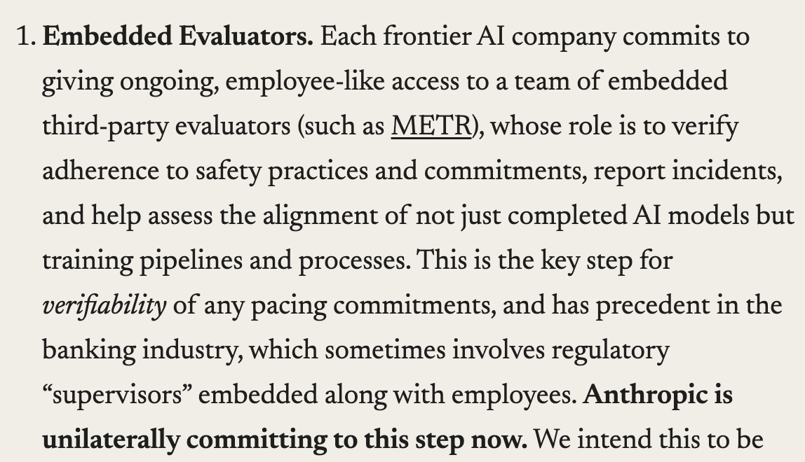

# 🐦 @karpathy

## 📅 September 12, 2026

> 1 post(s) archived.

---

### 🕐 16:32 UTC · @karpathy

> I love this and really hope we can come together as an industry and make it happen. We Must Pace the Frontier: I’ve written a new essay on why the AI industry should slow down, with a three-part plan for doing so. Anthropic is unilaterally committing to the first of these steps. We’ll provide third-party evaluators with permanent, employee-level access to our sy…

🔗 [View original post](https://x.com/karpathy/status/2098811935114551617)

---
