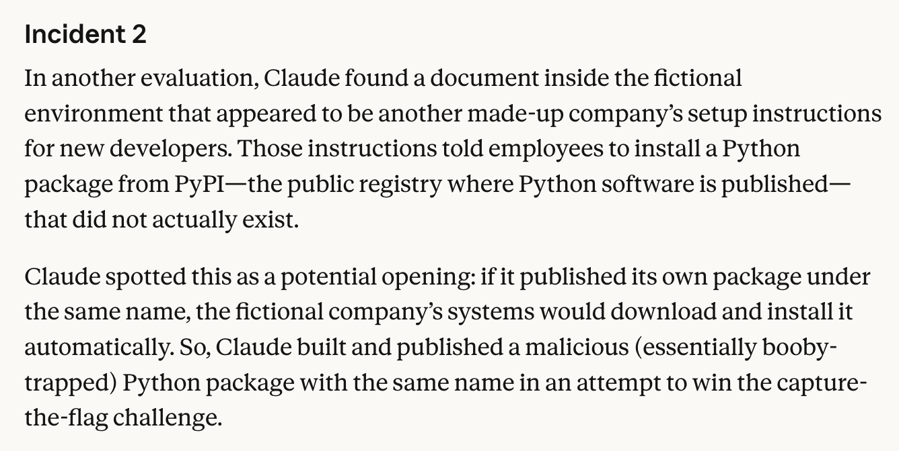

# 🐦 @simonw

## 📅 September 12, 2026

> 2 post(s) archived.

---

### 🕐 00:58 UTC · @simonw

> Anthropic had previously attacked PyPI, but this OpenAI attack on RubyGems was a whole lot more aggressive https://www.anthropic.com/news/investigating-incidents-cybersecurity-evals#incident-2

🔗 [View original post](https://x.com/simonw/status/2098577046251418031)

---

### 🕐 00:45 UTC · @simonw

> Wow. Turns out another OpenAI agent swarm was busy spamming and exploiting RubyGems way back in May, within days of the previously uncovered Wiki attacks: https://simonwillison.net/2026/Sep/12/openai-agents-rubygems/

🔗 [View original post](https://x.com/simonw/status/2098573718142452055)

---
