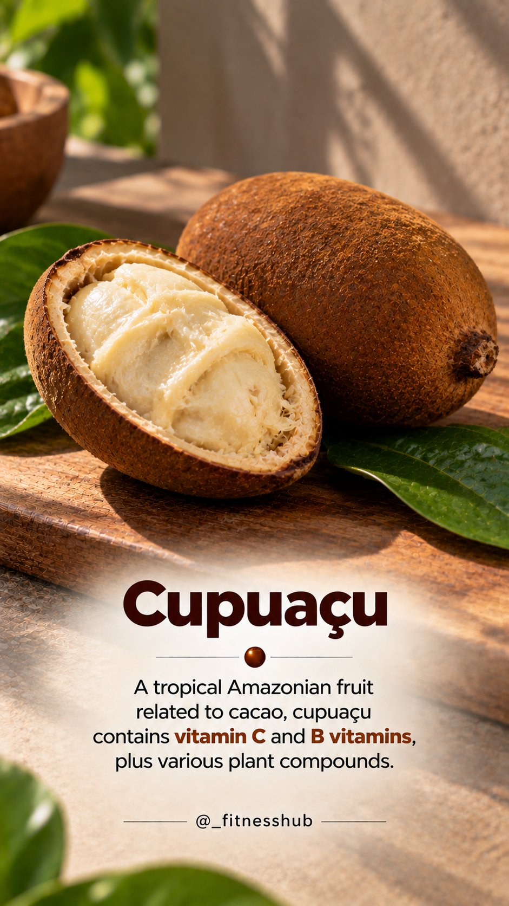
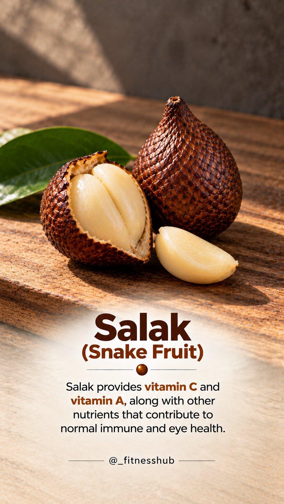
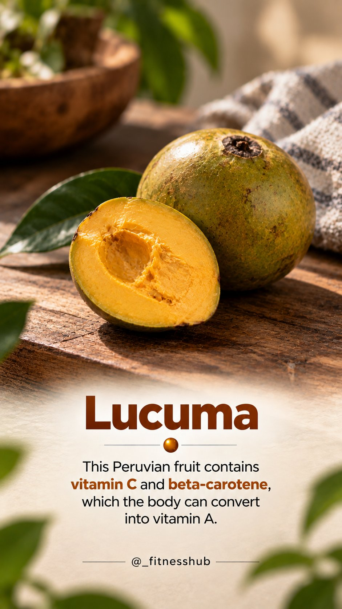
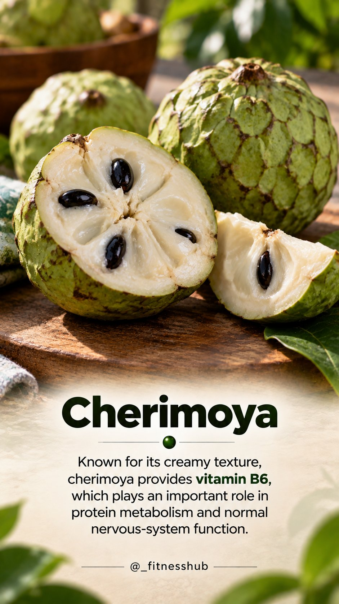
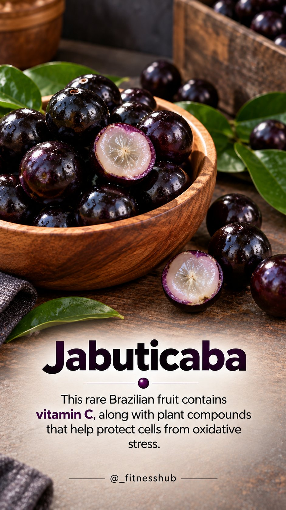

# 🐦 @Unlockyourlife_

## 📅 September 13, 2026

> 7 post(s) archived.

---

### 🕐 07:03 UTC · @Unlockyourlife_

> Eating a variety of fruits means you’re exposed to a wider range of vitamins, minerals, antioxidants and beneficial plant compounds. You don’t need rare or exotic fruits to be healthy, but trying different fruits can make your diet more diverse and help you discover new ways to support your overall health.

🔗 [View original post](https://x.com/_fitnesshub/status/2099031180335018325)

---

### 🕐 07:03 UTC · @Unlockyourlife_

> 5.

🔗 [View original post](https://x.com/_fitnesshub/status/2099031177168347332)

---

### 🕐 07:03 UTC · @Unlockyourlife_

> 4.

🔗 [View original post](https://x.com/_fitnesshub/status/2099031171975835650)

---

### 🕐 07:03 UTC · @Unlockyourlife_

> 3.

🔗 [View original post](https://x.com/_fitnesshub/status/2099031166326022295)

---

### 🕐 07:03 UTC · @Unlockyourlife_

> 2.

🔗 [View original post](https://x.com/_fitnesshub/status/2099031161766887743)

---

### 🕐 07:03 UTC · @Unlockyourlife_

> 🍇 Think you’ve tried every healthy fruit? Think again. These 5 rare fruits are packed with different vitamins and nutrients—and some of them probably aren’t even on your radar. 1.

🔗 [View original post](https://x.com/_fitnesshub/status/2099031156070965460)

---

### 🕐 06:30 UTC · @Unlockyourlife_

> You don&apos;t need a detox. Your liver and kidneys are already your body&apos;s detox system. What they need isn&apos;t a &quot;cleanse.&quot; They need less alcohol, enough water, quality sleep, regular exercise and a balanced diet. The healthiest detox is the one your daily habits support, not the one sold in a bottle.

🔗 [View original post](https://x.com/FitnessDr_/status/2099022813705199705)

---
