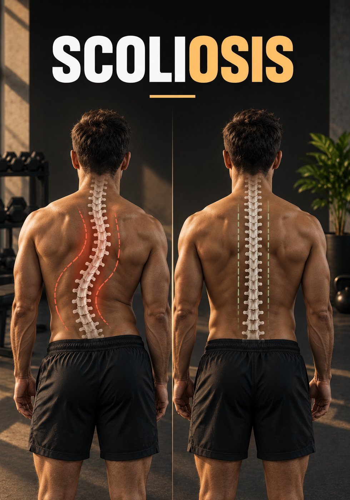
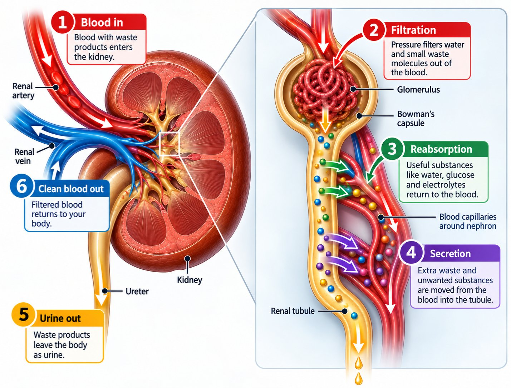

# 🐦 @Unlockyourlife_

## 📅 September 13, 2026

> 14 post(s) archived.

---

### 🕐 14:45 UTC · @Unlockyourlife_

> Reality hits harrrrrd.. Build your life so that losing one thing doesn&apos;t destroy everything. - Don&apos;t make your relationship your entire world. - Don&apos;t make your job your entire identity. - Don&apos;t make money your entire purpose. - Don&apos;t make one friendship your entire support system. A strong man builds more than one pillar. That way, when life shakes one, he can still stand.

🔗 [View original post](https://x.com/Masculinjournal/status/2099147392167686497)

---

### 🕐 14:11 UTC · @Unlockyourlife_

> The most dangerous military in a new world war isn&apos;t the largest. Russia&apos;s doctrine lowers the threshold for using nuclear weapons, changing the calculus of any conflict. Which nation do you believe is the ultimate wildcard on this list?

🔗 [View original post](https://x.com/Mastering_life_/status/2099138815114031452)

---

### 🕐 14:06 UTC · @Unlockyourlife_

> 6 Exercises To Fix Scoliosis

🔗 [View original post](https://x.com/_alphafit/status/2099137706080997583)

---

### 🕐 12:47 UTC · @Unlockyourlife_

> Your kidneys clean your blood every day without you even noticing. They remove waste, control excess fluid, and return important substances back to your bloodstream. Here&apos;s how they do it.

🔗 [View original post](https://x.com/BioLifex/status/2099117804221878602)

---

### 🕐 12:25 UTC · @Unlockyourlife_

> 5 mistakes can slowly create distance in your marriage. Here’s what to avoid if you want your wife to feel heard, understood, and valued:

🔗 [View original post](https://x.com/MensStandards/status/2099112125801390111)

---

### 🕐 12:08 UTC · @Unlockyourlife_

> Dear Men.. Don&apos;t use alcohol, women, entertainment or shopping to constantly escape from problems you refuse to face. Distraction can make pain quieter. It doesn&apos;t make the problem disappear. Eventually, you have to sit down with yourself and deal with what you&apos;ve been avoiding. That&apos;s where real growth begins.

🔗 [View original post](https://x.com/Masculinjournal/status/2099107983921762745)

---

### 🕐 08:13 UTC · @Unlockyourlife_

> Take your faith seriously. You don&apos;t have to have everything figured out before you turn to God. • Bring your worries. • Your mistakes. • Your plans. • Your fears. • Your gratitude. Sometimes a man needs to stop trying to control everything and remember that he isn&apos;t in control of everything.

🔗 [View original post](https://x.com/Masculinjournal/status/2099048805874200621)

---

### 🕐 07:03 UTC · @Unlockyourlife_

> Eating a variety of fruits means you’re exposed to a wider range of vitamins, minerals, antioxidants and beneficial plant compounds. You don’t need rare or exotic fruits to be healthy, but trying different fruits can make your diet more diverse and help you discover new ways to support your overall health.

🔗 [View original post](https://x.com/_fitnesshub/status/2099031180335018325)

---

### 🕐 07:03 UTC · @Unlockyourlife_

> 5.

🔗 [View original post](https://x.com/_fitnesshub/status/2099031177168347332)

---

### 🕐 07:03 UTC · @Unlockyourlife_

> 4.

🔗 [View original post](https://x.com/_fitnesshub/status/2099031171975835650)

---

### 🕐 07:03 UTC · @Unlockyourlife_

> 3.

🔗 [View original post](https://x.com/_fitnesshub/status/2099031166326022295)

---

### 🕐 07:03 UTC · @Unlockyourlife_

> 2.

🔗 [View original post](https://x.com/_fitnesshub/status/2099031161766887743)

---

### 🕐 07:03 UTC · @Unlockyourlife_

> 🍇 Think you’ve tried every healthy fruit? Think again. These 5 rare fruits are packed with different vitamins and nutrients—and some of them probably aren’t even on your radar. 1.

🔗 [View original post](https://x.com/_fitnesshub/status/2099031156070965460)

---

### 🕐 06:30 UTC · @Unlockyourlife_

> You don&apos;t need a detox. Your liver and kidneys are already your body&apos;s detox system. What they need isn&apos;t a &quot;cleanse.&quot; They need less alcohol, enough water, quality sleep, regular exercise and a balanced diet. The healthiest detox is the one your daily habits support, not the one sold in a bottle.

🔗 [View original post](https://x.com/FitnessDr_/status/2099022813705199705)

---
