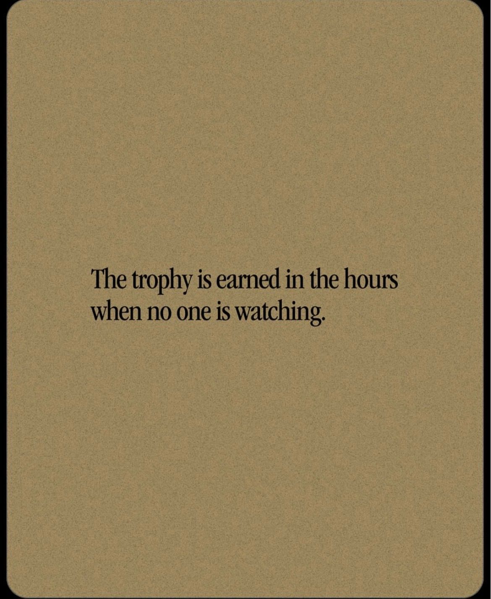
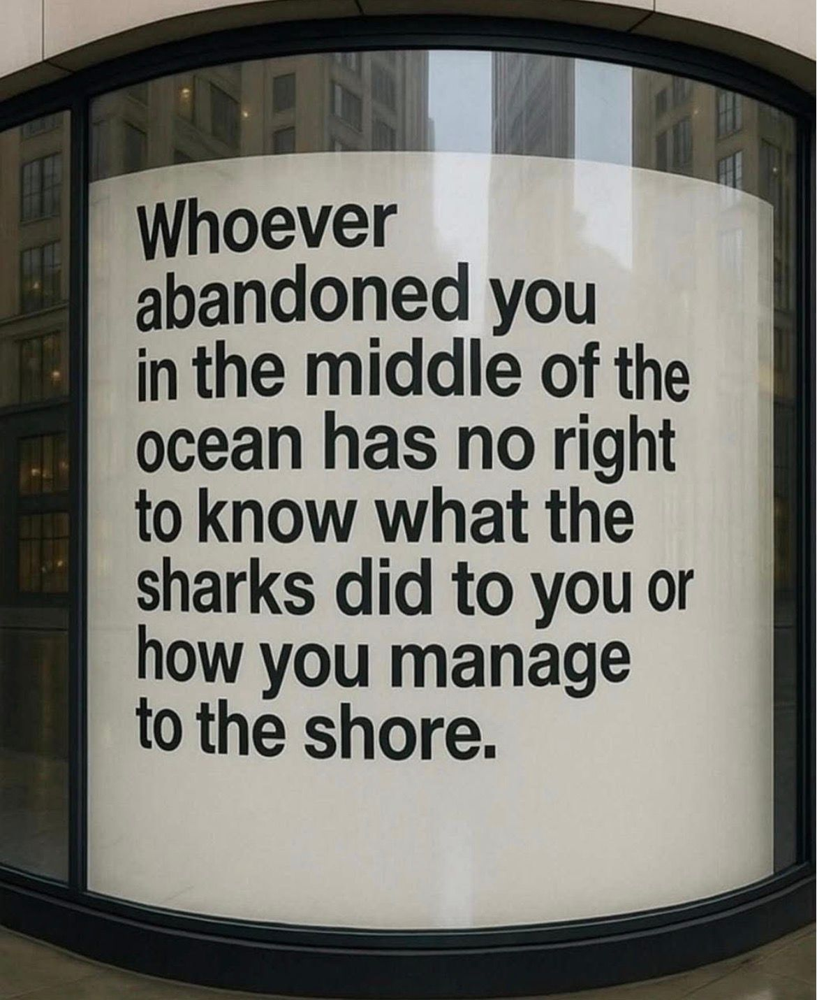
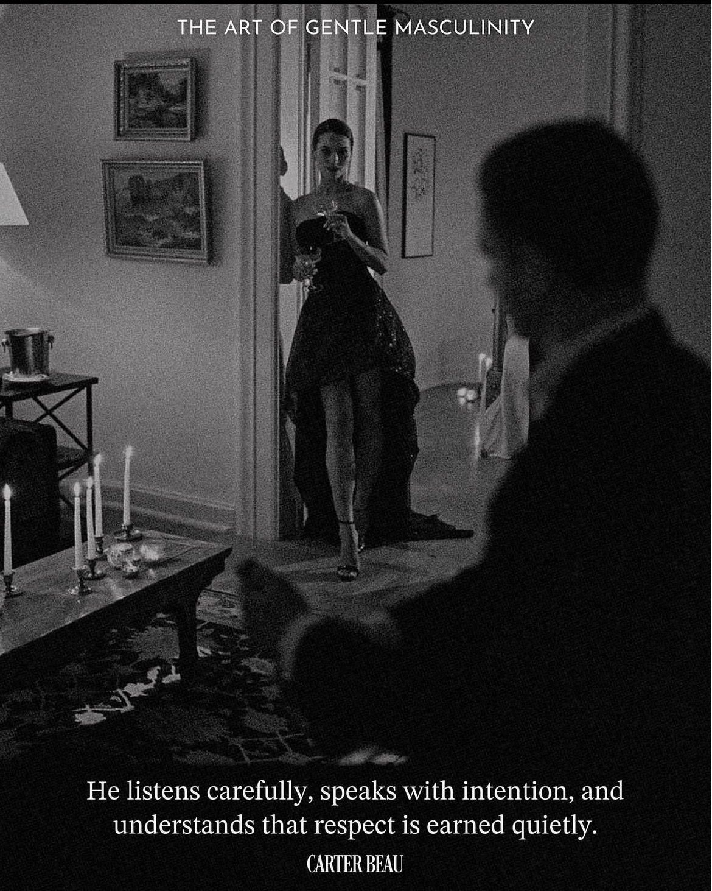

# 🐦 @Wise1Philosophy

## 📅 September 13, 2026

> 32 post(s) archived.

---

### 🕐 10:30 UTC · @Wise1Philosophy

> I started taking vitamin D at breakfast, zinc in the morning, and ashwagandha with dinner. My life changed 180 degrees. 1. Vitamin D, at breakfast

🔗 [View original post](https://x.com/HeyEleanorr/status/2099083177390453048)

---

### 🕐 10:15 UTC · @Wise1Philosophy

> This guy just wrote an absolute mind-blowing piece: https://x.com/i/article/2057838741104832512

🔗 [View original post](https://x.com/Scottvdberg/status/2099079533118840954)

---

### 🕐 10:10 UTC · @Wise1Philosophy

> I can&apos;t stop thinking about what this guy just wrote: https://x.com/i/article/2057838741104832512

🔗 [View original post](https://x.com/xgrowthpascal/status/2099078277759439123)

---

### 🕐 10:09 UTC · @Wise1Philosophy

> WHAT THE FUCK DID I JUST READ https://x.com/i/article/2057838741104832512

🔗 [View original post](https://x.com/creatorpascal/status/2099078027233620077)

---

### 🕐 09:57 UTC · @Wise1Philosophy

> Dr. Rhonda Patrick named 6 things aging your brain that you think are protecting it: 1. Chewing gum. Media

🔗 [View original post](https://x.com/ClaraBrooksjz/status/2099074889818988792)

---

### 🕐 09:00 UTC · @Wise1Philosophy

> If you bloat after meals, it&apos;s your gut. If you keep breaking out, it&apos;s your gut. If your hormones feel off, that&apos;s your gut too. Here&apos;s how to fix all three at once: 1. Stop grazing Media

🔗 [View original post](https://x.com/TinaaDeJong/status/2099060553985777922)

---

### 🕐 08:57 UTC · @Wise1Philosophy

> Apple sold 100 million AirPods last year. The AirPods Pro 5 has 50% better noise cancellation than last generation and most owners will never notice. A former Apple audio engineer told me: &quot;Your AirPods Pro 5 can cancel more noise than any earbuds on the market. But you&apos;re using the default Adaptive mode, which dials ANC back to save battery. You paid for the best noise cancellation Apple has ever shipped. You&apos;re getting 60% of it.&quot; Here are the 9 AirPods Pro 5 settings that unlock the full ANC 🧵

🔗 [View original post](https://x.com/Alvin1492840/status/2099059857072758883)

---

### 🕐 08:50 UTC · @Wise1Philosophy

> Stanford University charges $65,127 per year in tuition. A 4-year degree costs roughly $260,000 before room, board, and fees. The acceptance rate is 3.6%. For every 100 students who apply, 96 are told no. Stanford has also published for free, online, accessible to anyone on Earth with an internet connection over 2,100 courses, the complete AI curriculum its graduate students use, hundreds of full lecture series on YouTube, one of the most comprehensive philosophy references ever written, a design thinking toolkit used by Google and Nike, medical school health courses, business strategy lectures from Stanford GSB, entrepreneurship resources from the university that produced Google, Netflix, Instagram, LinkedIn, and PayPal and research papers that have shaped entire industries. A Stanford professor told a friend: &quot;Most people think Stanford&apos;s knowledge is locked behind a $65,000/year gate. It&apos;s not. The gate is the degree the credential, the campus, the network, the diploma. The knowledge has been free for over a decade published on YouTube, Coursera, edX, and Stanford&apos;s own website. The same lectures I give to students who paid $65,000 are sitting on a YouTube channel with 4 million subscribers. Most people have never searched for them because they assumed a university this expensive would never give anything away.&quot; She said: &quot;Why would Stanford give it away?&quot; &quot;Because the degree is the product not the knowledge. The knowledge is the marketing. A free Stanford course that changes your life is the best advertisement for a $260,000 degree. And the research the papers, the encyclopedias, the toolkits exists to advance human knowledge, not to generate tuition revenue. Stanford publishes freely because the mission has always been public. The price tag is for the credential. The education has been free since the moment they uploaded the first lecture.&quot; He showed her 11 free Stanford resources most people don&apos;t know exist resources that replaced $3,000 in textbooks, $10,000 in professional workshops, and $100,000 in degree programs. &quot;Stanford&apos;s reputation is behind a gate. Stanford&apos;s knowledge is not.&quot; Here are the 11 resources 🧵

🔗 [View original post](https://x.com/jackcoder0/status/2099058136007262326)

---

### 🕐 08:30 UTC · @Wise1Philosophy

🔗 [View original post](https://x.com/Mindsthatbuild/status/2099053052485325062)

---

### 🕐 08:30 UTC · @Wise1Philosophy

> The tension in your jaw, your shoulders and your evenings is extremely easy to release once you realize this:

🔗 [View original post](https://x.com/Rose_MaryIRL/status/2099052979026636943)

---

### 🕐 08:02 UTC · @Wise1Philosophy

> 4 supplements I&apos;m getting my father to take, six months after his scare: 1. Vitamin D3 with K2. You should take it, your friends should take it, your parents should take it. One softgel with a meal, never D3 alone. Media

🔗 [View original post](https://x.com/RafaelNasriX/status/2099045986706600101)

---

### 🕐 08:01 UTC · @Wise1Philosophy

🔗 [View original post](https://x.com/Wise1Philosophy/status/2099045682791211284)

---

### 🕐 07:30 UTC · @Wise1Philosophy

🔗 [View original post](https://x.com/Daily__wisdom_/status/2099037893830312037)

---

### 🕐 07:00 UTC · @Wise1Philosophy

🔗 [View original post](https://x.com/apex_mentality_/status/2099030536295522678)

---

### 🕐 06:56 UTC · @Wise1Philosophy

> Neurologists have a name for the deficiency that mimics dementia: 1. Tingling or numbness in your hands and feet

🔗 [View original post](https://x.com/Marc0sRomano/status/2099029311219195991)

---

### 🕐 06:33 UTC · @Wise1Philosophy

> Fatty liver = fructose Fatty liver = insulin resistance Fatty liver = 1 in 3 adults, and almost none of them know 1. Coffee, and not for the reason you think

🔗 [View original post](https://x.com/CoachLucHerrera/status/2099023522148540756)

---

### 🕐 06:30 UTC · @Wise1Philosophy

🔗 [View original post](https://x.com/yeti_mind/status/2099022791378882982)

---

### 🕐 06:14 UTC · @Wise1Philosophy

> AI characters that appear in motion before you type a single word. Elymi&apos;s out today, free → https://www.elymi.ai/en AI character apps, a short history: 2023: static profile card, then you type 2024: static card with better art 2026: Elymi starts with a scene in motion, the character appears, creates a moment, and the chat continues the story you can build your own too. free → http://www.elymi.…

🔗 [View original post](https://x.com/Wise1Philosophy/status/2099018930748530997)

---

### 🕐 06:00 UTC · @Wise1Philosophy

🔗 [View original post](https://x.com/Life__Mastery/status/2099015335781310758)

---

### 🕐 06:00 UTC · @Wise1Philosophy

> An endocrinologist shocked me when she said: &quot;You age because your body stops making vitamin D. Without it, your bones thin, your mood sinks, and your energy never comes back.&quot; 1. Pair your calcium with D3 and K2

🔗 [View original post](https://x.com/LiveandAlive_/status/2099015230621925762)

---

### 🕐 04:50 UTC · @Wise1Philosophy

> A neurologist shocked me when he said: &quot;You age because your stomach stops absorbing Magnesium. Without it, your energy drops, your eyelids tremble, and dementia happens.&quot; Here&apos;s the 5-step protocol to rebuild it naturally:

🔗 [View original post](https://x.com/LevelUpPrime/status/2098997765523341489)

---

### 🕐 04:49 UTC · @Wise1Philosophy

> TAKING MAGNESIUM CORRECTLY TURNS YOU INTO A 13% BODY FAT BEAST: (99% ARE MAKING THESE 3 MISTAKES):

🔗 [View original post](https://x.com/Fitby_Chandler/status/2098997454985437533)

---

### 🕐 04:37 UTC · @Wise1Philosophy

> A Superhost earns $84,000/year from 2 properties. She&apos;s been hosting for 5 years. Her occupancy rate is 89%. Her average nightly rate is 22% above the market average. Her listings appear on page 1 of Airbnb search results. She gets booked 2 months in advance. Her neighbor same neighborhood, same-size property, similar furnishings earns $31,000/year from 1 property. His occupancy rate is 54%. His nightly rate is 15% below market. His listing appears on page 8. He has empty weeks every month. He says: &quot;Airbnb isn&apos;t worth it anymore. Too much competition. Fees are killing the margins.&quot; Same platform. Same neighborhood. Same guest pool. Same square footage. $53,000/year difference. A short-term rental consultant who&apos;s optimized over 300 Airbnb listings and has helped hosts increase revenue by an average of 40-60% in their first year looked at both listings and said: &quot;The difference isn&apos;t the property. It&apos;s 9 things she does that he doesn&apos;t. She uses dynamic pricing that adjusts her rate every night based on demand. She invested $300 in professional photography that increases every booking for the life of her listing. She enabled Instant Book which gives her a 15-25% search placement boost he&apos;s missing. She earned the Guest Favorites badge which replaced Superhost as the #1 quality signal in the algorithm. She manages calendar gaps that are actively suppressing his listing. She responds to every inquiry in under an hour. And she repriced after the 15.5% fee change which he never did, so he&apos;s been making 12% less per night for 9 months without knowing why.&quot; &quot;He&apos;s running a listing. She&apos;s running a system. The listing is the same. The system is the difference.&quot; Here are the 9 things 🧵

🔗 [View original post](https://x.com/jamescoder12/status/2098994462450192630)

---

### 🕐 04:33 UTC · @Wise1Philosophy

> If I wanted to get dementia ASAP, this is exactly what I would do: 1. Sleep 6 hours a night Media

🔗 [View original post](https://x.com/_Gut_Laboratory/status/2098993365522231802)

---

### 🕐 04:32 UTC · @Wise1Philosophy

> Walking is the most underrated medicine on Earth. It lowers blood sugar, blood pressure, anxiety, and even your risk of early death. Here&apos;s how to get the full effect with 8 simple steps: 1. Don&apos;t chase 10,000 steps. Media

🔗 [View original post](https://x.com/TheFastedState/status/2098993257472721201)

---

### 🕐 04:32 UTC · @Wise1Philosophy

> Losing fat in your hips and belly is extremely easy once you realize this:

🔗 [View original post](https://x.com/BeBetterMan_/status/2098993085405659162)

---

### 🕐 04:30 UTC · @Wise1Philosophy

> 10 foods with zero limits. Eat them at 9pm, eat them all week, it doesn&apos;t matter. 1. Pickles

🔗 [View original post](https://x.com/CoachDanCole_/status/2098992759311040914)

---

### 🕐 04:30 UTC · @Wise1Philosophy

> 4 supplements I&apos;m getting my aging parents to take: 1. Creatine. You should take it, your friends should take it, your parents should take it. 5g a day, forever. No loading phase needed. Media

🔗 [View original post](https://x.com/CoachWillStone/status/2098992666965143976)

---

### 🕐 04:29 UTC · @Wise1Philosophy

> Heart Attack = High blood sugar Heart Attack = High insulin resistance Heart Attack = High blood pressure 5 simple rules to protect your heart: 1. Don&apos;t go pee at 3 AM Media

🔗 [View original post](https://x.com/HeyDoc_MD/status/2098992378116026441)

---

### 🕐 04:26 UTC · @Wise1Philosophy

> A Stanford neurologist told me: “Sticking out your tongue for 40 seconds removes cortisol faster than any pills and breathing exercises.” 1. Your neck is what&apos;s keeping you anxious.

🔗 [View original post](https://x.com/LongevityCode_/status/2098991794025632201)

---

### 🕐 04:16 UTC · @Wise1Philosophy

> A ChatGPT Plus subscriber typed a complex financial analysis question into GPT-6 Astra. The answer was good. Clear structure. Reasonable insights. Solid recommendations. He was impressed this felt smarter than GPT-5.6. His friend a ChatGPT Pro subscriber paying $200/month typed the exact same question into the exact same model. Word for word. Same prompt. Same &quot;GPT-6 Astra&quot; label in the model selector. The answer was different. Not slightly different. Fundamentally different. Deeper analysis. Statistical nuances the first answer missed entirely. A counterintuitive finding the first answer didn&apos;t surface. Three additional risk factors the first answer never considered. A conclusion that contradicted the first answer&apos;s recommendation and turned out to be more accurate when they verified against real data. Same model name. Same text box. Same prompt. Different answers. The Plus subscriber stared at both responses side by side. &quot;How is this possible? We&apos;re using the same model.&quot; His friend told him something most ChatGPT users don&apos;t understand about GPT-6 Astra something OpenAI doesn&apos;t explain prominently on the pricing page. &quot;There are effectively 3 different Astras behind the same text box. The model is the same architecture. The reasoning depth varies by plan. You&apos;re on the $20 tier. I&apos;m on the $200 tier. We&apos;re talking to the same brain but my version thinks harder than yours.&quot; He showed him 11 hidden features, tier differences, and prompting techniques inside GPT-6 Astra that most ChatGPT users will never discover. Here&apos;s the full playbook 🧵

🔗 [View original post](https://x.com/Eric_Smith08/status/2098989047616332203)

---

### 🕐 04:14 UTC · @Wise1Philosophy

> A heart doctor once admitted: “There are 3 types of people who never get heart attacks.” 1. You don&apos;t get up at 3 AM to pee Media

🔗 [View original post](https://x.com/dzejlacathleen/status/2098988560615698941)

---
