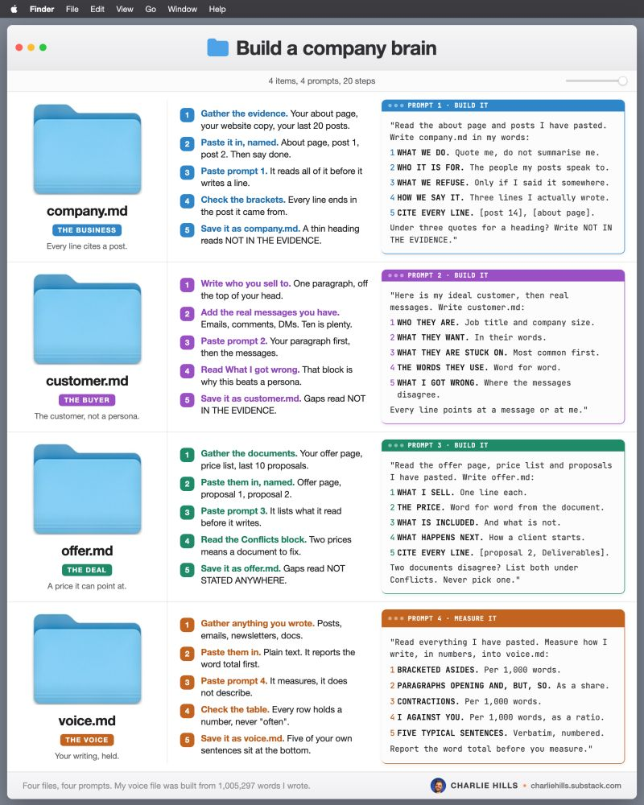
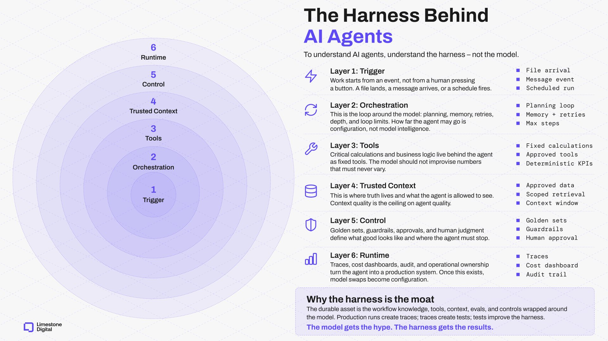
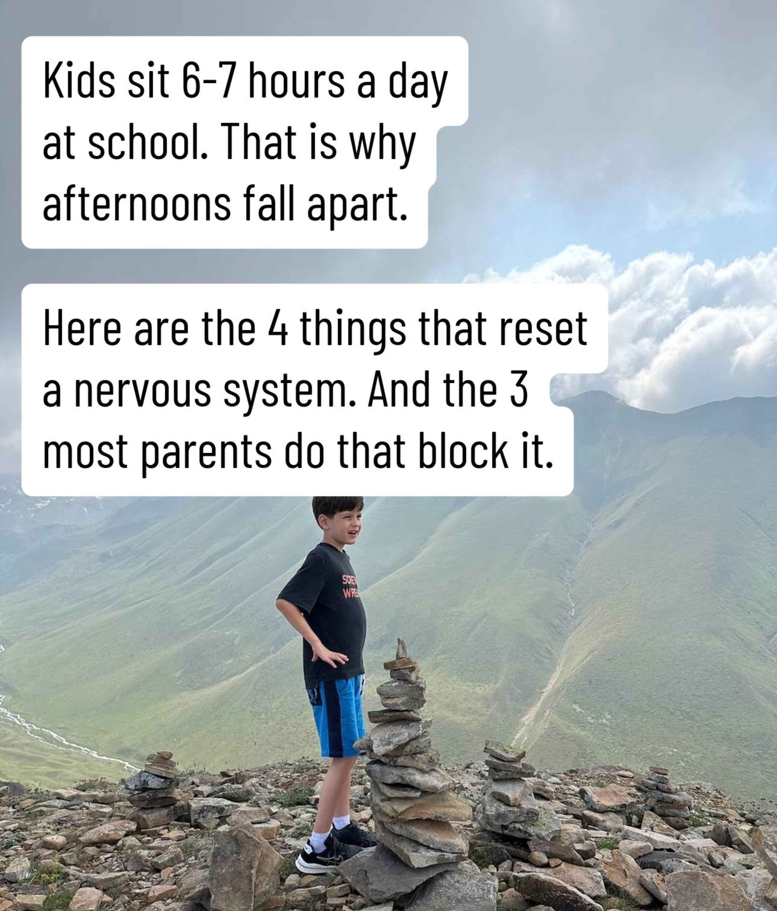
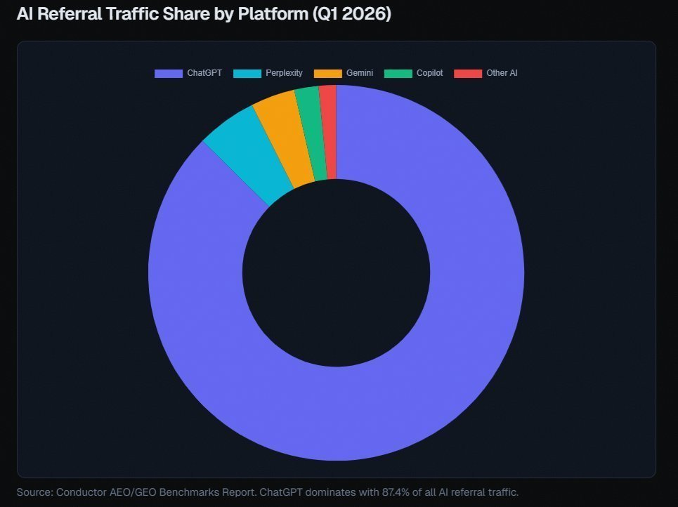
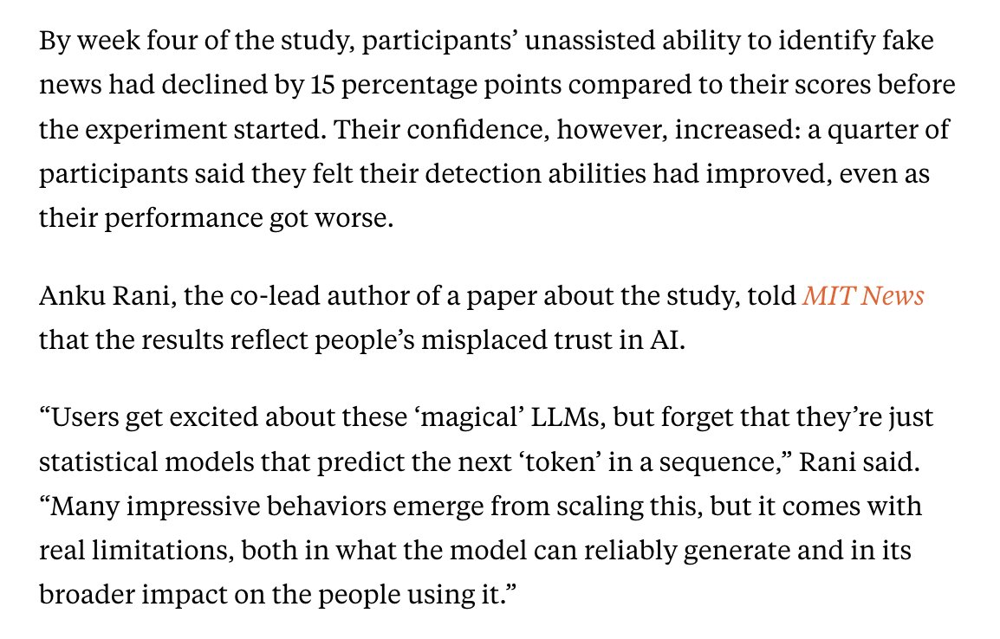
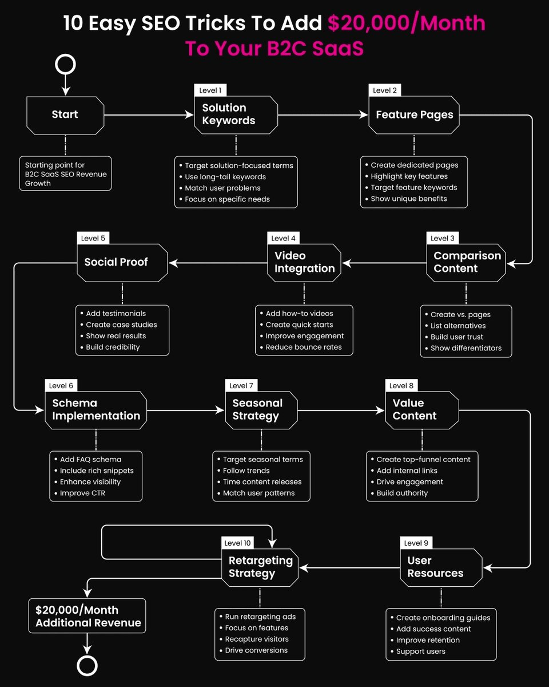
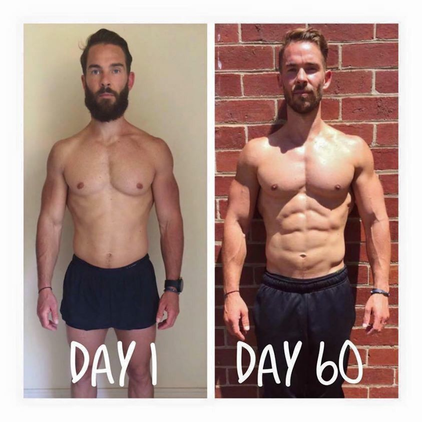
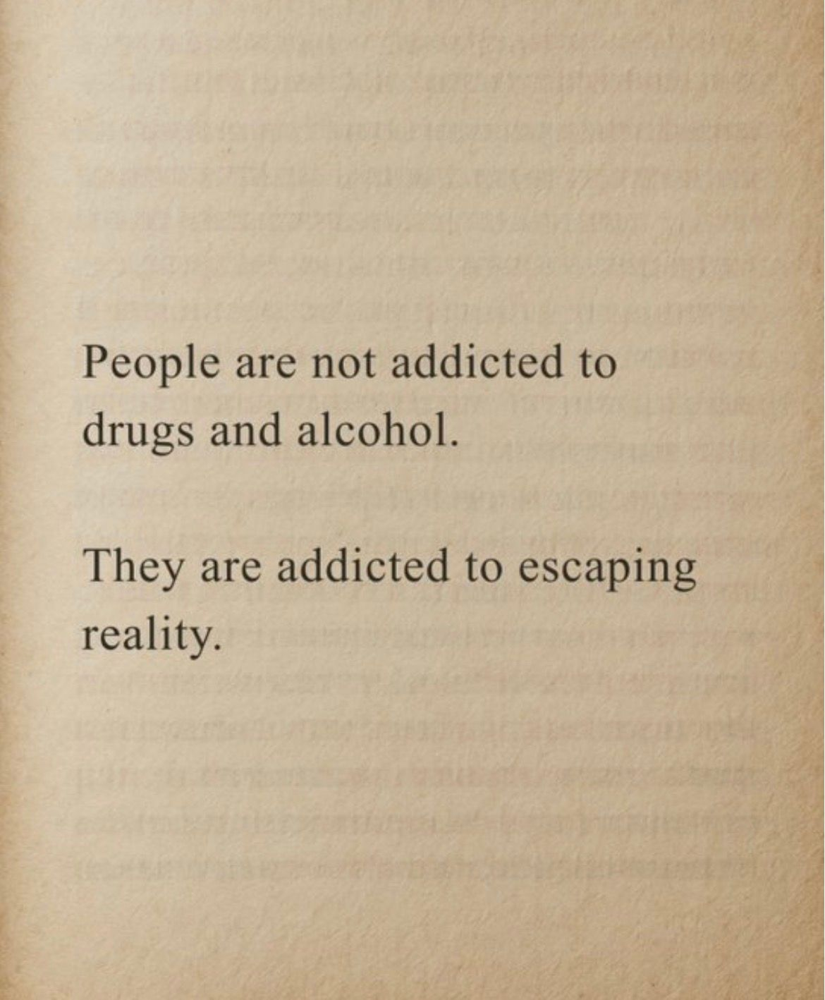
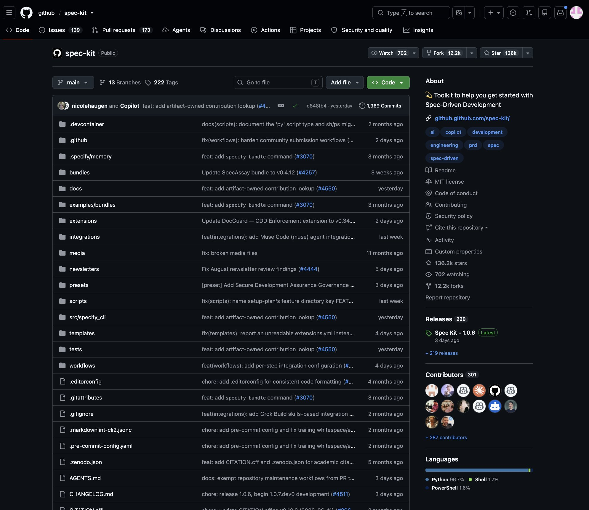
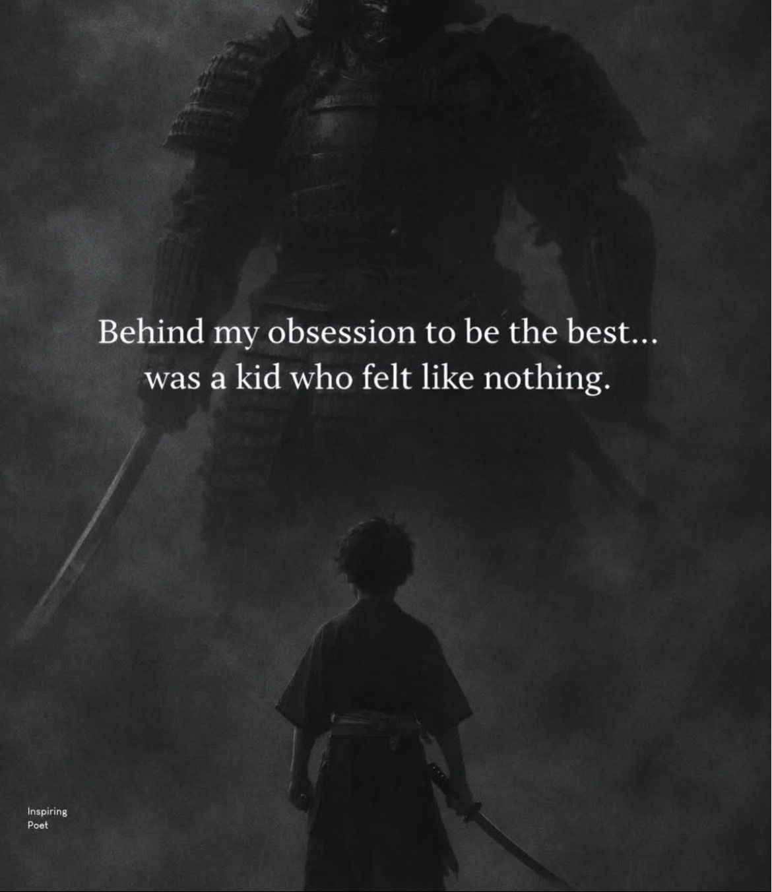

# 🐦 @Wise1Philosophy

## 📅 September 13, 2026

> 77 post(s) archived.

---

### 🕐 18:12 UTC · @Wise1Philosophy

> the StatQuest to Karpathy pipeline alone will take you further than most paid programs. Best YouTube Channels To Master AI 1). AI Foundations ↳ Khan Academy - https://www.youtube.com/@khanacademy ↳ freeCodeCamp - https://www.youtube.com/@freecodecamp ↳ MIT OpenCourseWare - https://www.youtube.com/@mitocw ↳ StatQuest with Josh Starmer - https://www.youtube.com/@statq…

🔗 [View original post](https://x.com/Wise1Philosophy/status/2099199521892831343)

---

### 🕐 17:05 UTC · @Wise1Philosophy

> Your AI is guessing what your business is. You can fix that with 4 files: ✦ customer.md - who actually buys, not a persona ✦ voice.md - everything you&apos;ve written, measured ✦ offer.md - your offer page, priced exactly ✦ company.md - your about page, in your words Prompts here → https://charliehills.substack.com/p/resource Full system here → https://charliehills.substack.com/p/graph-engineering-claude-code Paste the evidence in. The prompt writes the file. Repost ♻️ to help someone in your network. https://x.com/i/article/2099077155594612737

🔗 [View original post](https://x.com/charliejhills/status/2099182810426986898)

---

### 🕐 16:40 UTC · @Wise1Philosophy

> Key components of agent harnesses: Layer 1: Trigger — &quot;Work starts from an event, not from a human pressing a button. A file lands, a message arrives, or a schedule fires.&quot; Tags: File arrival, Message event, Scheduled run. Layer 2: Orchestration — &quot;This is the loop around the model: planning, memory, retries, depth, and loop limits. How far the agent may go is configuration, not model intelligence.&quot; Tags: Planning loop, Memory + retries, Max steps. Layer 3: Tools — &quot;Critical calculations and business logic live behind the agent as fixed tools. The model should not improvise numbers that must never vary.&quot; Tags: Fixed calculations, Approved tools, Deterministic KPIs. Layer 4: Trusted Context — &quot;This is where truth lives and what the agent is allowed to see. Context quality is the ceiling on agent quality.&quot; Tags: Approved data, Scoped retrieval, Context window. Layer 5: Control — &quot;Golden sets, guardrails, approvals, and human judgment define what good looks like and where the agent must stop.&quot; Tags: Golden sets, Guardrails, Human approval. Layer 6: Runtime — &quot;Traces, cost dashboards, audit, and operational ownership turn the agent into a production system. Once this exists, model swaps become configuration.&quot; Tags: Traces, Cost dashboard, Audit trail. Either you die a system of record or you live long enough to become a domain-specific harness

🔗 [View original post](https://x.com/LimestoneHQ/status/2099176377580675081)

---

### 🕐 16:37 UTC · @Wise1Philosophy

> The model is the smallest, most swappable part. Key principles learned from engineering harnesses: &gt; Garbage in, garbage out: Better models won&apos;t fix bad context. The quality of information you feed the agent determines the quality of its output. &gt; Hardcode fixed rules: Keep calculations and critical metrics in deterministic tools so the model never hallucinates exact numbers. &gt; Keep humans accountable: Use agents to advise, but require a designated person to approve actions before execution. &gt; Audit every step: Maintain detailed logs so you can trace failures to the exact prompt or tool and patch the system permanently. &gt; Build for interchangeable models: When your system architecture is solid, swapping out the underlying model is just a simple config change. The model gets the credit, but the infrastructure delivers the results. Either you die a system of record or you live long enough to become a domain-specific harness

🔗 [View original post](https://x.com/mardehaym/status/2099175716046643654)

---

### 🕐 16:02 UTC · @Wise1Philosophy

> Kids sit 6-7 hours a day at school. That is why afternoons fall apart. Here are the 4 things that reset a nervous system and the 3 most parents do that block it... Must Read till End.. 👇🧵

🔗 [View original post](https://x.com/Manifest_Lord/status/2099166838504767488)

---

### 🕐 16:02 UTC · @Wise1Philosophy

> 8 things that will put your marriage in the top 1%. (we do every one of them, and you can too) 🪡 👇

🔗 [View original post](https://x.com/scotti_brooks/status/2099166745705808040)

---

### 🕐 16:01 UTC · @Wise1Philosophy

> A DOCTOR WHO LIVED TO 108 SAYS THE REAL KILLER ISN&apos;T STRESS OR DIET. THIS IS WHAT IS SILENTLY WIPING YOU OUT. Here are 9 things you need to know:

🔗 [View original post](https://x.com/Better_men/status/2099166585332326495)

---

### 🕐 15:54 UTC · @Wise1Philosophy

> ChatGPT is responsible for nearly 70% of all AI referral traffic. How much of that is flowing to your business? If the answer is “not enough,” there is a pretty straightforward way to improve it. Similarweb&apos;s Global AI Tracker had ChatGPT at 64.5% of generative AI search traffic in January 2026. By the end of Q1, Conductor put ChatGPT&apos;s share at 87%, while SE Ranking had it around 80%. The exact number varies by dataset, but the conclusion is the same: ChatGPT is by far the biggest source of AI-driven referral traffic. And that is exactly what SEO Stuff helps businesses capture: https://seo-stuff.com If you want to see where your site stands across Google, ChatGPT, Claude and broader AI search, start here. It’s free: https://seo-stuff.com/free-audit The problem is that AI platforms do not work like traditional Google results. Instead of giving buyers a page of links and letting them browse, ChatGPT, Perplexity, Gemini and Copilot can research the question and surface a much smaller set of companies and sources. If your brand never enters that research process, the buyer may never see you. And visibility can vary enormously by platform. Superlines analyzed 34,234 AI responses across 10 platforms and found cases where the same brand had a citation rate of just 0.59% on one platform and 27% on another. That is a 46x difference depending on which AI tool the customer opens. So how do you increase your chances of appearing consistently? Two things keep showing up. The first is content depth. A homepage and five feature pages are not enough if buyers are asking dozens of different questions about your category. AI systems can research pricing, integrations, use cases, comparisons, alternatives, implementation, specifications and other subtopics before producing an answer. Every useful question your site covers gives you another opportunity to become a source. Every important question you ignore creates another opening for a competitor. The second is authority. Strong editorial backlinks, expert attribution and credible third-party mentions give AI systems more evidence that your company and content are worth trusting. That combination is important. Content gives AI systems something relevant to retrieve. Authority gives them more reason to use your source over somebody else&apos;s. Think about a buyer asking: “Best project management tool for agencies.” Brand A has detailed pages covering agency workflows, client reporting, pricing, integrations, alternatives, onboarding and customer results, backed by credible third-party authority. Brand B has a homepage and a handful of feature pages. Which company gives ChatGPT more useful material to work with? That same basic dynamic applies across Perplexity, Gemini, Copilot and other AI systems, even though each platform has its own retrieval and citation behavior. AI referral traffic is still relatively early. Conductor found it represented about 1.08% of total website traffic on average, but that is exactly why the opportunity is interesting. The brands building category-level content and authority now are establishing visibility while the channel is still growing. So what should you actually do? Build content around the full question map in your category, including comparisons, pricing, alternatives, integrations, use cases, implementation and the specific problems buyers are trying to solve. Then strengthen that content with credible third-party authority and editorial backlinks, and stop treating AI visibility as a one-keyword-at-a-time exercise. The companies most likely to show up repeatedly are the ones giving AI systems broad, useful information about the category and enough outside validation to trust it. That is the system SEO Stuff was built around. The Done-For-You package combines AI-search-optimized content with DR50+ authority placements: https://seo-stuff.com/gold-plan-package The Premium Content Bundle adds 60 long-form pieces designed to cover the questions customers and AI systems are researching across your category: https://seo-stuff.com/premium-content-bundle-service And the Premium Backlink Bundle adds contextual DR50+ placements designed to strengthen authority across trusted third-party websites: https://seo-stuff.com/premium-backlink-bundle-service And if you want to see where your brand stands today, start here: https://seo-stuff.com/free-audit Not trying to insult anyone here but... B2C SaaS operators on X are struggling to keep up with how marketing is changing. Let’s start with how people are finding software now. Your customers are increasingly starting with questions like: “What’s the best budgeting app if I don’t …

🔗 [View original post](https://x.com/alexgroberman/status/2099164750567678157)

---

### 🕐 15:18 UTC · @Wise1Philosophy

> THERE&apos;S A FOLDER ON YOUR ANDROID CALLED &quot;OTHER&quot; AND GOOGLE NEVER TELLS YOU WHAT&apos;S IN IT. On a lot of phones it quietly climbs past 30, 50, even 80GB. Here&apos;s how to clear it for free:👇

🔗 [View original post](https://x.com/Kevincreates77/status/2099155753584271593)

---

### 🕐 15:04 UTC · @Wise1Philosophy

> Arcads plus image 2.5 and Seedance 2.5 is a very practical stack. everyone is posting these AI character videos and nobody explains how they get this realistic.. so here&apos;s my exact process, start to finish

🔗 [View original post](https://x.com/Wise1Philosophy/status/2099152250006290632)

---

### 🕐 14:56 UTC · @Wise1Philosophy

> AN ONCOLOGIST CONFESSED: “There are 3 types of people who don&apos;t get cancer.” (SAVE THIS):

🔗 [View original post](https://x.com/BeBetterMan_/status/2099150337773109420)

---

### 🕐 14:36 UTC · @Wise1Philosophy

> I started taking vitamin D at breakfast, ashwagandha in the late afternoon, and magnesium before bed. Without exaggerating, my personality changed 180 degrees. 1. Vitamin D, at breakfast

🔗 [View original post](https://x.com/HiVioletMM/status/2099145073753800829)

---

### 🕐 14:30 UTC · @Wise1Philosophy

> TAKING MAGNESIUM CORRECTLY WILL CHANGE YOUR LIFE. HERE&apos;S WHY:

🔗 [View original post](https://x.com/Sophiaz6xo/status/2099143567474335786)

---

### 🕐 14:20 UTC · @Wise1Philosophy

> A heart doctor told me there are 3 kinds of people who never get heart attacks. 1. Don&apos;t get up to pee at 3 AM Media

🔗 [View original post](https://x.com/IranaJasmin/status/2099141065643340058)

---

### 🕐 14:04 UTC · @Wise1Philosophy

> MIT has released a blunt account of what generative AI is doing to its students. Honestly this reads less like a white paper and more like an urgent warning for higher education. For five months, a committee of faculty and students tracked how learning on campus is changing. The findings are stark. Study groups are shrinking, office hours are getting quieter, and the traditional proof points of learning, such as problem sets, take home exams, and polished written work, are losing their value as evidence. When a chatbot can produce a plausible solution to nearly anything in the undergraduate curriculum, credibility no longer reliably signals understanding. And when students reach for AI at the first sign of difficulty, the report argues, they are not just outsourcing effort. They are giving up core parts of thinking itself. The numbers reinforce the concern. Forty six percent of surveyed MIT undergraduates say they use large language models every day. Nine in ten report feeling uneasy about their dependence. More undergraduates now say AI makes them feel replaceable than say it makes them feel more capable. Equally notable is what MIT does not recommend. There is no call for a crackdown and no push for an arms race in surveillance. The report describes AI detectors as unreliable, characterizes lockdown browsers as invasive, and warns that heavy policing turns classrooms into adversarial spaces where suspicion replaces trust. Instead, MIT proposes rebuilding education around what cannot be reduced to a prompt. More oral exams. Portfolios that show process over time. In person projects that demand real coordination. Social requirements embedded across subjects so learning cannot be completed in isolation. The report even raises a more radical possibility: rethinking grading itself, since removing the incentive to game a GPA may reduce the impulse to optimize coursework through AI. The committee also sets an expectation for faculty. Do not replace undergraduate research assistants with cheaper AI agents simply because it is possible. A university’s purpose is to develop people, not to maximize output. One of the world’s most celebrated tech institutions is acknowledging that machines have broken its old teaching model, and the solution it is betting on is more human contact, not more software.

🔗 [View original post](https://x.com/AiEvolutio58513/status/2099137034548051971)

---

### 🕐 14:00 UTC · @Wise1Philosophy

> A sports physician shocked me when he said: &quot;You age because your body stops making creatine. Without it, your strength goes, your memory slips, and recovery takes days.&quot; Here&apos;s the 5-step protocol to rebuild it naturally: 1. Stop trying to keep muscle with cardio

🔗 [View original post](https://x.com/RasmusNorbergg/status/2099136021325926562)

---

### 🕐 13:52 UTC · @Wise1Philosophy

> Not trying to insult anyone here but... B2C SaaS operators on X are struggling to keep up with how marketing is changing. Let’s start with how people are finding software now. Your customers are increasingly starting with questions like: “What’s the best budgeting app if I don’t want to track everything manually?” “What’s the best app for learning Spanish if I only have 15 minutes a day?” “Is there a cheaper alternative to Dropbox for storing all my photos?” Those questions are being answered across Google AI Overviews, ChatGPT, Perplexity, Gemini, Bing and traditional search. That is something SEO Stuff started building around early: https://seo-stuff.com And if you want to see whether your site is already showing up across Google and AI search, check here. It’s free: https://seo-stuff.com/free-audit The first step is targeting the way customers actually describe their problems. Good sources include keyword data, Reddit discussions, app reviews, support forums and anywhere customers explain what they are trying to accomplish in their own words. Look for specific, commercially relevant searches with manageable competition, then build around the actual problem instead of broad category keywords. Next, every meaningful feature and use case should have a strong landing page. If your software helps fitness coaches schedule clients, tutors collect payments and creators manage invoices, those use cases should not be buried inside one generic features page. Each important page should clearly explain the outcome, who it is for, how the feature works, what proof supports it and where the customer should go next. Then own the comparison layer. If customers are searching “[Your Tool] vs [Competitor]” or “best alternatives to [Competitor],” you want your site participating in that decision. Strong comparison pages should include a clear verdict, pricing and feature differences, screenshots, customer proof, FAQs and a direct explanation of who each option is best for. Those are extremely high-intent searches because the buyer is already evaluating software. Video helps too. Create short demos, workflow walkthroughs, customer stories and direct comparisons, then publish them on YouTube with clear titles and transcripts. That gives customers another way to discover the product while also creating more indexable information around what the software does and who it serves. Content still matters, but it needs to be useful and easy to extract. Good topics include category explainers, workflow guides, templates, common mistakes, comparisons and timely planning content. A piece like “2026 planning framework for freelancers” is much more useful when it naturally connects back to the product&apos;s relevant feature, pricing page or use case. The goal is covering the questions customers ask before they sign up. Retention content matters too. Create onboarding hubs, “how to do X with [Your Tool]” walkthroughs, templates, workflows and useful customer education. That improves the product experience while creating more branded searches, repeat visits and clear information about how people actually use the software. Then retarget the people showing real buying intent. Someone who visits pricing, reads a comparison page or starts signup and leaves is very different from someone who bounced from a broad informational article. Use customer stories, “why I switched” videos, testimonials and concrete outcomes to bring those users back. Run the system consistently and you start building visibility around the questions people actually ask instead of the keywords you hope they type. You also give Google, ChatGPT, Gemini, Perplexity and other systems far more information about what your product does, who it serves and why somebody might choose it. If you want the done-for-you version so you can stay focused on the product, check out SEO Stuff: https://seo-stuff.com And if you want to see where your SaaS already stands across Google, ChatGPT, Claude, Perplexity and broader AI search, start here: https://seo-stuff.com/free-audit Google has revealed the best way to show up in AI Search. Yes, they finally explicitly addressed how businesses and brands should be getting traffic. This comes straight from Google’s Brendon Kraham. Google just published a new piece called “Good SEO is good GEO.” Let’s go throug…

🔗 [View original post](https://x.com/alexgroberman/status/2099134176049963019)

---

### 🕐 13:35 UTC · @Wise1Philosophy

> me paying for 5 tools that do the same thing: 🧍 this list would&apos;ve saved me actual money. bookmarking so future me stops signing up for tools I already have a version of. Beginner vs Expert Level AI Tools 1. Presentations: Gemini vs Gamma Gemini - generates slides straight from your Google Workspace files - references existing docs and keeps your presentation theme - refines everything inside Google Slides - best for team updates, proposals, inter…

🔗 [View original post](https://x.com/Wise1Philosophy/status/2099129887525163381)

---

### 🕐 13:32 UTC · @Wise1Philosophy

> 13 FACTS TO MAKE YOU AN ABSOLUTE MENACE.. Must read 👇

🔗 [View original post](https://x.com/MindPatternHQ/status/2099129141245419803)

---

### 🕐 13:30 UTC · @Wise1Philosophy

> Every January I put on 6kg, stopped training by the third week, and went Monday to Friday without seeing daylight. I needed to reach March with none of that happening. I achieved it with these 18 rules: 1. GO OUTSIDE BEFORE 9AM (grey counts).

🔗 [View original post](https://x.com/thisispeak007/status/2099128479342338275)

---

### 🕐 13:05 UTC · @Wise1Philosophy

> 🚨BREAKING NEWS: AI is building Instagram Pages from scratch and creators are hitting monetisation in as little as 90 days. When I started doing this, it genuinely changed my life. Whether you&apos;re stuck in a 9-5 or already running a business and want another stream of income, this is one of the simplest ways to build a real asset and generate income. It doesn&apos;t require experience, just consistency and the earlier you start the faster you see results. Drop &quot;READY&quot; below and I&apos;ll show you exactly how. Media

🔗 [View original post](https://x.com/amelieannepl/status/2099122288700408085)

---

### 🕐 13:01 UTC · @Wise1Philosophy

🔗 [View original post](https://x.com/Life__Mastery/status/2099121407309262954)

---

### 🕐 12:58 UTC · @Wise1Philosophy

> BREAKING: Sam Altman says OpenAI won’t pursue an IPO this year, citing “safety concerns.” “With all the safety issues in motion, this isn’t the right time to be a public company.” Media

🔗 [View original post](https://x.com/AiEvolutio58513/status/2099120444117053580)

---

### 🕐 12:55 UTC · @Wise1Philosophy

> A doctor spent 40 years fasting thousands of patients told me: “Fasting is the most effective treatment ever shown for the world’s leading cause of cancer. It&apos;s the baseline for every human being.” Here&apos;s his 7 simple rules: 1. You should fast every single day

🔗 [View original post](https://x.com/Dr_Biohacker/status/2099119863562391620)

---

### 🕐 12:54 UTC · @Wise1Philosophy

> Your body will forgive you for: -Skipping your vitamins for a day -Eating takeout when you&apos;re too tired to cook -Drinking one too many coffees on a Monday -Going to bed later than you planned Your body will NOT forgive you for:

🔗 [View original post](https://x.com/HeyDoc_MD/status/2099119505444368405)

---

### 🕐 12:42 UTC · @Wise1Philosophy

> All Paid Courses (Free for First 4500 People) 𝗣𝗮𝗶𝗱 𝗖𝗼𝘂𝗿𝘀𝗲 𝗙𝗥𝗘𝗘 (PART - 1) 1. Artificial Intelligence 2. Machine Learning 3. Prompt Engineering 4. Claude,Chatgpt,Grok 5. Data Analytics 6. AWS Certified 7. Data Science 8. BIG DATA 9. Python 10. Ethical Hacking (72 Hours only ) Like + RT + comment &apos; Drive &apos; Must Follow me so I can DM you.

🔗 [View original post](https://x.com/heyalexmoore/status/2099116560308961305)

---

### 🕐 12:41 UTC · @Wise1Philosophy

> A Biology professor told me: “Taking magnesium correctly will make your testosterone go through the roof. But 99% are taking it wrong.” 1. Your hormones can’t function without it.

🔗 [View original post](https://x.com/LongevityCode_/status/2099116246176501953)

---

### 🕐 12:30 UTC · @Wise1Philosophy

🔗 [View original post](https://x.com/Wise1Philosophy/status/2099113475880386637)

---

### 🕐 12:21 UTC · @Wise1Philosophy

> Cortisol = Jaw clenching Cortisol = Waking up at 3 AM Cortisol = Belly fat that won&apos;t budge Cortisol = Bloated face Cortisol = No libido One hormone. Every symptom. Simple fix: 1. Ashwagandha in the morning.

🔗 [View original post](https://x.com/Fitby_Chandler/status/2099111237280051592)

---

### 🕐 12:12 UTC · @Wise1Philosophy

> 7 years in the gym taught me that: Gut Health Changes Everything. If you want to fix your gut health, here&apos;s every tip I could come up with: 1. Stop drinking alcohol.

🔗 [View original post](https://x.com/LevelUpPrime/status/2099108852067455417)

---

### 🕐 12:09 UTC · @Wise1Philosophy

> This Harvard professor just proved 6 hours of sleep &quot;triggers&quot; your body toward heart disease and even cancer in 1 week. He revealed 7 daily habits that destroy your sleep, mood, and brain: 1) Checking your phone right after waking up Media

🔗 [View original post](https://x.com/NutritionCorp/status/2099108202977923236)

---

### 🕐 12:07 UTC · @Wise1Philosophy

> A heart surgeon told me something that scared me: “There are only 3 types of people who don&apos;t get heart attacks.” 1. Don&apos;t go to the toilet at 3 AM

🔗 [View original post](https://x.com/DPro_Coach/status/2099107658934714378)

---

### 🕐 12:05 UTC · @Wise1Philosophy

> A Radiologist said : &quot;If I have cancer, I will not consider a hospital. I’ve seen too many people die from chemo, not from cancer.&quot; 1. I’ll fast for 30 days and I’ll stop working. Media

🔗 [View original post](https://x.com/_Gut_Laboratory/status/2099107134898385340)

---

### 🕐 12:02 UTC · @Wise1Philosophy

> Heart disease doesn&apos;t start with age. It starts with inflammation, insulin resistance, and low nitric oxide. Here are 7 science-proven tips to keep your heart young: 1. Don&apos;t go pee at 3 AM Media

🔗 [View original post](https://x.com/TheFastedState/status/2099106561994248296)

---

### 🕐 12:00 UTC · @Wise1Philosophy

> Your body has emergency switches built into it. Most people have never been shown where they are. Here&apos;s how you can reset in under a minute: 1. Lying awake in bed = Blink slowly for 60 seconds.

🔗 [View original post](https://x.com/mind_and_beauty/status/2099105839797936537)

---

### 🕐 11:53 UTC · @Wise1Philosophy

> 10 GitHub Repos Builders Are Starring Right Now (and What They Do) 1) EvoMap (EvoX) It remembers you across terminal, browser, and IDE, then turns wins into reusable Genes and Capsules. https://evomap.ai/evox/beta?utm_source=10454321&amp;utm_campaign=kol&amp;utm_content=muhammad_ayan 2) spec-kit — 136k+ GitHub’s toolkit for spec-driven development with coding agents. https://github.com/github/spec-kit 3) ui-ux-pro-max-skill — 127k+ Agent skill that forces real design systems, not generic AI UI. https://github.com/nextlevelbuilder/ui-ux-pro-max-skill 4) awesome-mcp-servers — 94.9k+ The map of MCP servers worth plugging into your agent stack. https://github.com/punkpeye/awesome-mcp-servers 5) Cline — 67.9k+ Autonomous coding agent as SDK, IDE extension, or CLI. https://github.com/cline/cline 6) mem0 — 65.2k+ Drop-in memory layer so agents remember across sessions. https://github.com/mem0ai/mem0 7) minimind — 60.9k+ Train a 64M LLM from scratch in about 2 hours. https://github.com/jingyaogong/minimind 8) archify — 60.2k+ Agent skill that turns a repo into verifiable architecture diagrams. https://github.com/tt-a1i/archify 9) goose — 54.2k+ Block’s open source agent that goes past autocomplete. https://github.com/block/goose 10) exo — 47.4k+ Run frontier models locally across the devices you already own. https://github.com/exo-explore/exo Which one is already in your stack? Every agent I tested this month quit somewhere. EvoMap&apos;s EvoX Agent is the only one that didn&apos;t, and it&apos;s not even out of Beta. Here&apos;s the ranking👇

🔗 [View original post](https://x.com/socialwithaayan/status/2099104073517781052)

---

### 🕐 11:30 UTC · @Wise1Philosophy

> Hello, how do I get all this cortisol out of my body. Asking for every professional over 40 with a puffy face, a belly that won&apos;t move, and a 3am wake-up schedule they didn&apos;t sign up for. 1. You do not flush it out

🔗 [View original post](https://x.com/HeyKimChong/status/2099098269632823700)

---

### 🕐 11:15 UTC · @Wise1Philosophy

> YouTube is free education. Sadly, 97% of people don&apos;t know the best channels. Here are 10 YouTube channels that will level up your learning:

🔗 [View original post](https://x.com/AndrewBolis/status/2099094496378253321)

---

### 🕐 11:08 UTC · @Wise1Philosophy

> don&apos;t just star all 10. clone one and build something with it this weekend. 10 GITHUB REPOS THAT FEEL ALMOST ILLEGAL TO BE FREE 1. Archify ↳ https://github.com/tt-a1i/archify 2. OpenMAIC ↳ https://github.com/THU-MAIC/OpenMAIC 3. DeepSeek Harness ↳ https://github.com/deepseek-ai/deepseek-harness 4. Ponytail ↳ https://github.com/DietrichGebert/ponytail 5. …

🔗 [View original post](https://x.com/Wise1Philosophy/status/2099092874688184633)

---

### 🕐 11:01 UTC · @Wise1Philosophy

🔗 [View original post](https://x.com/apex_mentality_/status/2099091051357020323)

---

### 🕐 11:00 UTC · @Wise1Philosophy

> Dario Amodei breaks his silence on Jacob Coxon’s post: “I agree with Jacob much more than I disagree with him.” “When he left, he said, ‘I think Anthropic is the most responsible player. I think Anthropic is the most aware of these issues.’” “He wasn’t calling out us. He was calling out the dynamic of the industry as a whole moving too fast.” Media I resigned from Anthropic today. I spent the last three years doing pretraining research at both OpenAI and Anthropic. Neither company is acting responsibly. They are racing straight to self-improving superintelligence and gambling with our lives. More thoughts below.

🔗 [View original post](https://x.com/AiEvolutio58513/status/2099090873527218298)

---

### 🕐 11:00 UTC · @Wise1Philosophy

> Losing fat in your hips, face, and belly is extremely easy once you realize this: 1. Walk before you eat

🔗 [View original post](https://x.com/JasperKasparov/status/2099090740605558785)

---

### 🕐 10:30 UTC · @Wise1Philosophy

🔗 [View original post](https://x.com/yeti_mind/status/2099083250631160061)

---

### 🕐 10:30 UTC · @Wise1Philosophy

> I started taking vitamin D at breakfast, zinc in the morning, and ashwagandha with dinner. My life changed 180 degrees. 1. Vitamin D, at breakfast

🔗 [View original post](https://x.com/HeyEleanorr/status/2099083177390453048)

---

### 🕐 10:25 UTC · @Wise1Philosophy

> https://x.com/i/article/2099077155594612737

🔗 [View original post](https://x.com/charliejhills/status/2099082012573552901)

---

### 🕐 10:15 UTC · @Wise1Philosophy

> This guy just wrote an absolute mind-blowing piece: https://x.com/i/article/2057838741104832512

🔗 [View original post](https://x.com/Scottvdberg/status/2099079533118840954)

---

### 🕐 10:10 UTC · @Wise1Philosophy

> I can&apos;t stop thinking about what this guy just wrote: https://x.com/i/article/2057838741104832512

🔗 [View original post](https://x.com/xgrowthpascal/status/2099078277759439123)

---

### 🕐 10:09 UTC · @Wise1Philosophy

> WHAT THE FUCK DID I JUST READ https://x.com/i/article/2057838741104832512

🔗 [View original post](https://x.com/creatorpascal/status/2099078027233620077)

---

### 🕐 09:57 UTC · @Wise1Philosophy

> Dr. Rhonda Patrick named 6 things aging your brain that you think are protecting it: 1. Chewing gum. Media

🔗 [View original post](https://x.com/ClaraBrooksjz/status/2099074889818988792)

---

### 🕐 09:30 UTC · @Wise1Philosophy

🔗 [View original post](https://x.com/Ant_Philosophy/status/2099068137245151711)

---

### 🕐 09:00 UTC · @Wise1Philosophy

> If you bloat after meals, it&apos;s your gut. If you keep breaking out, it&apos;s your gut. If your hormones feel off, that&apos;s your gut too. Here&apos;s how to fix all three at once: 1. Stop grazing Media

🔗 [View original post](https://x.com/TinaaDeJong/status/2099060553985777922)

---

### 🕐 08:57 UTC · @Wise1Philosophy

> Apple sold 100 million AirPods last year. The AirPods Pro 5 has 50% better noise cancellation than last generation and most owners will never notice. A former Apple audio engineer told me: &quot;Your AirPods Pro 5 can cancel more noise than any earbuds on the market. But you&apos;re using the default Adaptive mode, which dials ANC back to save battery. You paid for the best noise cancellation Apple has ever shipped. You&apos;re getting 60% of it.&quot; Here are the 9 AirPods Pro 5 settings that unlock the full ANC 🧵

🔗 [View original post](https://x.com/Alvin1492840/status/2099059857072758883)

---

### 🕐 08:50 UTC · @Wise1Philosophy

> Stanford University charges $65,127 per year in tuition. A 4-year degree costs roughly $260,000 before room, board, and fees. The acceptance rate is 3.6%. For every 100 students who apply, 96 are told no. Stanford has also published for free, online, accessible to anyone on Earth with an internet connection over 2,100 courses, the complete AI curriculum its graduate students use, hundreds of full lecture series on YouTube, one of the most comprehensive philosophy references ever written, a design thinking toolkit used by Google and Nike, medical school health courses, business strategy lectures from Stanford GSB, entrepreneurship resources from the university that produced Google, Netflix, Instagram, LinkedIn, and PayPal and research papers that have shaped entire industries. A Stanford professor told a friend: &quot;Most people think Stanford&apos;s knowledge is locked behind a $65,000/year gate. It&apos;s not. The gate is the degree the credential, the campus, the network, the diploma. The knowledge has been free for over a decade published on YouTube, Coursera, edX, and Stanford&apos;s own website. The same lectures I give to students who paid $65,000 are sitting on a YouTube channel with 4 million subscribers. Most people have never searched for them because they assumed a university this expensive would never give anything away.&quot; She said: &quot;Why would Stanford give it away?&quot; &quot;Because the degree is the product not the knowledge. The knowledge is the marketing. A free Stanford course that changes your life is the best advertisement for a $260,000 degree. And the research the papers, the encyclopedias, the toolkits exists to advance human knowledge, not to generate tuition revenue. Stanford publishes freely because the mission has always been public. The price tag is for the credential. The education has been free since the moment they uploaded the first lecture.&quot; He showed her 11 free Stanford resources most people don&apos;t know exist resources that replaced $3,000 in textbooks, $10,000 in professional workshops, and $100,000 in degree programs. &quot;Stanford&apos;s reputation is behind a gate. Stanford&apos;s knowledge is not.&quot; Here are the 11 resources 🧵

🔗 [View original post](https://x.com/jackcoder0/status/2099058136007262326)

---

### 🕐 08:30 UTC · @Wise1Philosophy

🔗 [View original post](https://x.com/Mindsthatbuild/status/2099053052485325062)

---

### 🕐 08:30 UTC · @Wise1Philosophy

> The tension in your jaw, your shoulders and your evenings is extremely easy to release once you realize this:

🔗 [View original post](https://x.com/Rose_MaryIRL/status/2099052979026636943)

---

### 🕐 08:02 UTC · @Wise1Philosophy

> 4 supplements I&apos;m getting my father to take, six months after his scare: 1. Vitamin D3 with K2. You should take it, your friends should take it, your parents should take it. One softgel with a meal, never D3 alone. Media

🔗 [View original post](https://x.com/RafaelNasriX/status/2099045986706600101)

---

### 🕐 08:01 UTC · @Wise1Philosophy

🔗 [View original post](https://x.com/Wise1Philosophy/status/2099045682791211284)

---

### 🕐 07:30 UTC · @Wise1Philosophy

🔗 [View original post](https://x.com/Daily__wisdom_/status/2099037893830312037)

---

### 🕐 07:00 UTC · @Wise1Philosophy

🔗 [View original post](https://x.com/apex_mentality_/status/2099030536295522678)

---

### 🕐 06:56 UTC · @Wise1Philosophy

> Neurologists have a name for the deficiency that mimics dementia: 1. Tingling or numbness in your hands and feet

🔗 [View original post](https://x.com/Marc0sRomano/status/2099029311219195991)

---

### 🕐 06:33 UTC · @Wise1Philosophy

> Fatty liver = fructose Fatty liver = insulin resistance Fatty liver = 1 in 3 adults, and almost none of them know 1. Coffee, and not for the reason you think

🔗 [View original post](https://x.com/CoachLucHerrera/status/2099023522148540756)

---

### 🕐 06:30 UTC · @Wise1Philosophy

🔗 [View original post](https://x.com/yeti_mind/status/2099022791378882982)

---

### 🕐 06:14 UTC · @Wise1Philosophy

> AI characters that appear in motion before you type a single word. Elymi&apos;s out today, free → https://www.elymi.ai/en AI character apps, a short history: 2023: static profile card, then you type 2024: static card with better art 2026: Elymi starts with a scene in motion, the character appears, creates a moment, and the chat continues the story you can build your own too. free → http://www.elymi.…

🔗 [View original post](https://x.com/Wise1Philosophy/status/2099018930748530997)

---

### 🕐 06:00 UTC · @Wise1Philosophy

🔗 [View original post](https://x.com/Life__Mastery/status/2099015335781310758)

---

### 🕐 06:00 UTC · @Wise1Philosophy

> An endocrinologist shocked me when she said: &quot;You age because your body stops making vitamin D. Without it, your bones thin, your mood sinks, and your energy never comes back.&quot; 1. Pair your calcium with D3 and K2

🔗 [View original post](https://x.com/LiveandAlive_/status/2099015230621925762)

---

### 🕐 04:50 UTC · @Wise1Philosophy

> A neurologist shocked me when he said: &quot;You age because your stomach stops absorbing Magnesium. Without it, your energy drops, your eyelids tremble, and dementia happens.&quot; Here&apos;s the 5-step protocol to rebuild it naturally:

🔗 [View original post](https://x.com/LevelUpPrime/status/2098997765523341489)

---

### 🕐 04:49 UTC · @Wise1Philosophy

> TAKING MAGNESIUM CORRECTLY TURNS YOU INTO A 13% BODY FAT BEAST: (99% ARE MAKING THESE 3 MISTAKES):

🔗 [View original post](https://x.com/Fitby_Chandler/status/2098997454985437533)

---

### 🕐 04:37 UTC · @Wise1Philosophy

> A Superhost earns $84,000/year from 2 properties. She&apos;s been hosting for 5 years. Her occupancy rate is 89%. Her average nightly rate is 22% above the market average. Her listings appear on page 1 of Airbnb search results. She gets booked 2 months in advance. Her neighbor same neighborhood, same-size property, similar furnishings earns $31,000/year from 1 property. His occupancy rate is 54%. His nightly rate is 15% below market. His listing appears on page 8. He has empty weeks every month. He says: &quot;Airbnb isn&apos;t worth it anymore. Too much competition. Fees are killing the margins.&quot; Same platform. Same neighborhood. Same guest pool. Same square footage. $53,000/year difference. A short-term rental consultant who&apos;s optimized over 300 Airbnb listings and has helped hosts increase revenue by an average of 40-60% in their first year looked at both listings and said: &quot;The difference isn&apos;t the property. It&apos;s 9 things she does that he doesn&apos;t. She uses dynamic pricing that adjusts her rate every night based on demand. She invested $300 in professional photography that increases every booking for the life of her listing. She enabled Instant Book which gives her a 15-25% search placement boost he&apos;s missing. She earned the Guest Favorites badge which replaced Superhost as the #1 quality signal in the algorithm. She manages calendar gaps that are actively suppressing his listing. She responds to every inquiry in under an hour. And she repriced after the 15.5% fee change which he never did, so he&apos;s been making 12% less per night for 9 months without knowing why.&quot; &quot;He&apos;s running a listing. She&apos;s running a system. The listing is the same. The system is the difference.&quot; Here are the 9 things 🧵

🔗 [View original post](https://x.com/jamescoder12/status/2098994462450192630)

---

### 🕐 04:33 UTC · @Wise1Philosophy

> If I wanted to get dementia ASAP, this is exactly what I would do: 1. Sleep 6 hours a night Media

🔗 [View original post](https://x.com/_Gut_Laboratory/status/2098993365522231802)

---

### 🕐 04:32 UTC · @Wise1Philosophy

> Walking is the most underrated medicine on Earth. It lowers blood sugar, blood pressure, anxiety, and even your risk of early death. Here&apos;s how to get the full effect with 8 simple steps: 1. Don&apos;t chase 10,000 steps. Media

🔗 [View original post](https://x.com/TheFastedState/status/2098993257472721201)

---

### 🕐 04:32 UTC · @Wise1Philosophy

> Losing fat in your hips and belly is extremely easy once you realize this:

🔗 [View original post](https://x.com/BeBetterMan_/status/2098993085405659162)

---

### 🕐 04:30 UTC · @Wise1Philosophy

> 10 foods with zero limits. Eat them at 9pm, eat them all week, it doesn&apos;t matter. 1. Pickles

🔗 [View original post](https://x.com/CoachDanCole_/status/2098992759311040914)

---

### 🕐 04:30 UTC · @Wise1Philosophy

> 4 supplements I&apos;m getting my aging parents to take: 1. Creatine. You should take it, your friends should take it, your parents should take it. 5g a day, forever. No loading phase needed. Media

🔗 [View original post](https://x.com/CoachWillStone/status/2098992666965143976)

---

### 🕐 04:29 UTC · @Wise1Philosophy

> Heart Attack = High blood sugar Heart Attack = High insulin resistance Heart Attack = High blood pressure 5 simple rules to protect your heart: 1. Don&apos;t go pee at 3 AM Media

🔗 [View original post](https://x.com/HeyDoc_MD/status/2098992378116026441)

---

### 🕐 04:26 UTC · @Wise1Philosophy

> A Stanford neurologist told me: “Sticking out your tongue for 40 seconds removes cortisol faster than any pills and breathing exercises.” 1. Your neck is what&apos;s keeping you anxious.

🔗 [View original post](https://x.com/LongevityCode_/status/2098991794025632201)

---

### 🕐 04:16 UTC · @Wise1Philosophy

> A ChatGPT Plus subscriber typed a complex financial analysis question into GPT-6 Astra. The answer was good. Clear structure. Reasonable insights. Solid recommendations. He was impressed this felt smarter than GPT-5.6. His friend a ChatGPT Pro subscriber paying $200/month typed the exact same question into the exact same model. Word for word. Same prompt. Same &quot;GPT-6 Astra&quot; label in the model selector. The answer was different. Not slightly different. Fundamentally different. Deeper analysis. Statistical nuances the first answer missed entirely. A counterintuitive finding the first answer didn&apos;t surface. Three additional risk factors the first answer never considered. A conclusion that contradicted the first answer&apos;s recommendation and turned out to be more accurate when they verified against real data. Same model name. Same text box. Same prompt. Different answers. The Plus subscriber stared at both responses side by side. &quot;How is this possible? We&apos;re using the same model.&quot; His friend told him something most ChatGPT users don&apos;t understand about GPT-6 Astra something OpenAI doesn&apos;t explain prominently on the pricing page. &quot;There are effectively 3 different Astras behind the same text box. The model is the same architecture. The reasoning depth varies by plan. You&apos;re on the $20 tier. I&apos;m on the $200 tier. We&apos;re talking to the same brain but my version thinks harder than yours.&quot; He showed him 11 hidden features, tier differences, and prompting techniques inside GPT-6 Astra that most ChatGPT users will never discover. Here&apos;s the full playbook 🧵

🔗 [View original post](https://x.com/Eric_Smith08/status/2098989047616332203)

---

### 🕐 04:14 UTC · @Wise1Philosophy

> A heart doctor once admitted: “There are 3 types of people who never get heart attacks.” 1. You don&apos;t get up at 3 AM to pee Media

🔗 [View original post](https://x.com/dzejlacathleen/status/2098988560615698941)

---
