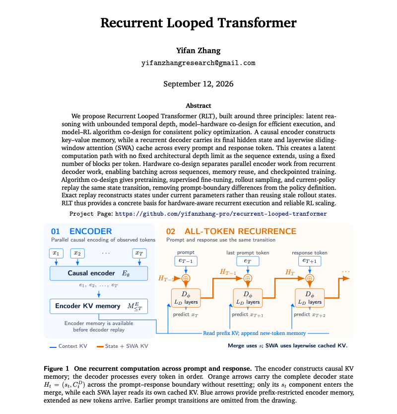

# 🐦 @dair_ai

## 📅 September 13, 2026

> 4 post(s) archived.

---

### 🕐 18:49 UTC · @dair_ai

> Should you build an agent harness? I see lots of opinions about it. My thoughts: As an AI engineer, learning how to build a harness is one of the best ways to stay ahead and unlock unique value from agents. If you understand how to build one, you can, at a minimum, transfer that knowledge to tune whatever harness or set of harnesses (closed or open) you use. In the best case, you apply your domain expertise to build domain-specific harnesses that unlock unique real-world value and solve reliability issues other companies just aren&apos;t willing to invest time in. If you haven&apos;t noticed, many companies and startups have already started doing this. Harnesses are enablers in that way. I don&apos;t see any drawbacks in learning to build one. The main pushback against building a custom harness is that models will get better at generating them on the fly, so why build one? Or that companies will provide harness-as-a-service, etc. Now, ask yourself: will you have the level of customization that a proper harness requires? See, you are not building a wrapper here; you are building an important part of your intelligence stack. Something you want to control completely. Like automated prompt engineering, evals, and many other areas requiring extensive domain knowledge, harness engineering isn&apos;t something models are great at (see dynamic workflows from ant as an example). We assume too much that tools will remain static, data won&apos;t change, or knowledge will not evolve. A custom harness lets you own these issues and solve them at your desired pace. You simply cannot afford to sit back and wait for model providers to solve this problem for you. The harness is too important to offload. While general frontier models get better at verifiable (math, code, and the like) tasks, I haven&apos;t seen evidence that they solve reliability issues when you apply them to domain-specific and more dynamic environments. This is why you want to understand how the harness works and potentially build your own. I see a lot of companies already doing this in bio, health, legal, and finance. My other concern about just relying on a model provider to solve the harness for you is vendor lock-in. Right now, we mostly use single models for most tasks, but it&apos;s not hard to see a world where we leverage a set of frontier models (open and closed) to address issues like cost and diversity of intelligence. Are you going to rely on some company to build that harness solution for you, or, even worse, trust a single model to do that for you? I can go on and on. Building your own harness is about working towards building your own intelligence stack. I don&apos;t think that&apos;s optional where things are headed if you really want to have a differentiated business or offering. So where do you get started? I suggest feeding this list of seminal harness engineering papers to your agent: https://academy.dair.ai/papers/collections/harness-engineering You can start with something like: &quot;Summarize the main components of an agent harness by researching this list of papers and tools: https://academy.dair.ai/papers/collections/harness-engineering. Then put together a set of visual notes on where to get started to build my own minimal harness using &lt;language_of_your_choice&gt;.&quot; Your thoughts? I want to keep this as an open discussion. Please share any concerns or thoughts. I&apos;ll share more thoughts as the conversation evolves. https://x.com/omarsar0/status/2098809969252450451?s=20 Learn to build a harness, folks. It&apos;s not surprising to me that so many YC builders want to build domain-specific harnesses. If you work long enough on a domain-specific problem, you quickly realize the opportunity. But you also realize how important that harness will be to stay …

🔗 [View original post](https://x.com/omarsar0/status/2099208894866178204)

---

### 🕐 17:12 UTC · @dair_ai

> Looped transformers are a popular architecture topic right now. This new technical report extends the loop across tokens. Recurrent Looped Transformer (RLT) makes the decoder recurrent over every token, prompt and response included. A causal encoder builds global KV memory. For each new token, the decoder combines the token&apos;s encoder representation with its own final hidden state from the previous token and a sliding-window cache of recent activations. With a 48-layer decoder, the computation path after t tokens runs through 48t decoder blocks, while each token still executes a fixed number of blocks. Depth grows with the sequence and per-token cost stays the same. The same state transition is used for pretraining, SFT, sampling and RL replay, and nothing resets at the prompt-response boundary. RL replay rebuilds states under the current weights instead of reusing stale rollout states. The report is a design proposal. The author states that reasoning gains, hardware speedups and RL scaling are goals that have not been measured yet. Paper: https://github.com/yifanzhang-pro/recurrent-looped-tranformer Chat with Paper: https://academy.dair.ai/papers/recurrent-looped-transformer

🔗 [View original post](https://x.com/omarsar0/status/2099184337195565335)

---

### 🕐 16:08 UTC · @dair_ai

> https://x.com/i/article/2099167331314204676

🔗 [View original post](https://x.com/dair_ai/status/2099168306863190147)

---

### 🕐 13:50 UTC · @dair_ai

> This is all I will say on the matter: It’s alarming to see the constant effort to try to tell me how I should use AI, how I should build AI, and now how I should pace it. Is it just me, or are all these proposals demanding way too much control? It’s clear that open-source AI matters more than ever. It’s how we free ourselves from suspicious views, constant desire for control, and hidden agendas. There&apos;s still so much to solve. Better evals, removing biases, novelty generation, reliability, creativity, code quality, OOD problems, automation capabilities like dynamically generating workflows/harnesses, automated prompt engineering, compaction, cost, multimodality, omni models, latency, throughput, long context understanding, retrieval, tool calling, agent coordination, and the list goes on and on. We need more people working on these problems instead of constantly fear-mongering society about what the technology isn&apos;t. As an independent researcher, I don&apos;t ignore the safety concerns around AI. Some are valid. And I work on these every day. But we all need to bring more scientific rigor back to this problem, less anthropomorphizing of frontier capabilities, and concerns more grounded in reality than in personal belief or feelings. Lastly, I&apos;ve never seen so much pessimism about human capabilities as what the topic of recursive self-improvement has brought. We need to be more optimistic about humanity&apos;s potential, and how we all play a role in this. To me, that&apos;s one of the real problems. I remain optimistic about our field. Transparent dialogue is key to getting this right. But cleverly coordinated self-serving efforts are not welcome. We need to level the playing field. AI is too important to be controlled by only a few. Now back to building.

🔗 [View original post](https://x.com/omarsar0/status/2099133736310731250)

---
