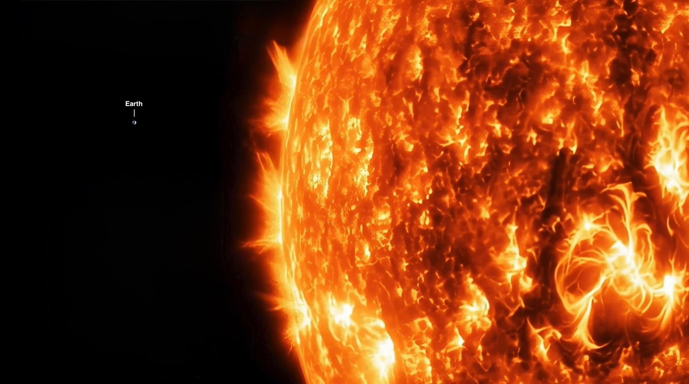
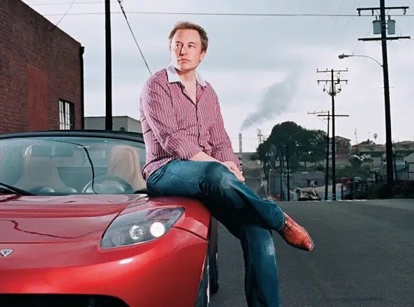
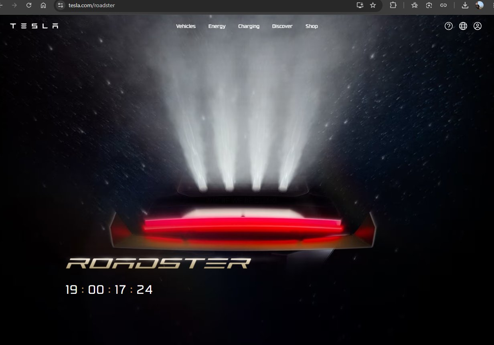

# 🐦 @elonmusk

## 📅 September 13, 2026

> 15 post(s) archived.

---

### 🕐 18:11 UTC · @elonmusk

> Live from the #Blizzcon2026 #DiabloIV S15 panel: - all three prime evils from previous games are coming back (D2 Meph/Baal, D1 Diablo) - nostalgic enemies - old-school transmogs - 3 Dark Wanderers show up, you choose to gain an evil&apos;s power with unique activity changes A legacy 30 years in the making, and we’re breaking it all down today. 🔥 Tune in to the Diablo IV: What&apos;s Next panel for a deep dive into the Season of Hell&apos;s Legacy. Watch Live Now: https://blizz.ly/46i63Yq

🔗 [View original post](https://x.com/wudijo/status/2099199283761496462)

---

### 🕐 16:17 UTC · @elonmusk

> Wild 24 hours for AI and lots of different proposals have been made. TLDR; the only *tangible* new fact is that OpenAI and Anthropic are going to have embedded 3rd party evaluators from unknown organizations with Dario floating METR as a possibility. Having 3rd party evaluators is smart as there is no Section 230 style liability shield for model outputs and showing a “duty of care” will be important in future litigation. Several internet companies might have gone bankrupt without Section 230 so limiting liability really matters. There are minimal investment implications from this single new fact, but I do think that for anyone who wants a “smoother for longer” cycle then most constraints are good: wafers, watts, real rates and spreads. Excessive regulation is a different matter but I don’t think we are anywhere close to this even if the vector changed over the last 24 hours. To summarize the events: Dario made the most maximalist proposal of the weekend: embedded 3rd party evaluators, a national regulatory regime for models beyond a certain capability/ingredient threshold, a broad international regulatory pact between democracies, stricter limits on compute/distillation for China and then a different international regulatory regime that encompasses China. Before there is a national regulatory regime, he wants a Sherman act waiver so that Anthropic can safely coordinate with OpenAI and other frontier labs without antitrust fears. TBF, this latest proposal is much less maximalist than some of his prior proposals like “Policy on the AI Exponential,” where he advocated for an FAA for AI. I believe he is sincere in his beliefs. And despite all the protestations, all of this would also probably be good for his business over the long-term. Sam agreed that embedded 3rd party evaluators were a good idea and stated they would implement them. Again, this is smart as should help limit future liability. Elon said “Dario is right” and later specified that “Dario is right that there should be some oversight. Peer review of AI by competitors is the right way to start this off.” This would be a MPAA like self-regulatory structure for AI with regular calls between the labs plus a process where each new model is evaluated for safety by competitors for a 1-2 week period before being released. That is *wildly* different from Dario’s proposal and in-line with what David Sacks has been proposing. Elon also stated that nothing was going to slow down open-weight models. Demis said that Dario’s essay was a “step in the right direction.” Dario also said that he was also open to Demis’ idea of a FINRA like self-regulatory structure as part of his proposal. David Sacks had a thoughtful post where he said that Dario and Sam should pace unilaterally, called the antitrust waiver a cartel request and denied that METR was truly independent given their ties to Anthropic. Sriram Krishnan, former White House AI advisor, noted that it would be important to have the 3rd party evaluators come from independent organizations that are not affiliated with any lab, which is basically an indirect statement about the relationship between METR and Anthropic which Sacks was explicit about. Clem from Hugging Face said they were open to being a neutral 3rd party evaluator, which is interesting especially if Jensen was consulted before that post. Alexander Wang from Meta noted that alignment would be an increasing focus going forward. An executive order seems likely after all this and the language in this EO is going to be really important. It is possible to democratize and distribute AI broadly and safely without centralizing it in the hands of a few corporations who might each become more powerful than any single government. I do not want a few humans in control of intelligence. I want us all to have our own intelligences that reflect our own values and human variation in all of its richness. Intelligence distribution over intelligence centralization FTW.

🔗 [View original post](https://x.com/GavinSBaker/status/2099170698887315833)

---

### 🕐 08:25 UTC · @elonmusk

> Lot of players 130 million players. One Sanctuary. An endless fight against Hell. 🔥🖤🔥 Thank you for joining us.

🔗 [View original post](https://x.com/elonmusk/status/2099051728318660621)

---

### 🕐 07:59 UTC · @elonmusk

> Race hustlers Never forget that tons of leftists actually believed Jussie Smollett walked to Subway to get food at 2:00am during a polar vortex in Chicago and got attacked with bleach and a noose by some roving gang of conservative white supremacists who shouted “THIS IS MAGA COUNTRY!!” 🤦‍♂️

🔗 [View original post](https://x.com/adamcarolla/status/2099045366197109039)

---

### 🕐 07:08 UTC · @elonmusk

> Elon is not for cartels of state capture. He is pro-human and he doesn’t want AI that’s destroying humans. A lot of us see Elon as the hope against the AI cartel, and I think he is still fighting it. Saying “we should be careful not to wipe out part of the economy by releasing a model that can do a lot of damage without any safety” is not the same as “we need to be regulated and the state should capture AI.” I’ve been sounding the alarm on AI for a long time

🔗 [View original post](https://x.com/brivael/status/2099032556033233067)

---

### 🕐 06:53 UTC · @elonmusk

> Yes Elon Musk on how to make AI safer and actually pro-human: “Artificial intelligence will be smarter than the smartest human. At which point, any invention is possible” But there’s also a small chance AI could kill us all So what matters most is how we train it • Make AI as truthfu…

🔗 [View original post](https://x.com/elonmusk/status/2099028557758706048)

---

### 🕐 06:50 UTC · @elonmusk

> True First we achieve abundance in energy....and once that happens, abundance in almost everything else starts to follow

🔗 [View original post](https://x.com/elonmusk/status/2099027918806790355)

---

### 🕐 06:46 UTC · @elonmusk

> I think this is worth doing ELON MUSK: AI competitors should peer review each other’s models before release. “I would recommend that we at least have some sort of informal weekly or biweekly call and that there’s maybe a week or two weeks of early access by competitors. This is why I think the incentives wo…

🔗 [View original post](https://x.com/elonmusk/status/2099026931006181867)

---

### 🕐 06:14 UTC · @elonmusk

> First we achieve abundance in energy....and once that happens, abundance in almost everything else starts to follow

🔗 [View original post](https://x.com/XFreeze/status/2099018760128487608)

---

### 🕐 04:37 UTC · @elonmusk

> Banger Can&apos;t believe people keep doing the meme

🔗 [View original post](https://x.com/elonmusk/status/2098994567810830823)

---

### 🕐 04:00 UTC · @elonmusk

> Elon Musk with his first Tesla Roadster, in 2008.

🔗 [View original post](https://x.com/cb_doge/status/2098985200298692687)

---

### 🕐 03:37 UTC · @elonmusk

> People who live in America should love America.

🔗 [View original post](https://x.com/TheRabbitHole/status/2098979236539449615)

---

### 🕐 00:51 UTC · @elonmusk

> 12 years ago Worth reading Superintelligence by Bostrom. We need to be super careful with AI. Potentially more dangerous than nukes.

🔗 [View original post](https://x.com/elonmusk/status/2098937640108093571)

---

### 🕐 00:42 UTC · @elonmusk

> I’ve been sounding the alarm on AI for a long time @TalulahRiley I’ve seen quite a few technologies develop, but none with this level of risk. AGI is significantly higher risk than nuclear weapons, in my opinion. Super smart humans have trouble imagining something vastly smarter than themselves.

🔗 [View original post](https://x.com/elonmusk/status/2098935235446551022)

---

### 🕐 00:24 UTC · @elonmusk

> Confirmation: Tesla will Livestream the Roadster unveil on X. I analysed the updated Tesla Roadster website and found Body classes include &quot;tcl-theme--spacerace&quot;.. on-brand with the SpaceX thruster package. The countdown timer has a &quot;targetTime&quot; of 2026-10-02T00:30:00.000+00:00 That translates to October 1st, 2026, 5:30pm Pacific (10:30am AEST on the 2nd). The clickthrough button is already wired: Watch Livestream → https://x.com/Tesla Meta description for the page &quot;Learn about Roadster, an all-electric sports car and the quickest vehicle in the world, with record-setting acceleration, range and performance&quot; Email invites are also going out to reservation holders: The event is scheduled for Waco, Texas and will be 21+ only. 1 approved guest is allowed. McGregor, TX plays host to SpaceX&apos;s engine / stage testing site which seems perfectly aligned.

🔗 [View original post](https://x.com/techAU/status/2098930881373344001)

---
