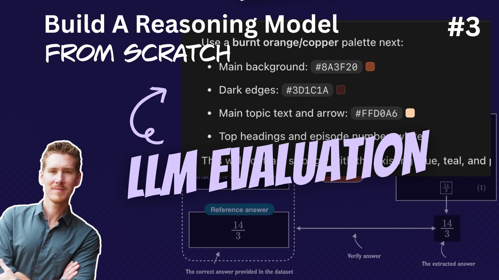

# 🐦 @rasbt

## 📅 September 13, 2026

> 2 post(s) archived.

---

### 🕐 20:19 UTC · @rasbt

> And the YouTube version: https://youtu.be/JQJ_8_jSAoY

🔗 [View original post](https://x.com/rasbt/status/2099231453531734297)

---

### 🕐 20:19 UTC · @rasbt

> Reasoning from scratch round 3: This time, I cover generating a verifier for... a) ...evaluation (base model versus any future model improvement) b) ...the reinforcement learning with verifiable rewards (RLVR) training later on 00:00 Introduction 01:21 Four approaches to LLM evaluation 07:20 Verifiers and reinforcement learning with verifiable rewards 10:52 Notebook setup and dependencies 13:43 Section 3.1 Building a math verifier 18:57 Section 3.2 Loading a pre-trained model to generate text 24:34 Generating and displaying model answers 29:23 Section 3.3 Implementing a wrapper for easier text generation 34:00 Section 3.4 Extracting the final answer box 37:29 Handling answers without boxes 43:17 Section 3.5 Normalizing the extracted answer 46:56 Section 3.6 Verifying mathematical equivalence 53:32 Implementing the equality check 57:48 Section 3.7 Grading answers 59:20 Building and testing the answer grader 1:03:18 Section 3.8 Loading the evaluation dataset (MATH-500) 1:07:51 Section 3.9 Evaluating the model 1:08:34 Prompt templates for evaluation 1:10:47 Prompt sensitivity and memorization 1:13:55 A minimal evaluation example 1:15:32 Building the evaluation loop 1:20:27 Comparing CPU, MPS, and CUDA results 1:21:54 Reproducibility and floating-point math 1:23:37 Base model vs. reasoning model 1:25:30 Summary and next steps Media

🔗 [View original post](https://x.com/rasbt/status/2099231450411290900)

---
