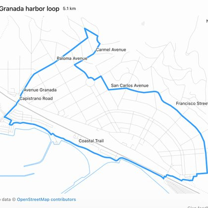

# 🐦 @simonw

## 📅 September 13, 2026

> 2 post(s) archived.

---

### 🕐 00:20 UTC · @simonw

> I used this as an excuse to do some reverse engineering of ChatGPT itself - the resulting running map was presented to me using this &quot;visualize&quot; skill, as a fragment of HTML that used D3 to draw both the map and the overlaid route https://codex-tool-reference.simonw.chatgpt.site/skills/visualize

🔗 [View original post](https://x.com/simonw/status/2098929831945842887)

---

### 🕐 00:19 UTC · @simonw

> This is pretty neat: ChatGPT Work and GPT-6 Astra (I used &quot;Max&quot;) can take an address and produce a 5K/10K circular running route starting from that address, using OSM data https://simonwillison.net/2026/Sep/12/astra-running-routes/

🔗 [View original post](https://x.com/simonw/status/2098929534968238094)

---
