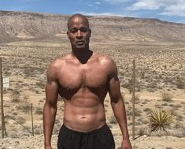
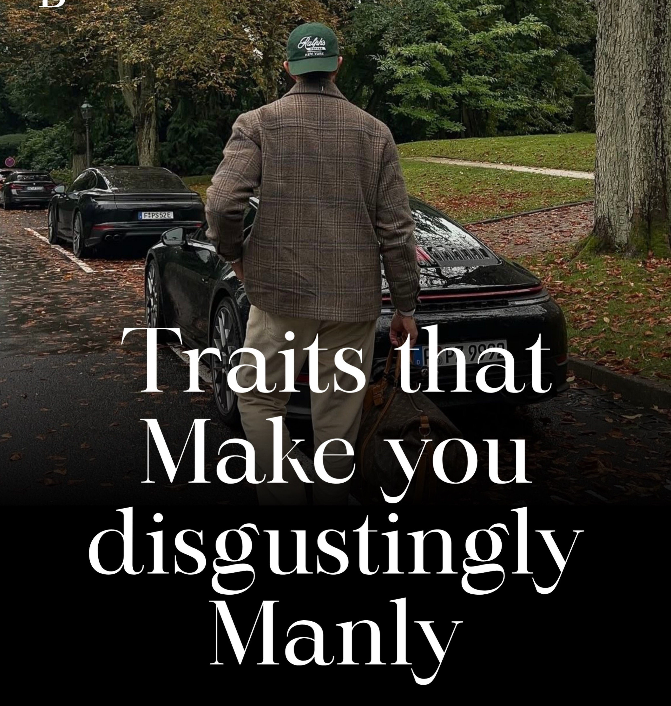

# 🐦 @theendeavorpath

## 📅 September 13, 2026

> 4 post(s) archived.

---

### 🕐 17:09 UTC · @theendeavorpath

> I WISH SOMEONE HAD SCREAMED THIS AT ME AT 30. (Hit the save button, Read it when you forget.) 1. Take care of your knees and back like they re irreplaceable.

🔗 [View original post](https://x.com/EnergyUp_/status/2099183765562298482)

---

### 🕐 16:38 UTC · @theendeavorpath

> Life is all about perspective.🌍 The same thing can feel irritating in one moment and beautiful in another. What matters is not the situation itself, but how you choose to see it.💭 Media

🔗 [View original post](https://x.com/stoicmen_/status/2099175888860680678)

---

### 🕐 15:16 UTC · @theendeavorpath

> “The most important conversations you’ll ever have are the ones you have with yourself.” — David Goggins

🔗 [View original post](https://x.com/theendeavorpath/status/2099155163558916123)

---

### 🕐 13:32 UTC · @theendeavorpath

> Traits that Make you disgustingly Manly... You have to build these 🧵 👇

🔗 [View original post](https://x.com/superior_hombre/status/2099129044063441049)

---
