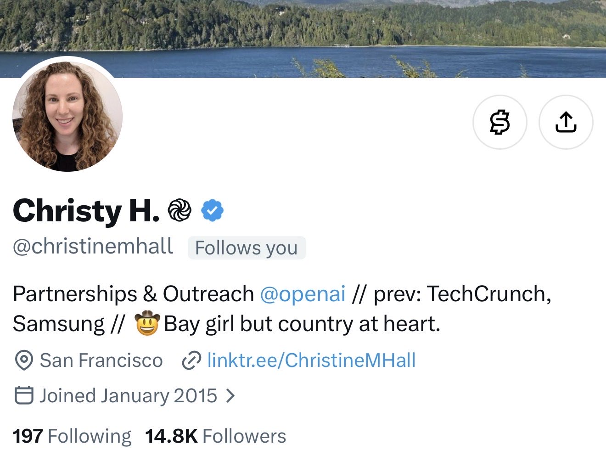

# 🐦 @tunguz

## 📅 September 13, 2026

> 16 post(s) archived.

---

### 🕐 20:20 UTC · @tunguz

> Can I say something?

🔗 [View original post](https://x.com/tunguz/status/2099231818054824319)

---

### 🕐 19:49 UTC · @tunguz

> This would be awesome. Canada Discussing Joining EU As ‘Associate Member,’ Report Says https://go.forbes.com/8fWTza

🔗 [View original post](https://x.com/tunguz/status/2099224078846726498)

---

### 🕐 19:27 UTC · @tunguz

> We only need 5, max. now imagine 11 more years or 22 years

🔗 [View original post](https://x.com/tunguz/status/2099218484378894436)

---

### 🕐 18:39 UTC · @tunguz

> Reposting for no particular reason. He’s been practically begging for it.

🔗 [View original post](https://x.com/tunguz/status/2099206436379091365)

---

### 🕐 18:20 UTC · @tunguz

> You are pacing the frontier. I am pacing around my home office. We are not the same.

🔗 [View original post](https://x.com/tunguz/status/2099201560269967384)

---

### 🕐 18:19 UTC · @tunguz

> Canada is actually pretty nice.

🔗 [View original post](https://x.com/tunguz/status/2099201218648154308)

---

### 🕐 18:11 UTC · @tunguz

> Millennium problems? More like every other millisecond problem, amirite.

🔗 [View original post](https://x.com/tunguz/status/2099199215452741864)

---

### 🕐 18:08 UTC · @tunguz

> Trying to advance modern physics by reformulating it as a subset of advanced abstract mathematics was in hindsight the dumbest sh*t ever.

🔗 [View original post](https://x.com/tunguz/status/2099198445688910287)

---

### 🕐 17:33 UTC · @tunguz

> We are so back!!! https://www.tesla.com/roadster

🔗 [View original post](https://x.com/tunguz/status/2099189790541480394)

---

### 🕐 17:32 UTC · @tunguz

> Prolly Uzbekistan-Colombia-Nigeria alliance. This post is unavailable

🔗 [View original post](https://x.com/tunguz/status/2099189585423343919)

---

### 🕐 16:58 UTC · @tunguz

> We got ourselves some time. At least a couple of weeks. Media

🔗 [View original post](https://x.com/tunguz/status/2099180857538073035)

---

### 🕐 15:15 UTC · @tunguz

> Scam alert: this is probably a hacked fake account purporting to be someone working at OpenAI.

🔗 [View original post](https://x.com/tunguz/status/2099155059494056115)

---

### 🕐 05:09 UTC · @tunguz

> Yes Living simply is linked to greater happiness and purpose. You need people, not products.

🔗 [View original post](https://x.com/tunguz/status/2099002437856293243)

---

### 🕐 05:04 UTC · @tunguz

> Another problem due to global warming. History has been made! ✏️ 📖 No hurricanes have formed in the North Atlantic Ocean so far this year. This is the FIRST time on record in the satellite era (since 1966) that we have made it to September 12th without at least one Atlantic hurricane yet in the calendar year. This is…

🔗 [View original post](https://x.com/tunguz/status/2099001359312080973)

---

### 🕐 01:13 UTC · @tunguz

> I’m not so sure about this. I honestly can’t think of a *single* discovery in *fundamental* mathematics from the 20th century onwards that has had *any* impact on modern Physics for instance. The two nuanced takes I’d add to the discussion: 1. The reason most people see math as different from curing cancer today, is the time lag between fundamental mathematical breakthrough and application is way too long, sometimes centuries. This will change in the next couple years…

🔗 [View original post](https://x.com/tunguz/status/2098943132968923193)

---

### 🕐 01:08 UTC · @tunguz

> Overestimating Google’s AI capabilities is literally why we have all the other top AI labs now. I don&apos;t know if Google has achieved RSI. But... If the reason Gemini Pro has not been released for 6+ months is they allocated all the resources they would have spent on it to a gargantuan training run to leapfrog past everyone else... ...then that&apos;d be an impressive gamble.

🔗 [View original post](https://x.com/tunguz/status/2098941878309924893)

---
